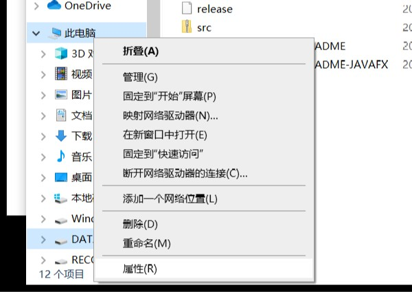

# JDK配置

系统重装，由于要设置各种环境变量，怕之后还会遇到这个情况，特此记录一下。

前提：已经下载完成jdk和jre文件。
环境：Windows10

## 进入配置界面

`此电脑`->`右键`->`属性`

`高级系统设置`->`环境变量`

## 配置JAVA_HOME
系统变量中：新建JAVA_HOME
变量名：`JAVA_HOME`
变量值：`E:\Java\jdk1.8.0_231` （jdk文件的安装路径）

## 配置Path
系统变量中：在Path中增加
`%JAVA_HOME%\bin`
`%JAVA_HOME%\jre\bin`

## 配置CLASSPATH
系统变量中：新建CLASSPATH
变量名：`CLASSPATH`
变量值：`.;%JAVA_HOME%\lib;%JAVA_HOME%\lib\tools.jar`(最前面是点，代表当前路径）

## 查看是否成功
`Win`+`r` ，输出cmd，打开命令行。
输入`java -version`（中间有空格）

