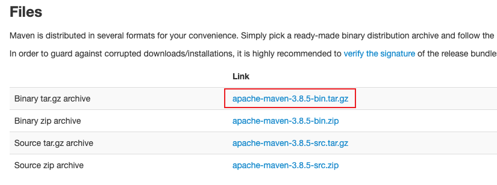
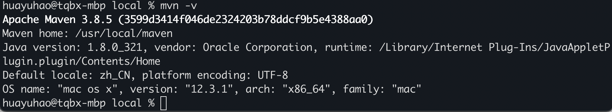

## Windows环境Maven下载并配置

### 下载并配置

官网下载：https://maven.apache.org/download.cgi


解压到`E:\devSofts\maven`目录下


此时我们就可以进入该文件夹的bin目录下执行`mvn -v`命令了，为了全局使用这个命令，我们需要配置环境变量。

新建系统变量`MAVEN_HOME`

```java
MAVEN_HOME
E:\devSofts\maven\apache-maven-3.6.3
```


配置Path变量，将bin目录加入path，`%MAVEN_HOME%\bin`。

win + r在任意位置打开cmd，执行`mvn -v`查看是否已经成功安装配置。


### 配置Maven本地仓库

在`E:\devSofts\maven`目录下创建`maven-repo`目录，作为maven的本地仓库。

配置`E:\devSofts\maven\apache-maven-3.6.3\conf`目录下的`settings.xml`，找到下面这段，可以看到如果我们不配置，默认在我们用户目录下的`./m2/respository`目录下。

```xml
  <!-- localRepository
   | The path to the local repository maven will use to store artifacts.
   |
   | Default: ${user.home}/.m2/repository
  <localRepository>/path/to/local/repo</localRepository>
  -->
```

我们修改以下配置即可：

```xml
    <localRepository>E:\devSofts\maven\maven-repo</localRepository>
```

当我们从maven获取jar包的时候，首先会在本地仓库种查找，如果本地仓库中有最好，没有的话就会联网从远程仓库中获取，并保存到本地仓库中。

如果我们项将项目打包安装到本地供其他项目使用，可以执行`mvn install`命令。

### 配置中央仓库阿里镜像

```xml
  <mirrors>
    <mirror>
      <id>alimaven</id>
      <name>aliyun maven</name>
      <url>http://maven.aliyun.com/nexus/content/groups/public/</url>
      <mirrorOf>central</mirrorOf> 
    </mirror>      
  </mirrors>
```

### IDEA配置


## MAC环境Maven下载并配置

### 下载maven

maven下载地址：[https://maven.apache.org/download.cgi](https://maven.apache.org/download.cgi)，选择`apache-maven-3.8.5-bin.tar.gz`。



解压至当前目录，将文件夹重命名为maven，移动文件夹至`/usr/local/maven`目录。

```
sudo mv /Users/huayuhao/Downloads/maven /usr/local/maven
```

### 配置环境变量

打开终端输入命令

```
vim ~/.bash_profile
```

在vim中输入`i`进行编辑，写下以下内容

```
export MAVEN_HOME=/usr/local/maven
export PATH=$MAVEN_HOME/bin:$PATH
```

点击`esc`键，接着输入`:wq`，意思是保存并退出

接着使配置生效

```
source ~/.bash_profile
```

### 查看配置是否生效

```
mvn -v
```



至此配置成功！