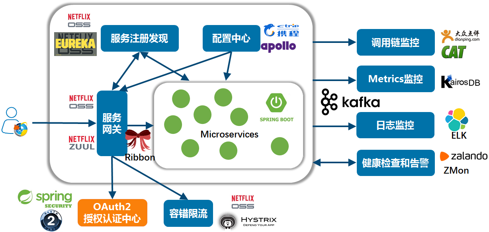
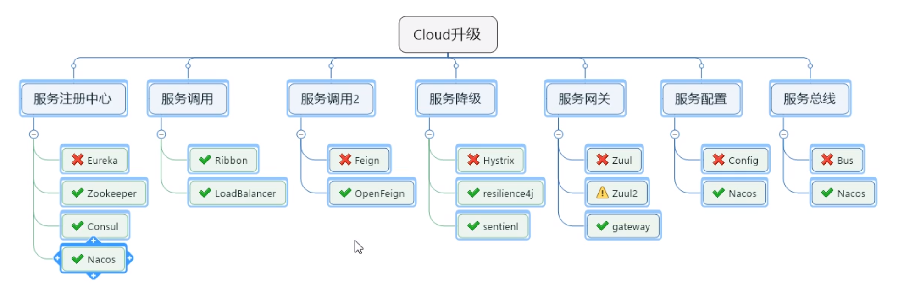

[toc]

# 什么是微服务？

> "微服务架构是一种**架构模式**，它提倡**将单一应用程序划分成一组小的服务，服务之间相互协调、互相配合，为用户提供最终价值**。每个服务运行在其独立的进程中，服务和服务之间采用轻量级的通信机制相互沟通（通常是基于HTTP的Restful API).每个服务都围绕着具体的业务进行构建，并且能够被独立的部署到生产环境、类生产环境等。另外，应尽量避免统一的、集中的服务管理机制，对具体的一个服务而言，应根据业务上下文，选择合适的语言、工具对其进行构"    ——Martin Fowler的博客


# SpringCloud简介

## SpringCloud用来干嘛？

学习新技术，官网会给出最权威的答案，不妨看看官网对SpringCloud的介绍：[https://spring.io/projects/spring-cloud](https://spring.io/projects/spring-cloud)

> Spring Cloud provides tools for developers to quickly build some of the common patterns in distributed systems (e.g. **configuration management, service discovery, circuit breakers, intelligent routing, micro-proxy, control bus, one-time tokens, global locks, leadership election, distributed sessions, cluster state**). 

Spring Cloud为开发人员提供了快速构建分布式系统中一些常见模式的工具，如：配置管理【configuration management】，服务发现【service discovery】，熔断机制【circuit breakers】，智能路由【intelligent routing】，微代理【micro-proxy】，控制总线【control bus】，一次性令牌【one-time tokens】，全局锁【global locks】，leader投票选举【leadership election】，分布式会话【distributed sessions】，集群状态【cluster state】。

## 特性

Spring Cloud 侧重提供开箱即用的典型用例和允许自由扩展的机制。

- Distributed/versioned configuration 分布式/版本控制配置
- Service registration and discovery 服务注册与发现
- Routing 路由
- Service-to-service calls 服务到服务的调用
- Load balancing 负载均衡
- Circuit Breakers 熔断机制
- Global locks 全局锁
- Leadership election and cluster state 选举与集群状态管理
- Distributed messaging 分布式消息

## 构建注意事项

### 从0到1构建新的SpringCloud工程

最简单的方法是访问[start.spring.io](https://start.spring.io/)网站，选择合适的SpringBoot和SpringCloud版本，进行构建。

### 在已有SpringBoot应用程序基础上构建SpringCloud

需要注意版本兼容性，确定你需要的SpringCloud版本，这由原本存在的SpringBoot版本决定。目前的版本依赖关系如下：

| Release Train                                                | Boot Version                     |
| :----------------------------------------------------------- | :------------------------------- |
| 2020.0.x aka Ilford                                          | 2.4.x                            |
| [Hoxton](https://github.com/spring-projects/spring-cloud/wiki/Spring-Cloud-Hoxton-Release-Notes) | 2.2.x, 2.3.x (Starting with SR5) |
| [Greenwich](https://github.com/spring-projects/spring-cloud/wiki/Spring-Cloud-Greenwich-Release-Notes) | 2.1.x                            |
| [Finchley](https://github.com/spring-projects/spring-cloud/wiki/Spring-Cloud-Finchley-Release-Notes) | 2.0.x                            |
| [Edgware](https://github.com/spring-projects/spring-cloud/wiki/Spring-Cloud-Edgware-Release-Notes) | 1.5.x                            |
| [Dalston](https://github.com/spring-projects/spring-cloud/wiki/Spring-Cloud-Dalston-Release-Notes) | 1.5.x                            |

需要注意的是Dalston，Edgware，Finchley已经不再支持。

更多详细的版本对应关系，可以访问网址：https://start.spring.io/actuator/info

```json
spring-cloud: {
	//...省略
    Greenwich.M1: "Spring Boot >=2.1.0.M3 and <2.1.0.RELEASE",
    Greenwich.SR6: "Spring Boot >=2.1.0.RELEASE and <2.1.999.BUILD-SNAPSHOT",
    Greenwich.BUILD-SNAPSHOT: "Spring Boot >=2.1.999.BUILD-SNAPSHOT and <2.2.0.M4",
    Hoxton.SR9: "Spring Boot >=2.2.0.M4 and <2.3.7.BUILD-SNAPSHOT",
    Hoxton.BUILD-SNAPSHOT: "Spring Boot >=2.3.7.BUILD-SNAPSHOT and <2.4.0.M1",
    2020.0.0-M3: "Spring Boot >=2.4.0.M1 and <=2.4.0.M1",
    2020.0.0-M4: "Spring Boot >=2.4.0.M2 and <=2.4.0-M3",
    2020.0.0-SNAPSHOT: "Spring Boot >=2.4.0-M4"
}
spring-cloud-alibaba: {
	2.2.1.RELEASE: "Spring Boot >=2.2.0.RELEASE and <2.3.0.M1"
}
```

> 官方建议：官方通过service release【SR】，将Bug修复和向后兼容的特性添加到每个版本系列中，因此，一旦确定要使用哪个版本的SpringCloud，就应使用该版本系列的最新服务版本。
>
> 了解版本对应关系约束必要性之后，便可以引入适当的Spring Cloud BOM了。

```xml
<properties>
    <spring.cloud-version>Hoxton.SR8</spring.cloud-version>
</properties>
<dependencyManagement>
    <dependencies>
        <dependency>
            <groupId>org.springframework.cloud</groupId>
            <artifactId>spring-cloud-dependencies</artifactId>
            <version>${spring.cloud-version}</version>
            <type>pom</type>
            <scope>import</scope>
        </dependency>
    </dependencies>
</dependencyManagement>
```

和SpringBoot一样，SpringCloud工程也包含starters，你可以为其添加许多不同的特性，并将其作为依赖加入项目之中。大多数情况下，你只需要将starters加入到类路径下就可以启用功能。以下展示如何将`Spring Cloud Config`客户端和`Spring Cloud Netflix Eureka`客户端添加到应用程序：

```xml
<dependencies>
    <dependency>
        <groupId>org.springframework.cloud</groupId>
        <artifactId>spring-cloud-starter-config</artifactId>
    </dependency>
    <dependency>
        <groupId>org.springframework.cloud</groupId>
        <artifactId>spring-cloud-starter-netflix-eureka-client</artifactId>
    </dependency>
    ...
</dependencies>
```

## 微服务架构

> 下图为杨波老师于2018年5月7日在[一个可供中小团队参考的微服务架构技术栈](https://www.infoq.cn/article/china-microservice-technique/?utm_source=tuicool&utm_medium=referral)一文中，结合自身的实战落地经验，总结的一套贴近国内技术文化特色的轻量级微服务参考技术栈。



SpringCloud的主要项目：

| 项目名                                                       | 描述                                                         |
| :----------------------------------------------------------- | :----------------------------------------------------------- |
| [Spring Cloud Config](https://spring.io/projects/spring-cloud-config) | 通过git仓库进行集中的外部配置管理。配置资源可以直接映射到Spring 的环境下，但如果需要，non-spring应用程序也可使用 |
| [Spring Cloud Netflix](https://spring.io/projects/spring-cloud-netflix) | 集成了多种Netfix OSS 组件【Eureka，Hystrix，Zuul，Archaius等】 |
| [Spring Cloud Bus](https://spring.io/projects/spring-cloud-bus) | 通过**分布式消息**来关联连接服务和服务实例的事件总线，能在集群中有效的传播状态变更（例如 **配置文件修改事件**） |
| [Spring Cloud Cloudfoundry](https://spring.io/projects/spring-cloud-cloudfoundry) | 将你的应用与Pivotal Cloud Foundry集成。提供服务发现而且使得更加容易去实现SSO 和 OAuth2所保护资源 |
| [Spring Cloud Open Service Broker](https://spring.io/projects/spring-cloud-open-service-broker) | 为构建实现Open Service Broker API的服务代理提供基础          |
| [Spring Cloud Cluster](https://github.com/spring-cloud/spring-cloud-cluster) | 针对Zopkeeper，Redi，Hazelcast, Consul等，提供的leader选举、通用状态模式 |
| [Spring Cloud Consul](https://spring.io/projects/spring-cloud-consul) | Hashicorp Consul 服务发现和配置管理                          |
| [Spring Cloud Security](https://spring.io/projects/spring-cloud-security) | Zuul 代理 提供对负载均衡 OAuth2 rest 客户端、认证头中继      |
| [Spring Cloud Sleuth](https://spring.io/projects/spring-cloud-sleuth) | 对spring cloud 应用的分布式跟踪，兼容Zipkin,Htrace,log-based【例如ELK】跟踪 |
| [Spring Cloud Data Flow](https://spring.io/projects/spring-cloud-dataflow) | 针对现代运行时可组合微服务应用程序的云原生编排服务。         |
| [Spring Cloud Stream](https://spring.io/projects/spring-cloud-stream) | 轻量级的**事件驱动微服务框架**，用于快速构建可以连接到外部系统的应用程序。 |
| [Spring Cloud Stream App Starters](https://spring.io/projects/spring-cloud-stream-app-starters) | 基于Spring Boot的Spring Integration应用程序，可与外部系统集成。 |
| [Spring Cloud Task](https://spring.io/projects/spring-cloud-task) | short-lived微服务框架，可快速构建可执行有限数量数据处理的应用程序。 |
| [Spring Cloud Task App Starters](https://spring.io/projects/spring-cloud-task-app-starters) | 是Spring Boot应用程序，可以是任何进程，包括【不会永远运行的Spring Batch作业】。 |
| [Spring Cloud Zookeeper](https://spring.io/projects/spring-cloud-zookeeper) | 使用Apache Zookeeper进行服务发现和配置管理。                 |
| [Spring Cloud Connectors](https://github.com/spring-cloud/spring-cloud-connectors) | 使各种平台上的PaaS应用程序轻松连接到后端服务，例如数据库和消息代理 |
| [Spring Cloud Starters](https://github.com/spring-cloud/spring-cloud-starters) | Spring Boot风格的启动程序项目，可简化对Spring Cloud使用者的依赖关系管理。在Angel.SR后停产并和其他项目合并 |
| [Spring Cloud CLI](https://github.com/spring-cloud/spring-cloud-cli) | 用于在Groovy中快速创建Spring Cloud组件应用程序               |
| [Spring Cloud Contract](https://spring.io/projects/spring-cloud-contract) | 总括项目解决方案，可帮助用户成功实施Consumer Driven Contracts |
| [Spring Cloud Gateway](https://spring.io/projects/spring-cloud-gateway) | 基于Project Reactor的智能可编程路由器。                      |
| [Spring Cloud OpenFeign](https://spring.io/projects/spring-cloud-openfeign) | 通过自动配置并绑定到Spring Environment和其他Spring编程模型，为Spring Boot应用程序提供集成。 |
| [Spring Cloud Pipelines](https://spring.io/projects/spring-cloud-pipelines) | 提供了一个可靠的部署管道，确保应用可以零停机部署，并且可以轻松回滚某些错误。 |
| [Spring Cloud Function](https://github.com/spring-cloud/spring-cloud-function) | 通过功能促进业务逻辑的实现。 它支持跨无服务器提供程序的统一编程模型，以及独立运行（本地或在PaaS中）的功能。 |

这是SpringCloud官方在维护的项目集合，有些组件功能完全可以被更优秀的框架替代，这个视情况而定。

## SpringCloud组件选型



| 服务注册与发现   | 服务调用              | 服务调用2          | 服务熔断降级        | 服务网关           | 服务分布式配置   | 服务总线         |
| ---------------- | --------------------- | ------------------ | ------------------- | ------------------ | ---------------- | ---------------- |
| Eureka 【×】     | Ribbon【v】停更       | Feign【x】         | Hystrix【x】        | Zuul【x】          | Config【x】      | Bus【x】         |
| Zookeeper【v】   | **LoadBalancer**【v】 | **OpenFeign**【v】 | resilience4j【v】   | Zuul2【x】         | apollo【v】      | **Nacos**【vvv】 |
| Consul【v】      |                       |                    | **Sentinel**【vvv】 | **gateway**【vvv】 | **Nacos**【vvv】 |                  |
| **Nacos**【vvv】 |                       |                    |                     |                    |                  |                  |

