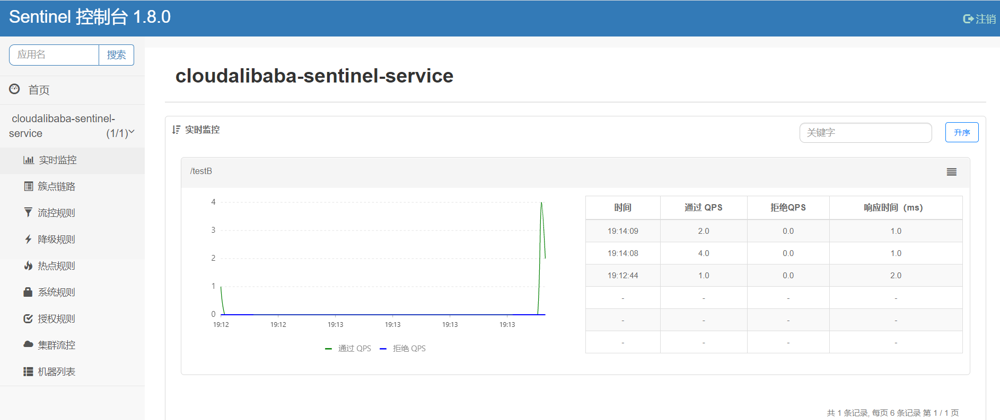

> github地址：https://github.com/alibaba/Sentinel
>
> 中文文档：[Sentinel: 分布式系统的流量防卫兵](https://github.com/alibaba/Sentinel/wiki/%E4%BB%8B%E7%BB%8D)
>
> 官方文档：https://sentinelguard.io/zh-cn/

## Sentinel 是什么？

分布式系统的流量防卫兵：随着微服务的流行，服务和服务之间的稳定性变得越来越重要。Sentinel 以流量为切入点，从流量控制、熔断降级、系统负载保护等多个维度保护服务的稳定性。

Sentinel 具有以下特征:

- **丰富的应用场景**：Sentinel 承接了阿里巴巴近 10 年的双十一大促流量的核心场景，例如秒杀（即突发流量控制在系统容量可以承受的范围）、消息削峰填谷、集群流量控制、实时熔断下游不可用应用等。
- **完备的实时监控**：Sentinel 同时提供实时的监控功能。您可以在控制台中看到接入应用的单台机器秒级数据，甚至 500 台以下规模的集群的汇总运行情况。
- **广泛的开源生态**：Sentinel 提供开箱即用的与其它开源框架/库的整合模块，例如与 Spring Cloud、Dubbo、gRPC 的整合。您只需要引入相应的依赖并进行简单的配置即可快速地接入 Sentinel。
- **完善的 SPI 扩展点**：Sentinel 提供简单易用、完善的 SPI 扩展接口。您可以通过实现扩展接口来快速地定制逻辑。例如定制规则管理、适配动态数据源等。

主要特性：


Sentinel 的使用可以分为两个部分:

- 核心库（Java 客户端）：不依赖任何框架/库，能够运行于 Java 7 及以上的版本的运行时环境，同时对 Dubbo / Spring Cloud 等框架也有较好的支持（见 [主流框架适配](https://sentinelguard.io/zh-cn/docs/open-source-framework-integrations.html)）。
- 控制台（Dashboard）：Dashboard 主要负责管理推送规则、监控、管理机器信息等。

## Sentinel控制台安装

> sentinel控制台下载地址：https://github.com/alibaba/Sentinel/releases
>
> ps：下载慢的小伙伴可以尝试将网址在迅雷里打开，会稍微快一些。

控制台的jar包下载下来就是一个可执行的jar嘛，用过springboot的小伙伴应该就很了解了，启动它只需要一行：

```java
java -jar sentinel-dashboard-1.8.0.jar  # 默认会使用8080作为端口号，注意端口不要冲突
```

我们也可以在启动的时候配置命令行参数：

- `--server.port`：自定义服务器端口。默认为 8080 端口。
- `--auth.username` 和 `--auth.password`：自定义账号和密码。默认为「sentinel / sentinel」。
- `--logging.file`：自定义日志文件。默认为 `${user.home}/logs/csp/sentinel-dashboard.log`。

启动之后，访问：`localhost:8080`即可，默认用户名和密码都是 `sentinel`。

## Sentinel演示

前置环境条件：nacos正常安装配置启动，sentinel控制台安装配置成功。

### 新建测试服务

新建测试模块：`cloudalibaba-sentinel-service8401`

```xml
        <!--SpringCloud ailibaba nacos -->
        <dependency>
            <groupId>com.alibaba.cloud</groupId>
            <artifactId>spring-cloud-starter-alibaba-nacos-discovery</artifactId>
        </dependency>
        <!--SpringCloud ailibaba sentinel -->
        <dependency>
            <groupId>com.alibaba.cloud</groupId>
            <artifactId>spring-cloud-starter-alibaba-sentinel</artifactId>
        </dependency>
```

### 配置yml

```yml
server:
  port: 8401

spring:
  application:
    name: cloudalibaba-sentinel-service
  cloud:
    nacos:
      discovery:
        server-addr: localhost:8848 #Nacos服务注册中心地址
    sentinel:
      transport:
        dashboard: localhost:8080 #配置Sentinel dashboard地址
        port: 8719

management:
  endpoints:
    web:
      exposure:
        include: '*'
```

### 编写控制器

```java
@RestController
@Slf4j
public class FlowLimitController
{
    @GetMapping("/testA")
    public String testA()
    {
        return "------testA";
    }

    @GetMapping("/testB")
    public String testB()
    {
        log.info(Thread.currentThread().getName()+"\t"+"...testB");
        return "------testB";
    }
}
```

### 主启动类

```java
@EnableDiscoveryClient
@SpringBootApplication
public class MainApp8401
{
    public static void main(String[] args) {
        SpringApplication.run(MainApp8401.class, args);
    }
}
```

### 测试

1. 启动sentinel控制台：`java -jar sentinel-dashboard-1.8.0.jar`

2. 启动8401服务，查看是否成功注册进nacos。
3. 访问：`localhost:8401/testA`和`localhost:8401/testB`接口。



## 流控规则

