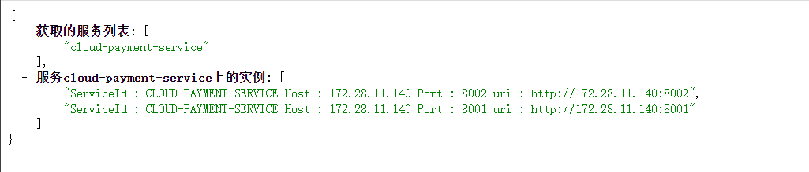

[toc]

## 本篇要点

- 介绍Eureka管理界面主机名和访问ip信息提示修改。
- 介绍获取当前注册中心服务列表，以及获取每个服务的实例列表的方法。

## Actuator微服务信息完善

### 前提

除了eureka依赖之外，确保已经引入以下依赖：

```xml
        <dependency>
            <groupId>org.springframework.boot</groupId>
            <artifactId>spring-boot-starter-web</artifactId>
        </dependency>
        <dependency>
            <groupId>org.springframework.boot</groupId>
            <artifactId>spring-boot-starter-actuator</artifactId>
        </dependency>
```

### 主机名称：服务名称修改

我们回顾一下：当我们访问Eureka的后台管理页面时，注册的客户端的Status是这样的：笔记本+服务名+端口：


如果我们有特殊的定制需求，其实Status的信息可以通过`eureka.instance.instance-id`自定义：

```yml
eureka:
  client:
    #表示是否将自己注册进EurekaServer默认为true。
    register-with-eureka: true
    #是否从EurekaServer抓取已有的注册信息，默认为true。单节点无所谓，集群必须设置为true才能配合ribbon使用负载均衡
    fetchRegistry: true
    service-url:
      #单机版
      defaultZone: http://localhost:7001/eureka
  instance:
    instance-id: payment8002
```

修改结果显示如下：


### 显示IP地址

在啥也没有配置的时候，我们需要点击Status中的服务链接，才会显示诸如：`http://desktop-qfk0mbg:8002/actuator/info`的链接地址，如果我们想让鼠标悬浮显示IP地址，我们也是有办法的：

```yml
eureka:
  #..省略
  instance:
    instance-id: payment8001
    #访问路径可以显示IP地址
    prefer-ip-address: true
```

再次测试，url变为：`http://172.28.11.140:8002/actuator/info`。

## Eureka服务发现

对于注册进Eureka的微服务，可以通过服务发现来获得该服务的信息，这里以Payment8001模块为例演示具体步骤。

### 注入DiscoveryClient，获取信息

```java
@Slf4j
@RestController
public class PaymentController {

    @Resource
    private DiscoveryClient discoveryClient;

    @GetMapping("/payment/discovery")
    public Object discovery(){
        Map<String,Object> map = new HashMap<>();
        List<String> services = discoveryClient.getServices();
        services.forEach(log::info);
        map.put("获取的服务列表",services);
        List<ServiceInstance> instances = discoveryClient.getInstances("CLOUD-PAYMENT-SERVICE");
        List<String> instanceList = new ArrayList<>();
        instances.forEach(x -> {
            log.info(x.getServiceId() + "\n" + x.getHost() + "\n" + x.getPort() + "\n" +  x.getUri());
            instanceList.add("ServiceId : " + x.getServiceId() + " Host : " + x.getHost() + " Port : " + x.getPort() + " uri : " + x.getUri());
        });
        map.put("服务cloud-payment-service上的实例",instanceList);
        return map;
    }
}
```

### 主程序上加上@EnableDiscoveryClient

```java
@EnableEurekaClient
@SpringBootApplication
@EnableDiscoveryClient
public class Payment8001Application {

    public static void main(String[] args) {
        SpringApplication.run(Payment8001Application.class,args);
    }
}
```

### 测试

访问：`http://localhost:8001/payment/discovery`




我们可以成功获得服务列表信息，以及某个服务的所有实例信息。

## 源码下载

本系列文章为《尚硅谷SpringCloud教程》的学习笔记【版本稍微有些不同，后续遇到bug再做相关说明】，主要做一个长期的记录，为以后学习的同学提供示例，代码同步更新到Gitee：[https://gitee.com/tqbx/spring-cloud-learning](https://gitee.com/tqbx/spring-cloud-learning)，并且以**标签**的形式详细区分每个步骤，这个系列文章也会同步更新，如果内容有误，还望评论区批评指正。