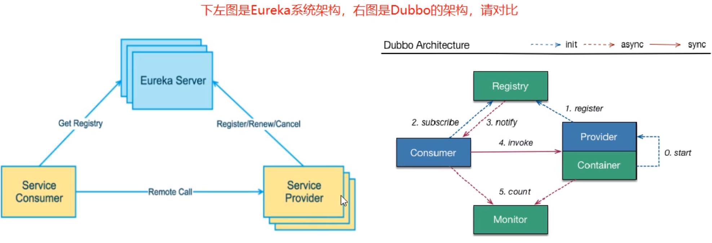
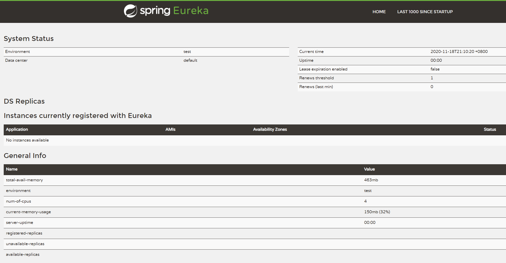
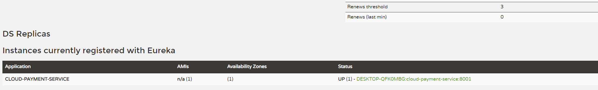
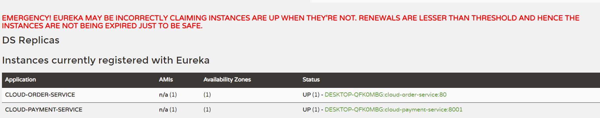
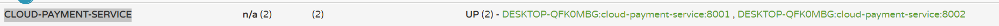

[toc]

# Eureka服务注册与发现

> Eureka2.0已经停更，但是学习它的思想还是有必要的，项目地址：https://github.com/Netflix/eureka

## 本篇要点

- 学习服务注册与发现的概念。
- 学习Eureka基础中的两大组件Server和Client的概念。
- 尝试Eureka单机和集群版的案例demo。

## Eureka基础知识

### 什么是服务治理

SpringCloud封装了Netflix公司开发的Eureka模块来实现服务治理。

在传统的RPC远程调用框架中，管理每个服务与服务之间依赖关系比较复杂，管理比较复杂，所以需要服务治理，**管理服务与服务间的依赖关系**，可以实现服务调用，负载均衡，容错等，实现服务注册与发现。

### 什么是服务注册与发现

Eureka采用了CS的设计架构：**Eureka Server作为服务注册功能的服务器**，它是服务注册中心。而**系统中的其他微服务，使用Eureka Client连接到Eureka Server并维持心跳连接**。这样系统的维护人员就可以<u>通过Eureka Server来监控系统中各个服务是否正常运行。</u>

在服务注册与发现中，有一个注册中心。当服务器启动的时候，会把当前自己服务器信息【比如：服务地址、通讯地址等】**以别名的方式注册到注册中心**上。另一方【消费者服务提供者】，以该别名的方式去注册中心上**获取到实际的服务通讯地址**，然后再实现本地RPC调用。

远程调用框架核心思想：**在与注册中心，因为使用注册中心管理每个与服务之间的一个依赖关系**【服务治理概念】。在任何RPC远程框架中，都会有一个注册中心【存放服务地址相关的信息：接口地址】。



### Eureka的两个组件

**Eureka Server提供服务的注册服务**

各个微服务节点通过配置启动后，会在EurekaServer中进行注册，这样EurekaServer中的服务注册表中将会存储所服务节点的信息，服务节点的信息可以在接口中直观的看到。

**Eureka Client通过注册中心进行访问**

是一个Java客户端，用与简化Eureka Server的交互，客户端同时也具备一个内置的，使用轮询(round-robin)的负载均衡器。在应用启动后，将会向Eureka Server发送心跳(默认周期为30s)。如果Eureka Server在多个心跳周期内没有接收到某个节点的心跳，Eureka Server将会从服务注册表中把这个服务节点移除掉(默认90s，也就是3个心跳周期).

## 单机版Eureka构建步骤

### 创建服务中心模块

了解了Eureka的系统架构图之后，我们应该非常清楚，最简单的实现也需要三个角色：服务消费者，服务提供者，注册中心EurekaServer。已知我们已经拥有了两个角色：

- cloud-provider-payment8001 服务提供
- cloud-consumer-order80  服务消费

我们还需创建一个服务中心模块：cloud-eureka-server7001。

### 引入依赖

```xml
<!--eureka server-->
<dependency>
    <groupId>org.springframework.cloud</groupId>
    <artifactId>spring-cloud-starter-netflix-eureka-server</artifactId>
</dependency>
```

### 配置yml

```yml
server:
  port: 7001

eureka:
  instance:
    hostname: localhost #eureka服务端的实例名称
  client:
    register-with-eureka: false     #false表示不向注册中心注册自己。
    fetch-registry: false     #false表示自己端就是注册中心，我的职责就是维护服务实例，并不需要去检索服务
    service-url:
      # 设置与Eureka Server交互的地址查询服务和注册服务都需要依赖这个地址
      defaultZone: http://${eureka.instance.hostname}:${server.port}/eureka/
```

### 在启动类上表明@EnableEurekaServer

```java
@SpringBootApplication
@EnableEurekaServer
public class EurekaServer7001Application {
    public static void main(String[] args) {
        SpringApplication.run(EurekaServer7001Application.class,args);
    }
}
```

### 进行测试

访问`localhost:7001/`，出现如下界面，表示Eureka已经配置完成。但此时你会发现，第二栏出现了No instances available，因为此时还没有将两个客户端加入。



### 注册客户端

服务端已经配置，接下来就是配置注册客户端的操作。在操作之前，我们应该能够联想，既然表明服务注册中心用的是：@EnableEurekaServer，那么是不是表明客户端也有类似的注解呢？是不是也要引入类似的依赖呢？确实，是这样的。我们以`cloud-provider-payment8001`服务为例，先试着将该服务注册进注册中心。

#### 引入依赖

```xml
<dependency>
    <groupId>org.springframework.cloud</groupId>
    <artifactId>spring-cloud-starter-netflix-eureka-client</artifactId>
</dependency>
```

#### 配置yml

在yml中增加一下内容：

```yml
eureka:
  client:
    #表示是否将自己注册进EurekaServer默认为true。
    register-with-eureka: true
    #是否从EurekaServer抓取已有的注册信息，默认为true。单节点无所谓，集群必须设置为true才能配合ribbon使用负载均衡
    fetchRegistry: true
    service-url:
      #单机版
      defaultZone: http://localhost:7001/eureka
```

#### 在启动类上表明@EnableEurekaClient

```java
@EnableEurekaClient
@SpringBootApplication
public class Payment8001Application {

    public static void main(String[] args) {
        SpringApplication.run(Payment8001Application.class,args);
    }
}
```

#### 继续测试

我们先启动EurekaServer7001Application，再启动Payment8001Application，接着访问：`localhost:7001/`，我们可以看到Application为`CLOUD-PAYMENT-SERVICE`的服务已经注册进来。



而这里的Application的名称就是我们在yml中配置的`spring.application.name=cloud-payment-service`。

ok，我们可以照着上述步骤，将另外一个客户端也注册进来，这里就不赘述了。

### 开启保护机制

启动服务并注册完成后，如果停掉服务，30s后，Eureka会开启保护机制：



### Eureka执行步骤理解

1. 先启动eureka注册中心。
2. 启动服务提供者(我们这里的服务提供者就是payment支付服务)。
3. 服务提供者在启动后会把自身的信息(如服务地址，以别名方式注册到)注册到eureka中。
4. 消费者(我们这里是order服务)在需要调用接口的时候，使用服务别名去注册中心获取到实际的RPC远程调用地址。
5. 消费者获取到调用地址后，底层实际是利用HttpClient技术实现远程调用的。
6. 消费者获得服务地址后会缓存在本地的JVM内存中，默认每隔30秒更新移除服务调用地址。

> 服务注册实际上就是将服务信息注册到注册中心中，服务发现实际上就是从注册中心中获取到服务的信息，本质上就是key-value形式信息的存入与读取。
>
> key就是服务的名字，value就是服务调用的地址。

## 集群原理说明

搭建Eureka注册中心集群，实现负载均衡和故障容错，也就是Eureka server和provider都是多个的，这防止一个注册中心故障，所有都GG。

而集群的搭建原理在于：每个Eureka注册中心之间相互注册，相互同步心跳。

## 集群版Eureka构建步骤

### 创建第二个注册中心

此时从父pom中查看一下module的结构：

```xml
  <modules>
    <module>cloud-provider-payment8001</module>
    <module>cloud-consumer-order80</module>
    <module>cloud-api-commons</module>
    <module>cloud-eureka-server7001</module>
    <module>cloud-eureka-server7002</module>
  </modules>
```

### 修改映射配置

在`C:\Windows\System32\drivers\etc`目录下的hosts文件添加以下映射：

```xml
127.0.0.1 eureka7001.com
127.0.0.1 eureka7002.com
```

### 修改yml配置

```yml
server:
  port: 7001

eureka:
  instance:
    hostname: eureka7001.com #eureka服务端的实例名称
  client:
    register-with-eureka: false     #false表示不向注册中心注册自己。
    fetch-registry: false     #false表示自己端就是注册中心，我的职责就是维护服务实例，并不需要去检索服务
    service-url:
      #集群指向其它eureka
      defaultZone: http://eureka7002.com:7002/eureka/
      
######################### 7001 < - > 7002 #############################

server:
  port: 7002

eureka:
  instance:
    hostname: eureka7002.com #eureka服务端的实例名称
  client:
    register-with-eureka: false     #false表示不向注册中心注册自己。
    fetch-registry: false     #false表示自己端就是注册中心，我的职责就是维护服务实例，并不需要去检索服务
    service-url:
      #集群指向其它eureka
      defaultZone: http://eureka7001.com:7001/eureka/
```

### 测试集群是否成功配置

访问`localhost:7001/`和`localhost:7002/`，发现两个中心都成功启动。当然，我们已经配置了路径映射，访问`eureka7001.com:7001/`和`eureka7002.com:7002/`的效果是一样的。

### 修改客户端的yml配置

单机版的时候稳定指向`http://localhost:7001/eureka`，集群状态下需要改变`eureka.client.service-url.defaultZone`的值：

```yml
eureka:
  client:
    #表示是否将自己注册进EurekaServer默认为true。
    register-with-eureka: true
    #是否从EurekaServer抓取已有的注册信息，默认为true。单节点无所谓，集群必须设置为true才能配合ribbon使用负载均衡
    fetchRegistry: true
    service-url:
#      #单机版
#      defaultZone: http://localhost:7001/eureka
      # 集群版
      defaultZone: http://eureka7001.com:7001/eureka,http://eureka7002.com:7002/eureka
```

### 测试

此时两个注册中心都注册了两个客户端服务，代表已经配置完成。

## 负载均衡配置

我们访问注册中心，可以发现**CLOUD-PAYMENT-SERVICE**对应两台提供服务者：



### 修改URL地址

```java
    private static final String PAYMENT_URL = "http://CLOUD-PAYMENT-SERVICE";
```

### 赋予RestTemplate负载均衡的能力

```java
@Configuration
public class ApplicationContextConfig {

    @Bean
    @LoadBalanced //赋予RestTemplate负载均衡的能力
    public RestTemplate restTemplate(){
        return new RestTemplate();
    }
}
```

接着多次访问：`http://localhost/consumer/payment/1`，会轮换者调用不同服务者的接口。

## 源码下载

本系列文章为《尚硅谷SpringCloud教程》的学习笔记【版本稍微有些不同，后续遇到bug再做相关说明】，主要做一个长期的记录，为以后学习的同学提供示例，代码同步更新到Gitee：[https://gitee.com/tqbx/spring-cloud-learning](https://gitee.com/tqbx/spring-cloud-learning)，并且以标签的形式详细区分每个步骤，这个系列文章也会同步更新。