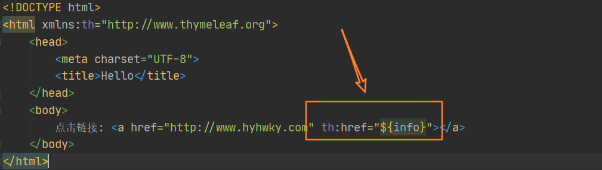
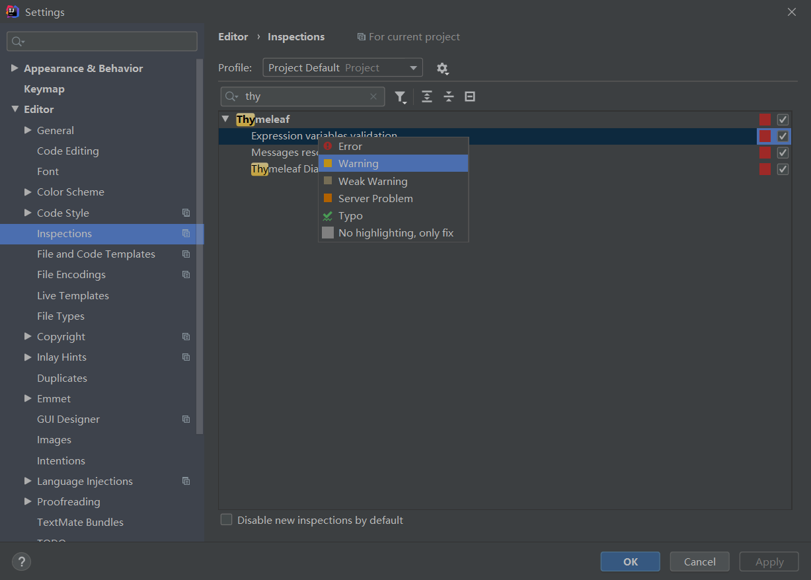

[toc]

## 问题描述

不多说，直接上图。本身代码没啥问题，就是强迫症看着难受，如何去除呢？



## 解决方案

### 一、修改IDEA针对thymeleaf表达式的报错提醒级别

File->Settings->Editor->Inspections，搜索thymeleaf，右键Expression variables validation的级别，不是Error就行。



### 二、添加suppress ALL

```html
<!DOCTYPE html>
<!--suppress ALL-->
<html xmlns:th="http://www.thymeleaf.org">
    <head>
        <meta charset="UTF-8">
        <title>Hello</title>
    </head>
    <body>
        点击链接: <a href="http://www.hyhwky.com" th:href="${info}"></a>
    </body>
</html>
```

## 参考资料

- [IDEA 使用thymeleaf模板 前端HTML代码中标签有红色下划线](https://blog.csdn.net/David_jiahuan/article/details/101199274?utm_medium=distribute.pc_relevant_t0.none-task-blog-BlogCommendFromMachineLearnPai2-1.channel_param&depth_1-utm_source=distribute.pc_relevant_t0.none-task-blog-BlogCommendFromMachineLearnPai2-1.channel_param)

