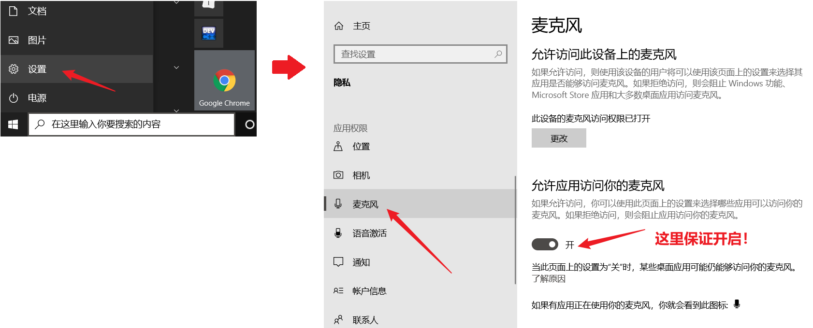
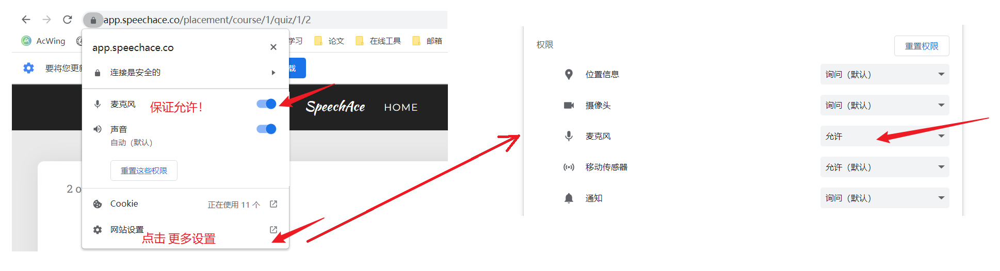

# 解决：win10 浏览器麦克风权限如何打开？打开也没用？

前提：一定要确保系统本身就已经启用麦克风，具体操作如下：

> 设置 -> 隐私 -> 打开麦克风权限

根据提示，打开浏览器权限，这里以谷歌浏览器为例，其他的可以参考：[https://zhuanlan.zhihu.com/p/446229767](https://zhuanlan.zhihu.com/p/446229767)

至此就已解决！

> ps：或者也可以直接访问：[chrome://settings/privacy](chrome://settings/privacy) 进行高级设置。

