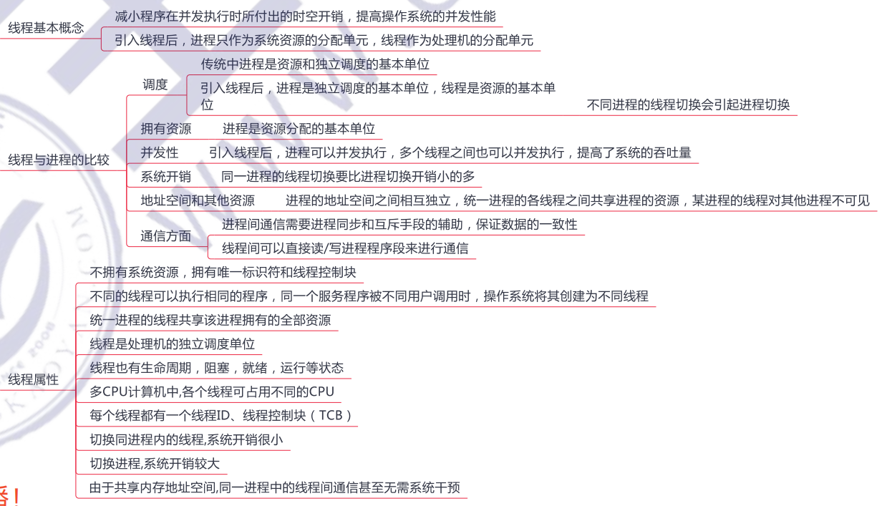
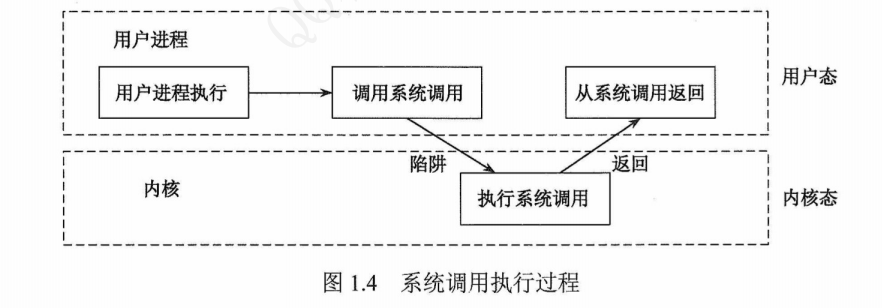
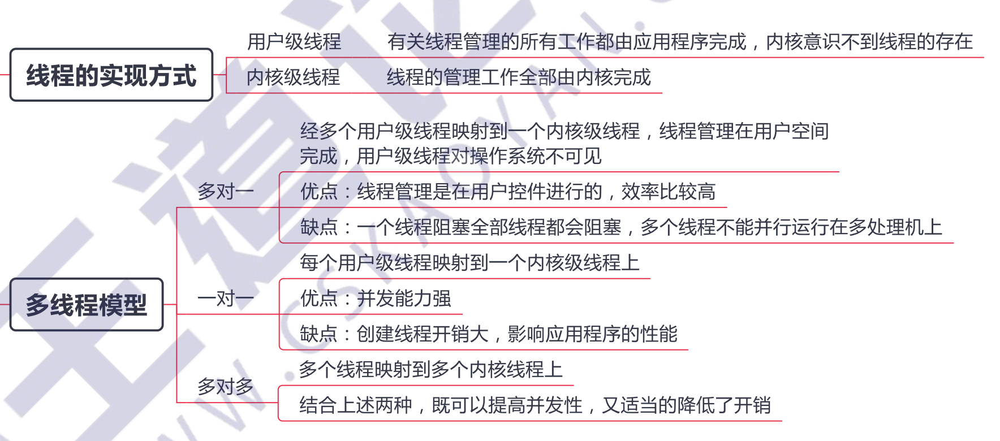
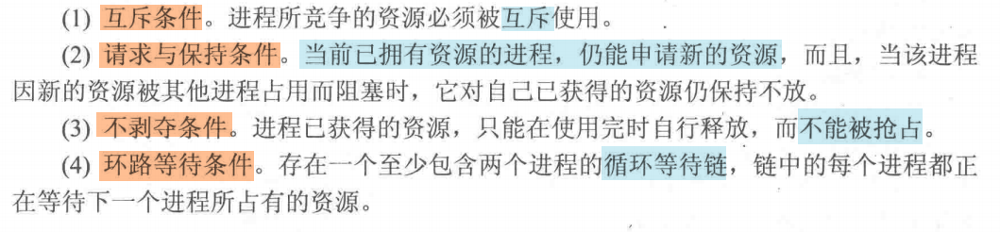
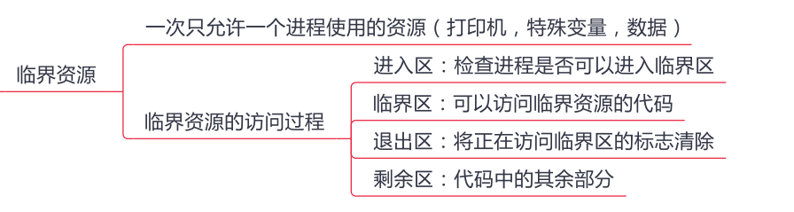
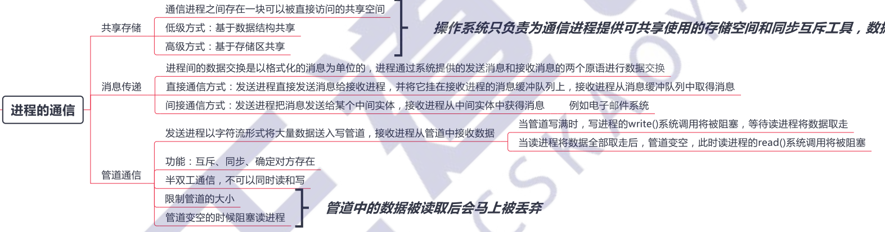
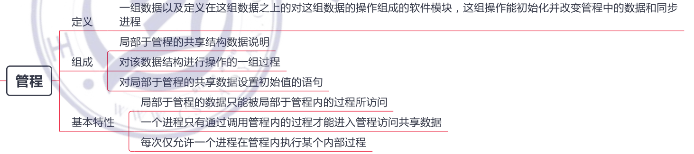

[toc]

## 什么是操作系统？操作系统的基本特征？

**一、并发性**

- 并发：两个或多个事件在同一时间间隔内发生。多道程序环境下，**宏观上在一段时间内多个程序同时运行**。

- 并行：两个或多个事件在同一时刻发生。

**二、共享性**

- 系统中的资源可**供内存中多个并发执行的进程同时使用**。 资源共享方式分为两种：
  - 互斥共享：资源一段时间只能给一个进程使用。
  - 同时访问：资源一段时间内可以被多个进程同时访问。（宏观上的同时，微观上可能是交替访问！）

**三、虚拟性**

- 通过虚拟技术，将一个物理实体变为若干个逻辑上的对应物。（虚拟处理剂、虚拟存储器、虚拟设备）

**四、异步性**

- 在多道程序环境下，每个程序何时执行和暂停都是未知的。

> OS四大特征的关系：并发最重要，其他三个以并发为前提。并发性和共享性是最基本的特征。
>
> 操作系统的形成标志：多道程序设计技术的出现。

## 操作系统的主要功能

1. 目标：方便性、有效性、可扩充性、开放性
2. 作用：操作系统是覆盖在硬件上的第一层软件，它管理计算机的硬件和软件资源，并向用户提供良好的页面。
   1. 用户与计算机硬件系统之间的**接口**。
   2. 计算机资源的**管理者**。
   3. 实现了对计算机资源的**抽象**。
   4. 计算机工作流程的**组织者**。

## 线程与进程的区别

### 进程

为了能使程序能够并发执行，并且可以对并发执行的程序加以描述和控制，操作系统中引入进程的概念，用进程来表示一个并发的程序。

一个进程实体包括三个部分：PCB(进程控制块)、程序段、相关数据段。

> PCB是进程存在的唯一标志。

### 线程

## 进程有几个状态？相互之间如何转换？

- 就绪态->运行态：处于就绪态的进程被调度后，获得处理机资源（分派处理机时间片）。
- 运行态->就绪态：
  - 情况一：处于运行态的进程 在时间片用完之后，让出处理机。
  - 情况二：可剥夺系统中，更高优先级的进程就绪时，抢到了处理机资源，导致当前进程让出处理机。
- 运行态->阻塞态：进程请求某一资源或等待某一事件发生时，此时运行转阻塞。
- 阻塞态->就绪态：进程等待的事件到来时，比如中断结束，进程从阻塞态转化为就绪态。

## 用户态和核心态

## 内核级线程和用户级线程的区别是什么？

## 内部碎片和外部碎片

## 同步与互斥

## 产生死锁的几个必要条件

死锁：多个进程因为竞争资源从造成的一种僵局，没有外力作用，这些进程 都无法向前继续推进。

## 死锁预防

原理是：通过破坏产生死锁的某个必要条件来防止死锁的发生。四个必要条件中，后三个条件都可以被破坏。

1. 针对请求与保持条件：**规定所有的进程都必须一次性申请其在运行过程中所需的全部资源**。（改进方法：允许进程获得初期所需资源就可以运行，变运行边释放资源，全部释放完后，可再次请求所需资源）
2. 针对不剥夺条件：规定一个已经保持了某些资源的进程，**在提出新的资源请求而不能立即得到满足时，必须释放它已获得的所有资源**。
3. 针对环路等待条件：将系统中的资源按类型赋予不同的**序号**，并规定所有的进程必须严格按照资源序号递增的顺序申请资源。

## 如何避免死锁状态？

理解安全与不安全状态：

所谓安全状态，即系统能按某种进程顺序`<p1,p2,...,pn>`来为每个进程分配其所需资源，直至最大需求，每个进程都可顺利完成，`<p1,p2,...,pn>`叫做安全序列。 

所谓不安全状态，即系统不存在安全序列。系统若进入不安全状态，便有可能（不是一定的）进入死锁状态。、

利用**银行家算法**可以避免死锁！

## 局部性原理

**程序局部性原理**：是指程序在执行时呈现出局部性规律，即在一段时间内，整个程序的执行仅限于程序中的某一部分。相应地，执行所访问的存储空间也局限于某个内存区域，具体来说，局部性通常有两种形式：时间局部性和空间局部性。

**时间局部性：**被引用过一次的存储器位置在未来会被多次引用（通常在循环中）。

**空间局部性：**如果一个存储器的位置被引用，那么将来他附近的位置也会被引用。

## 临界区和临界资源

## 进程间通信的几种方式

## 什么是中断？ 中断处理的过程？

## 页面置换算法

## 什么是管程

