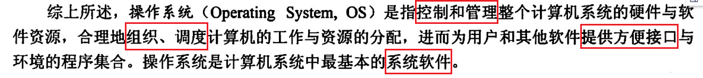

[toc]

## 什么是操作系统？操作系统的基本特征？

**一、并发性**

- 并发：两个或多个事件在同一时间间隔内发生。多道程序环境下，**宏观上在一段时间内多个程序同时运行**。

- 并行：两个或多个事件在同一时刻发生。

**二、共享性**

- 系统中的资源可**供内存中多个并发执行的进程同时使用**。 资源共享方式分为两种：
  - 互斥共享：资源一段时间只能给一个进程使用。
  - 同时访问：资源一段时间内可以被多个进程同时访问。（宏观上的同时，微观上可能是交替访问！）

**三、虚拟性**

- 通过虚拟技术，将一个物理实体变为若干个逻辑上的对应物。（虚拟处理剂、虚拟存储器、虚拟设备）

**四、异步性**

- 在多道程序环境下，每个程序何时执行和暂停都是未知的。

> OS四大特征的关系：并发最重要，其他三个以并发为前提。并发性和共享性是最基本的特征。
>
> 操作系统的形成标志：多道程序设计技术的出现。

## 操作系统的主要功能

1. 目标：方便性、有效性、可扩充性、开放性
2. 作用：操作系统是覆盖在硬件上的第一层软件，它管理计算机的硬件和软件资源，并向用户提供良好的页面。
   1. 用户与计算机硬件系统之间的**接口**。
   2. 计算机资源的**管理者**。
   3. 实现了对计算机资源的**抽象**。
   4. 计算机工作流程的**组织者**。

## 线程与进程的区别

## 进程有几个状态？相互之间如何转换？

## 用户态和核心态

## 内核级线程和用户级线程的区别是什么？

## 内部碎片和外部碎片

## 同步与互斥

## 死锁的几个必要条件

## 如何避免死锁状态？

## 局部性原理

## 临界区和临界资源

## 进程间通信的几种方式

## 什么是中断？ 中断处理的过程？

## 页面置换算法

