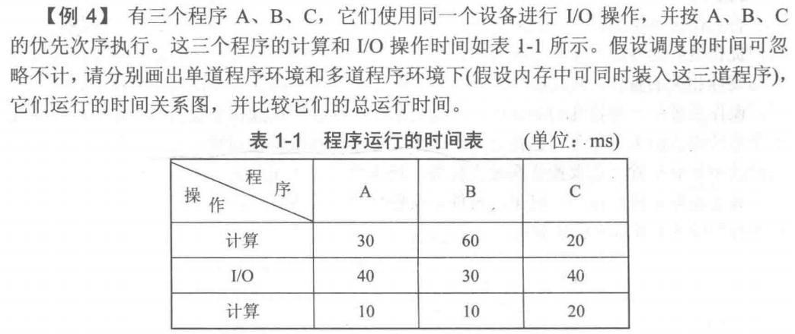
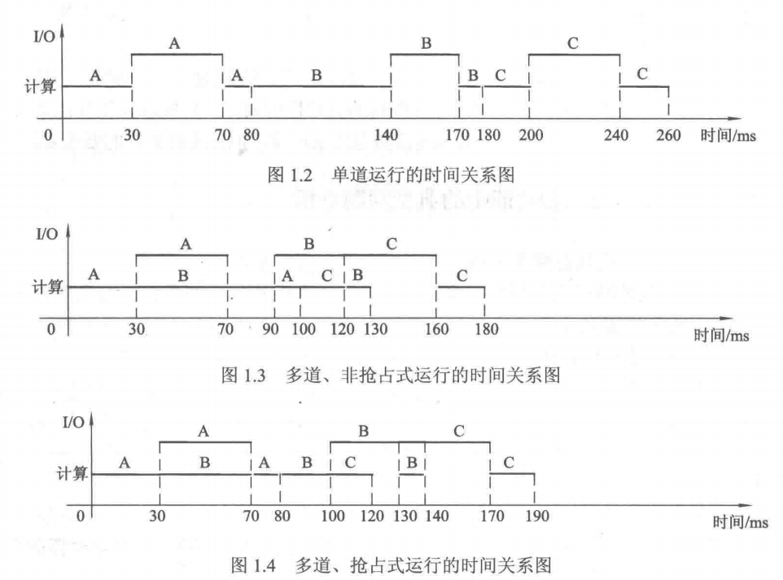
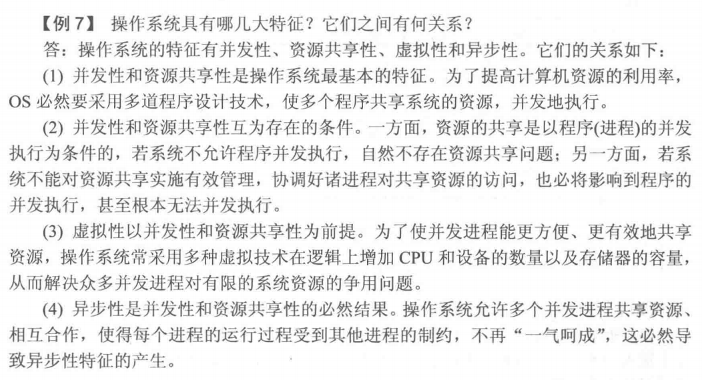

[toc]

# 一、操作系统的目标和使用

1. 目标：方便性、有效性、可扩充性、开放性

2. 作用：操作系统是覆盖在硬件上的第一层软件，它管理计算机的硬件和软件资源，并向用户提供良好的页面。
   1. 用户与计算机硬件系统之间的**接口**。
   2. 计算机资源的**管理者**。
   3. 实现了对计算机资源的**抽象**。 
   4. 计算机工作流程的**组织者**。

# 二、操作系统的发展过程

## 一、无操作系统的计算机系统

### 1. 人工操作方式

特点：用户独占全机资源 + CPU等待人工操作

缺点：**人机矛盾**，资源利用率低， 高速的CPU和低速的IO设备之间速度不匹配的矛盾突出。

### 2. 脱机输入输出方式

啥是脱机输入/输出？ 指**在一台外围机的控制下**， 预先将程序和数据从低速输入设备输入到磁带，当CPU需要这些程序和数据时， 再从磁带高速地读入内存。 类似，脱机输出指CPU需要输出时，先高速地将数据写入磁带，然后**在外围机控制下**，通过低速输出设备进行输出。

> 外围机：专门用来管理输入输出的，功能较简单的计算机。

啥是联机输入/输出？在**主机的直接控制下**进行的输入/输出， 注意脱机和联机的区别。

特点：

1. 外围机控制，减少主存CPU的空闲时间，缓和了人机矛盾。
2. CPU直接通过高速磁带输入输出，极大提高IO速度，缓和CPU与IO设备间的速度不匹配。

## 二、单道批处理系统

> **批处理技术**: 在系统中配置一个**监督程序**，并在该监督程序的控制下，能够**对一批作业自动进行处理**的技术。

啥是**单道批处理系统**？ 单道+批处理，即内存中只能存放一道作业的批处理系统。且监督程序就是操作系统的雏形。

单道批处理系统的处理过程：

1. 将一批作业以**脱机方式**输入到磁带上。
2. 由**监督程序**将磁带上的第一个作业装入内存，并**把运行的控制权交给作业**。
3. 当该作业**处理完成**或**出现异常**， 又把控制权交还给监督程序。
4. 监督程序再调入磁带上的第二个作业。
5. 如此继续下去，指导磁带上的所有作业执行完毕。

特点：

1. 提高了资源利用率，增加了系统吞吐量， 但资源仍未得到充分利用。
2. 内存中仅仅只有一道程序，造成内存的浪费。
3. 每逢该程序在运行中发出IO请求后，CPU便处于等待状态，必须在其IO完成后才能继续运行，操作CPU利用率降低。

## 三、多道批处理系统

### 1. 多道程序设计技术

啥是多道程序设计技术？ 指在**内存中同时存放若干个作业，并使它们共享系统资源且同时运行**的技术。

优点：若正在执行的作业因IO等原因而暂停执行时，CPU可马上调度另一道作业执行，从而使系统中众多的IO设备可与CPU并行地工作。

1. 提高CPU利用率。
2. 提高内存和IO设备利用率。
3. 增加系统吞吐量。

### 2. 多道批处理系统

啥是多道批处理系统？ 指采用 **多道程序设计技术** + **批处理**处理系统。

特点：该类系统中必须配置一组软件，来解决多道程序对系统资源的共享和争用问题，解决各个作业的组织和调度问题，提供给用户友好接口。

优点：资源利用率高，系统吞吐量大。

缺点：将用户和计算机操作员 分开， 且用户作业需要排队依次处理，使得用户无法直接与自己的作业进行交互和作业的平均周转时间较长。

> 操作系统的形成标志：多道程序设计技术的出现。

## 四、分时系统

引入目的：**解决批处理系统无法进行人机交互的问题， 并使得多个用户能够同时使用主机资源。**（就是为了更好地满足用户的需要）

啥是分时系统?  在一台主机上连接有多个配有显示器和键盘的终端，**同时允许多个用户通过自己的终端以交互方式使用计算机**，共享主机中的资源。

特点：**使用户能够与自己的作业进行交互**， **系统能够及时响应用户的终端命令**。

1. 作业提交时应直接进入内存。
2. 系统中必须**采用按时间片轮转运行的分时技术**。

> 分时技术：**把处理机的 时间划分为很短的时间片（几百毫秒）轮流地分配给各个终端作业使用**。 在一段时间内，所有的作业都能执行一个时间片。 如果一个时间片内没执行完，也必须将CPU交给下一个作业使用。 这样子系统才能够及时地响应每个用户的请求，每个用户都可以与自己的 作业交互。

分时系统的特征：多路性、独立性、及时性、交互性。

## 五、实时系统

实时系统是啥？指系统能够及时响应外部事件的请求，在规定的时间内完成对该事件的处理，并控制所有实时任务协调一致地运行。

类型: 工业控制系统、信息查询系统、多媒体系统、嵌入式系统。

根据对任务的截止时间的要求，分为硬实时任务和软实时任务。

实时系统的特征：多路性、独立性、及时性、交互性、**可靠性**。实时系统对可靠性要求相较于分时系统高。

## 六、微机操作系统

啥是微机操作系统？ 配置在微型机上的操作系统。

# 三、操作系统的基本特征和功能

## 一、操作系统的基本特征（重要）

### 1. 并发性

并发：两个或多个事件在同一时间间隔内发生。多道程序环境下，**宏观上在一段时间内多个程序同时运行**。

并行：两个或多个事件在同一时刻发生。

### 2. 共享性

系统中的资源可**供内存中多个并发执行的进程同时使用**。 资源共享方式分为两种：

1. 互斥共享：资源一段时间只能给一个进程使用。
2. 同时访问：资源一段时间内可以被多个进程同时访问。（宏观上的同时，微观上可能是交替访问！）

### 3. 虚拟性

通过虚拟技术，将一个物理实体变为若干个逻辑上的对应物。（虚拟处理剂、虚拟存储器、虚拟设备）

### 4. 异步性

在多道程序环境下，每个程序何时执行和暂停都是未知的。

## 二、操作系统的功能

### 1. 处理机管理

主要指 对处理机的分配和运行进行管理。 处理机分配和运行以进程为基本单位。进程管理主要包括：

1. 进程控制：创建、撤销进程，进程在运行中的状态转换。
2. 进程同步：协调进程执行次序。
3. 进程通信：进程之间信息交换。
4. 进程调度：为多个就绪进程分配处理机，分配到处理机的进程投入执行。

### 2. 存储器管理

1. 内存分配：为每道程序分配内存空间。
2. 内存保护：确保每道用户程序只在自己的内存中运行，不干扰其他。
3. 地址映射：将程序中的逻辑地址转换成内存中的物理地址。
4. 内存扩充：逻辑上扩充内存的容量，方便大作业的运行。

### 3. 设备管理

1. 缓冲管理：利用缓冲来缓和CPU和IO设备速度不匹配的矛盾。
2. 设备分配：为用户分配完成IO请求所需的设备和设备控制器。
3. 设备处理：启动设备进行真正的IO操作，响应并处理设备控制器发来的中断请求。

### 4. 文件管理

1. 文件存储空间的管理：为文件分配必要的存储空间。
2. 目录管理：通过目录的方式来组织文件。
3. 文件的读写管理和保护：实现文件的**读写操作**，提供有效的存取控制功能保护文件。

### 5. 友好的用户接口

1. 用户接口：分为联机用户接口、脱机用户接口和图形用户接口。
2. 程序接口：提供一组**系统调用**，供用户程序调用操作系统的功能。

### 6. 现代操作系统的新功能

1. 系统安全：认证技术、密码技术、访问控制技术以及反病毒技术。
2. 网络的功能和服务：网络通信、网络资源管理和应用互操作等功能。
3. 支持多媒体：提供接纳控制和实时调度等功能，采取适当的多媒体文件存储方式。

# 四、操作系统的结构设计

1. 无结构OS：整体式系统，整个操作系统是各种过程的集合，每个过程都可以调用任意其他过程，不方便维护和调试，可读性可扩充性差。
2. 模块化结构OS：采用模块化程序设计技术，将操作系统按其功能划分为若干个具有一定独立性和大小的模块，规定模块间交互的接口。优点：操作系统设计的正确性高，适应性好，但模块划分和接口规定较为困难。
3. 分层式结构OS：对模块化结构的改进，将模块之间的复杂依赖关系改为单向依赖关系，并消除了某些循环依赖关系，因此能使 OS 结构变得非常清晰，从而使系统的正确性更高、扩充性和维护性更好。
4. **微内核结构OS**（重要）
   1. 主要思想：在操作系统内核中只留下一些最基本的功能，而将其他服务尽**可能地从内核中分离出去**，用若干个运行在**用户态下的进程**（即服务器进程）来实现，形成所谓的**"客户/服务器"**模式。普通用户进程（即客户进程）可通过内核向服务器进程发送请求，以取得操作系统的服务。
   2. 优点: 提高了系统的可扩展性，增强了系统的可靠性和可移植性，提供了对分布式系统的支持等优点。
   3. 缺点：运行效率不好。

# 五、重难点！

## 一、OS发展

1. “人机矛盾” 和 “CPU-IO设备速度不匹配的矛盾” 对计算机资源的利用率有何严重的影响？
2. 单道批处理系统引入哪些技术？ 他们是如何解决上述两对矛盾的？
3. 单道批处理系统还存在哪些不足之处？而多道批处理系统又是通过哪些技术措施来解决这些不足的？
4. 多道批处理系统还有哪些地方不能满足用户的需求？（为何发展为分时系统，分时系统关键技术？）
5. 上述系统还有哪些不足？（为何发展为实时系统）
6. **注意分析和比较分时系统与实时系统的特征。（重要）**
   1. 从**交互性**上看，**交互性问题是分时系统的关键问题**。 分时系统中用户可以通过终端与系统进行广泛的人机交互。 实时系统中交互性仅限于访问系统中某些特定的专用服务程序，交互性具有局限性。
   2. 从**及时性**方面上考虑， 分时系统的及时性是指用户能在很短的时间内获得系统响应，一般是2-3秒，而**实时系统的及时性是关键问题之一**，要求的响应时间一般为秒级，百毫秒级直到毫秒级，甚至更低。
   3. 从**可靠性**上看，**可靠性是实时系统的另一个关键问题**，实时系统中任何差错都可能带来巨大经济损失，往往采取多级容错措施来保证系统的高度可靠，而分时系统要求可靠度相对较低。

## 二、OS基本特征和功能

1. **OS的特征：并发、共享、虚拟、异步。（重要）**
2. OS四大特征的关系：并发最重要，其他三个以并发为前提。
   1. 并发性和共享性是最基本的特征。多道程序设计技术，使得多个程序共享系统资源，并发执行。
   2. 并发性和共享性互为存在前提。一方面，若系统不允许程序并发执行，自然不存在资源共享问题。另一方面，若系统无法对资源共享有效管理，也会影响到程序的并发执行。
   3. 虚拟性以并发性和共享性为前提。为了是并发进程更有效地共享资源，操作系统采取多种虚拟技术在逻辑上增加CPU和设备的数量以及存储器的容量，从而解决并发进程对有限资源的争用问题。
   4. 异步性是并发性和共享性的必然结果。操作系统允许多个并发进程共享资源，每个进程在运行时也会受到其他进程制约，导致异步性的产生。
3. **OS的功能：处理机管理、存储器管理、设备管理、文件管理、提示友好用户接口。**
4. OS五大功能的必要性：保证多道程序能有条不紊的高效运行，方便用户对计算机系统的使用。

## 三、微内核结构

1. 微内核结构的优点？ 为什么？
   1. 提高**系统扩展性**。微内核结构中OS的大部分功能都是由相对独立的服务器实现，用户可以根据需要，选配其中部分或全部服务器或是更新或增加一些新的服务器。
   2. 增强OS的**可靠性**。所有的服务器都是运行在用户态，他们不能直接访问硬件，因此当某个服务器出现错误时，通常只会影响到自己，而不会引起内核和其他服务器的损坏或崩溃。
   3. **可移植性**更好，在微内核的OS中，所有与特定CPU和IO设备硬件相关的代码，均放在内核和内核下面的硬件隐藏层中，而操作系统其他绝大部分均与硬件平台无关，因此将该操作系统移植至另一硬件平台所需的改动较小。
   4. 适用于**分布式系统**。对用户而言，他通过消息传递与服务器通信时，只需要发送一个请求，然后等待服务器的响应，而无需指导该消息是在本地机就地处理还是通过网络送给远地机上的服务器处理。

# 六、例题

1. 在计算机系统中配置操作系统的主要目的是：**提高系统资源的利用率**。 操作系统的主要功能是管理计算机系统中的**资源**，其中包括**存储器**、**处理机**，以及文件和设备，这里的**处理机**主要是对进程进行管理。
2. 操作系统有多种类型：
   1. 允许多个用户以交互方式使用计算机的操作系统，称为：**分时操作系统**；
   2. 允许多个用户将若干个作业提交给计算机系统集中处理：**批处理操作系统**；
   3. 计算机系统能够及时处理由过程控制反馈的数据并作出响应：**实时操作系统**；
   4. 在IBM-PC机上的操作系统：**微机操作系统**。

3. 操作系统是一种**系统软件**，它负责为用户和用户程序完成所有的**与硬件相关并与应用无关**的工作，高级程序设计语言的编译不是操作系统关心的主要问题。
4. 用户在程序设计的过程中，可通过**系统调用**获得操作系统的服务。

5. 在OS中采用多道程序设计技术，能有效提高CPU，内存和IO设备的利用率，为实现多道程序设计需要有更大的内存。
6. 推动批处理系统形成和发展的主要动力是提供系统资源利用率，推动分时系统形成和发展的动力是方便用户，推动微机OS发展的主要动力是计算机硬件的不断更新换代。

7. 在设计分时操作系统时，首先要考虑的是 **交互性和响应时间**;  在设计批处理操作系统时，首先要考虑的是**周转时间和系统吞吐量** ;  在设计实时操作系统时，首先要考虑的是**实时性和可靠性**。

8. 在多道批处理系统中，为了充分利用各种资源，系统总是优先选择**计算型和 I/O型均衡的**多个作业投入运行; 为了提高吞吐量，系统总是想方设法缩短用户作业的**周转时间**。

9. 对批处理作业，必须提供相应的作业控制信息。
10. 分时系统的响应时间（及时性）主要是根据**用户所能接受的等待时间**确定的，而实时系统的响应时间则是由**控制对象所能接受的时延**确定的。

11. 在分时系统中，为使多个用户能够同时与系统交互，最关键的问题是**能在一较短的时间内，使所有用户程序都得到运行**。;当用户数目为100时，为保证响应时间不超过2秒，此时的时间片最大应为**20ms**。
12. 分时系统和实时系统都具有交互性，实时系统的交互性允许用户访问**专用服务程序**；分时系统的交互性允许用户请求系统提供**多方面的服务**。
13. 实时操作系统必须在**规定时间**内处理完来自外部的事件，**资源利用率**不是设计实时系统主要追
求的目标。
14. 民航售票系统是实时信息系统，火箭飞行控制系统是实时控制系统。
15. 选择场合：
    1. 航空航天，核变研究：配置实时操作系统。
    2. 国家统计局数据处理中心：配置批处理操作系统。
    3. 机房学生上机学习编程：配置分时操作系统。
    4. 民航机票订购系统：配置实时操作系统。
    5. 两个不同地区之间发送电子邮件：配置网络操作系统。
16. 并发性是指若干事件在同一时间间隔内发生。
17. 在单处理器系统中，可以并发但不可以并行工作的是**进程与进程**。
18. 从下述关于**模块化程序**的叙述中，选出5条正确的叙述。
    1. 便于由多人分工编制大型程序。√
    2. 便于软件功能扩充。√
    3. 只要模块接口不变，各模块内部实现细节的修改，不会影响别的模块。√
    4. 使程序易于理解，也利于排错。√
    5. 模块间的单向调用关系，形成了模块的层次式结构。√
    6. 使程序设计更为方便，但比较难维护。×
    7. 在内存能够容纳的前提下，应使模块尽可能大，以减少模块的个数。×
    8. 模块之间的接口叫数据文件。×
    9. 模块愈小，模块化的优点愈明显，一般说来，一个模块的大小在10行以下。×
    10. 一个模块实际上是一个进程。×
19. 采用**微内核结构**时，将 OS 分成用于实现OS最基本功能的内核和提供各种服务的服务器两个部分;通常，下列模块中必须包含在操作系统内核中的是**中断处理模块**。
20. 与早期的OS相比，采用微内核结构的 OS 具有很多优点，但这些优点不包含**提高了OS的运行效率**。包含：1. 系统可扩展性 2. 系统可靠性 3. OS的可移植性。
21. 在 8 位微机上占据统治地位的操作系统是**CP/M**，16 位微机事实上的操作系统标准是**MS-DOS**。
22. 在3.X版本以前的 MS-DOS是**单用户单任务**操作系统，Windows 95是**单用户多任务**操作系统，Windows XP、Windows 7及Windows 8是**多用户多任务**，它们都是由**Microsoft 公司**开发的。
23. UNIX操作系统最初是由**Bell实验室**推出的，它属于**多用户多任务**类操作系统。
24. Linux是一个**多用户多任务**类型的操作系统，其内核的创始人是Linus Torvalds;所谓linux 是一个"Free Software"，这意味着Linux 可以自由修改和发布。

二、填空题

1. 设计现代OS 的主要目标是 <u>提高资源利用率</u>和 <u>方便用户</u>。


2. 单道批处理系统是在解决<u>人机矛盾</u>和<u>CPU与IO设备速度不匹配</u>的矛盾中发展起来的。

3. 在单处理机环境下的多道程序设计具有多道、<u>宏观上同时运行</u>和<u>微观上交替运行</u>的特点。


4. 现代操作系统的两个最基本的特征是 <u>并发和 资源共享</u>除此之外，它还具有 <u>虚拟性和 异步性</u>的特征。
5. 从资源管理的角度看，操作系统具有四大功能∶ <u>处理机管理、存储器管理、设备管理、文件管理</u>。为了方便用户，操作系统还必须提供<u>友好的用户接口</u>。
6. 
除了传统操作系统中的进程管理、存储器管理、设备管理、文件管理等基本功能外，现代操作系统中还增加<u>系统安全、网络和多媒体</u>等功能。
7. 操作系统的基本类型主要有<u>批处理系统、分时系统和 实时系统</u>。
8. 批处理系统的主要优点是<u>资源利用率高和系统吞吐量大</u>; 主要缺点是<u>无交互作用能力和作业平均周转时间长</u>。
9. 实现分时系统的关键问题是<u>人机交互</u>，为此必须引入<u>时间片</u> 的概念，并采用<u>时间片轮转</u>调度算法。
10. 分时系统的基本特征是∶<u>多路性、独立性、交互性和及时性</u>。

11. 若干事件在同一时间间隔内发生称为 <u>并发</u>; 若干事件在同一时刻发生称为 <u>并行</u>。
12. 实时系统可分为 <u>实时信息处理系统</u>、<u>实时控制系统</u>、多媒体系统和嵌入式系统等类型;民航售票系统属于<u>实时信息处理系统</u>，而导弹飞行控制系统则属于<u>实时控制系统</u>。

13. 为了使实时系统高度可靠和安全，通常不强求 <u>资源利用率</u>。
14. 当前比较流行的微内核的操作系统结构，是建立在层次化结构的基础上的，而且还采用了<u>客户机/服务器</u>模式和 <u>面向对象程序设计</u>技术。