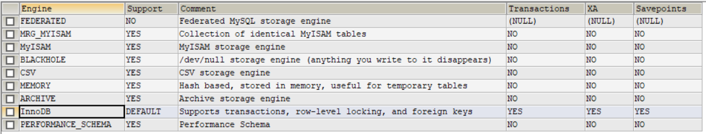

版本：MySQL5.7

# 存储引擎

```mysql
show engines; # 查看mysql提供的所有的存储引擎
```



- MySQL默认存储引擎是InnoDB。
- 只有InnoDB是事务性存储引擎。

```mysql
show variables like '%storage_engine%'; # 查看当前默认的存储引擎
```

```mysql
show table status like "tb_brand"; #查看tb_brand表的相关信息
```

# MyISAM和InnoDB的区别

|                  | MyISAM     | InnoDB                       |
| ---------------- | ---------- | ---------------------------- |
| 是否支持行级锁   | 只有表级锁 | 行级锁（默认）和表级锁都支持 |
| 是否支持事务     | 不支持     | 支持                         |
| 是否支持崩溃修复 | 不支持     | 支持                         |
| 是否支持外键     | 不支持     | 支持                         |
| 是否支持MVCC     | 不支持     | 支持                         |

# 索引

帮助mysql高效获取数据的数据结构。