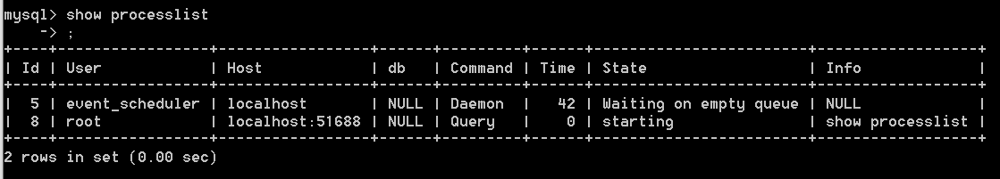

> https://time.geekbang.org/column/article/68319

# MySQL基本架构示意图


分为**Server层**和**存储引擎层**两部分。

## Server层

Server 层包括连接器、查询缓存、分析器、优化器、执行器等，涵盖 MySQL 的大多数核心服务功能，以及所有的内置函数（如日期、时间、数学和加密函数等），所有跨存储引擎的功能都在这一层实现，比如存储过程、触发器、视图等。

### 连接器

负责跟客户端建立连接、获取权限、维持和管理连接。连接命令的写法：

```sql
mysql -h$ip -P$port -u$user -p
```

连接命令中的mysql是mysql的客户端工具，用来跟服务端建立连接。

在完成TCP握手之后，连接器开始认证身份，使用用户名和密码。

- 认证失败： Access denied for user， 客户端执行结束。
- 认证通过：连接器去权限表中查询拥有的权限。

查看连接状态：

```sql
mysql> show processlist;
```



#### 使用长连接

数据库中，应该尽量使用**长连接**，因为建立连接的过程通常是比较复杂的，应该尽量减少建立连接的动作。

> 长连接：指连接成功后，如果客户端持续有请求，则一直使用同一个连接。短连接则是指每次执行完很少的几次查询就断开连接，下次查询再重新建立一个。

但是全部使用长连接后，占用内存涨的特别快，因为mysql执行过程中临时使用的内存是管理在连接对象里面的，这些资源在连接断开时才释放，内存占用太大，导致被系统强行杀掉，mysql异常重启。

如何解决？

1. 定期断开长连接。
2. mysql5.7或更新版本，在每次执行一次较大操作后，通过执行mysql_reset_connection来重新初始化连接资源。

### 查询缓存

建立连接之后，执行器会查询缓存。缓存命中，便不需要执行后面的复杂操作，直接返回结果，效率高。

> MySQL 拿到一个查询请求后，会先到查询缓存看看，之前是不是执行过这条语句。**之前执行过的语句及其结果可能会以 key-value 对的形式，被直接缓存在内存中。key 是查询的语句，value 是查询的结果**。如果你的查询能够直接在这个缓存中找到 key，那么这个 value 就会被直接返回给客户端。

如果不在缓存中，继续执行后面的执行阶段。

#### 查询缓存弊大于利

查询缓存的失效非常频繁，只要有对一个表的更新，这个表上的查询缓存都会被清空。mysql8版本就直接将查询缓存删掉了。

查询缓存适合使用的情况：静态表，很长时间才会更新一次。比如，一个系统配置表，那这张表上的查询才适合使用查询缓存。

你可以将参数 query_cache_type 设置成 DEMAND，这样对于默认的 SQL 语句都不使用查询缓存。而对于你确定要使用查询缓存的语句，可以用 SQL_CACHE 显式指定，像下面这个语句一样：

```sql
mysql> select SQL_CACHE * from T where ID=10；
```

### 分析器

对sql语句做解析。

1. 词法分析：识别sql语句中每个字符串分别是什么，代表什么，比如select是一个查询语句，T是表名。
2. 语法分析：判断sql语句是否满足mysql的语法。

### 优化器

经过分析器之后，mysql就知道你要做什么了，在开始执行之前，还需要经过优化器的处理。比如：

1. 在表里有多个索引的时候，决定使用哪个索引。
2. 在一个语句有多表关联的时候，决定各个表的连接顺序。

优化器执行完之后，这个sql的执行方案就确定了，接着就进入执行器阶段。

### 执行器

开始执行语句。

开始执行之前，判断有没有对这个表的执行查询的权限，如果没有，返回没有权限的错误。

如果有权限，就打开表继续执行，打开表时，根据表的引擎定义，使用该引擎提供的接口。

> 1. 调用 InnoDB 引擎接口取这个表的第一行，判断 ID 值是不是 10，如果不是则跳过，如果是则将这行存在结果集中；
> 2. 调用引擎接口取“下一行”，重复相同的判断逻辑，直到取到这个表的最后一行。[rows_examined]在这个时候机型累加，表示执行过程中扫描了多少行。
> 3. 执行器将上述遍历过程中所有满足条件的行组成的记录集作为结果集返回给客户端。

## 存储引擎层

存储引擎层负责数据的存储和提取。其架构模式是插件式的，支持 InnoDB、MyISAM、Memory 等多个存储引擎。现在最常用的存储引擎是 InnoDB，它从 MySQL 5.5.5 版本开始成为了默认存储引擎。

> 也就是说，你执行 create table 建表的时候，如果不指定引擎类型，默认使用的就是 InnoDB。不过，你也可以通过指定存储引擎的类型来选择别的引擎，比如在 create table 语句中使用 engine=memory, 来指定使用内存引擎创建表。


总结：

1. Mysql组件及其作用。
2. Server层和存储引擎层的作用。
3. 执行查询的流程。