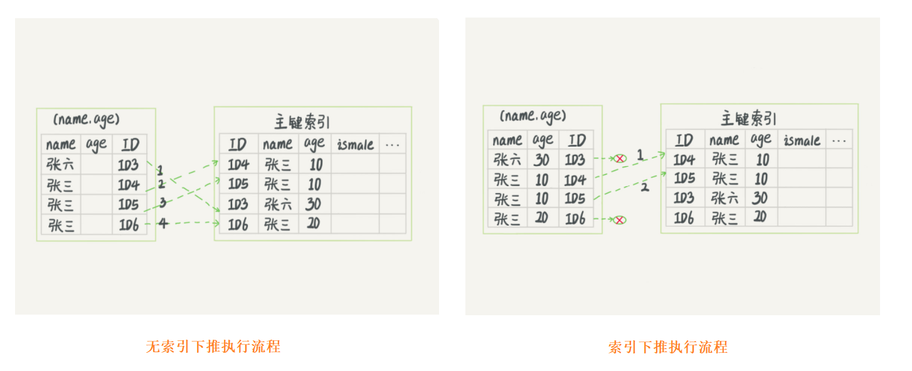

## 覆盖索引


如果执行的语句是 `select ID from T where k between 3 and 5`，这时只需要查 ID 的值，而 **ID 的值已经在 k 索引树上了，因此可以直接提供查询结果，不需要回表**。也就是说，在这个查询里面，索引 k 已经“覆盖了”我们的查询需求，我们称为**覆盖索引**。

由于覆盖索引可以减少树的搜索次数，显著提升查询性能，所以使用覆盖索引是一个常用的性能优化手段。

> 联合索引： https://cloud.tencent.com/developer/news/44861

```sql
CREATE TABLE `tuser` ( 
    `id` int(11) NOT NULL, 
    `id_card` varchar(32) DEFAULT NULL, 
    `name` varchar(32) DEFAULT NULL, 
    `age` int(11) DEFAULT NULL, 
    `ismale` tinyint(1) DEFAULT NULL, 
    PRIMARY KEY (`id`), 
    KEY `id_card` (`id_card`), 
    KEY `name_age` (`name`,`age`)
) ENGINE=InnoDB
```

建立id_card和name的联合索引是否有必要？ 

根据市民的身份证号查询他的姓名，可以在这个高频请求上用到覆盖索引，不再需要回表查整行记录，减少语句的执行时间。但索引字段的维护总是有代价的，在建立冗余索引来支持覆盖索引时就需要权衡考虑了。

## 最左前缀原则

name 和age联合索引的示意图如下：**索引项是按照索引定义里面出现的字段顺序排序的**。


不只是索引的全部定义，只要满足最左前缀，就可以利用索引来加速检索。这个最左前缀可以是联合索引的最左 N 个字段，也可以是字符串索引的最左 M 个字符。

**建立联合索引**时，要考虑到索引的复用能力。因为可以支持最左前缀，所以当已经有了 (a,b) 这个联合索引后，一般就不需要单独在 a 上建立索引了。因此，第一原则是，如果通过调整顺序，**可以少维护一个索引**，那么这个顺序往往就是需要优先考虑采用的。

如果既有联合查询，又有基于a，b各自的查询呢？如果查询b，是无法使用(a,b)联合索引的，不得不单独维护一个b索引，这时候就需要考虑**空间**了，尽量调整顺序，单独维护字段较小的索引。

## 索引下推

在 MySQL 5.6 之前，**只能从 ID3 开始一个个回表**。到主键索引上找出数据行，**再对比字段值**。

而 MySQL 5.6 引入的**索引下推优化**（index condition pushdown)， 可以在索引遍历过程中**，对索引中包含的字段先做判断，直接过滤掉不满足条件的记录，减少回表次数**。



可以看到有了索引下推之后，InnoDB在内部判断了age是否等于10，把不为10的记录直接跳过了，减少了不必要的回表。

## 评论区补充

1、覆盖索引：如果查询条件使用的是普通索引（或是联合索引的最左原则字段），查询结果是联合索引的字段或是主键，不用回表操作，直接返回结果，减少IO磁盘读写读取正行数据
2、最左前缀：联合索引的最左 N 个字段，也可以是字符串索引的最左 M 个字符
3、联合索引：根据创建联合索引的顺序，以最左原则进行where检索，比如（age，name）以age=1 或 age= 1 and name=‘张三’可以使用索引，单以name=‘张三’ 不会使用索引，考虑到存储空间的问题，还请根据业务需求，将查找频繁的数据进行靠左创建索引。
4、索引下推：like 'hello%’and age >10 检索，MySQL5.6版本之前，会对匹配的数据进行回表查询。5.6版本后，会先过滤掉age<10的数据，再进行回表查询，减少回表率，提升检索速度

