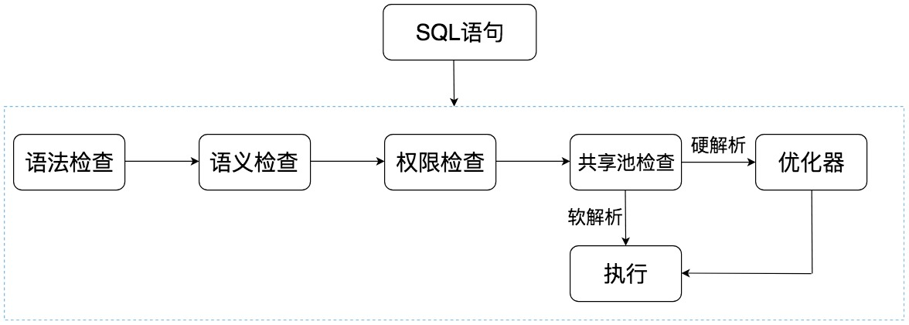
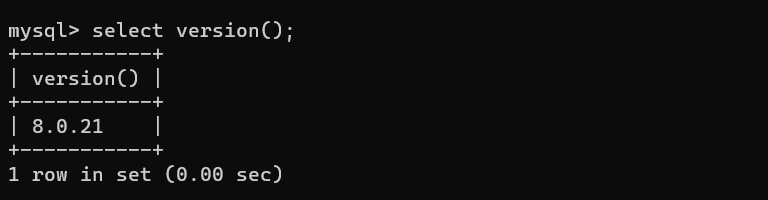

## Oracle中SQL是如何执行的？



## MySQL中的SQL是如何执行的？

Mysql是C/S架构， 服务器端使用mysqld。

### 整体流程


1. 连接层： 客户端和服务端建立连接，客户端发送SQL至服务器端。
2. SQL层：对SQL语句进行处理。
3. 存储引擎层：与数据库文件打交道，负责数据的存储和读取。

### SQL层


1. 查询缓存：Server如果在查询缓存中发现了这条SQL语句，就会直接将结果返回给客户端，如果没有，就进入解析器阶段。**查询缓存的失效非常频繁**，只要有对一个表的更新，这个表上所有的查询缓存都会被清空。mysql8.0之后功能移除。

2. 解析器：在解析器中对SQL语句进行**语法分析和语义分析**。
3. 优化器：**确定SQL语句的执行路径**，比如是根据全表检索，还是根据索引来检索等。
4. 执行器：**在执行之前需要判断该用户是否具备权限**，如果具备权限就执行SQL查询并返回结果。

## 不同的存储引擎

MySQL的存储引擎采用**插件**的形式，每个存储引擎都面向一种特定的数据库应用环境。常见的存储引擎如下：

1. **InnoDB**：**MySQL5.5版本之后默认的存储引**擎，最大的特点是 **支持事务**，**行级锁定**，外键约束。
2. **MyISAM**：MySQL5.5版本之前默认的存储引擎，**不支持事务，不支持外键**，最大的特点是速度快，占用资源少。
3. **Memory**：使用**系统内存**作为存储介质，相应速度快。但**如果mysqld进程崩溃，会导致所有的数据丢失**，适合临时使用数据的情况下使用。
4. NDB：主要用于MySQL cluster分布式集群环境，类似于Oracle的RAC集群。
5. Archive：有很好的压缩机制，用于文件归档，在请求写入时会进行压缩。

## 如何查看SQL执行使用的资源

看下profiling是否开启，开启之后可以让MySQL收集在SQL执行时所使用的资源情况。

```sql
mysql> select @@profiling;
```


打开它，设置为1。

```sql
mysql> set profiling = 1;
```

接着执行一系列操作：

```sql
mysql> show databases;
mysql> use jpa;
mysql> show tables;
mysql> select * from t_blog;
```

查看当前会话产生的所有profiles。

```sql
mysql> show profiles;
```


获取上一次查询的执行时间：

```sql
mysql> show profile;
```


可以指定query id：

```sql
mysql> show profile for query 2;
```


查看数据库版本：

```sql
mysql> select version();
```



