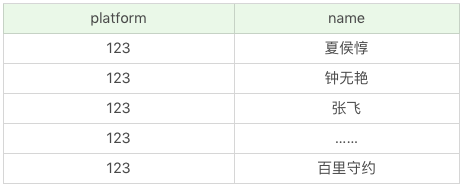
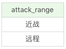
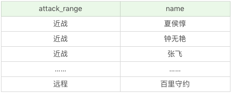

## 基础语法

**查询列**

```sql
SELECT name FROM heros;
```

**查询多个列**

```sql
SELECT name, hp_max FROM heros;
```

**查询所有列**

```sql
SELECT * FROM heros;
```

**起别名**

```sql
SELECT name AS n, hp_max AS hm FROM heros;
```

**查询常数**

```sql
SELECT '王者荣耀' AS platform, name FROM heros;
```



**去除重复行**

```sql
SELECT DISTINCT attack_range FROM heros;
```



```sql
SELECT DISTINCT attack_range, name FROM heros;
```



- DISTINCT 需要放在所有列名前面。
- DISTINCT 其实是对后面**所有列名的组合**进行去重。

**排序检索**

1. 排序的列名：ORDER BY 后面可以有一个或多个列名，**如果是多个列名进行排序，会按照后面第一个列先进行排序，当第一列的值相同的时候，再按照第二列进行排序**，以此类推。
2. 排序的顺序：ORDER BY 后面可以注明排序规则，**ASC 代表递增排序，DESC 代表递减排序**。如果没有注明排序规则，默认情况下是按照 **ASC** 递增排序。我们很容易理解 ORDER BY 对数值类型字段的排序规则，但如果排序字段类型为文本数据，就需要参考数据库的设置方式了，这样才能判断 A 是在 B 之前，还是在 B 之后。比如使用 MySQL 在创建字段的时候设置为 BINARY 属性，就代表区分大小写。
3. 非选择列排序：ORDER BY 可以使用非选择列进行排序，所以即使在 SELECT 后面没有这个列名，你同样可以放到 ORDER BY 后面进行排序。
4. ORDER BY 的位置：**ORDER BY 通常位于 SELECT 语句的最后一条子句**，否则会报错。

```sql
SELECT name, hp_max FROM heros ORDER BY hp_max DESC -- 最大生命值从高到低
SELECT name, hp_max FROM heros ORDER BY mp_max, hp_max DESC -- 多列排序
```

**约束返回结果的数量**

```sql
SELECT name, hp_max FROM heros ORDER BY hp_max DESC LIMIT 5
```

约束返回结果的数量可以减少数据表的网络传输量，也可以提升查询效率。如果我们知道返回结果只有 1 条，就可以使用LIMIT 1，告诉 SELECT 语句只需要返回一条记录即可。这样的好处就是 SELECT 不需要扫描完整的表，只需要检索到一条符合条件的记录即可返回。

## select 的执行顺序

1. 关键字的顺序不能颠倒

```sql
SELECT ... FROM ... WHERE ... GROUP BY ... HAVING ... ORDER BY ...
```

2. select语句的执行顺序

```sql
FROM > WHERE > GROUP BY > HAVING > SELECT的字段 > DISTINCT > ORDER BY > LIMIT
```

```sql
SELECT DISTINCT player_id, player_name, count(*) as num #顺序5
FROM player JOIN team ON player.team_id = team.team_id #顺序1
WHERE height > 1.80 #顺序2
GROUP BY player.team_id #顺序3
HAVING num > 2 #顺序4
ORDER BY num DESC #顺序6
LIMIT 2 #顺序7
```

1. 先执行from这一步，如果是多张表联查，还会经历下面几个步骤：
   1. 首先通过cross join求笛卡尔积，得到虚拟表vt1-1。
   2. 通过on进行筛选，在vt1-1基础上 筛选得到vt1-2。
   3. 添加外部行，如果是左连接或右连接或全连接，会在vt1-2基础上增加外部行，得到虚拟表vt1-3。

如果我们操作的是两张以上的表，还会重复上面的步骤，直到所有表都被处理完为止。这个过程得到是我们的原始数据。

2. 当我们拿到了查询数据表的原始数据，也就是最终的虚拟表 vt1，就可以在此基础上再进行 WHERE 阶段。在这个阶段中，会**根据 vt1 表的结果进行筛选过滤**，得到虚拟表 vt2。

3. 然后进入第三步和第四步，也就是 **GROUP 和 HAVING** 阶段。在这个阶段中，实际上是在虚拟表 vt2 的基础上进行分组和分组过滤，得到中间的虚拟表 vt3 和 vt4。

4. 当我们完成了条件筛选部分之后，就可以筛选表中提取的字段，也就是进入到 **SELECT 和 DISTINCT** 阶段。首先在 SELECT 阶段会提取想要的字段，然后在 DISTINCT 阶段过滤掉重复的行，分别得到中间的虚拟表 vt5-1 和 vt5-2。

5. 当我们提取了想要的字段数据之后，就可以按照指定的字段进行排序，也就是 **ORDER BY** 阶段，得到虚拟表 vt6。

6. 最后在 vt6 的基础上，取出指定行的记录，也就是 **LIMIT** 阶段，得到最终的结果，对应的是虚拟表 vt7。

## 如何提升select 效率

如果我们不需要把所有列都检索出来，还是先指定出所需的列名，因为**写清列名，可以减少数据表查询的网络传输量**，而且考虑到在实际的工作中，我们往往不需要全部的列名，因此你需要养成良好的习惯，写出所需的列名。