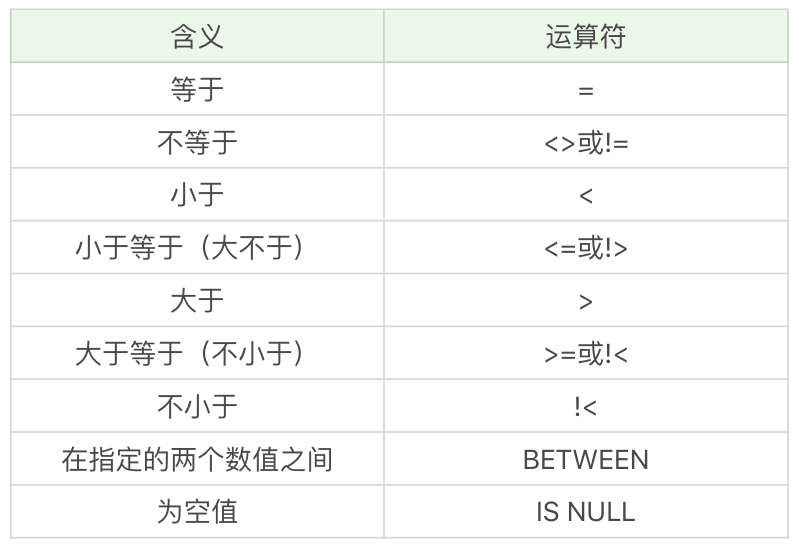
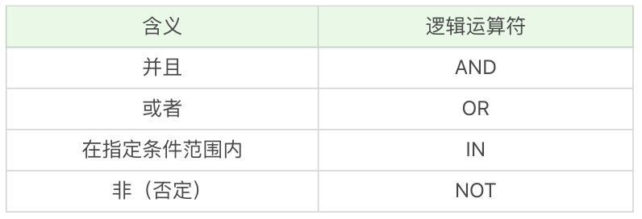

## 比较运算符

在SQL中可以使用where子句对条件进行筛选。



**简单案例**

查询所有生命值大于6000的英雄

```sql
select name, hp_max from heros where hp_max > 6000;
```

查询所有最大生命值5399到6811之间的英雄

```sql
select name, hp_max from heros where hp_max between 5399 and 6811;
```

查询最大值字段为空值的记录

```sql
select name, hp_max from heros where hp_max is null;
```

## 逻辑运算符



如果存在多个where条件子句，可以使用逻辑运算符。

**简单案例**

筛选最大生命值大于6000， 最大法力值大于1700的英雄，按照最大生命值和最大法力值之和从高到低排序。

```sql
select name, hp_max, mp_max from heros 
where hp_max > 6000 
and mp_max > 1700 
order by (hp_max + mp_max) desc;
```

查询最大生命值加最大法力值大于 8000 的英雄，或者最大生命值大于 6000 并且最大法力值大于 1700 的英雄，并排序。

```sql
select name, hp_max, mp_max from heros 
where (hp_max + mp_max) > 8000 
or hp_max > 6000 and mp_max > 1700
order by (hp_max + mp_max) desc;
```

当 WHERE 子句中同时出现 AND 和 OR 操作符的时候，需要考虑到执行的先后顺序，也就是两个操作符执行的**优先级**。**一般来说 () 优先级最高，其次优先级是 AND，然后是 OR**。

查询主要定位或者次要定位是法师或是射手的英雄，同时英雄的上线时间不在 2016-01-01 到 2017-01-01 之间。

```sql
select name, role_main, role_assist, hp_max, mp_max, birthdate 
from heros 
where (role_main in ('法师','射手') or role_assist in ('法师','射手')) 
and date(birthdate) not between '2016-01-01' and '2017-01-01' 
order by (hp_max + mp_max) desc;
```

## 通配符过滤

检索文本中包含某个词的所有数据，需要使用通配符。

匹配任意字符串出现的任意次数，使用%。

```sql
select name from heros where name like '%太%';
```

匹配单个字符，使用下划线通配符。

```sql
select name from heros where name like '_%太%'; -- 查找英雄名除了第一个字以外，包含‘太’字的英雄有哪些
```

如果使用%开头，会导致索引失效。