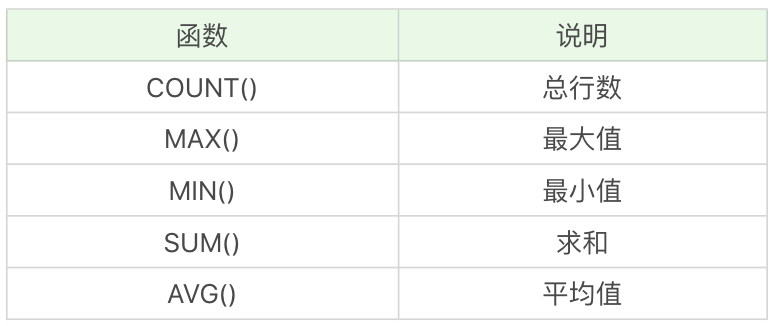
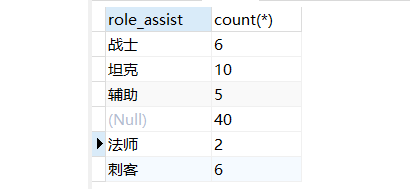
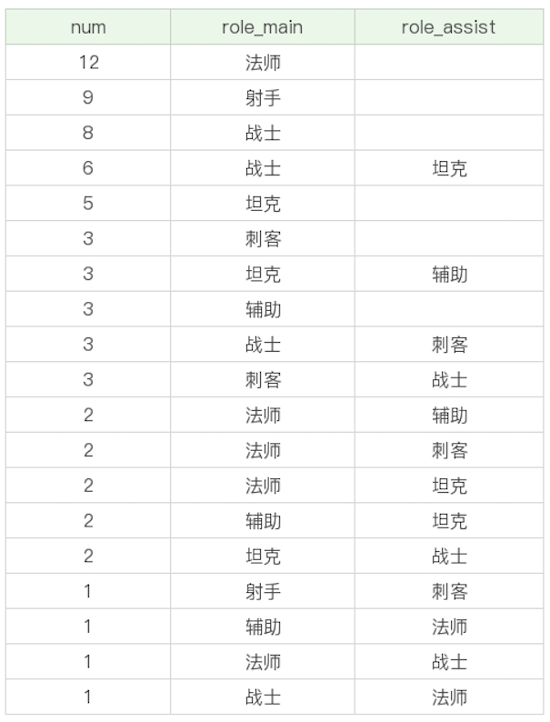
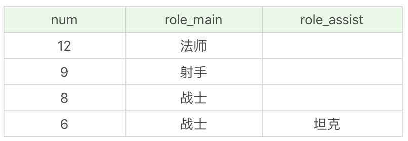
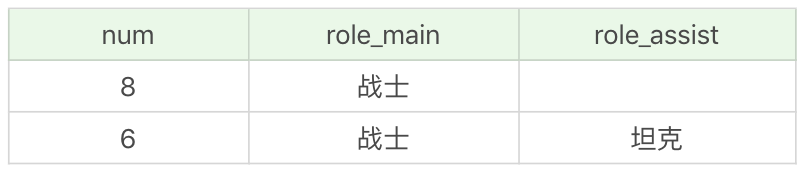

## 聚集函数的使用

聚集函数，它是对一组数据进行汇总的函数，输入的是一组数据的集合，输出的是单个值。



查询最大生命值大于 6000 的英雄数量。

```sql
SELECT
	count( * ) 
FROM
	heros 
WHERE
	hp_max > 6000;
```

查询最大生命值大于 6000，且有次要定位的英雄数量。

```sql
SELECT
	count( * ) 
FROM
	heros 
WHERE
	hp_max > 6000 
	AND role_assist IS NOT NULL;
```

```sql
SELECT
	count( role_assist ) 
FROM
	heros 
WHERE
	hp_max > 6000;
```

> COUNT(role_assist)会忽略值为 NULL 的数据行，而 COUNT(*) 只是统计数据行数，不管某个字段是否为 NULL。

查询射手（主要定位或者次要定位是射手）的最大生命值的最大值是多少。

```sql
SELECT
	max( hp_max ) 
FROM
	heros 
WHERE
	role_main = '射手' 
	OR role_assist = '射手';
```

射手（主要定位或者次要定位是射手）的英雄数、平均最大生命值、法力最大值的最大值、攻击最大值的最小值，以及这些英雄总的防御最大值等汇总数据。

```sql
SELECT
	count( * ),
	avg( hp_max ),
	max( mp_max ),
	min( attack_max ),
	sum( defense_max ) 
FROM
	heros 
WHERE
	role_main = '射手' 
	OR role_assist = '射手';
```

> AVG、MAX、MIN 等聚集函数会自动忽略值为 NULL 的数据行，MAX 和 MIN 函数也可以用于字符串类型数据的统计，如果是英文字母，则按照 A—Z 的顺序排列，越往后，数值越大。如果是汉字则按照全拼拼音进行排列。

需要先把 name 字段统一转化为 gbk 类型。

```sql
SELECT
	min( CONVERT ( NAME USING gbk ) ),
	max( CONVERT ( NAME USING gbk ) ) 
FROM
	heros;
```

查询不同的生命最大值的英雄数量是多少。

```sql
SELECT
	count( DISTINCT hp_max ) 
FROM
	heros;
```

统计不同生命最大值英雄的平均生命最大值，保留小数点后两位。

```sql
SELECT
	round( avg( DISTINCT hp_max ), 2 ) 
FROM
	heros;
```

## 先分组，再聚集

按照英雄的主要定位进行分组，并统计每组的英雄数量。

```sql
SELECT
	role_main,
	count( * ) 
FROM
	heros 
GROUP BY
	role_main;
```

对英雄按照次要定位进行分组，并统计每组英雄的数量。

```sql
SELECT
	role_assist,
	count( * ) 
FROM
	heros 
GROUP BY
	role_assist;
```



> 如果字段为 NULL，也会被列为一个分组。

按照英雄的主要定位、次要定位进行分组，查看这些英雄的数量，并按照这些分组的英雄数量从高到低进行排序。

```sql
SELECT
	role_main,
	role_assist,
	count( * ) AS num 
FROM
	heros 
GROUP BY
	role_main,
	role_assist 
ORDER BY
	num DESC;
```



## having 与 where的区别

HAVING 的作用和 WHERE 一样，都是起到过滤的作用，只不过 WHERE 是用于数据行，而 HAVING 则作用于分组。

想要按照英雄的主要定位、次要定位进行分组，并且筛选分组中英雄数量大于 5 的组，最后按照分组中的英雄数量从高到低进行排序。

```sql
SELECT
	count( * ) AS num,
	role_main,
	role_assist 
FROM
	heros 
GROUP BY
	role_main,
	role_assist 
HAVING
	num > 5;
```



筛选最大生命值大于 6000 的英雄，按照主要定位、次要定位进行分组，并且显示分组中英雄数量大于 5 的分组，按照数量从高到低进行排序。

```sql
SELECT
	count( * ) AS num,
	role_main,
	role_assist 
FROM
	heros 
WHERE
	hp_max > 6000 
GROUP BY
	role_main,
	role_assist 
HAVING
	num > 5 
ORDER BY
	num DESC;
```



## 课后习题

筛选最大生命值大于 6000 的英雄，按照主要定位进行分组，选择分组英雄数量大于 5 的分组，按照分组英雄数从高到低进行排序，并显示每个分组的英雄数量、主要定位和平均最大生命值。

```sql
SELECT
	count( * ) AS num,
	role_main,
	avg( hp_max ) AS avg 
FROM
	heros 
WHERE
	hp_max > 6000 
GROUP BY
	role_main 
HAVING
	num > 5 
ORDER BY
	num DESC;
```

筛选最大生命值与最大法力值之和大于 7000 的英雄，按照攻击范围来进行分组，显示分组的英雄数量，以及分组英雄的最大生命值与法力值之和的平均值、最大值和最小值，并按照分组英雄数从高到低进行排序，其中聚集函数的结果包括小数点后两位。

```sql
SELECT
	count( * ) AS num,
	round( avg( hp_max + mp_max ), 2 ),
	round( max( hp_max + mp_max ), 2 ),
	round( min( hp_max + mp_max ), 2 ) 
FROM
	heros 
WHERE
	( hp_max + mp_max ) > 7000 
GROUP BY
	attack_range 
ORDER BY
	num DESC;
```

