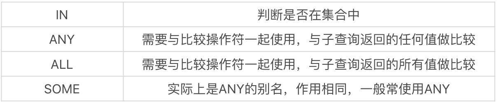

子查询可以分为关联子查询和非关联子查询。

## 关联子查询与非关联子查询

子查询是一种嵌套查询的形式，可以依据子查询是否执行多次，从而将子查询划分为关联子查询和非关联子查询。

**非关联子查询** ： 子查询从数据表中查询了数据结果，如果这个数据结果只执行一次，然后这个数据结果作为主查询的条件进行执行

**关联子查询**： 子查询需要执行多次，即采用循环的方式，先从外部查询开始，每次都传入子查询进行查询，然后再将结果反馈给外部。

## 案例

sql下载地址：[https://github.com/cystanford/sql_nba_data](https://github.com/cystanford/sql_nba_data)

表介绍： player 表为球员表，team 为球队表，team_score 为球队比赛表，player_score 为球员比赛成绩表，height_grades 为球员身高对应的等级表。

**非关联子查询**

以 NBA 球员数据表为例，假设我们想要知道哪个球员的身高最高，最高身高是多少，就可以采用子查询的方式

```sql
SELECT
	player_name,
	height 
FROM
	player 
WHERE
	height = ( SELECT max( height ) FROM player );
```

这就是非关联子查询，通过`select max(height) form player`查出最高身高，将这个最高身高作为主查询的条件执行一次。

**关联子查询**

如果子查询的执行依赖于外部查询，通常情况下都是因为子查询中的表用到了外部的表，并进行了条件关联，因此每执行一次外部查询，子查询都要重新计算一次，这样的子查询就称之为关联子查询。

查找每个球队中大于**平均身高**的球员有哪些，并显示他们的球员姓名、身高以及所在球队 ID。

```sql
SELECT
	player_name,
	height,
	team_id 
FROM
	player AS a 
WHERE
	height > ( SELECT avg( height ) FROM player b WHERE a.team_id = b.team_id );
```

这里我们将 player 表复制成了表 a 和表 b，每次计算的时候，需要将表 a 中的 team_id 传入从句，作为已知值。因为每次表 a 中的 team_id 可能是不同的，所以是关联子查询。

## EXISTS 子查询

关联子查询通常也会和 EXISTS 一起来使用，EXISTS 子查询用来判断条件是否满足，满足的话为 True，不满足为 False。

想要看出场过的球员都有哪些，并且显示他们的姓名、球员 ID 和球队 ID。

```sql
SELECT
	player_id,
	team_id,
	player_name 
FROM
	player 
WHERE
	EXISTS ( SELECT player_id FROM player_score 
            WHERE player.player_id = player_score.player_id );
```

## 集合比较子查询

集合比较子查询的作用是与另一个查询结果集进行比较，我们可以在子查询中使用 IN、ANY、ALL 和 SOME 操作符，它们的含义和英文意义一样



```sql
SELECT
	player_id,
	team_id,
	player_name 
FROM
	player 
WHERE
	player_id 
IN ( SELECT player_id FROM player_score 
    WHERE player.player_id = player_score.player_id );
```

查询球员表中，比印第安纳步行者（对应的 team_id 为 1002）中任意一个球员身高高的球员信息，并且输出他们的球员 ID、球员姓名和球员身高

```sql
SELECT
	player_id,
	player_name,
	height 
FROM
	player 
WHERE
	height > ANY ( SELECT height FROM player WHERE team_id = 1002 );
```

比印第安纳步行者（对应的 team_id 为 1002）中所有球员身高都高的球员的信息，并且输出球员 ID、球员姓名和球员身高。

```sql
SELECT
	player_id,
	player_name,
	height 
FROM
	player 
WHERE
	height > ALL ( SELECT height FROM player WHERE team_id = 1002 );
```

## in和exists如何选择

in和exists可以抽象为下面两个模型：

```sql
SELECT * FROM A 
WHERE
	cc IN ( SELECT cc FROM B );
```

```sql
SELECT * FROM A 
WHERE
	EXISTS ( SELECT cc FROM B WHERE B.cc = A.cc );
```

在对cc建立索引的情况下，我们还需要判断表A和表B的大小。

当大表IN小表时效率高；小表EXIST大表时效率高。

## 将子查询作为计算字段

子查询可以作为主查询的计算字段。

查询每个球队的球员数，也就是对应 team 这张表，我需要查询相同的 team_id 在 player 这张表中所有的球员数量是多少。

```sql
SELECT
	team_name,
	( SELECT count( * ) FROM player WHERE player.team_id = team.team_id ) AS player_num 
FROM
	team;
```

