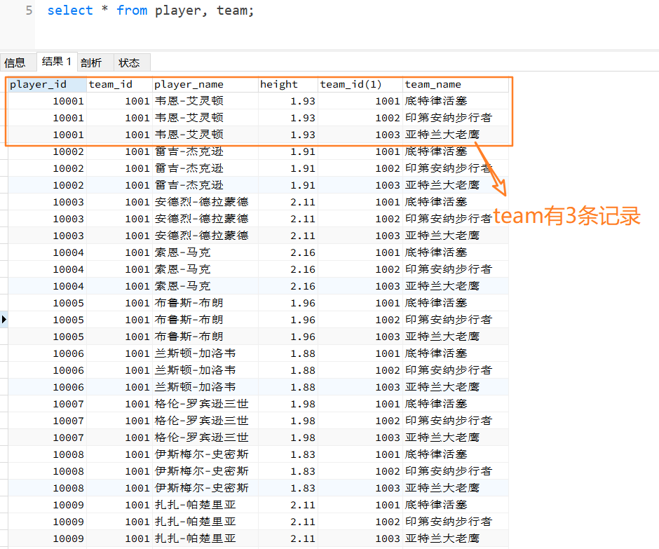
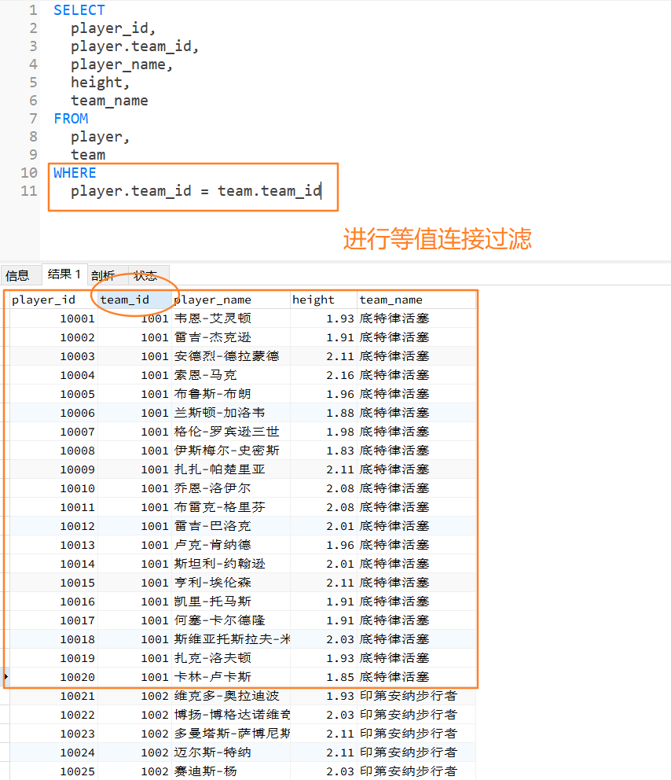
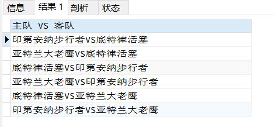

SQL可以在各个数据表之间进行连接查询，因为数据表是基于关系模型的，一个表就是一个关系。

一个数据库中可以包括多个表，也就是存在多种数据之间的关系。

连接join可以用一条select语句在多张表之间进行查询。

# SQL连接标准

SQL有两个主要的标准，SQL92和SQL99。

SQL92有5种连接方式，分别是笛卡尔积、等值连接、非等值连接、外连接（左连接、右连接）和自连接。

## 笛卡尔积

什么是笛卡尔积？假设有两个集合x和y，x和y的笛卡尔积就是x和y的所有可能组合，也就是第一个对象来自x，第二个对象来自y的所有可能。

```sql
SELECT * FROM player, team;
```




笛卡尔积也称为交叉连接，cross join， 它的作用就是将任意表进行连接，即使它们不相关。

他会列出所有的可能性，这里是37 * 3 = 111条，如果要筛选条件，可以使用where子句。

## 等值连接

两张表的等值连接就是**用两张表中都存在的列进行连接**。我们也可以对多张表进行等值连接。

```sql
SELECT
	player_id,
	player.team_id,
	player_name,
	height,
	team_name 
FROM
	player,
	team 
WHERE
	player.team_id = team.team_id
```



等值连接时，可以使用表的别名，更加简洁。

```sql
SELECT
	player_id,
	a.team_id,
	player_name,
	height,
	team_name 
FROM
	player AS a,
	team AS b 
WHERE
	a.team_id = b.team_id
```

SQL99中的自然连接会帮你自动查询两张连接表中所有相同的字段，然后进行等值连接。

```sql
SELECT
	player_id,
	team_id,
	player_name,
	height,
	team_name 
FROM
	player
	NATURAL JOIN team
```

## 非等值连接

当我们进行多表查询的时候，如果连接多个表的条件是等号时，就是等值连接，**其他的运算符连接就是非等值查询**。

想要知道每个球员的身高的级别：

```sql
SELECT
	p.player_name,
	p.height,
	h.height_level 
FROM
	player AS p,
	height_grades AS h 
WHERE
	p.height BETWEEN h.height_lowest 
	AND h.height_highest
```

## 外连接

除了查询满足条件的记录以外，外连接还**可以查询某一方不满足条件的记录**。

- 两张表的外连接，会有一张是主表，另一张是从表。

- 如果是多张表的外连接，那么第一张表是主表，即显示全部的行，而第剩下的表则显示对应连接的信息。

SQL92 中采用（+）代表从表所在的位置，而且在 SQL92 中，只有左外连接和右外连接，没有全外连接。

### 左外连接

左外连接，就是指左边的表是主表，需要显示左边表的全部行，而右侧的表是从表。

```sql
SELECT
	* 
FROM
	player
	LEFT JOIN team ON player.team_id = team.team_id
```

### 右外连接

右外连接，指的就是右边的表是主表，需要显示右边表的全部行，而左侧的表是从表。

```sql
SELECT
	* 
FROM
	player
	RIGHT JOIN team ON player.team_id = team.team_id
```

## 自连接

自连接可以对多个表进行操作，也可以对同一个表进行操作。也就是说**查询条件使用了当前表的字段**。

想要查看比布雷克·格里芬高的球员都有谁，以及他们的对应身高：

```sql
SELECT
	b.player_name,
	b.height 
FROM
	player AS a,
	player AS b 
WHERE
	a.player_name = '布雷克-格里芬' 
	AND a.height < b.height
```

如果不用自连接的话，需要两次查询：

第一次查询布雷克·格里芬的身高

```sql
SELECT
	height 
FROM
	player 
WHERE
	player_name = '布雷克-格里芬'
```

第二次查比他高的

```sql
SELECT
	player_name,
	height 
FROM
	player 
WHERE
	height > 2.08
```

## 课后习题

表格中一共有 3 支球队，现在这 3 支球队需要进行比赛，请用一条 SQL 语句显示出所有可能的比赛组合。

区分主客场

```sql
SELECT
	a.team_name AS 主场,
	b.team_name AS 客场 
FROM
	team AS a,
	team AS b 
WHERE
	a.team_id != b.team_id
```

不区分主客场

```sql
SELECT
	* 
FROM
	team AS a,
	team AS b 
WHERE
	a.team_id < b.team_id
```

特殊写法

```sql
SELECT
    CONCAT(a.team_name,'VS',b.team_name) AS '主队 VS 客队'
FROM team AS a
JOIN team AS b
ON a.team_id != b.team_id
```

