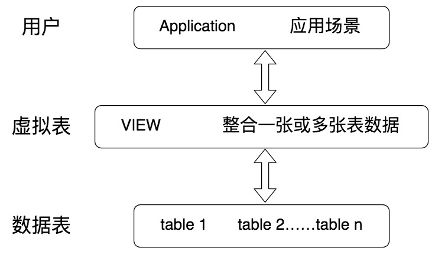

## 什么是视图

视图，也就是虚拟表，本身是不具有数据的，它是 SQL 中的一个重要概念。

虚拟表的创建连接了一个或多个数据表，不同的查询应用都可以建立在虚拟表之上。



**视图作为一张虚拟表，帮我们封装了底层与数据表的接口**。它相当于是一张表或多张表的**数据结果集**。视图的这一特点，可以帮我们简化复杂的 SQL 查询，比如在编写视图后，我们就可以直接重用它，而不需要考虑视图中包含的基础查询的细节。同样，我们也可以根据需要更改数据格式，返回与底层数据表格式不同的数据。

## 如何创建视图

```SQL
CREATE VIEW view_name AS
SELECT column1, column2
FROM table
WHERE condition
```

例子：询比 NBA 球员平均身高高的球员都有哪些，显示他们的球员 ID 和身高。

```sql
CREATE VIEW player_above_avg_height AS
SELECT player_id, height
FROM player
WHERE height > (SELECT AVG(height) from player)
```

视图创建之后，相当于创建了一个虚拟表，可以直接查询得到：

```sql
SELECT * FROM player_above_avg_height
```

视图可以嵌套创建，也就是在视图的基础上再创建视图。

```sql
CREATE VIEW player_above_above_avg_height AS
SELECT player_id, height
FROM player
WHERE height > (SELECT AVG(height) from player_above_avg_height)
```

## 如何修改视图

```sql
ALTER VIEW view_name AS
SELECT column1, column2
FROM table
WHERE condition
```

更新视图 player_above_avg_height，增加一个 player_name 字段

```sql
ALTER VIEW player_above_avg_height AS
SELECT player_id, player_name, height
FROM player
WHERE height > (SELECT AVG(height) from player)
```

## 如何删除视图

```sql
DROP VIEW view_name
```

## 视图的优点

1. 安全性：虚拟表是基于底层数据表的，我们在使用视图时，一般不会轻易通过视图对底层数据进行修改，即使是使用单表的视图，也会受到限制，比如计算字段，类型转换等是无法通过视图来对底层数据进行修改的，这也在一定程度上保证了数据表的数据安全性。同时，我们还可以针对不同用户开放不同的数据查询权限，比如人员薪酬是个敏感的字段，那么只给某个级别以上的人员开放，其他人的查询视图中则不提供这个字段。

2. 简单清晰：视图是对 SQL 查询的封装，它可以将原本复杂的 SQL 查询简化，在编写好查询之后，我们就可以直接重用它而不必要知道基本的查询细节。同时我们还可以在视图之上再嵌套视图。这样就好比我们在进行模块化编程一样，不仅结构清晰，还提升了代码的复用率。