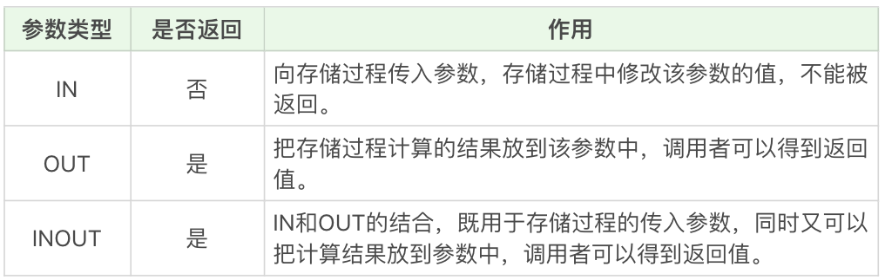

视图和存储过程的区别：

1. 存储过程和视图一样，清晰，安全，还可以减少网络传输量。
2. 视图是虚拟表，通常不对底层数据表直接操作，而存储过程是程序化的SQL，直接操作底层数据表，能够实现一些更加复杂的数据处理。

存储过程可以说是由SQL语句和流控制语句构成的语句集合，类似函数，可以接受输入参数，也可以返回输出参数给调用者，返回计算结果。

## 什么是存储过程，如何创建

存储过程的英文是 Stored Procedure。它的思想很简单，就是 SQL 语句的封装。一旦存储过程被创建出来，使用它就像使用函数一样简单，我们直接通过调用存储过程名即可。

```sql
CREATE PROCEDURE 存储过程名称([参数列表])
BEGIN
    需要执行的语句
END    
```

和视图一样，删除和更新操作分别是：

- drop procedure
- alter procedure

案例，计算1到n的累加和：

```sql
CREATE PROCEDURE `add_num`(IN n INT)
BEGIN -- BEGIN 和 END 中间包含多个语句
       DECLARE i INT; -- 声明变量
       DECLARE sum INT;
       
       SET i = 1; -- 赋值语句
       SET sum = 0;
       WHILE i <= n DO
              SET sum = sum + i;
              SET i = i +1;
       END WHILE;
       SELECT sum; -- 把从数据表种查询的结果存放到变量中
END
```

调用函数：

```sql
CALL add_num(100);
```

如果使用MySQL，需要使用DELIMITER临时定义新的结束符。

因为默认情况下 SQL 采用（；）作为结束符，这样当存储过程中的每一句 SQL 结束之后，采用（；）作为结束符，就相当于告诉 SQL 可以执行这一句了。但是存储过程是一个整体，我们不希望 SQL 逐条执行，而是采用存储过程整段执行的方式，因此我们就需要临时定义新的 DELIMITER，新的结束符可以用（//）或者（$$）。

```sql
DELIMITER //
CREATE PROCEDURE `add_num`(IN n INT)
BEGIN
       DECLARE i INT;
       DECLARE sum INT;
       
       SET i = 1;
       SET sum = 0;
       WHILE i <= n DO
              SET sum = sum + i;
              SET i = i +1;
       END WHILE;
       SELECT sum;
END //
DELIMITER ;
```

首先用（//）作为结束符，又在整个存储过程结束后采用了（//）作为结束符号，告诉 SQL 可以执行了，然后再将结束符还原成默认的（;）。

## 三种参数类型



创建一个存储类型 get_hero_scores，用来查询某一类型英雄中的最大的最大生命值，最小的最大魔法值，以及平均最大攻击值。

```sql
CREATE PROCEDURE `get_hero_scores` ( 
	OUT max_max_hp FLOAT, 
	OUT min_max_mp FLOAT, 
	OUT avg_max_attack FLOAT, 
	s VARCHAR ( 255 ) ) 
BEGIN
	SELECT
		MAX( hp_max ),
		MIN( mp_max ),
		AVG( attack_max ) 
	FROM
		heros 
	WHERE
		role_main = s INTO max_max_hp,
		min_max_mp,
		avg_max_attack;

END

-- 调用 get_hero_scores 
CALL get_hero_scores ( @max_max_hp, @min_max_mp, @avg_max_attack, '战士' );
SELECT
	@max_max_hp,
	@min_max_mp,
		@avg_max_attack;
```

## 其他语句

1. `IF…THEN…ENDIF`：条件判断语句
2. `CASE`语句

```sql

CASE 
  WHEN expression1 THEN ...
  WHEN expression2 THEN ...
  ...
    ELSE 
    --ELSE语句可以加，也可以不加。加的话代表的所有条件都不满足时采用的方式。
END
```

3. `LOOP,LEAVE和ITERATE`，可以将leave理解为break， iterate理解为continue。
4. `REPEAT…UNTIL…END REPEAT`，首先执行一次循环，在until中进行判断，满足条件就退出，不满足则继续循环。
5. `WHILE...DO..END WHILE`，先进行条件判断，满足条件就进入循环。

## 存储过程的优点与缺点

### 优点

1. 一次编译多次使用，创造时进行编译，提升SQL的执行效率。
2. 安全性强，设定存储过程的时候可以设置对用户的使用权限。
3. 可以减少网络传输量，因为代码封装到存储过程中，每次使用只需要调用存储过程即可。
4. 进行相对复杂的数据库操作时，可能需要连接多次数据库才能完成的操作，现在只需连接一次。

### 缺点

1. 可移植性差，存储过程不能跨数据库移植。
2. 调试困难，只有少数DBMS支持存储过程的调试。
3. 存储过程的版本管理困难，比如数据表索引发生变化了，可能会导致存储过程失效。
4. 不适合高并发的场景。

## 课后联系

针对王者荣耀的英雄数据表 heros 表，请编写存储过程 get_sum_score，用来得到某一类型英雄（主要定位为某一类型即可）的最大生命值的总和。

```sql
CREATE PROCEDURE get_sum_score ( OUT total FLOAT, type VARCHAR ( 255 ) ) BEGIN
	SELECT
		sum( hp_max ) AS sum_hp_max 
	FROM
		heros 
	WHERE
		role_main = type INTO total;
	
END;
CALL get_sum_score ( @total, '坦克' );
SELECT
	@total
```

