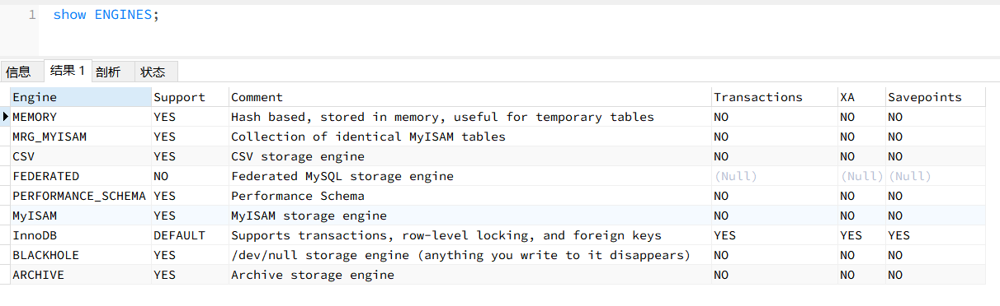

InnoDB是支持事务的，是MySQL5.7之后的默认存储引擎。

事务： 保证一组数据库操作，要么全部成功，要么全部失败。

## 事务的特性

ACID。

1. Atomicity，原子性，原子是不可分割的。
2. Consistency：一致性，数据库在进行事务操作后，会由原来的一致状态变成另一种一致状态。
3. Isolation：隔离性，一个事务在提交之前，对其他事务都是不可见的。
4. Durability：持久性，事务提交之后对数据的修改是持久的，即使系统发生故障，数据修改依然有效。

总结：原子性是基础，隔离性是手段，一致性是约束条件，持久性是目的。

## 事务的控制

MySQL可以通过show engines来查看当前支持的存储引擎有哪些？

可以看到只有InnoDB是支持事务的。常用的事务控制语句有：

1. 开启一个事务： `start transaction`或`begin`。
2. 提交事务：`commit`
3. 回滚事务：`rollback`或`rollback to [savepoint]`。
4. 在事务中创建保存点：`savepoint`
5. 删除某个保存点：`release savepoint`
6. 设置事务的隔离级别：`set transaction`

使用事务有两种方式：隐式事务和显示事务，隐式事务指的是自动提交，MySQL默认是自动提交的，可以通过`set autocommit = 0`关闭自动提交。

