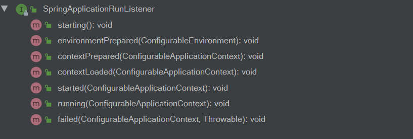

- SpringApplication 准备阶段。
- ApplicationContext 启动阶段。
- ApplicationContext 启动后阶段。

## SpringApplication准备阶段

此阶段为：从`run(String ...)`方法调用开始，到`refreshContext(Confidurable ApplicationContext)`调用之前。

```java
public ConfigurableApplicationContext run(String... args) {
		StopWatch stopWatch = new StopWatch();
		stopWatch.start();
		ConfigurableApplicationContext context = null;
		Collection<SpringBootExceptionReporter> exceptionReporters = new ArrayList<>();
		configureHeadlessProperty();
		SpringApplicationRunListeners listeners = getRunListeners(args);
		listeners.starting();
		try {
			ApplicationArguments applicationArguments = new DefaultApplicationArguments(args);
			ConfigurableEnvironment environment = prepareEnvironment(listeners, applicationArguments);
			configureIgnoreBeanInfo(environment);
			Banner printedBanner = printBanner(environment);
			context = createApplicationContext();
			exceptionReporters = getSpringFactoriesInstances(SpringBootExceptionReporter.class,
					new Class[] { ConfigurableApplicationContext.class }, context);
			prepareContext(context, environment, listeners, applicationArguments, printedBanner);
			refreshContext(context);
			//...
		return context;
	}
```

这个过程中的核心对象有：

1. ApplicationArguments
2. SpringApplicationRunListeners
3. Banner
4. ConfigurableApplicationContext
5. SpringBootExceptionReporter

## SpringApplicationRunListeners

```java
	private SpringApplicationRunListeners getRunListeners(String[] args) {
		Class<?>[] types = new Class<?>[] { SpringApplication.class, String[].class };
		return new SpringApplicationRunListeners(logger,
				getSpringFactoriesInstances(SpringApplicationRunListener.class, types, this, args));
	}
```

SpringApplicationRunListeners属于组合模式的实现，内部实现了SpringApplicationRunListener的集合：

```java
class SpringApplicationRunListeners {

	private final Log log;

	private final List<SpringApplicationRunListener> listeners;

	SpringApplicationRunListeners(Log log, Collection<? extends SpringApplicationRunListener> listeners) {
		this.log = log;
		this.listeners = new ArrayList<>(listeners);
	}
    void starting() {
		for (SpringApplicationRunListener listener : this.listeners) {
			listener.starting();
		}
	}
}
```

## SpringApplicationRunListener

按字面意思理解就是SpringBoot应用的运行时监听器，和上面的starting方法一样，它的其他方法将会被SpringApplicationRunListeners迭代地执行：



以上监听方法与运行时阶段的对应关系如下：

| 监听方法                                          | 运行阶段说明                                                 | SpringBoot起始版本 |
| ------------------------------------------------- | ------------------------------------------------------------ | ------------------ |
| starting()                                        | Spring应用刚启动                                             | 1.0                |
| environmentPrepared(ConfigurableEnvironment)      | ConfigurableEnvironment准备妥当，允许将其调整                | 1.0                |
| contextPrepared(ConfigurableApplicationContext)   | ConfigurableApplicationContext准备妥当，允许将其调整         | 1.0                |
| contextLoaded(ConfigurableApplicationContext)     | ConfigurableApplicationContext已装载，但仍未启动             | 1.0                |
| started(ConfigurableApplicationContext)           | ConfigurableApplicationContext已启动，此时SpringBean初始化已完成 | 2.0                |
| running(ConfigurableApplicationContext)           | Spring应用正在运行                                           | 2.0                |
| failed(ConfigurableApplicationContext, Throwable) | Spring应用运行失败                                           | 2.0                |

`META-INF/spring.factories`

```properties
# Run Listeners
org.springframework.boot.SpringApplicationRunListener=\
org.springframework.boot.context.event.EventPublishingRunListener
```

EventPublishingRunListener是SpringBoot的唯一内建实现