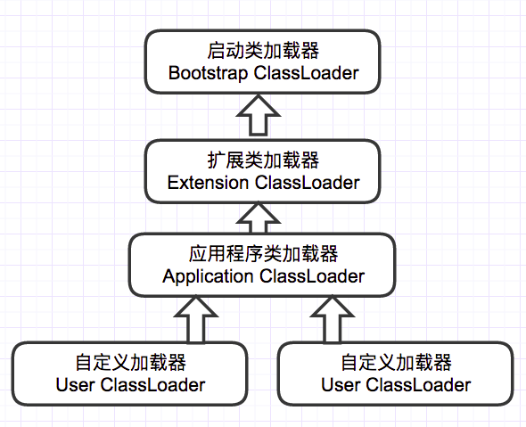
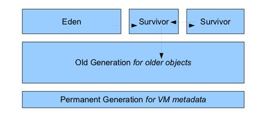
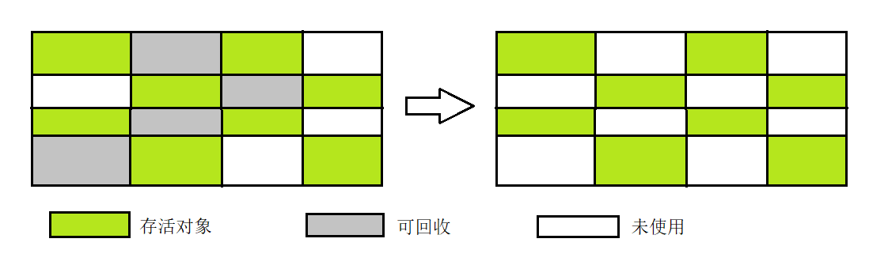
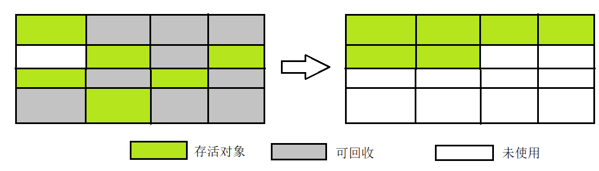

[toc]

# 什么是JVM

广义上是一种规范，狭义上是 JDK中的JVM虚拟机

JVM实现由各个厂商来做，比如hotspot

广义上讲，java、kotlin、clojure等运行在java虚拟机上的编程语言及其相关程序都属于java技术体系（java语言、java类库api、第三方java类库、jvm）的一员


JVM架构图：类加载子系统、运行时数据区、垃圾收集器


# 类加载机制

> jvm 把Class文件加载到内存的机制（数据校验、转换解析、初始化）

类加载机制：Java虚拟机将描述类的数据从Class文件加载到内存，并对数据进行校验，转换解析和初始化，最终形成可以被虚拟机直接使用的Java类型。

## 类加载的时机

> 什么时候类加载：主要有四个
>
> 1. new（实例化）、getstatic、putstatic（读取设置静态字段）、invokestatic（调用静态方法）
>
>    ```java
>    public class Student{
>      private static int age ;
>      public static void method(){
>      }
>    } 
>    //Student.age
>    //Student.method();
>    //new Student();
>    ```
>
> 2. 反射调用 Class c = Class.forname("com.hello.Student");
>
> 3. 初始化某个类 发现 父类还没初始化，先初始化父类
>
> 4. jvm启动时，用户需要指定一个主类main，主类会优先初始化
>
> 一个类的一生：


加载阶段合适开始，《Java虚拟机规范》并没有强制约束，交由虚拟机自己实现。

而初始化阶段，严格规定有且只有以下六种情况，如果类型没有进行过初始化，必须对类进行初始化：

- 遇到以下字节码指令：
  - new：实例化对象的时候
  - getstatic和putstatic，读取或设置一个类型的静态字段（被final修饰、已在编译期把结果放入常量池的静态字段除外）。
  - invokestatic：调用一个类型的静态方法的时候。

- 使用`java.lang.reflect`包对类型进行反射调用的时候。
- 当初始化类的时候，发现父类还没有进行初始化，则先初始化父类。
- 虚拟机启动时，会先初始化用户指定执行的主类，main方法所在类。
- 当使用JDK 7新加入的动态语言支持时，如果一个java.lang.invoke.MethodHandle实例最后的解 析结果为`REF_getStatic`、`REF_putStatic`、`REF_invokeStatic`、`REF_newInvokeSpecial`四种类型的方法句柄，并且这个方法句柄对应的类没有进行过初始化，则需要先触发其初始化。
- 当一个接口中定义了JDK 8新加入的默认方法（被default关键字修饰的接口方法）时，如果有 这个接口的实现类发生了初始化，那该接口要在其之前被初始化。 

## 类加载的过程

> **类加载**三件事：
>
> 1. 根据全限定名称com.hello.Student -》获取二进制字节流加载class文件
> 2. 字节流的静态数据结构 -〉方法区的运行时数据结构
> 3. 创建字节码Class对象，作为方法区该类各种数据的访问入口
>
> 从下面这些途径加载字节码！
>
> 

系统加载Class类型的文件主要是三步：加载，连接，初始化。

连接过程又分为三步：验证，准备，解析。

### 加载

在加载阶段Java虚拟机需要完成的三件事情：

1. 通过一个类的全限定名来获取定义此类的二进制字节流。
2. 将这个字节流所代表的静态存储结构转化为**方法区的运行时数据结构**。
3. <u>在内存中生成一个代表这个类的java.lang.Class对象</u>，作为**方法区**这个类的各种数据的访问入口。

**一个非数组类的加载阶段（加载阶段获取类的二进制字节流的动作）是可控性最强的阶段，这一步我们可以去完成还可以自定义类加载器去控制字节流的获取方式（重写一个类加载器的 `loadClass()` 方法）。数组类型不通过类加载器创建，它由 Java 虚拟机直接创建。**

#### 验证

确保Class文件的字节流中包含的信息符合《Java虚拟机规范》的全部约束要求，保证这些信息被当作代码运行后不会危害虚拟机自身的安全。

- 文件格式验证：验证字节流是否符合Class文件格式的规范。
  - 是否以0XCAFEBABE开头。
  - 主次版本号是否在当前虚拟机的处理范围之内。
  - 常量池中的常量是否有不被支持的类型。
- 元数据验证：对字节码描述的信息进行语义分析，以保证其描述的信息符合Java语言规范的要求。
  - 这个类是否有父类。【除Object之外都有父类】
  - 这个类是否被继承了不允许继承的类。【final修饰的类】
- 字节码验证：最复杂的阶段，通过数据流和控制流分析，确定程序语义是否合法、符合逻辑。
  - 比如说任意时刻操作数栈和指令代码序列都能够配合工作。
- 符号引用验证：确保解析动作能正确执行。

#### 准备 

为类中定义的变量，**分配内存**并**设置类变量初始值**的阶段。

- **仅仅进行包括类变量的内存分配**【static】，不包括实例变量，实例变量将会在对象实例化时随着对象一起分配在Java堆中。
- 初始值通常情况下时数据类型的零值（int类型为0，boolean类型为false等），特殊情况如类字段的字段中属性表中存在ConstantValue属性时：`public static final int value = 123`，在准备阶段就会赋值123。

> tips：public static int value = 123;该语句在准备阶段过后为value值为0，给value赋值123的操作在类初始化才进行。

#### 解析

**Java虚拟机将常量池内的符号引用替换为直接引用的过程**。

解析动作主要针对7类符号引用：类或接口、字段、类方法、接口方法、方法类型、方法句柄和调用限定符。

Java 虚拟机为每个类都准备了一张方法表来存放类中所有的方法。当需要调用一个类的方法的时候，只要知道这个方法在方发表中的偏移量就可以直接调用该方法了。通过解析操作符号引用就可以直接转变为目标方法在类中方法表的位置，从而使得方法可以被调用。

解析阶段是虚拟机将常量池内的符号引用替换为直接引用的过程，也就是得到类或者字段、方法在内存中的指针或者偏移量。

#### 初始化

类加载的最后一个过程，前面的几个阶段中，除了加载阶段用户可以自定义加载器参与控制外，其余动作完全 由JVM主导，直到初始化阶段，JVM才真正开始执行类中编写的Java代码，主导权交由应用程序。

初始化阶段是执行类构造器`<clinit>()`方法的过程。

> `<clinit>()`方法是由编译器自动收集类中的所有类变量的赋值动作和静态语句块（`static{}`块）中的 语句合并产生的，编译器收集的顺序是由语句在源文件中出现的顺序决定的，静态语句块中只能访问 到定义在静态语句块之前的变量，定义在它之后的变量，在前面的静态语句块可以赋值，但是不能访问。

JVM会保证子类的`<clinit>()`方法执行前，父类的`<clinit>()`方法也已经执行完毕，因此第一个被执行的`<clinit>()`方法一定在`java.lang.Object`中。

Java虚拟机必须保证一个类的`<clinit>()`方法在多线程环境中被正确地加锁同步，如果多个线程同 时去初始化一个类，那么只会有其中一个线程去执行这个类的`<clinit>()`方法，其他线程都需要阻塞等 待，直到活动线程执行完毕`<clinit>()`方法。如果在一个类的`<clinit>()`方法中有耗时很长的操作，那就 可能造成多个进程阻塞。

且其他线程唤醒之后就不会再进入该方法，从而保证再同一个类加载器之下，一个类型只会被初始化一次。

---

对于初始化阶段，JDK8之前虚拟机严格规范了有且只有5种情况下，必须对类进行初始化(只有主动去使用类才会初始化类)：

1. 当遇到 new 、 getstatic、putstatic或invokestatic 这4条直接码指令时，比如 new 一个类，读取一个静态字段(未被 final 修饰)、或调用一个类的静态方法时。
   - 当jvm执行new指令时会初始化类。即当程序创建一个类的实例对象。
   - 当jvm执行getstatic指令时会初始化类。即程序访问类的静态变量(不是静态常量，常量会被加载到运行时常量池)。
   - 当jvm执行putstatic指令时会初始化类。即程序给类的静态变量赋值。
   - 当jvm执行invokestatic指令时会初始化类。即程序调用类的静态方法。
2. 使用 `java.lang.reflect` 包的方法对类进行反射调用时如Class.forname("..."),newInstance()等等。 ，如果类没初始化，需要触发其初始化。
3. 初始化一个类，如果其父类还未初始化，则先触发该父类的初始化。
4. 当虚拟机启动时，用户需要定义一个要执行的主类 (包含 main 方法的那个类)，虚拟机会先初始化这个类。
5. MethodHandle和VarHandle可以看作是轻量级的反射调用机制，而要想使用这2个调用， 就必须先使用findStaticVarHandle来初始化要调用的类。

JDK8新增：

1. 当一个接口中定义了JDK8新加入的默认方法（被default关键字修饰的接口方法）时，如果有这个接口的实现类发生了初始化，那该接口要在其之前被初始化。

# 类加载器

> 完成类加载的 就是 类加载器 ：ClassLoader 及其子类
>
> 
>
> 检查顺序是自底向上：加载时，先检查类是否已经被加载。
>
> 加载顺序是自顶向下：逐层尝试加载这个类

> Java虚拟机设计团队有意把类加载阶段中的“通过一个类的全限定名来获取描述该类的二进制字节流”这个动作放到Java虚拟机外部去实现，以便让应用程序自己决定如何去获取所需的类。实现这个动作的代码被称为“类加载器”（Class Loader）。

**对于任意一个类，都必须由加载它的类加载器和这个类本身一起共同确立其在Java虚拟机中的唯一性**，每一个类加载器，都拥有一个独立的类名称空间。简单来说就是：<u>比较两个类是否相等，只有在他们是由同一个类加载器加载的前提下才有意义。</u>只要加载他们的类加载器不同，两个类必不相同。

## 类加载器的类型

> 
>
> 启动类加载器：加载JAVA_HOME\lib目录中的，或通过-Xbootclasspath参数指定路径中的，且被虚拟机认可（按文件名识别，如rt.jar）的类。由C++实现，不是ClassLoader的子类
>
> 扩展类加载器：加载JAVA_HOME\lib\ext目录中，或通过java.ext.dirs系统变量指定路径中的类库
>
> 应用程序类加载器：负责加载用户路径classpath上的类库
>
> 自定义类加载器：
>
> - 为什么要自定义加载器，因为jvm自带的只能加载指定路径下的类字节码，如果需要加载应用程序之外的类文件，就需要自定义
> - 例子：JRebel，实时 Java 类重新加载工具

JVM 中内置了三个重要的 ClassLoader，除了 BootstrapClassLoader 其他类加载器均由 Java 实现且全部继承自`java.lang.ClassLoader`：

### 启动类加载器 Bootstrap ClassLoader

C++语言实现，是虚拟机自身的一部分，其他类加载器独立存在于虚拟机外部，并且全都继承自抽象类 

`java.lang.ClassLoader`。 

负责加载`<JAVA_HOME>\lib`目录中，或通过`-Xbootclasspath`参数指定路径中，且被虚拟机认可的类。

【按照文件名识别，如rt.jar、tools.jar，名字不符合的类库即使放在lib目录中也不会被加载】。

### 扩展类加载器 Extension ClassLoader

负责加载`<JAVA_HOME>\lib\ext`目录中，或者被`java.ext.dirs`系统变量所指定路径中的所有的类库。

### 应用程序类加载器 Application ClassLoader

它负责加载用户类路径 `(ClassPath)`上所有的类库。

如果应用程序中没有自定义过类加载器，默认为该类加载器。

## 怎么自定义类加载器

目标：自定义加载指定路径在D盘下的lib文件下的类

步骤：

1. 新建一个Test.java
2. 编译到指定lib目录，javac Test.java生成Test.class
3. 自定义MyClassLoader继承ClassLoader
   1. 重写findClass方法
   2. 调用defineClass方法
4. 测试

# 双亲委派模型

> **什么是双亲委派**：当一个类加载器收到类加载任务，会先交给父类加载器去完成。因此，最终加载任务都会传递到顶层bootstrap classloader，只有当父类加载器无法完成加载任务，子类才会尝试执行加载任务（讲道理，应该叫父亲委派比较合适吧）
>
> **为什么需要**：避免原始类被覆盖，例子：双亲委派机制保证不管是哪个加载器加载某个类，最终都是交给启动类加载器进行加载，保证使用不同加载器最终得到同一个object。


## 双亲委派模型的要求

除了顶层的启动类加载器外，**其余的类加载器都应有自己的父类加载器**，只不过这里的父子关系一般不是以继承的关系实现，而是以**组合**来复用父加载器的代码。

## 双亲委派模型的工作过程

- 如果一个类加载器收到了类加载的请求，它首先不会自己去尝试加 载这个类，而是**把这个请求委派给父类加载器去完成**。
- 每一个层次的类加载器都是如此，因此**所有的加载请求最终都应该传送到最顶层的启动类加载器中**。
- 只有当父加载器反馈自己无法完成这个加载请求（它的搜索范围中没有找到所需的类）时，子加载器才会尝试自己去完成加载。 

## 双亲委派模型的优点

- 使用双亲委派模型来组织类加载器间的关系，**使得Java中的类随着它的类加载器一起具备了一种带有优先级的层次关系**。
- 比如加载位于 rt.jar 包中的类 java.lang.Object，不管是哪个加载器加载这个类，最终都是委托给顶层的启动类加载器进行加载，这样就**保证了使用不同的类加载器最终得到的都是同样一个 Object 对象**。

## 双亲委派的代码实现

```java
protected Class<?> loadClass(String name, boolean resolve)
    throws ClassNotFoundException
{
    synchronized (getClassLoadingLock(name)) {
        // 首先，检查请求的类是否已经被加载过了
        Class<?> c = findLoadedClass(name);
        if (c == null) {
            long t0 = System.nanoTime();
            try {
                //不断调用父加载器的loadClass方法，直到BootstrapClassLoader
                if (parent != null) {
                    c = parent.loadClass(name, false);
                } else {
                    c = findBootstrapClassOrNull(name);
                }
            } catch (ClassNotFoundException e) {
                // 如果父类加载器抛出ClassNotFoundException说明父类加载器无法完成加载请求
            }

            if (c == null) {
                // 在父类加载器无法加载时 再调用本身的findClass方法来进行类加载
                long t1 = System.nanoTime();
                c = findClass(name);

                // this is the defining class loader; record the stats
                sun.misc.PerfCounter.getParentDelegationTime().addTime(t1 - t0);
                sun.misc.PerfCounter.getFindClassTime().addElapsedTimeFrom(t1);
                sun.misc.PerfCounter.getFindClasses().increment();
            }
        }
        if (resolve) {
            resolveClass(c);
        }
        return c;
    }
}
```

1. 首先检查请求加载的类型是否已经被加载过，如果没有，则调用父加载器的loadClass方法。
2. **如果父加载器为null，则默认使用启动类加载器作为父加载器**。
3. 如果父加载器加载失败，抛出`ClassNotFoundException`异常，才调用自己的findClass方法。

# 破坏双亲委派

**为什么要破坏双亲委派呢？**

某些情况下，父加载器需要加载的class文件受到加载范围的限制，无法加载到需要的文件，这时需要委托子类加载器进行加载。

例子：比如Driver接口（SPI Service Provider Interface）定义在jdk中，实现由各个数据库服务商（mysql、oracle）提供，实现这个接口。这些实现类都是以jar形式放到classpath目录下

问题来了：DriverManager加载各个实现了Driver接口的实现类（在classpath下）进行管理，**但是DriverManager由启动类加载器加载**，只能加载JAVA_HOME的lib下文件，而其实现类是由服务商提供的，由系统类加载器加载。这个时候，**就需要启动类加载器来 委托子类来加载Driver实现**，这就破坏了双亲委派。类似情况还有很多：

- 热加载技术
- Tomcat加载多个应用程序：优先加载 Web 应用目录下的类，然后再加载其他目录下的类，就自定义了类加载器 `WebAppClassLoader` 来打破双亲委托机制
- **线程上下文类加载器（`ThreadContextClassLoader`**：将一个类加载器保存在线程私有数据里，跟线程绑定，然后在需要的时候取出来使用

**怎么破坏？**

自定义加载器的话，需要继承 `ClassLoader`，重写 `loadClass()` 

重写 `loadClass()`方法之后，我们就可以改变传统双亲委派模型的执行流程。例如，子类加载器可以在委派给父类加载器之前，先自己尝试加载这个类，或者在父类加载器返回之后，再尝试从其他地方加载这个类。具体的规则由我们自己实现，根据项目需求定制化。

 Tomcat 服务器为了能够优先加载 Web 应用目录下的类，然后再加载其他目录下的类，就自定义了类加载器 `WebAppClassLoader` 来打破双亲委托机制。

**单纯依靠自定义类加载器没办法满足某些场景的要求，例如，有些情况下，高层的类加载器需要加载低层的加载器才能加载的类。**

上面的SPI机制

# JVM运行时数据区

> JVM三大块之一！三大块是：类加载系统、运行时数据区、执行引擎
>
> 按照线程使用情况和指责分为：线程独享、线程共享
>
> - 独享：不需要垃圾回收- 虚拟机栈、本地方法栈、程序计数器
> - 共享：垃圾回收、存储静态数据和对象数据- 堆和方法区（方法区1.8之后移除，变成直接内存的元空间）

## JDK1.8前后，JVM内存区域的变化

### 一、JDK1.8前


### 二、JDK1.8之后


## 线程共享

### 一、堆

> Java堆在JVM启动时 创建内存区域 分配对象、数组、运行时常量，垃圾回收的主要内存区域，Java 虚拟机所管理的内存中最大的一块
>
> 堆内存为什么存在新生代和老年代？
>
> - 分代收集：大多数对象朝生夕灭 + 熬过越多次GC的对象越不容易灭
> - 所以！划分不同区域，根据对象年龄分配到不同区域中存储，不同区域的垃圾回收的策略也不同，比如（容易灭的对象，就考虑怎么保留少量存活的，不容易灭的，堆到一起回收频率也低）
> - 优势：垃圾收集的开销 和 内存空间有效利用！
>
> 为什么新声代要有两个suivivor区域呢？
>
> - todo
>
> 内存模型的变迁：
>
> - jdk1.7
>   - young：年轻区，eden + 2 * survivor
>   - tenured：年老区
>   - perm：永久区，保存class,method,field对象，一般不会溢出（除非一次性加载很多类）
>   - virtual：差值，最大内存 - 初始内存
> - jdk1.8
>   - perm移除了，使用metaspace替换，而且metaspace在本地内存（直接内存）
>   - young：年轻区，eden + 2 * survivor
>   - old eden：年老代
> - jdk1.9
>   - 取消young 和old的物理划分
>   - 将堆划分成若干区域region，具有逻辑上的新生代和老年代区域
>
> 查看内存信息：
>
> ```shell
> javac Demo.java
> java -Xms100m -Xmx100m Demo # 初始内存、最大内存
> jmap -heap 3252
> ```
>
> 解决Mac中jmap失败的问题：https://www.cnblogs.com/ITPower/p/15528658.html

Java 虚拟机所管理的内存中最大的一块，Java 堆是所有线程共享的一块内存区域，在虚拟机启动时创建。**此内存区域的唯一目的就是存放对象实例，几乎所有的对象实例以及数组都在这里分配内存。**

为什么说**几乎**呢？

答：**Java世界中“几乎”所有的对象都在堆中分配，但是，随着JIT编译期的发展与逃逸分析技术逐渐成熟，<u>栈上分配、标量替换</u>优化技术将会导致一些微妙的变化，所有的对象都分配到堆上也渐渐变得不那么“绝对”了。从jdk 1.7开始已经默认开启逃逸分析，如果某些方法中的对象引用没有被返回或者未被外面使用（也就是未逃逸出去），那么对象可以直接在栈上分配内存。**

Java 堆是垃圾收集器管理的主要区域，因此也被称作**GC 堆（Garbage Collected Heap）**.从垃圾回收的角度，由于现在收集器基本都采用分代垃圾收集算法，所以 Java 堆还可以细分为：新生代和老年代：再细致一点有：Eden 空间、From Survivor、To Survivor 空间等。**进一步划分的目的是更好地回收内存，或者更快地分配内存。**

---

在JDK1.7及以前，堆内存分为三部分：

1. 新生代【分为Eden区、Survivor from区、Survivor to区】8：1：1
2. 老生代
3. 永久代



JDK1.8之后方法区【HotSpot的永久代】被彻底移除【JDK1.7就已经开始】，取而代之的是元空间，元空间使用的是**直接内存**。


大部分情况下：对象都会首先在Eden区分类，再一次新生代垃圾回收后，如果对象还存活，则会进入from或to，之后就在from和to之间来回倒腾，且对象的年龄+1，年龄增加到一定程度【阈值默认15岁，阈值可通过参数`-XX:MaxTenuringThreshold`设置】，就会被晋升到老年代中。

> **Sets the maximum tenuring threshold for use in adaptive GC sizing. The largest value is 15. The default value is 15 for the parallel (throughput) collector, and 6 for the CMS collector.默认晋升年龄并不都是15，这个是要区分垃圾收集器的，CMS就是6.**

**动态年龄计算**

> “Hotspot遍历所有对象时，按照年龄从小到大对其所占用的大小进行累积，当累积的某个年龄大小超过了survivor区的一半时，取这个年龄和MaxTenuringThreshold中更小的一个值，作为新的晋升年龄阈值”。

> 堆中容易出现的错误：OOM，对于这种错误，表现形式有多种：
>
> 1. GC Overhead Limit Exceeded：当JVM花太多时间执行垃圾回收并且只能回收很少的堆空间时，就会发生此错误。
> 2. Java Heap Space：假如在创建新的对象时, 堆内存中的空间不足以存放新创建的对象, 就会引发该错误。【和本机物理内存无关，和你配置的内存大小有关】

### 二、方法区


> **有两种实现：**
>
> - jdk1.8是永久代permGen、之后是元空间metaspace
>
> **区别是什么？**
>
> - 存储位置：per是jvm进程用的区域，受jvm限制，meta是直接内存，受物理内存限制
> - 存储内容：per存储下面这些，meta只存储类的元信息，静态变量和运行时常量池都挪到堆里了
>
> **为什么要用元空间替换永久代呢？**
>
> - 字符串存在per里面容易per内存溢出
> - 类及方法等信息比较难确定大小，存per容易per溢出
> - per会为gc带来不必要的复杂度
> - oracle 计划 将hotspot和jrockit合二为一
>
> **存了什么？**
>
> 
>
> - 三种：**Class类信息、运行时常量池、JIT编译器编译之后的代码缓存**
>
> Class信息：类型Class、方法Method、字段Field、静态变量static、方法表等（所以要获取其他的信息，必须先获得Class对象，才能访问相关字段和方法）
>
> 运行时常量池（字符串常量池）：从class中的常量池加载而来，1.7后转到堆里
>
> - 字面量 
> - 引用类型-》内存地址
>

存储已被虚拟机加载的类信息、常量、静态变量、即时编译器编译后的代码等数据。

虽然 **Java 虚拟机规范把方法区描述为堆的一个逻辑部分**，但是它却有一个别名叫做 **Non-Heap（非堆）**，目的应该是与 Java 堆区分开来。

#### 方法区与永久代的关系

> 《Java 虚拟机规范》只是规定了有方法区这么个概念和它的作用，并没有规定如何去实现它。那么，在不同的 JVM 上方法区的实现肯定是不同的了。 **方法区和永久代的关系很像 Java 中接口和类的关系，类实现了接口，而永久代就是 HotSpot 虚拟机对虚拟机规范中方法区的一种实现方式。** 也就是说，永久代是 HotSpot 的概念，方法区是 Java 虚拟机规范中的定义，是一种规范，而永久代是一种实现，一个是标准一个是实现，其他的虚拟机实现并没有永久代这一说法。

#### 常用参数

JDK1.8之前永久代还没被彻底移除的时候，调节方法区大小的参数：

```java
-XX:PermSize=N //方法区 (永久代) 初始大小
-XX:MaxPermSize=N //方法区 (永久代) 最大大小,超过这个值将会抛出 OutOfMemoryError 异常:java.lang.OutOfMemoryError: PermGen
```

相对而言，垃圾收集行为在这个区域比较少出现，但也是有的。

JDK1.8之后，方法区【hotSpot的永久代】被彻底移除【JDK1.7就已经开始了】，取而代之的是元空间，元空间使用的是直接内存，之后调节元空间大小的参数是：

```java
-XX:MetaspaceSize=N //设置 Metaspace 的初始（和最小大小）
-XX:MaxMetaspaceSize=N //设置 Metaspace 的最大大小
```

与永久代很大的不同是，如果不指定大小的话，随着类的创建，虚拟机会耗尽所有可用的系统内存。

#### 为什么要将永久代替换为元空间？

1. **整个永久代有一个 JVM 本身设置固定大小上限，无法进行调整，而元空间使用的是直接内存，受本机可用内存的限制**，虽然元空间仍旧可能溢出【元空间溢出的错误：java.lang.OutOfMemoryError: MetaSpace】，但是比原来出现的几率会更小。

2. 元空间里面存放的是**类的元数据**，这样加载多少类的元数据就不由MaxPermSize控制了，而由系统的实际可用空间来控制，加载的类更多。
3. 在 JDK8，合并 HotSpot 和 JRockit 的代码时, JRockit 从来没有一个叫永久代的东西, 合并之后就没有必要额外的设置这么一个永久代的地方了。

#### 运行时常量池、class常量池、字符串常量池
> **三种常量池的比较**
>
> class常量池、运行时常量池、字符串常量池
>
> 
>
> **字符串常量池**：更快查找某个字符串是否存在于常量池，StringTable保存了字符串的引用，类似于哈希表， -xx:stringTable
>
> **字符串常量池怎么查找字符串**：
>
> 
>
> 字符串常量池的案例
>
> 
- 运行时常量池是方法区的一部分，Class文件中除了有类的版本、字段、方法、接口等描述信息外，还有一项信息是常量池表（Constant Pool Table），用于存放编译期生 成的各种字面量与符号引用，这部分内容将在类加载后存放到方法区的运行时常量池中。
- 运行时常量池相对于Class文件常量池的另外一个重要特征是具备动态性，Java语言并不要求常量 一定只有编译期才能产生，也就是说，并非预置入Class文件中常量池的内容才能进入方法区运行时常量池，运行期间也可以将新的常量放入池中，这种特性被开发人员利用得比较多的便是String类的 intern()方法。 

> String.intern() 是一个 Native 方法，它的作用是：如果运行时常量池中已经包含一个等于此 String 对象内容的字符串，则返回常量池中该字符串的引用；如果没有，JDK1.7之前（不包含1.7）的处理方式是在常量池中创建与此 String 内容相同的字符串，并返回常量池中创建的字符串的引用，JDK1.7以及之后的处理方式是在常量池中记录此字符串的引用，并返回该引用。

- 既然运行时常量池是方法区的一部分，自然受到方法区内存的限制，当常量池无法再申请到内存时会抛出OutOfMemoryError异常。

### 三、直接内存【非运行时数据区的一部分】

> 直接内存并不是虚拟机运行时数据区的一部分，也不是虚拟机规范中定义的内存区域
>
> 在JDK1.4 中新加入了NIO(New Input/Output)类，引入了一种基于通道(Channel)与缓冲区（Buffer）的I/O 方式，它可以**使用native 函数库直接分配堆外内存**，然后通过一个存储在Java堆中的DirectByteBuffer 对象作为这块内存的引用进行操作。这样能在一些场景中显著提高性能，因为避免了在Java堆和Native堆中来回复制数据。
>
> 本机直接内存的分配不会受到Java 堆大小的限制，受到本机总内存大小限制，配置虚拟机参数时，不要忽略直接内存 防止出现OutOfMemoryError异常。
>
> 直接内存（堆外内存）与堆内存比较：
>
> - 直接内存申请空间耗费更高的性能，当频繁申请到一定量时尤为明显
>
> - 直接内存IO读写的性能要优于普通的堆内存，在多次读写操作的情况下差异明显
>
> 

**直接内存并不是虚拟机运行时数据区的一部分，也不是虚拟机规范中定义的内存区域，但是这部分内存也被频繁地使用。而且也可能导致 OutOfMemoryError 错误出现。**

## 线程私有

### 一、程序计数器

> PC计数器，当前线程执行字节码的行号指示器，实现代码的流程控制
>
> 为什么需要PC：多线程的情况下，**程序计数器用于记录当前线程执行的位置**，方便系统上下文切换，每条线程都需要有一个独立的PC，互补影响。
>
> 存储的什么数据：
>
> - 执行的是Java方法：记录正在执行的jvm字节码指令的地址
> - 执行的是native方法：计数器为空
>
> 唯一一个不会出现OOM的内存区域，它的生命周期随线程的创建而创建，随着线程的结束而死亡！

- 可以看作是当前线程所执行的字节码的**行号指示器**。
- 字节码解释器通过改变程序计数器来依次读取指令，从而**实现代码的流程控制**，如：顺序执行、选择、循环、异常处理。
- 在多线程的情况下，**程序计数器用于记录当前线程执行的位置**，从而当线程被切换回来的时候能够知道该线程上次运行到哪儿了。

> 程序计数器是唯一一个不会出现OOM的内存区域，它的生命周期随线程的创建而创建，随着线程的结束而死亡。

### 二、虚拟机栈

> 线程私有、生成周期和线程相同，**每个java方法执行时都会创建一个栈帧**。
>
> 栈内存深度决定方法调用深度：
>
> - stackoverflow：线程分配的容量超过了java虚拟机栈允许的最大容量Xss
> - OOM：虚拟机栈动态扩展无法申请到足够内存 + 创建线程时，没有足够内存去创建对应的虚拟机栈
>
> 栈帧是什么？
>
> - 支持jvm进行方法执行的数据结构
> - 存储了：局部变量表、操作数栈、动态连接和方法返回地址
> - 方法调用 + 执行完成 过程对应：栈帧 从虚拟机栈 入栈到出栈的过程

- 生命周期和线程相同，描述的是 Java 方法执行的内存模型，每次方法调用的数据都是通过**栈**传递的。

- 虚拟机栈又一个个**栈帧**组成，每个栈帧中都有：局部变量表、操作数栈、动态链接、方法出口信息。
- Java内存粗略分为【堆内存】和【栈内存】、而栈大多说的就是虚拟机栈，或者说是虚拟机栈中的**局部变量部分**。
- **局部变量表**主要存放了**编译期可知的各种数据类型**【boolean、byte、char、short、int、float、long、double】、**对象引用**【reference 类型，它不同于对象本身，可能是一个指向对象起始地址的引用指针，也可能是指向一个代表对象的句柄或其他与此对象相关的位置】。

> 虚拟机栈可能出现的两个错误：
>
> - StackOverFlowError：若 Java 虚拟机栈的内存大小不允许动态扩展，那么当线程请求栈的深度超过当前 Java 虚拟机栈的最大深度的时候，就抛出 StackOverFlowError 错误。
> - OOM： 若 Java 虚拟机堆中没有空闲内存，并且垃圾回收器也无法提供更多内存的话。就会抛出 OutOfMemoryError 错误。
>
> 每个线程都有各自的 Java 虚拟机栈，而且随着线程的创建而创建，随着线程的死亡而死亡。

### 三、本地方法栈

> **和虚拟机栈的区别是啥！**
>
>  虚拟机栈为虚拟机执行 Java 方法 （也就是字节码）服务，而本地方法栈则为虚拟机使用到的 Native 方法服务。
>
> 简单说：native method就是 java 调用非java代码的接口
>
> **为什么需要本地方法？**
>
> java高级语言，一般不直接和操作系统资源、系统硬件打交道，靠native方法。
>
> 像数组拷贝arraycopy，Thread的一些start0、sleep、Unsafe里的cas操作

和虚拟机栈所发挥的作用非常相似，区别是： **虚拟机栈为虚拟机执行 Java 方法 （也就是字节码）服务，而本地方法栈则为虚拟机使用到的 Native 方法服务。**

在 HotSpot 虚拟机中和 Java 虚拟机栈合二为一。

本地方法被执行的时候，在本地方法栈也会创建一个栈帧，用于存放该本地方法的局部变量表、操作数栈、动态链接、出口信息。

> 方法执行完毕后相应的栈帧也会出栈并释放内存空间，也会出现 StackOverFlowError 和 OutOfMemoryError 两种错误。

# 对象创建流程和内存分配

## 创建流程


## 对象内存分配方式

有两种，不同收集器不同：

1. 指针碰撞，内存地址是连续的（young），serial和parnew收集器
2. 空闲列表，内存地址不连续（old），CMS和mark-sweep收集器


## 内存分配安全问题

**问题发生**：分配内存的时候，jvm给A线程分配内存过程中，指针未修改，此时B线程同时使用了同样一块内存

**JVM两种解决办法**：

1. CAS乐观锁 + 失败重试 保证更新操作的原子性
2. TLAB本地线程分配缓冲（Thread Local Allocation Buffer）：为每个线程预先分配一块内存

JVM在第一次给线程中的对象分配内存时，**首先使用CAS进行TLAB的分配**。当对象大于TLAB中的剩余内存或TLAB的内存已用尽时，再采用上述的CAS进行内存分配。


## 对象怎么样才能进入老年代

内存担保机制！

### 对象内存分配

- 新生代：新对象大多数默认进入eden
- 进入老年代的4种情况：
  - 存活年龄太大，默认超过15次【-XX：MaxTenuringThreshold】
  - **动态年龄判断**：minorGC之后，发现Survivor区中的一批对象的总大小大于这块Survivor的50%，就会将此时大于等于这批对象年龄最大值的所有对象，直接放入老年代
    - Survivor区中有一批对象，年龄分别为年龄1+年龄2+年龄n的多个对象，对
      象总和大小超过了Survivor区域的50%，此时就会把年龄n及以上的对象都放入老年
      代（一半以上对象年龄相同）
    - **为什么？**希望长期存活的对象，尽早进入老年代
    - -XX：TargetSurvivorRatio
  - 大对象直接进入老年代：需要是Serial和ParNew
    - 比如字符串or数组
    - -XX：PretenureSizeThreshold一半设置1M
    - **为什么？**避免大对象分配内存时的复制操作降低效率，避免eden和survivor区的复制
  - minorGC后，存活对象太多无法放入Survivor

### **空间担保机制**

当新生代无法分配内存的时候，我们想把新生代的对象转移到老年代，然后把新对象放入腾空的新生代。此时就需要内存担保机制。

- MinorGC前，判断老年代可用内存是否小于新生代对象全部对象大小，如果小于则继续判断
- 判断老年代可用内存大小是否小于之前每次MinorGC后进入老年代的对象平均大小
  - 如果是，则会进行一次FullGC，判断是否放得下，放不下OOM
  - 如果否，则会进行一些MinorGC：
    - MinorGC后，剩余存活对象小于Survivor区大小，直接进入Survivor区
    - MinorGC后，剩余存活对象大于Survivor区大小，但是小于老年代可用内存，直接进入老年代
    - MinorGC后，剩余存活对象大于Survivor区大小，也大于老年代可用内存，进行FullGC
    - FullGC之后，任然没有足够内存存放MinorGC的剩余对象，就会OOM


1. 对象优先进入eden

```
    对象优先在eden区分配，
    eden区没有足够空间时，触发 Minor GC
    
    虚拟机发起 【Minor GC】 = {  
            情况1 ： eden 已使用内存 < suvivor内存
                eden 内对象  转移到 suvivor内存
            情况2 : eden 已使用内存 > suvivor内存
                eden 内对象 转移到 老年代 
    } 
    
    FULL GC 触发条件 = {
            新生代对象总空间 > 老年代剩余连续空间 
            Minor GC 平均晋升空间大小 > 老年代连续剩余空间，则触发FULL GC 
    }
```

2. 大对象进入老年代：避免剩余较多内存空间时，直接出发GC。
3. 长期存活对象进入老年代：

```
对象在Eden出生， 每经历一次minor GC 并被移动到survivor区，则age++
年龄增加到一定程度(15岁)，则进入老年代。
此外 当suvivor区中一般以上对象年龄相同，则>=该年龄的对象进入老年代。
```

> 1. 当Eden区存储不下新分配的对象时，会触发minorGC
> 2. GC之后，还存活的对象，按照正常逻辑，需要存入到Survivor区。
> 3. 当无法存入到Survivor时，此时会触发担保机制
> 4. 发生内存担保时，需要将Eden区GC之后还存活的对象放入老年代。后来的新对象或者数组放入Eden区。

### 常用参数

```shell
-XX:NewRatio=2 新生代与老年代比值
-XX:SurvivorRatio=8 新生代中，Eden与两个Survivor区域比值
-XX:+PrintGCDetails 打印详细GC日志
-XX:PretenureSizeThreshold 对象超过多大直接在老年代分配，默认值为0，不限制
```

# 对象的内存布局：堆中，对象里面都有啥？

对象在堆中的存储布局分为三块：对象头、实例数据、对齐补充

- 对象头：markword（存储锁、hashcode、gc年龄等）、类型指针、数组长度、对齐补充
- 实例数据：对象的非静态成员变量
- 对齐补充：采用8byte对齐


```
32位对象：markword 32bit（4bytes） + 4 bytes类型指针 = 8byte对象头
32位数组：markword 32bit（4bytes） + 4 bytes类型指针 + 4bytes = 12byte对象头
64位对象：markword 64bit（8bytes） + 4 bytes类型指针 = 12byte对象头
64位数组：markword 64bit（8bytes） + 4 bytes类型指针 + 4bytes = 16byte对象头

# 如果是指针未压缩的情况，在原有的大小基础上加4字节
```

jdk1.8的markword


# 怎么访问一个对象？

> 1. 句柄：稳定，对象被移动只要修改句柄中的地址
>
> 2. 直接指针：访问速度快，节省了一次指针定位的开销
>
>    
>
>    

# JVM垃圾收集器

## GC的基本原理

### 为什么要GC？

不GC，内存数据很快就会被占满

### 什么是垃圾？

内存中，没有被引用的对象就是垃圾！

### 怎么找到垃圾？（判断）

#### 引用计数法

特点：每当对象被引用，计数器++，对象失效，计数器--。计数器为0，表示对象可回收。

优点：原理简单，效率高。

> 堆内存有三种引用关系：单一引用、循环引用、无引用


缺点：无法解决循环引用问题！（循环问题 是一个重要问题，比如Spring里的循环依赖）

#### 根可达算法

**特点：从GC roots对象 向下搜索，如果没有路径（引用链）到达目标对象，对象不可达。**

GC roots对象有哪些？为什么选他们？因为他们不被GC所管理

1. 虚拟机栈中，**栈帧的本地变量表** 引用的对象。
2. 方法区 **类静态属性** 引用的对象。
3. 方法区 **常量**引用的对象。
4. 本地方法栈中 **JNI** 引用的对象

为什么选他们作为roots：GC管理的主要区域是Java堆，一般情况下只针对堆进行垃圾回收。**方法区、栈和本地方法区不被GC所管理**，因而选择这些区域内的对象作为GC roots。


### 啥时候回收垃圾？（时机）

真正回收，对象要经历两次标记，第一次是不可达之后，第二次是finalize

1. 判断不可达之后，对象第一次被标记

2. 判断**否有必要执行finalize()方法**，没有必要执行finalize方法的情况：

   - 对象没有覆盖finalize()方法。

   - finalize()方法已经被虚拟机调用过。

3. 两次标记之后，就会被回收

如果说有必要执行finalize方法，该对象将被置如F-Queue队列中，并由虚拟机建立的低调度优先级的Finalizer线程去执行对象们的finalize方法。

finalize方法中，如果对象重新与引用链上的任意一个对象建立联系，则可以拯救自己，逃脱回收。

稍后收集器将对队列中的对象进行第二次小规模的标记，此时解救自己的对象将会被移除即将回收的集合。

> 二次标记：标记可回收的对象，并非立刻回收，他们加入一个对列中进行二次标记，如果在二次标记之前，对象产生引用则不会被回收。
> 

#### 对象的四种引用类型

> 强引用：`Object o = new Object(); `只要强引用还在，就不会被GC
>
> 软引用：`SoftRefrence<Object> sf` ，非必须，内存溢出之前进行回收，get有时null，可以实现内存敏感的高速缓存，exp：读取大量本地文件，不能一次性全部加载到内存（可能会溢出），使用软引用解决，Hashmap保存文件路径和文件对象管理的软引用之间的映射，内存不足，jvm会自动回收缓存文件对象的占用空间，避免oom
>
> 弱引用：`WeakRefrence<Object> wf`，非必须，只要GC就回收，get有时null，监控对象是否已经被垃圾回收器标记为回收的垃圾，`isEnqueued()`
>
> 虚引用：`PhantomRefrence<Object> pf`，最弱，垃圾回收时直接回收，每次get都是null，幽灵引用，跟踪对象被垃圾回收的状态，用作事件监听

| 引用类型                   | 被垃圾回收时间 | 用途             | 生存时间          |
| -------------------------- | -------------- | ---------------- | ----------------- |
| **强引用** StrongReference | **从来不会**   | 对象的一般状态   | **JVM停止时终止** |
| 软引用 SoftReference       | 内存不足时     | 对象缓存         | 内存不足时终止    |
| 弱引用 WeakReference       | 正常GC         | 对象缓存         | GC后终止          |
| 虚引用 PhantomReference    | 正常GC         | 类似事件回调机制 | GC后终止          |
| 无引用                     | 正常GC         | 对象的一般状态   | GC后终止          |

### 怎么回收垃圾？（算法）

JVM提供3种垃圾回收算法：

- Mark Sweep 标记清除
- Copying 拷贝算法
- Mark Compact 标记整理

#### 标记清除 Mark Sweep

【标记】+【清除】：

1. 标记要回收的对象。
2. 统一回收有标记的对象。

【缺点】：

- **执行效率不稳定**，如果Java堆中包含大量对象需要标记或清除，效率低。
- **内存空间的碎片化问题**，产生大量不连续的内存碎片，大对象分配时可能提前触发GC



#### 拷贝算法 Copying

【半区复制】的思想，**解决Mark Sweep算法面对大量可回收对象时，执行效率低的问题**。

特点：

1. 将内存一份为二，假设为A和B。
2. 将A部分存活的对象复制到B中，A部分全部清除。

现在商业虚拟机都是采用这种收集算法来回收新生代，回收时，将eden和survivor中还存活的对象拷贝到另一块survivor上，最后清理掉eden和survivor空间

hotspot虚拟机默认eden和survivor是8:1，也就是每次新生代可用空间是80% + 10% = 90%，如果出现超过10%的对象存活，Survivor空间不足以容纳依次Minor GC之后存活的对象时，需要其他的内存区域（老年代）进行**分配担保**。

【优点】：**没有碎片化**，每次都是针对整个半区进行内存回收，分配内存时不用考虑有空间碎片的复杂情况，只需要移动堆顶指针，按顺序分配即可。实现简单，运行高效。

【缺点】：将可用内存缩小为原来的一半，**空间浪费较大**；对象存活率较高时，需要进行较多的复制操作，效率降低。


#### 标记整理 Mark -Compact

老年代没有人担保，不能用copying，采用标记整理。

1. 标记要回收的对象。
2. 将存活的对象向一端移动，清除掉边界外内存。



【缺点】：性能低，除了拷贝对象外，还需要对象内存空间进行压缩。

【优点】：移动并整理对象，相较于标记-清除来说，**解决空间碎片化问题**。

#### 分代收集

**分代收集**理论建立在两个分代假说之上：

- **弱分代假说**：绝大多数对象都是朝生夕灭的。
- **强分代假说**：熬过越多次垃圾收集过程的对象就越难消亡。

当前虚拟机都是采用的这种算法，根据对象存活周期不同将内存划分为：新生代和老年代

- 新生代：对象朝生夕灭，选择半区复制算法，复制少量存活对象就行

- 老年代：对象存活率高，但是无人分配担保，采用标记清除或标记整理，清除少量死亡对象就行

### 用什么回收？（回收器）

用垃圾回收器，有8种，分别不同分代使用：

1. 新生代回收器：Serial、ParNew、Parallel Scavenge
2. 老年代回收器：Serial Old、Parallel Old、CMS
3. 整理回收器：G1、ZGC

可组合使用：


## 经典垃圾收集器

GC 算法是方法论， 垃圾收集器是具体的实现。

> 串行收集器：只有一个工作线程 -XX:+UseSerialGC，Serial（复制）和Serial Old（标记整理）
>
> 
>
> safepoint挂起线程的点：循环末尾、方法返回前、调用方法的call之后、抛出异常的位置
>
> 并行收集器：
>
> - Parallel Scavenge：达到可控制的吞吐量（运行用户代码的时间 /  运行用户代码的时间 + 垃圾收集的时间），新生代并行复制 -XX：+UseParallelGC
>
>   
>
> - Parallel Old：Parallel Scavenge的老年代版本，-XX: +UseParallelOldGC，老年代多线程标记整理
>
> - ParNew：Serial的多线程版本，-XX：+UseParNewGC、-XX：ParallelGCThreads=n，n为并行线程数，单cpu性能并不如serial，因为存在线程交互
>
> - CMS：-XX：+UseConcMarkSweepGC，并发回收，【低延迟：减少STW对用户体验的影响】由于最耗费时间的并发标记与并发清除阶段都不需要暂停工作，所以整体的回收是低停顿的。另外，由于在垃圾收集阶段用户线程没有中断，所以在CMS回收过程中，还应该确保应用程序用户线程有足够的内存可用。
>
> - G1: -XX:+UseG1GC 面向局部收集的思路和基于Region的内存布局形式，JDK 8以后G1收集器才被Oracle官方称为“**全功能的垃圾收集器**（多代收集）”。[2GB , 64GB]，大内存企业配置的垃圾收集器大多都是G1
> - ZGC：-XX：+UseZGC、jdk11引入，jdk15稳定，并发、基于region、压缩、numa感知、使用彩色指针、负载屏障

### Serial收集器


最基本的垃圾收集器，**针对新生代采用复制算法**。

**单线程收集器**，只使用一个CPU或一个线程去垃圾收集，**必须暂停其他所有工作线程**。【stop the world】

但**简单高效**，没有线程交互的开销。

仍是Java虚拟机运行在Client模式下默认的新生代垃圾收集器。

### ParNew收集器


Serial收集器的**多线程版本**，**针对新生代采用复制算法**。

垃圾收集过程中，需要暂停所有其他的工作线程，区别在于，**支持多个垃圾收集线程的并行收集**操作。

默认开启和CPU数目相同的线程数，但可以通过`-XX:ParallelGCThreads`来改变。

是Java虚拟机运行在Server模式下默认的新生代垃圾收集器。

### Parallel Scavenge收集器

同样是**基于标记复制算法的多线程收集器**，与ParNew几乎一样，区别在于关注点不同：【可控制的吞吐量】

### Serial Old收集器

**单线程标记整理算法，是Serial的老年代版本**。

是运行在 客户端模式下 默认的 java 虚拟机默认的年老代垃圾收集器。

如果在服务断，它也有另外两种用途：

1. 在 JDK1.5 以及以前的版本中与 Parallel Scavenge 收集器搭配使用
2. 作为 CMS 收集器的后备方案

### Parallel Old 收集器

JDK1.6之后提供，**是Parallel Scavenge的年老代版本，使用多线程 的标记整理算法。**

在此之前，Parallel Scavenge需要配合Serial Old收集器进行垃圾收集【没办法，那时候这哥们还没出来呢，老年代只能交给单线程的SerialOld】，只能保证新生代的吞吐量，而无法保证整体吞吐量。而Parallel Old的出现正好解决了这个问题。

> 建议：在注重吞吐量或者处理器资源较为稀缺的场合，可以优先考虑【PS和PO】

### Concurrent Mark Sweep CMS收集器！

> 标记清除算法、低延迟（stw少）、并发收集、堆内存使用率到一定阈值开始回收

**CMS（Concurrent Mark Sweep）收集器是一种以获取最短回收停顿时间为目标的收集器。它非常符合在注重用户体验的应用上使用。**

**CMS（Concurrent Mark Sweep）收集器是 HotSpot 虚拟机第一款真正意义上的并发收集器，它第一次实现了让垃圾收集线程与用户线程（基本上）同时工作。**

多线程的标记清除，是**老年代**的垃圾收集器。

主要目标是获取最短垃圾回收停顿时间。

**工作机制**：

1. **初始标记**：**标记GC Roots能够直接关联的对象**，需要**stw暂停所有工作线程**，但这个过程速度很快。（会stw）
2. **并发标记**：进行GC Roots跟踪，和用户线程一起工作。（不会stw）
3. **重新标记**：在并发标记期间，用户程序可能会产生那一部分对象的变动，仍需要stw，但这个过程仍旧很快。（会stw）
4. **并发清除**：清除GC Roots不可达对象，和用户线程一起工作。（不会stw）


并发标记和并发清除两个操作耗时长，且能够并发，总体来看，**CMS收集器的内存回收和用户线程是并发执行的**。

**优点**：

1. 并发收集：可以同时执行用户线程
2. 低停顿，减少！STW对用户体验的影响

**缺点**：

1. 对CPU资源敏感：并发期间，gc程序占用cpu资源，导致用户程序吞吐量低。
2. 无法**处理浮动垃圾**：并发清除阶段，gc和用户线程并发执行，该阶段会产生垃圾，这些垃圾仅能在下次gc中回收。
3. 导致收集结束时会有大量空间碎片产生。

### Garbage-First G1收集器

> 面向局部收集器的设计思路 和 **基于Region**的内存布局（逻辑上的分代）形式， 全功能垃圾收集器
>
> 不需要其他收集器配合的分代收集
>
> 适合大内存和多处理器的机器
>
> 整体标记整理MarkCompact、局部复制Copy
>
> 可预测的停顿；能让使用者明确指定消耗在垃圾收集上的时间
>
> 

**G1 (Garbage-First) 是一款面向服务器的垃圾收集器,主要针对配备多颗处理器及大容量内存的机器. 以极高概率满足 GC 停顿时间要求的同时,还具备高吞吐量性能特征.**

优点：

1. 并行与并发：G1能够充分利用cpu，多核环境的硬件优势，使用多个cpu来缩短stw的事件。
2. 分代收集：不需要其他收集器配合就能独立管理整个gc堆，保留了分代概念。
3. 空间整合：整体基于标记整理，**局部基于标记复制**。
4. 可预测的停顿：降低停顿时间+能建立可预测的停顿事件模型。

G1 收集器的运作大致分为以下几个步骤：

- **初始标记**：暂停用户程序，标记和root相连的对象。
- **并发标记**：gc和用户程序并发，gc程序标记可达对象。
- **最终标记**：修正并发标记阶段，用户程序更新引用域所引起可达性的变化。
- **筛选回收**：对各个Region的回收价值和成本进行排序，根据用户所期望的GC停顿时间来制定回收
  计划

G1有三种垃圾回收模式：youngGC Mixed GC Full GC

G1的内存划分：取消了新生代、老年代的物理划分，变成划分若干Region，逻辑上的新老代

优点：不用单独对每个代进行设置，不用考虑每个代内存如何分配


局部复制算法：

- G1新生代垃圾收集依然采用暂停所有应用线程的方式，将存活对象拷贝到老年代或者Survivor空间
- G1通过将对象从一个区域复制到另外一个区域，完成了清理工作。 相当于在正常的处理过程中，G1完成了堆的压缩，这样就不会有cms内存碎片问题了。

Humongous区域：在G1中，有一种特殊的区域叫Humongous区域

- 如果一个对象占用的空间超过了分区容量50%以上，G1收集器就认为这是一个巨型对象。 这些巨型对象，默认直接会被分配在老年代。
- 但是，如果是一个短期存在的巨型对象，在分区之间来回拷贝，就会对垃圾收集器造成负面影响。为了解决这个问题，G1划分了Humongous区，它用来专门存放巨型对象。如果一个H区装不下一个巨型对象，那么G1会寻找连续的H分区来存储。

```shell
-XX:+UseG1GC
# 使用 G1 垃圾收集器
-XX:MaxGCPauseMillis=
# 设置期望达到的最大GC停顿时间指标（JVM会尽力实现，但不保证达到），默认值是 200 毫秒。
-XX:G1HeapRegionSize=n
# 设置的 G1 区域的大小。值是 2 的幂，范围是 1 MB 到 32 MB 之间。
# 目标是根据最小的 Java 堆大小划分出约 2048 个区域。
# 默认是堆内存的1/2000。
-XX:ParallelGCThreads=n
# 设置并行垃圾回收线程数，一般将n的值设置为逻辑处理器的数量，建议最多为8。
-XX:ConcGCThreads=n
# 设置并行标记的线程数。将n设置为ParallelGCThreads的1/4左右。
-XX:InitiatingHeapOccupancyPercent=n
# 设置触发标记周期的 Java 堆占用率阈值。默认占用率是整个 Java 堆的 45%。
```

### Z Garbage Collector ZGC收集器

JDK11引入的一种可扩展的低延迟垃圾收集器，JDK15发布稳定版

ZGC收集器：与CMS中的ParNew和G1类似， 也采用标记复制算法，在zgc中出现stw的情况会更少。

目标：

- <1ms 最大暂停时间（jdk>=16）
- 暂停时间不会随着堆、live-set 或 root-set 的大小而增加
- 适用内存大小从 8MB 到16TB 的堆

ZGC 收集器是一款**基于 Region** 内存布局的， **不设分代**的，使用了读屏障、染色指针和内存多重映射等技术来实现可**并发**的**标记-整理**算法的，以低延迟为首要目标的一款垃圾收集器。ZGC 的核心是一个并发垃圾收集器，这意味着所有繁重的工作都在Java 线程继续执行的同时完成。这极大地限制了垃圾收集对应用程序响应时间的影响。

```shell
-XX:+UseZGC # 启用 ZGC
-Xmx # 设置最大堆内存
-Xlog:gc # 打印 GC日志
-Xlog:gc* # 打印 GC 详细日志
```

[[新一代垃圾回收器ZGC的探索与实践](https://tech.meituan.com/2020/08/06/new-zgc-practice-in-meituan.html)](https://tech.meituan.com/2020/08/06/new-zgc-practice-in-meituan.html)

# Minor GC 、Major GC和 Full GC 有什么区别？

- 新生代收集（Minor GC/Young GC）：指目标只是新生代的垃圾收集。Minor GC 非常频繁，回收速度比较快。
- 老年代收集（Major GC/Old GC）：指目标只是老年代的垃圾收集， Major GC 一般比 Minor GC慢 10 倍以上。目前只有CMS收集器会有单独收集老年代的行为。另外请注意“Major GC”这个说法现在有点混淆，在不同资料上常有不同所指，需按上下文区分到底是指老年代的收集还是整堆收集。
- 整堆收集（Full GC）：收集整个Java堆和方法区的垃圾收集。
- 混合收集（Mixed GC）：指目标是收集整个新生代以及部分老年代的垃圾收集。目前只有G1收集器会有这种行为。

# JVM调优策略

JVM（Java Virtual Machine）的调优是优化应用程序性能和内存管理的关键一步。以下是一些常见的 JVM 调优策略：

1. 内存设置
   - 堆内存大小：通过 `-Xmx` 和 `-Xms` 参数设置堆的最大和初始大小。确保分配足够的堆内存以容纳应用程序的对象，同时避免过多的堆内存导致频繁的垃圾回收。
   - 永久代/元空间大小：在 Java 8 及之前，使用 `-XX:MaxPermSize` 控制永久代的大小；在 Java 8+，使用 `-XX:MaxMetaspaceSize` 控制元空间大小。
2. 垃圾回收调优
   - 选择合适的垃圾回收器：根据应用程序性能需求选择合适的垃圾回收器（如串行、并行、CMS、G1 等）。
   - 调整垃圾回收参数：根据应用程序特点和硬件环境，调整相关的垃圾回收参数以达到最佳性能。例如，可以使用 `-XX:NewRatio` 来调整新生代和老年代的比例。
3. 对象管理
   - 避免过度创建对象：避免频繁的对象创建，尽量重用对象，减少垃圾回收的负担。
   - 使用对象池：对于一些频繁创建和销毁的对象，可以使用对象池来复用对象，减少垃圾回收的压力。
4. 线程管理
   - 控制线程数量：适当控制线程数量，避免过多的线程竞争和上下文切换带来的开销。
5. 性能分析
   - 使用性能分析工具：使用工具如 VisualVM、YourKit 等，监视应用程序的性能，找出瓶颈并进行调优。
   - 分析堆转储文件：通过分析堆转储文件，了解内存使用情况，找出内存泄漏和不必要的对象。

# HotSpot的算法细节实现

根节点枚举

安全点

安全区域

记忆集与卡表

写屏障

并发的可达性分析

# 什么是STW

stop the world：垃圾回收算法执行过程中，需要将jvm内存冻结的一种状态。

在stw状态下，java所有的线程都是停止执行的（GC线程除外），native方法可以执行，但是不能和jvm交互

**GC各种算法优化的重点，就是减少STW！**

# JVM参数有哪些？

1. 标准指令：-开头，所有hotspot都支持的参数， java -help
2. 非标准指令：-X开头，可以用java -X打印，限定hotspot
3. 不稳定参数：-XX开头，特定的hotspot，变化非常大


# 参考

- 《深入理解 Java 虚拟机：JVM 高级特性与最佳实践（第三版》

- [https://snailclimb.gitee.io/javaguide/#/docs/java/jvm/](https://snailclimb.gitee.io/javaguide/#/docs/java/jvm/JVM%E5%9E%83%E5%9C%BE%E5%9B%9E%E6%94%B6?id=_24-%e4%b8%8d%e5%8f%af%e8%be%be%e7%9a%84%e5%af%b9%e8%b1%a1%e5%b9%b6%e9%9d%9e%e9%9d%9e%e6%ad%bb%e4%b8%8d%e5%8f%af)

  

