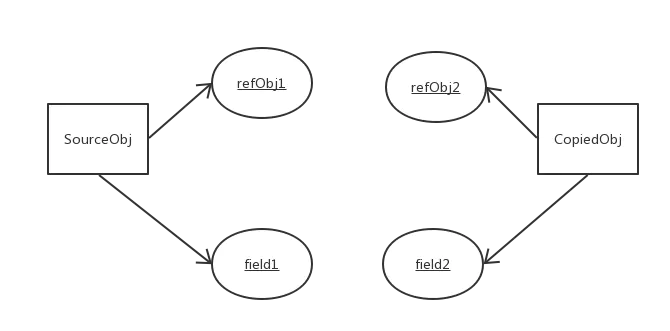

[toc]

# String相关问题

## String、StringBuilder和StringBuffer的区别


## String不可变的原因？


## String为什么用char数组存储？


# Object类相关问题

## equals的性质

equals有四个性质：

1. 自反性（reflexive）：对于任何非空引用x，x.equals(x)为true。
2. 对称性（symmetric）：对于任何非空的引用x和y，当且仅当y.equals(x)返回true时，x.equals(y)返回true
3. 传递性（transitive）：对于任何非空引用x、y和z，如果x.equals(y)返回true，而y.equals(z)返回true，x.equals(z)也应该返回true。
4. 一致性（consistent）：如果非空引用x和y的对象没有变化，反复调用x.equals(y)返回相同的结果。

## equals和hashcode

1. **当equals方法被重写时，应该重写hashCode方法**，从而保证两个相等的对象拥有相同的哈希码。
2. 程序执行过程中，如果对象的数据没有被修改，则多次调用hashCode方法将返回相同的整数。
3. **两个不相等的对象可能具有相同的哈希码**，但在实现hashCode方法时应避免太多这样的情况出现。

## wait

Object wait() 方法让当前线程进入等待状态。直到其他线程调用此对象的 notify() 方法或 notifyAll() 方法。

当前线程必须是此对象的监视器所有者，否则还是会发生 **IllegalMonitorStateException** 异常。

如果当前线程在等待之前或在等待时被任何线程中断，则会抛出 **InterruptedException** 异常。

## wait、sleep、yield比较

当前线程对象调用wait，进入等待状态，释放锁，不会自动苏醒，需要别的线程调用同一对象上的notify或notifyAll。

sleep方法是Thread的静态方法，进入等待，但不释放锁。sleep()方法执行完成后，将会自动苏醒。

调用yield()静态方法，暂时暂停当前线程，让系统的线程调度器重新调度一次，它自己完全有可能再次运行。

# 深拷贝和浅拷贝的区别

> https://www.jianshu.com/p/94dbef2de298

**浅拷贝**：只复制指向某个对象的指针，而不复制对象本身，新旧对象还是共享同一块内存。

1. 基本类型：一个对象修改值，不会影响另一个。注意：String是final类，改变这个值其实是new一个新的String类型的对象，所以不会影响原对象。
2. 引用类型： 数组或类，内存地址相同，改变其中一个会影响另一个。

浅拷贝的实现： 实现对象拷贝的类，需要实现 `Cloneable` 接口，并覆写 `clone()` 方法。


**深拷贝**：创建一个完全一样的对象，且新老对象不共享内存。

1. 基本类型：显然是不会影响的。
2. 引用类型：既然是深拷贝，为引用类型的数据成员开辟了独立的内存空间，也不会相互影响。
3. 速度慢且花销大。

深拷贝的实现： 多层对象，每个对象都需要实现cloneable并重写clone()方法，实现对象的串行层层拷贝。



# 创建对象有几种方法？

1. new：`Object obj = new Object();`
2. 反射：
   1. 使用Class对象的newInstance，要求Class对象对应的类有默认构造器。
   2. 使用Class对象获取Constructor，调用Construtor对象的newInstance()方法来创建该Class对象对应类的实例。

3. 反序列化

   序列化可以 保存对象状态【持久化】 或  RMI远程方法调用作为网络传输对象。

   ```java
   Person summerday = new Person(); // Person 实现 serializable
   ObjectOutputStream out = 
       new ObjectOutputStream(new FileOutputStream("person.ser"));
   
   out.writeObject(summerday); 
   
   // 下面是反序列化
   ObjectInputStream in = 
       new ObjectInputStream(new FileInputStream("person.ser"));  
   Person summerday = (Person) in.readObject(); 
   ```

4. clone
   1. 浅拷贝直接实现Cloneable接口，重写clone方法。
   2. 深拷贝的话，内层对象也需要cloneable。

# 程序结果输出类题目

## String类

```java
public class Example{
    String str=new String("hello");
    char[]ch={'a','b'};
    public static void main(String args[]){
        Example ex=new Example();
        ex.change(ex.str,ex.ch);
        System.out.print(ex.str+" and ");
        System.out.print(ex.ch);
    }
    public void change(String str,char ch[]){
        str="test ok";
        ch[0]='c';
    }
}
// 正确答案 hello and cb
```


大致如上图所示，需要注意绿色的Test Ok实在字符串常量池中创建，而不是图中的栈区。

## 类加载相关

```java
package NowCoder;
class Test {
    public static void hello() {
        System.out.println("hello");
    }
}
public class MyApplication {
    public static void main(String[] args) {
        // TODO Auto-generated method stub
        Test test = null;
        test.hello();
    }
}
// 正确结果： 能编译通过，并正确运行
```

关于结果的解释：[https://www.nowcoder.com/profile/710353654/test/38531333/56439#summary](https://www.nowcoder.com/profile/710353654/test/38531333/56439#summary)


# 在创建派生类对象，构造函数的执行顺序

```java
public class ExtendsTest {

    public static void main(String[] args) {
        A c = new  B();
    }

}

class A{
    static
    {
        System.out.println("A 基类静态域 ");
    }
    {
        System.out.println("A 基类对象成员构造函数");
    }
    public A(){
        System.out.println("A 基类本身的构造函数");
    }
}
class B extends A{
    static
    {
        System.out.println("B 派生类静态域");
    }
    {
        System.out.println("B 派生类对象成员构造函数");
    }
    public B(){
        System.out.println("B 派生类本身的构造函数");
    }
}
// 输出结果
A 基类静态域 
B 派生类静态域
A 基类对象成员构造函数
A 基类本身的构造函数
B 派生类对象成员构造函数
B 派生类本身的构造函数
```

# 二维数组的创建

```java
float f[][] = new float[6][6];
float []f[] = new float[6][6];
float [][]f = new float[6][6];
float [][]f = new float[6][];
```

以上都是正确的：

- 行必须指定。
- `[][]`和变量名的顺序可以不定。

