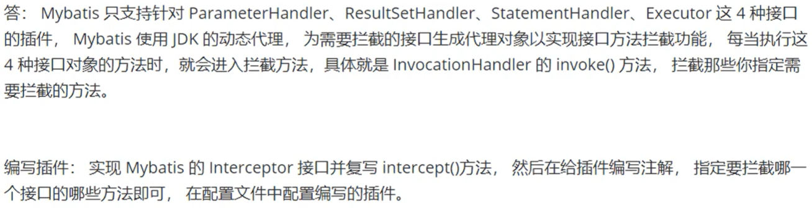

[toc]

# 简单介绍

是什么：开源持久层框架，通过xml或注解方式将java对象和数据库表进行映射，提供强大持久化功能。简化jdbc

为什么：简化数据库操作，灵活（支持动态sql，参数映射，结果集映射）、性能好（缓存、预编译）

怎么用：mapper接口和xml映射文件，配置数据源、mapper扫描路径，注入mapper。

# （*）平时怎么用的？

- 常用的注解有哪些：@Select @Insert @Update @Delete @Results+@Result, @Param @Options @ResultMap

- 对应的一些标签：`<resultMap>、 <parameterMap>、 <sql>+<include>、trim|where|set|foreach|if|choose|when|otherwise|bind`

- 动态sql：

  - ```xml
    <select id="getUserListByIds" parameterType="List" resultType="User">
        SELECT * FROM users
        WHERE id IN
        <foreach collection="ids" item="id" open="(" separator="," close=")">
            #{id}
        </foreach>
    </select>
    ```

  - ```xml
    <select id="getUserList" parameterType="map" resultType="User">
        SELECT * FROM users
        <where>
            <if test="username != null">
                AND username = #{username}
            </if>
            <if test="age != null">
                AND age = #{age}
            </if>
        </where>
    </select>
    ```

  - ```xml
    <select id="getUserListByDepartment" parameterType="map" resultType="User">
        SELECT * FROM users
        WHERE department_id IN
        <foreach item="departmentId" collection="departmentIds" open="(" separator="," close=")">
            #{departmentId}
        </foreach>
    </select>
    ```

# 参数传递#{}和${}的区别

#{} 是sql参数占位符，会被mybatis替换为？号，使用PreparedStatement按序奖？替换为参数值，防止sql注入（预编译，安全）

${} 是Properties文件中的变量占位符，可以替换内容，有sql注入风险

# 支持映射到枚举类吗

可以，自定义一个typehandler，实现setParameter()和getResult()方法：

完成javatype 和jdbctybe的相互转换，一个是java对象的类型（javaType=java.lang.String)， 一个是数据库字段的类型(jdbcType=VARCHAR)  当这两个字段类型不一致的时候，需要指定


# MyBatis 执行批量插入，能返回数据库主键列表吗？

可以，插入数据时，使用selectKey标签来获取数据库生成的主键，并将其存储在一个列表中返回

```xml
<insert id="insertBatch" parameterType="java.util.List">
  <!-- 批量插入的 SQL 语句 -->
  INSERT INTO your_table (column1, column2) VALUES
  <foreach collection="list" item="item" index="index" separator=",">
    (#{item.column1}, #{item.column2})
  </foreach>
  <!-- 获取数据库生成的主键 -->
  <selectKey keyProperty="id" order="AFTER" resultType="java.lang.Long">
    SELECT LAST_INSERT_ID()
  </selectKey>
</insert>

```

# 怎么批处理

BatchExecutor：update，将所有sql都添加到批处理中，等待统一执行（其他两种是simpleexecutor和reuseexecutor）

在mybatis配置文件中可以设置ExecutorType或者`SqlSession sqlSession = sqlSessionFactory.openSession(ExecutorType.BATCH);`

# （*）Mapper接口的工作原理？

mapper接口的全限定名 是 namespace， 接口方法名是id

调用接口方法时，根据**namespace + id 会定位到唯一**（这里如果有情况导致不唯一，那就报错了）的一个MappedStatement，（在 MyBatis 中，每一个 `<select>`、 `<insert>`、 `<update>`、 `<delete>` 标签，都会被解析为一个 `MappedStatement` 对象。）

**mapper接口的工作原理是：jdk动态代理会给mapper接口生成代理proxy对象，proxy对象会拦截接口方法，转而执行mappedstatement表示的sql，之后执行sql返回。**

**mapper接口里的方法，参数不同时，方法可以重载么？**

 可以有多个方法重载，但是对应的 映射只有一个（实际上 有点鸡肋、坑很大）只能仅有一个无参和一个有参的时候可以

# （*）mybatis的缓存机制

[源码解析](框架系列/mybatis/mybatis源码之缓存设置.md)

cache：{id, key, value}, id = namespace, key = cacheKey(根据statement得到，value是缓存对象)

分为两级缓存：

1. 一级缓存：在同一个 SqlSession 中执行相同的 SQL 语句时，查询的结果会被缓存起来，默认开启，无法关闭
2. 二级缓存：多个 SqlSession 共享同一个缓存，当多个 SqlSession 执行相同的 SQL 语句时，查询的结果会被缓存起来，需要手动开启（不默认开启就是为了考虑数据一致性和并发访问）：全剧配置：cacheEnabled=true， useCache=true

（既然是缓存，优点肯定是：减少数据库访问次数，缺点一定是：要注意数据的一致性问题）

什么时候缓存会清除？

一级缓存默认是sqlSession级别地缓存，insert|delete|update|commit()和close()的操作的执行都会清空一级缓存。

二级缓存实现了SqlSession之间缓存数据的共享，是mapper映射级别的缓存。

# 简述MyBatis的插件运行原理，如何编写一个插件

有哪些分页方法：

1. 针对ResultSet结果集进行内存分页
2. 在sql直接完成物理分页
3. 分页插件（怎么实现的）：使用mybatis提供的插件接口，自定义，在插件的拦截方法内拦截代执行的sql，重写sql：

举例：`select _ from student` ，拦截 sql 后重写为：`select t._ from （select \* from student）t limit 0，10`



# （*）有哪些设计模式

工厂模式SqlSessionFactory创建SqlSession工厂，隐藏对象创建的细节

代理模式通过动态代理技术来生成 Mapper 接口的实现类

模版模式：BaseExecutor使用模版方法，定义了执行sql语句的算法框架，将具体的细节放到子类去实现

观察者模式：executor和statementhandler等组件 触发和监听事件，实现解耦，灵活的处理事件

建造者模式：SqlSessionFactoryBuilder、XMLConfigBuilder等构造复杂的对象

# mybatis和hibernate不同

hibernate：全自动orm，可以根据对象关系模型直接获取，所以它是全自动的。而 MyBatis 在查询关联对象或关联集合对象时，需要手动编写 sql 来完成，所以，称之为半自动 ORM 映射工具。

# mybatis中的事务管理方式

默认用jdbc事务：commit + rollback

