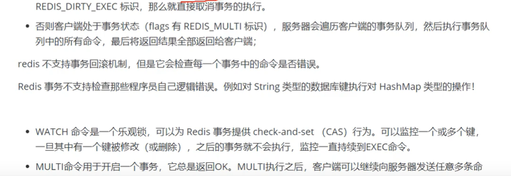

[toc]

# Redis线程模型，单线程为什么这么快


# 如何设计Redis Key

分段设计法：

1. 把表名转化为key前缀
2. 主键名
3. 主键值
4. 要存储的字段

例：`user:id:1:name` 

# Redis的基础数据类型和具体应用场景

> [Redis 数据类型及应用场景](https://segmentfault.com/a/1190000012212663)

## string

**概述**

string 类型是 Redis 中最基本的数据类型，最常用的数据类型，甚至被很多玩家当成 redis 唯一的数据类型去使用。string 类型在 redis 中是二进制安全(binary safe)的,这意味着 string 值关心二进制的字符串，不关心具体格式，你可以用它存储 json 格式或 JPEG 图片格式的字符串。

**底层实现**


**应用场景**

1. 存储某个字段的值： `set user:id:1:name summerday`
2. 存储json或其他对象格式化的对象： `set user:id:1 '[{"id":1,"name":"summerday"}]'`
3. 生成自增id：当redis的string类型是整数时，redis可以把它当作整数一样进行自增incr自减decr操作。

## list

**概述**

list 是按照插入顺序排序的字符串链表，可以在头部和尾部插入新的元素（双向链表实现，两端添加元素的时间复杂度为 O(1)）。插入元素时，如果 key 不存在，redis 会为该 key 创建一个新的链表，如果链表中所有的元素都被移除，该 key 也会从 redis 中移除。

**数据模型**


**应用场景**

1. 消息队列
2. 最新内容：两段附近的查询性能较好，适合查询最新数据场景。

## hash

**概述**

hash 类型很像一个关系型数据库的数据表，hash 的 Key 是一个唯一值，Value 部分是一个 hashmap 的结构。

hash数据类型在存储上述类型的数据时具有比 string 类型更灵活、更快的优势，具体的说，使用 string 类型存储，必然需要转换和解析 json 格式的字符串，即便不需要转换，在内存开销方面，还是 hash 占优势。

**应用场景**

适合存储对象类的数据：

```sql
hmset user:1 name summerday address hangzhou
```

## set

**概述**

　　set 数据类型是一个集合（没有排序，不重复），可以对 set 类型的数据进行添加、删除、判断是否存在等操作（时间复杂度是 O(1) ）
　　set 集合不允许数据重复，如果添加的数据在 set 中已经存在，将只保留一份。
　　set 类型提供了多个 set 之间的聚合运算，如求交集、并集、补集，这些操作在 redis 内部完成，效率很高。

**应用场景**

1. 共同好友列表：

```redis
// 这里为了方便阅读，把 id 替换成姓名
sadd user:wade james melo paul kobe
sadd user:james wade melo paul kobe
sadd user:paul wade james melo kobe
sadd user:melo wade james paul kobe

// 获取 wade 和 james 的共同好友
sinter user:wade user:james
/* 输出：
 *      1) "kobe"
 *      2) "paul"
 *      3) "melo"
 */
 
 // 获取香蕉四兄弟的共同好友
 sinter user:wade user:james user:paul user:melo
 /* 输出：
 *      1) "kobe"
 */
 
 /*
     类似的需求还有很多 , 必须把每个标签下的文章 id 存到集合中，可以很容易的求出几个不同标签下的共同文章；
 把每个人的爱好存到集合中，可以很容易的求出几个人的共同爱好。 
 */
```

## zset

**概述**

在 set 的基础上给集合中每个元素关联了一个分数，往有序集合中插入数据时会自动根据这个分数排序。

**应用场景**

```redis
// 用元素的分数（score）表示与好友的亲密度
zadd user:kobe 80 james 90 wade  85 melo  90 paul

// 根据“亲密度”给好友排序
zrevrange user:kobe 0 -1

/**
 * 输出：
 *      1) "wade"
 *      2) "paul"
 *      3) "melo"
 *      4) "james"
 */
 
// 增加好友的亲密度
zincrby user:kobe 15 james

// 再次根据“亲密度”给好友排序
zrevrange user:kobe 0 -1

/**
 * 输出：
 *      1) "james"
 *      2) "wade"
 *      3) "paul"
 *      2) "melo"
 */
 
 //类似的需求还出现在根据文章的阅读量或点赞量对文章列表排序
```

# Redis的set求交集的时间复杂度


> https://blog.csdn.net/weixin_43456598/article/details/100551692

# Redis 事务

原子性：与mysql不同， 没有回滚机制，只保证原子性， 要么一起执行， 要么都不执行。

一致性：可以数据恢复，保证最终一致性。

持久性：AOF 和 RDB。

隔离性：redis是单线程的，事务只会被一个线程执行。

可以通过watch命令监控事务中所有的key，如果key发生变化，会将事务取消。

**事务实现**





# Redis过期键的删除策略


# RDB 和 AOF

## RDB: Redis DataBase

在指定的时间间隔内将内存中的数据集快照写入磁盘，实际操作过程是fork一个子进程，先将数据集写入临时文件，写入成功后，再替换之前的文件，用二进制压缩存储。

**优点**

1. 整个Redis数据库将只包含一个文件dump.rdb，方面持久化。
2. 容灾性好，方便备份。
3. 性能最大化，fork子进程来完成写操作，让主进程继续处理命令，IO最大化。使用单独子进程来进行持久化，主进程不会进行任何IO操作，不会因为IO阻塞，高性能。
4. 相对数据集大时，比AOF启动效率更高。

**缺点**

1. 数据安全性低。rdb是间隔一段时间进行持久化，如果持久化之间redis发生故障，会发生数据丢失。适合数据要求不严谨的时候。
2. 由于rdb是通过fork子进程来协助完成数据持久化工作的，因此如果数据集较大，可能会导致整个服务器停止服务几百毫秒，甚至一秒。

## AOF:Append Only File

以日志的形式记录服务器所处理的每一个写、删除操作，查询操作不会记录，以文本的方式记录，可以打开文件看到详细的操作记录。

**优点**

1. 数据安全，redis中提供了三种同步策略：每秒同步、每修改同步、不同步。事实上，**每秒同步也是异步完成**的，其效率也是非常高的，所差的是一旦系统出现宕机现象，那么这一秒钟之内修改的数据将会丢失，而**每修改同步，我们可以将其视为同步持久化**，即每次发生的数据变化都会被立即记录到磁盘种。
2. append模式写文件，即便中途服务器宕机也不会破坏已经存在的内容，可以通过redis-check-aof工具解决数据一致性问题。
3. AOF机制的rewrite模式，定期对AOF文件进行重写，以达到压缩的目的。

**缺点**

1. AOF文件比RDB文件大，且恢复速度慢。
2. 数据集大的时候，比RDB启动效率低。
3. 运行效率没有RDB高。

## 总结

AOF文件比RDB更新频率高，优先使用AOF还原数据。

AOF比RDB更安全也更大

RDB性能AOF好

如果两个都配置了， 会优先加载AOF。

# 高并发问题

## 缓存雪崩

**概念**

缓存雪崩指的是：缓存在同一时间大面积的失效，后面的请求都会落在数据库上，造成数据库短时间内承受大量的请求而崩掉。或者【redis重启】

**解决方案**

- 缓存过期时间设置随机，防止同一时间大量数据过期现象发生。
- 给每个缓存数据增加相应的缓存标记，记录缓存是否失效，如果缓存标记失效，则更新数据缓存，但需要一直监控，消耗较多。
- 缓存预热
- 互斥锁

## 缓存穿透

**概念**

缓存穿透指的是：缓存和数据库中都没有的数据，导致所有的请求都落到数据库上，造成数据库短时间内承受大量请求而崩掉。【一般来自攻击场景或高并发场景】

**解决方案**

- **接口层增加校验**，如用户鉴权，id做基础校验，直接拦截。
- 从缓存取不到的数据，在数据库中也没有取到，此时可以**缓存key-null**。缓存有效时间可以设置短一些，如30s【太长的话会导致正常情况也无法使用】，这样可以防止攻击用户反复用同一个id暴力攻击。
- 采用布隆过滤器，将所有可能存在的数据哈希到一个足够大的bitmap中，一个**一定不存在的数据会被拦截**，避免对底层存储系统的查询压力。

## 缓存击穿

**概念**

缓存击穿指的是：缓存中没有但数据库中有的数据【一般指缓存时间到期】，这时由于并发用户较多，同时读缓存没有读到数据，同时去数据库中取数据，引起数据库压力瞬间增大，造成过大压力。

和缓存雪崩不同的是，**缓存击穿指并发查同一条数据**，**缓存雪崩是不同的数据都过期**了， 很多数据都查不到而查数据库。

**解决方案**

- 设置热点数据永远不过期。
- 加互斥锁。

