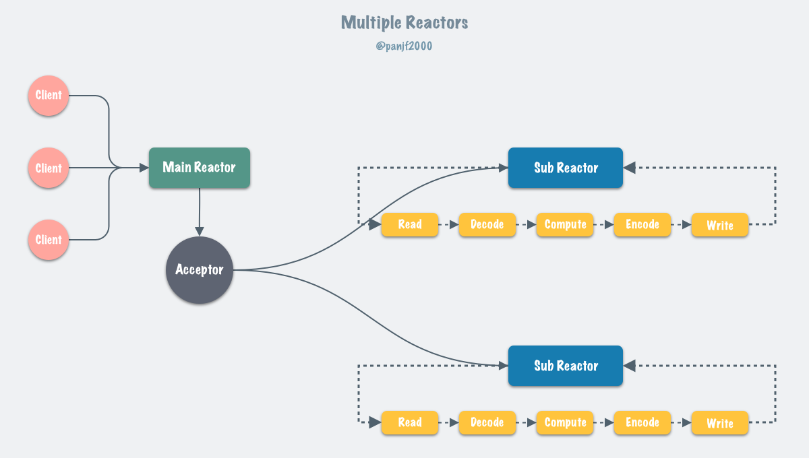
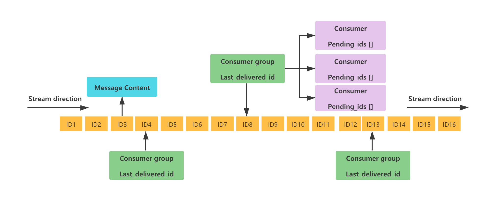

[toc]

本文摘自：《JavaGuide》

# Redis简介

> 【什么是redis】
>
> Redis数据库（Not only SQL），与传统关系型数据库（走磁盘IO，性能瓶颈）不同，Redis的数据存储在内存中，读写速度非常快。
>
> Redis可以应用的方向：缓存，分布式锁，事务，持久化，LUA脚本，LRU驱动事件，多种集群方案。
>
> 【为什么不用map缓存】
>
> 分布式缓存
>
> 【为什么要用】
>
> 高性能（基于内存、读写速度快） + 高并发 + 功能全面（分布式锁、缓存、消息队列、延迟队列）
>
> 【redis和memcached的区别】
>
> 【redis的缺点】
>
> 1. 结构化查询差
> 2. **容量受物理内存限制**
> 3. 难支持在线扩容

## 为什么要用Redis

> 高性能 + 高并发

**高性能：（基于内存、访问速度快）**

- 假设数据存储在数据库中，从中读取其实是从硬盘上读取的，读取速度相对较慢。
- 但将其存储在缓存中，再读取的时候，直接可以从缓存中获取，直接操作内存，速度很快。
- 如果数据库中的对应数据改变之后，需要同步改变缓存中响应的数据。

**高并发：（mysql的qps在4k左右，4c8g，使用Redis达到5w+到10w+，单机情况）**

- 直接操作缓存能够承受的请求远远大于直接访问数据库，所以可以把数据库中的部分数据转移到缓存中去，这样用户的一部分请求将会直接到缓存，而不经过数据库。

**功能全面：**

> 在项目中的使用场景：
>
> 1. **setnx 实现分布式锁**，优化独占锁为分段锁，过期时间设置为活动结束时间
> 2. 用于缓存：string、hash、list、zset
> 3. 实时消息控制（**消息队列**）：阻塞队列 blpush blpop
> 4. 延迟队列：Redisson内置延迟对立额，基于zset实现
> 5. 分布式session
> 6. 限流…… （Redis+lua 或 RRateLimiter：lua + 令牌桶算法）

## 本地缓存 or 分布式缓存

缓存分为本地缓存和分布式缓存。

Map：

- 是本地缓存，轻量及快速，生命周期随jvm的销毁而结束。
- 在多实例的情况下，每个实例都需要保存一份缓存，缓存不具有一致性。

Redis或memcached：

- 是分布式缓存，在多实例的情况下，各实例共用一份缓存，缓存具有一致性。
- 需要保持分布式缓存服务的高可用，整个程序架构上较为复杂。

## Redis和memcached的区别

| 对比参数     | Redis                                                        | Memecached                                                 |
| ------------ | ------------------------------------------------------------ | ---------------------------------------------------------- |
| 类型         | 1、支持内存<br />2、非关系型数据库                           | 1、支持内存<br />2、key-value键值对的形式<br />3、缓存系统 |
| 数据存储类型 | String、List、Set<br />Hash、SortSet（Zset）                 | 1、文本型<br />2、二进制类型                               |
| 操作类型     | 1、批量操作<br />2、事务支持（假事务）<br />3、每个类型不同的CRUD | 1、CRUD<br />2、少量的其他命令                             |
| 附加功能     | 1、发布订阅模式<br />2、主从分区<br />3、序列化支持<br />4、脚本支持（LUA脚本） | 多线程服务支持                                             |
| 网络IO模型   | 单线程模型                                                   | 多线程、非阻塞IO模式                                       |
| 事件库       | 自动简易事件库AeEvent                                        | 贵族血统的LibEvent事件库                                   |
| 持久化支持   | RDB、AOF                                                     | 不支持                                                     |

# Redis线程模型

> 【是单线程的吗？】
>
> 答：接收客户端请求，解析请求，数据读写等操作，发送给客户端，这个过程是由主线程完成的。但是redis程序并不是单线程的，redis启动时会启动后台线程，异步处理任务（关闭文件、aof 刷盘等）
>
> 【单线程为什么这么快？】
>
> 答：基于内存 + 避免多线程竞争 + IO多路复用 + 数据结构优化 等
>
> **【单线程模型是怎么样的？】**
>
> 基于Reactor模式，**采用epoll/select/kqueue等IO多路复用技术同时监听多个socket，在单线程的事件循环中不断去处理事件（客户端请求），最后回写响应数据到客户端**。本质就是：I/O多路复用 + 非阻塞I/O（事件派发）网络IO和命令处理都是单线程的
>
> 【为什么要用IO多路复用】
>
> 答：Redis是纯内存操作，执行速度快，性能瓶颈在**网络延迟**而不是执行速度，IO多路复用就是应对它实现高效网络请求。采用epoll/select/kqueue等IO多路复用技术同时监听多个socket，在单线程的事件循环中不断去处理事件。
>
> 【为什么redis6.0之前使用单线程】
>
> 答：因为CPU并不是制约redis性能瓶颈的因素，更多是受到内存大小和网络的限制，因此考虑I/O多路复用 + 非阻塞I/O去解决网络IO。虽然文件事件处理器以单线程方式运行， 但通过使用 I/O 多路复用程序来监听多个套接字， 文件事件处理器既实现了**高性能的网络通信模型**， 又可以很好地与 redis 服务器中其他同样以单线程方式运行的模块进行对接， 这保持了 Redis 内部单线程设计的简单性。
>
> 【为什么之后又引入了多线程】
>
> 答：传统的Redis版本中，一个主线程负责处理所有的客户端请求、数据操作和持久化等任务。这种单线程模型的设计简单高效，适用于大多数情况下的低延迟、高吞吐量的场景。
>
> 然而，随着数据量和并发请求量的增加，单线程模型可能会成为性能瓶颈，无法充分利用多核CPU的性能。为了提高Redis的并发处理能力和性能，Redis 6引入了多线程支持。在多线程模式下，Redis可以将一些耗时的操作和计算任务分配给多个线程来处理，例如网络IO操作、阻塞命令的执行、AOF日志的重写等，从而减轻了单线程的压力，提高了系统的并发能力和吞吐量。
>
> 1. IO操作多线程化
> 2. 阻塞命令的异步执行
> 3. aof日志的重写和压缩
>
> 

[https://www.javazhiyin.com/22943.html](https://www.javazhiyin.com/22943.html)

Redis内部使用文件事件处理器`filter event handler`，这个**文件处理器是单线程**的，因此Redis被称为单线程的模型。

## 为什么选择**单线程网络模型**？

因为CPU通常不会成为性能瓶颈，瓶颈往往是内存和网络，因此单线程就够了。


## Redis单线程为什么这么快？

> 官方基准测试 redis吞吐量可以达到10w/s

1. 基于**内存**，内存访问速度>>磁盘，并且利用自定义内存分配器jemalloc有效处理内存 
2. **单线程**，避免不必要的上下文切换可竞争条件，多线程还要考虑线程安全问题
3. **非阻塞IO多路复用**技术为中心的事件驱动程序设计模型，读写请求不阻塞其他操作。
4. 数据结构都对内存做了优化：比如：小值编码等
   1. SDS紧凑型字符串表示 string（动态string）
   2. 压缩列表zip list：list，sorted set
   3. 跳表skiplist：zset
5. 持久化操作也是异步的，不回阻塞主线程读写
6. 管道技术，一次性发送多个命令，减少网络往返
7. 客户端缓存、减少对Redis服务器的访问频率


## 为什么用IO多路复用？

Redis是纯内存操作，执行速度快，性能瓶颈在**网络延迟**而不是执行速度，IO多路复用就是应对它实现高效网络请求。

Redis1.0到6.0之前，核心网络模型是：单Reactor模型：**采用epoll/select/kqueue等IO多路复用技术同时监听多个socket，在单线程的事件循环中不断去处理事件（客户端请求），最后回写响应数据到客户端**。本质就是：I/O多路复用 + 非阻塞I/O（事件派发）

- 用户空间和内核空间
- 阻塞IO、非阻塞IO、IO多路复用（epoll）

> [阻塞IO和非阻塞IO的区别](Java基础/IO/md/NIO-BIO-AIO.md)，用户态和内核态，select和poll（只通知用户进程有socket就绪，不具体告诉是哪个，**都需要遍历**确定，区别在于select数组存储socket连接文件描述符，容量固定，而poll是链表存储） 和 epoll（通知+直接把socket写入用户进程）的区别

多个socket可能会并发产生不同的操作，每个操作对应不同的文件事件，但是IO多路复用程序会监听多个socket，会将socket产生的事件放入队列中排队，事件分派器每次从队列中取出一个事件，把该事件交给对应的事件处理器进行处理。

对于那些想利用多核优势提升性能的用户来说，redis官方给出的解决方案是：在同一个机器上多跑几个redis实例，事实上，为了保证高可用，往往利用redis分布式集群多节点和数据分片负载均衡来提升性能和保证高可用。

！！！实际上，参考文章：[Redis真的是单线程？](https://strikefreedom.top/archives/multiple-threaded-network-model-in-redis)


上面说的单线程的是网络模型，实际上，redis4.0开始就引入了多线程处理异步任务，来处理一些比较耗时的命令，将命令异步化，避免阻塞单线程的事件循环。（例子，超大key删除，会导致单线程阻塞好几秒，阻塞其他事件！）

**于是，redis 4.0之后加入一些非阻塞的命令：unlink，flushall async， flushdb async**

## 为什么引入多线程？

之前选择单线程是因为CPU不是性能瓶颈，内存和网络才是，但是现在I/O瓶颈越来越明显。Redis 的单线程模式会导致系统消耗很多 CPU 时间在网络 I/O 上从而降低吞吐量，要提升 Redis 的性能有两个方向：
- 优化网络I/O模块
- 提高机器内存读写的速度（依赖硬件，难）

I/O怎么优化：
- 零拷贝（什么是零拷贝） or DPDK（旁路网卡I/O绕过内核协议栈）（不适配or太复杂）
- 利用多核！！！性价比最高的方案！因此！引入多线程IO

Redis6.0之后在网络模型中实现I/O多线程，提高网络IO读写性能。从Reactor进化为Multi-Reactors模式：



从单线程事件循环 变成：多个线程（sub reactors）各自维护一个独立的事件循环，由main reactor负责接收新连接并分发给sub reactors去独立处理，最后sub reactors回写响应给客户端。

> 缺陷：在 Redis 的多线程方案中，I/O 线程任务仅仅是通过 socket 读取客户端请求命令并解析，却没有真正去执行命令，所有客户端命令最后还需要回到主线程去执行，因此对多核的利用率并不算高，而且每次主线程都必须在分配完任务之后忙轮询等待所有 I/O 线程完成任务之后才能继续执行其他逻辑。
>
> Redis 目前的多线程方案更像是一个折中的选择：既保持了原系统的兼容性，又能利用多核提升 I/O 性能。

# Redis常见数据结构以及使用场景分析

> 【常见的数据结构和场景分析】
>
> 【redis的数据类型怎么实现的】
>
> string： SDS（简单动态字符串），使用len属性判断字符串是否结束、获取长度的时间O(1)
>
> list：压缩列表 -> 双向链表，阈值可设置（默认512个元素、每元素64字节），3.2之后改为quicklist
>
> hash：压缩列表 -> 哈希表，阈值同上，7.0之后，压缩列表被废弃，由listpack实现
>
> set：整数集合 -> 哈希表，阈值同上
>
> zset：压缩列表 -> 跳表，阈值可设置（默认128个，每元素64字节）7.0之后，压缩列表被废弃，由listpack实现
>
> 

## String

常用操作：set、get、decr、incr、mget

String数据结构是简单的key-value类型，应用于常规的缓存应用：微博数、粉丝数等。

> 【项目】：库存扣减！decr

## Hash

常用操作：hget、hset、hgetall

String类型的field和value的映射表，hash适合用于存储对象，后续操作时，可以直接仅仅修改该对象中的某个字段的值。如：

```java
key=user122
value={
    "id": 1,
    "name":"summerday",
    "age":20
}
```

> 【项目】：存储抽奖算法需要的缓存

> 如何解决哈希冲突的问题：拉链法
>
> 问题：拉链过长，操作速度变慢
>
> 解决：rehash 和 渐进式hash

## List

常用操作：lpush、rpush、lpop、rpop、lrange

双向链表，可以支持双向查找遍历，可以实现消息列表，粉丝关注列表的，lrange命令可以实现从某个元素开始读取多少个元素，可以实现简单的高性能分页。

> 【项目】：阻塞队列的实现，blpop，blpush，

## Set

常用操作：sadd，spop，smembers，sunion

提供类似list的功能，但是set中元素自动去重，另外交集并集差集的操作可以轻松实现共同关注、共同粉丝的功能。

## Sorted Set

常用操作：zadd、zrange、zrem、zcard

在set的基础上增加了一个权重系数score，使得集合中的元素能够按score进行有序排列，可以实现各种排行榜。

> 延迟队列，更新库存，减少数据库的压力，score是时间戳
>
> 原理：基于选择机制，根据存储元素的长度or大小，选择压缩列表（类似于数组，双向链表）或者跳表（链表基础上+多级索引，logn时间查找、删除、插入，多个层级的链表组成）

跳表、平衡树、红黑树、B+树的区别？

- 平衡树：平衡树的插入、删除和查询的时间复杂度和跳表一样都是 **O(log n)**，范围查询也可以达到一样的效果，但是，但是它的每一次插入或者删除操作都需要保证整颗树左右节点的绝对平衡，只要不平衡就要通过旋转操作来保持平衡，这个过程是比较耗时的。（跳表使用概率平衡）
- 红黑树：跳表的实现也更简单一些，不需要通过旋转和染色（红黑变换）来保证黑平衡。
- B+树：跳表不需要存储大量数据，跳表实现 zset 时相较前者来说更简单一些，在进行插入时只需通过索引将数据插入到链表中合适的位置再随机维护一定高度的索引即可，也不需要像 B+树那样插入时发现失衡时还需要对节点分裂与合并。

## HyperLogLog、Bitmap、Geospatial，Bloom filter

HyperLogLog（基数统计）、Bitmap （位图）、Geospatial (地理位置)

Bitmap：存储连续的二进制0or1，bitmap极大节省存储空间，统计活跃用户：SETBIT 20220329 [id] 1 设置id用户2022年3月29日活跃为1。

```
BITOP and desk1 20220329
(integer) 1
BITCOUNT desk1
(integer) 1
```

Redis v4.0 之后有了 Module（模块/插件） 功能，Redis Modules 让 Redis 可以使用外部模块扩展其功能 。布隆过滤器就是其中的 Module。详情可以查看 Redis 官方对 Redis Modules 的介绍：https://redis.io/modules

# Redis实现分布式锁

## 为什么需要分布式锁？

场景：集群情况下的定时任务，抢单，幂等场景，单体锁只能锁同一个jvm下的进程、锁不住集群分布式


## redis分布式锁怎么实现？

- 使用Redisson分布式锁，底层是setnx命令 + lua脚本

```
set lock value NX EX 10 # 获取锁 过期时间兜底， 防止死锁
DEL key # 释放锁
```

## 如何控制锁的有效时长？

- 给**锁续期（开一个线程去监控）**：redisson分布式锁，提供了WatchDog，一个线程获取成功后，WatchDog会给持有锁的线程续期，默认是每隔10s续期一次

Redisson加锁tryLock（boolean）成功后，开启一个watch dog线程，每隔(releaseTime / 3) 的时间做一次续期。 如果加锁失败，会while自旋不断尝试获取锁。

```java
Rlock lock = redissonClient.getLock("myLock");
// 枷锁、设置过期时间 操作 基于lua脚本完成，保证原子性
boolean isLock = lock.tryLock(10, TimeUnit.SECONDS);
if(isLock) {
  try {
    //
  }finally{
    lock.unlock();
  }
}
```

## 可重入吗？ 

- 可以。多个锁重入需要判断是否是当前线程，redis中进行存储的时候使用hash结构，来存储线程信息和重入的次数

## 能解决主从一致的问题吗？

- 可以使用redlock，但是性能太低
- redis基于AP思想，如果希望CP思想，可以采用zookeeper强一致性

# Redis做消息队列

Redis2.0之前，使用List中的rpush和lpop实现简易版消息队列（问题是会不断轮询调用指令，存在性能问题）

以及阻塞式的BLPOP和BRPOP这种阻塞式读取的命令，

```redis
# 超时时间为 10s
# 如果有数据立刻返回，否则最多等待10秒
BRPOP myList 10
null
```

Redis2.0引入了发布订阅（pub/sub），解决了list实现消息队列没有广播机制的问题：publisher，channel，subscriber

- 发布者通过publish 发送消息到指定channel
- 订阅者通过subscribe订阅channel，可以订阅一个or多个channel

> 广播、单播都支持，还支持简单正则匹配，但是消息丢失，消息堆积等问题不能很好解决。

Redis5.0引入Stream来做消息队列：



- 发布 / 订阅模式
- 按照消费者组进行消费（借鉴了 Kafka 消费者组的概念）
- 消息持久化（ RDB 和 AOF）
- ACK 机制（通过确认机制来告知已经成功处理了消息）
- 阻塞式获取消息

这是一个有序的消息链表，每个消息都有一个唯一的 ID 和对应的内容。ID 是一个时间戳和序列号的组合，用来保证消息的唯一性和递增性。内容是一个或多个键值对（类似 Hash 基本数据类型），用来存储消息的数据。

这里再对图中涉及到的一些概念，进行简单解释：

- `Consumer Group`：消费者组用于组织和管理多个消费者。消费者组本身不处理消息，而是再将消息分发给消费者，由消费者进行真正的消费
- `last_delivered_id`：标识消费者组当前消费位置的游标，消费者组中任意一个消费者读取了消息都会使 last_delivered_id 往前移动。
- `pending_ids`：记录已经被客户端消费但没有 ack 的消息的 ID。

总结：Redis可以做简易的消息队列，但是不建议使用，因为有更成熟的方案：RocketMQ、Kafka等。

# Redis实现延迟任务

场景：订单在10分钟后未支付就失效，红包24小时未被查收就自动退还。

方案：

1. redis过期事件监听：时效性差、丢消息、多服务实例下消息重复消费。
2. Redisson内置的延迟队列：减少丢消息的可能（即使redis宕机了，也可以扫描数据库的方法作为补偿），消息不存在重复消费。

Redisson 的延迟队列 RDelayedQueue 是基于 Redis 的 SortedSet 来实现的。SortedSet 是一个有序集合，其中的每个元素都可以设置一个分数，代表该元素的权重。Redisson 利用这一特性，将需要延迟执行的任务插入到 SortedSet 中，并给它们设置相应的过期时间作为分数。

Redisson 使用 `zrangebyscore` 命令扫描 SortedSet 中过期的元素，然后将这些过期元素从 SortedSet 中移除，并将它们加入到就绪消息列表中。就绪消息列表是一个阻塞队列，有消息进入就会被监听到。这样做可以避免对整个 SortedSet 进行轮询，提高了执行效率。

# Redis过期策略

> 定期删除（定期、随机抽取）+ 惰性删除（访问key时）

redis用于缓存，既然是缓存，就是用的内存，内存是宝贵的，不可能用来当存储工具用。那么写入数据太多了咋办？这就涉及到过期策略，redis是怎么处理过期数据的？

而Redis拥有设置过期时间的功能，在set key的时候，设置一个expire time，通过这个过期时间指定key存活时间。

**Redis的过期策略：定期删除 + 惰性删除**

- 定期删除：<u>每隔100ms（10hz，1s10次）随机抽取一些设置了过期时间的key，检查他们是否过期，如果过期就删除</u>。注：随机抽取是为了防止key数量过多而导致的cpu负载。
- 惰性删除：定期删除可能会导致许多过期的key到了时间并没有被删除掉，这时就有了惰性删除，如果我们设置的过期key到了指定的时间还没有被删除掉，他还停留在内存中，<u>除非系统去查那个key</u>，那个key才会被Redis删除。

假如我们设置了大量过期时间的key，定期删除时漏掉了许多key，系统也没有及时去查这个key，那么将会导致一种严重的情况：**大量过期的key堆积在内存中，导致Redis内存耗尽**。

<u>这时就需要用到Redis的**内存淘汰**机制。</u>

# Redis提供数据淘汰策略

> 接上面，内存淘汰key，默认时no-eviction
>
> volatile （对设置了ttl的key）和 allkeys（对所有key）
>
> - 冷热数据区分，allkeys-lru，
> - 如果冷热不区分：allkeys-random
> - 置顶需求：volatile-lru + 不设置ttl
> - 短时高频访问：allkeys-lfu or volatile-lfu
>
> 其他问题：
>
> 1. 数据库有1000w数据，redis只能缓存20w，如何保证redis都是热点数据？
>    - allkeys-lru
> 2. redis内存用完了咋办？
>    - 默认的配置，会直接报错

- **volatile-lru：从已设置过期时间的数据集中挑选最近最少使用的数据，淘汰之。**

> 手写一个lru算法！！！
>
> 单链表思路：
>
> 1. 维护一个链表，头部表示最晚访问的，尾部表示最先访问的（先走）
> 2. 移除操作：移除尾部即可
> 3. 添加操作：加入的key存在，更新一下value，扔到头部（移除当前的，在头部加入新的），如果key不存在，就新创建一个，加入到头部，加入之后，如果cap超过了阈值，就移除尾部
>
> 这个思路没问题，但是可以优化：
>
> 1. 可以用双向链表快速找到某个节点的前向节点，快速删除节点
> 2. 可以用map存储每个key 和对应的node
>
> ```java
> import java.util.HashMap;  
> import java.util.Map;  
>   
> class ListNode {  
>     int key;  
>     int value;  
>     ListNode prev;  
>     ListNode next;  
>   
>     ListNode(int k, int v) {  
>         key = k;  
>         value = v;  
>     }  
> }  
>   
> class LRUCache {  
>     private int capacity;  
>     private Map<Integer, ListNode> map;  
>     private ListNode head;  
>     private ListNode tail;  
>   
>     public LRUCache(int capacity) {  
>         this.capacity = capacity;  
>         map = new HashMap<>();  
>         head = new ListNode(0, 0);  //虚拟头节点
>         tail = new ListNode(0, 0);  //虚拟尾节点
>         head.next = tail;  
>         tail.prev = head;  
>     }  
>   
>     public int get(int key) {  
>         ListNode node = map.get(key);  
>         if (node == null) {  
>             return -1; // key not found  
>         }  
>         // move node to head  
>         moveToHead(node);  
>         return node.value;  
>     }  
>   
>     public void put(int key, int value) {  
>         ListNode node = map.get(key);  
>         if (node == null) {  
>             // new key-value pair  
>             ListNode newNode = new ListNode(key, value);  
>             // add to map  
>             map.put(key, newNode);  
>             // add to linked list  
>             addToHead(newNode);  
>             if (map.size() > capacity) {  
>                 // remove tail  
>                 removeNode(tail.prev);  
>             }  
>         } else {  
>             // update value  
>             node.value = value;  
>             // move node to head  
>             moveToHead(node);  
>         }  
>     }  
>   
>     private void addToHead(ListNode node) {  
>         node.prev = head;  
>         node.next = head.next;  
>         head.next.prev = node;  
>         head.next = node;  
>     }  
>   
>     private void removeNode(ListNode node) {  
>         map.remove(node.key);  
>         node.prev.next = node.next;  
>         node.next.prev = node.prev;  
>     }  
>   
>     private void moveToHead(ListNode node) {  
>         removeNode(node);  
>         addToHead(node);  
>     }  
> }  
>   
> // Example usage  
> public class Main {  
>     public static void main(String[] args) {  
>         LRUCache cache = new LRUCache(2);  
>   
>         cache.put(1, 1);  
>         cache.put(2, 2);  
>         System.out.println(cache.get(1));       // returns 1  
>         cache.put(3, 3);                        // evicts key 2  
>         System.out.println(cache.get(2));       // returns -1 (not found)  
>         cache.put(4, 4);                        // evicts key 1  
>         System.out.println(cache.get(1));       // returns -1 (not found)  
>         System.out.println(cache.get(3));       // returns 3  
>         System.out.println(cache.get(4));       // returns 4  
>     }  
> }
> 
> ```
>
> 当然了，其实可以继承LinkedHashMap简易操作
>
> ```java
> public class LRUCache<K, V> extends LinkedHashMap<K, V> {
>     private int capacity;
> 
>     /**
>      * 传递进来最多能缓存多少数据
>      *
>      * @param capacity 缓存大小
>      */
>     public LRUCache(int capacity) {
>         super(capacity, 0.75f, true);
>         this.capacity = capacity;
>     }
> 
>     /**
>      * 如果map中的数据量大于设定的最大容量，返回true，再新加入对象时删除最老的数据
>      *
>      * @param eldest 最老的数据项
>      * @return true则移除最老的数据
>      */
>     @Override
>     protected boolean removeEldestEntry(Map.Entry<K, V> eldest) {
>         // 当 map中的数据量大于指定的缓存个数的时候，自动移除最老的数据
>         return size() > capacity;
>     }
> }
> 
> ```


- volatile-ttl：从已设置过期时间的数据集中挑选将要过期的数据淘汰。
- volatile-random：从已设置过期时间的数据集中任意选择数据淘汰。
- allkeys-lru：当内存不足以容纳新写入数据时，在键空间中，移除最近最少使用的key。（最常用）
- allkeys-random：从数据集中任意选择数据淘汰。
- no-eviction：禁止驱逐数据，也就是说当内存不足以容纳新写入数据时，新写入操作会报错。

4.0版本之后新增：

- volatile-lfu：从已设置过期时间的数据集中挑选最不经常使用的数据淘汰。
- allekeys-lfu：当内存不足以容纳新写入数据时，在键空间中，移除最不经常使用的key。

# Redis的持久化机制RDB和AOF

Redis支持两种持久化的操作，而memcached并不支持持久化操作。

> rdb：快照二进制数据 （原理save 和 bgsave（fork出一个子进程来生成rdb文件））问题：全量快照，频率高性能低，频率低怕丢数据）子进程生成快照时，主进程依旧可以处理操作命令，copy on write（读共享、写时复制）产生的问题：
>
> aof：操作命令集合（）

## RDB

- RDB，redis database backup file，reis数据快照。把内存中所有数据都记录在磁盘中，redis实例故障重启后，从磁盘读取快照文件，恢复数据。有主动备份（save、bgsave）和被动备份（redis.conf)修改。


> 快照持久化时Redis默认采用的持久化方式。
>
> save 900 10 表示每隔900s，自动执行bgsave10次

### save 和 bgsave

RDB的执行原理：bgsave开始时会fork主进程得到子进程，子进程共享主进程的内存数据。完成fork后读取内存数据并写入RDB文件。

> 子进程copy得到页表，就能拿到物理内存的存的数据了，写到新的rdb文件，替换旧的！


### Copy on Write

但是，如果子进程在写rdb的时候，主进程接收新的用户修改请求，怎么办呢？

- fork采用copy - on - write技术
  - 当主进程执行读操作时，访问共享内存
  - 当主进程执行写操作时，则会拷贝一份数据，执行写操作
- 产生的问题：
  - bgsave过程中，发生写时复制后，rdb快照保存的是原本数据，如果主线成修改了【共享数据】，这部分数据没办法第一时间写入rdb，需要等下一次bgsave，这时候，如果系统崩溃，那么这部分【数据将会丢失】
  - 写时复制极端情况下，共享内存都被修改，【占用内存*2】，所以要避免写多读少的场景！

## AOF

AOF，只追加文件，append-only file：记录**写操作**，实时性更好，已成为主流的持久化方案。默认情况下Redis没有开启，需要通过appendonly yes开启。

**redis是 先执行写操作命令之后，才将命令记录到aof日志中的**：

优点：避免额外的检查记录命令正确性的开销，不会阻塞当前写操作的命令的执行

缺点（风险）：

- 执行写操作和记录日志是两个过程，redis没来得及记录就宕机了，就数据丢失
- 写操作命令的执行，可能会给下一个命令带来阻塞

这两个风险，都和aof日志写回硬盘的时机有关：

### 写回策略always, every sec, no


为了兼顾数据和写入性能，可以采用第二个。

> 三种策略都是 控制 fysnc() 函数的调用时机，当应用程序向文件写入数据时，内核通常先将数据复制到内核缓冲区中，然后排入队列，然后由内核决定何时写入硬盘。
>
> 如果想要应用程序向文件写入数据后，能立即将数据同步到硬盘，就可以调用fsync函数，这样内核会讲内核缓冲区的数据直接写入硬盘，等到硬盘写操作完成后，该函数才会返回。

### bgrewriteaof

aof重写机制：避免aof文件越写越大，超过所设定阈值后，启用aof重写压缩文件

- 记录到最新的aof文件，再覆盖原文件。（不再原来上改防止重写失败造成污染）

执行bgrewriteaof命令，让aof文件执行**后台重写**功能，用最少的命令达到相同的效果，减少aof文件大小。


RDB 和 AOF 的混合持久化(Redis 4.0 新增)

总结：

- Redis 保存的数据丢失一些也没什么影响的话，可以选择使用 RDB。
- 不建议单独使用 AOF，因为时不时地创建一个 RDB 快照可以进行数据库备份、更快的重启以及解决 AOF 引擎错误。
- 如果保存的数据要求安全性比较高的话，建议同时开启 RDB 和 AOF 持久化或者开启 RDB 和 AOF 混合持久化。

## 大key持久化

```
【对 aof】
	no策略：不影响
	everysec策略：异步执行fysnc，大key持久化不影响主线程
	always：主线程执行fsync函数，阻塞时间久，数据量大，数据同步到硬盘耗时
	
【对 aof重写和 bgsave】
	1. 对aof：日志文件很大，很快触发重写机制
	2. fork的原理，父进程把页表（物理地址和虚拟地址的映射）复制给子进程，导致页表大，页表复制耗时
	3. 如果父进程修改共享数据中的大key，发生写时复制，这期间会拷贝物理内存，如果内存过大，阻塞
	
【其他的问题】除了持久化之外
	1. 客户端超时阻塞：redis执行命令单线程，操作大key比较耗时，客户端视角觉得redis很久没响应
	2. 引发网络阻塞：获取大key产生网络流量大
	3. 阻塞工作线程：使用del删除大key，会阻塞工作线程，无法处理后续命令。
	4. 内存分布不均：集群模型在slot分片均匀情况下，部分大key的redis节点占用内存多
	
【如何避免大key】
	大key拆分多个小key
	定时检查是否存在大key，使用unlink（4.0）替代del命令，异步删除
```

# Redis事务

> 并不符合ACID特性，是基于乐观锁实现的简单事务机制
>
> Redis通过MULTI、EXEC、WATCH等命令来实现事务功能。
>
> 原理：将一个事务范围内的若干命令发送给redis，然后再让redis依次执行这些命令

1. MULTI： 开启一个事务块，将后续的命令加入到事务队列中等待执行。
2. EXEC： 执行事务队列中的所有命令。
3. WATCH： 监视一个或多个键，如果在事务执行之前监视的键被修改，则事务将被打断。
4. DISCARD： 取消事务，清空事务队列中的所有命令。

在传统的关系型数据库中，常常用ACID来检验事务功能的可靠性和安全性。

在Redis中，事务总是具有原子性（Atomicity）、一致性（Consistency）和隔离性（Isolation），并且在Redis运行在某种特定的持久化模式下，事务也具有持久性（Durability）。

## 事务的生命周期

```
1. 使用MULTI开启一个事务
2. 在开启事务的时候，每次操作的命令将会被插入到一个队列中，同时这个命令并不会被真的执行
3. EXEC命令进行提交事务
4. 提交后原子性执行
```

## WATCH

`WATCH`命令可以监控一个或多个键，一旦其中有一个键被修改，之后的事务就不会执行（类似于乐观锁）。执行`EXEC`命令之后，就会自动取消监控。

```Java
127.0.0.1:6379> watch name //watch name开启了对name这个key的监控
OK
127.0.0.1:6379> set name 1 //修改name的值
OK
127.0.0.1:6379> multi //开启事务a
OK
127.0.0.1:6379> set name 2  //在事务a中设置了name和gender的值
QUEUED
127.0.0.1:6379> set gender 1
QUEUED
127.0.0.1:6379> exec  //使用EXEC命令进提交事务
(nil)
127.0.0.1:6379> get gender  //使用命令get gender发现不存在，即事务a没有执行
(nil)
```

使用`UNWATCH`可以取消`WATCH`命令对`key`的监控，所有监控锁将会被取消。

## redis事务支持隔离性吗？

执行命令单线程，保证执行事务时，不会对事务进行终端，所以支持隔离性。

## redis事务保证原子性吗？

redis单条命令时原子性执行的，但事务部保证原子性，且没有回滚

> 可以通过 LUA 脚本创建具有原子性的一批命令的执行

## LUA脚本

 Redis 通过 LUA 脚本创建具有**原子性**的一批命令的执行：当lua脚本命令正在运行的时候，不会有其他脚本或 Redis 命令被执行，实现组合命令的原子操作。

在Redis中执行Lua脚本有两种方法：`eval`和`evalsha`。`eval`命令使用内置的 Lua 解释器，对 Lua 脚本进行求值。

```shell
// 第一个参数是lua脚本，第二个参数是键名参数个数，剩下的是键名参数和附加参数
eval "return {KEYS[1],KEYS[2],ARGV[1],ARGV[2]}" 2 key1 key2 first second
1)"key1"   2)"key2"    3)"first"   4)"second"
```

应用场景：接口限流、原子库存扣减

## PIPELINE

PIPELINE 是 Redis 提供的一种批量命令执行机制，允许客户端在一次网络往返中发送多个命令，并一次性获取多个命令的执行结果。通过使用 PIPELINE，可以减少网络往返的次数，提高了 Redis 的性能和吞吐量

redis客户端执行一条命令分4个过程： **发送命令**、**命令排队**、**命令执行**、**返回结果**。

原生批命令（mset和mget）与`pipeline`对比：

1. 原生批命令是原子性，`pipeline`是**非原子性**。pipeline命令中途异常退出，之前执行成功的命令**不会回滚**。
2. 原生批命令只有一个命令，但`pipeline`**支持多命令**。

# 缓存雪崩


缓存在同一时间大面积的失败，后面的请求都会落到数据库，造成数据库短时间内承受大量请求而崩掉。

【解决方案】

- redis集群高可用，主从+哨兵，redis cluster，避免全盘崩溃。
- 缓存数据的过期时间设置为随机，防止统一时间大量数据过期现象发生。
- 本地echache缓存+hystrix限流&降级，避免Mysql崩掉。
- 利用Redis持久化机制保存的数据尽快恢复缓存。
- 多级缓存，失效时通过二级更新一级，由第三方插件更新二级缓存。

# 缓存穿透

大量请求的key根本不存在于缓存中，导致请求直接到了数据库上，根本没有经过缓存这一层。

可以通过`show variables like '%max_connections%';`命令查看MySQL的最大连接数，如果并发请求过多，数据库很容易挂掉。

【解决方案】

- 接口层增加校验，比如用户鉴权校验，id做基础校验，id<=0直接拦截

- 缓存无效key：从缓存拿不到的数据，在数据库中也没找到，可以将key-value对写为key-null，缓存有效时间设置短点（30s），防止攻击用户反复用同一个id暴力攻击。

- 使用**布隆过滤器**：将所有可能存在的数据哈希到一个足够大的bitmap中（一定不存在的数据会被bitmap拦截，宁可错杀一千也不放过一人）

# 缓存击穿

由于并发用户特别多，同时读缓存没读到数据，又同时去数据库去取数据，引起数据库压力瞬间增大，造成过大压力。和缓存雪崩不同的是，缓存击穿指并发查同一条数据，缓存雪崩是不同数据都过期了，很多数据都查不到从而查数据库

【解决方案】

- 设置热点数据永不过期，异步线程处理
- 加写回操作加互斥锁，查询失败默认值快速返回
- 缓存预热，系统上线后，将相关可预期（例如排行榜）热点数据直接加载到缓存。写一个缓存刷新页面，手动操作热点数据（例如广告推广）上下线

# 如何保证缓存与数据库双写时数据一致性

1. 读请求和写请求串行化，串到一个内存队列中，可以保证一致性，但会导致系统的吞吐量大幅度降低。
2. Cache Aside Pattern
   - 读的时候，先读缓存，缓存没有的话，就读数据库，然后取出数据后放入缓存，同时返回响应。
   - 更新的时候，先更新数据库，然后再删除缓存。这样会存在一个问题，如果更新数据库之后，再删除缓存，缓存删除失败，这时缓存中是旧数据，而数据库中是新数据，这时就出现了数据不一致。
     - 解决思路：先删除缓存，再更新数据库，如果数据库更新失败了，那么数据库中是旧数据，缓存中为空，读缓存的时候，缓存为空，自然就去数据库中读了旧数据，然后更新到缓存中，数据一致。
     - 这时候又出现了问题，如果先删除了缓存，还没来得及更新数据库，一个请求过来，去都缓存，发现缓存空了，去查数据库，查到了修改前的数据，放到缓存中，随后数据变更的程序完成了数据库的修改，这时又出现了数据不一致。（高并发环境下出现该问题）
     - 解决思路：更新数据的时候，根据数据的唯一标识，将操作路由之后，发送到一个jvm内部队列中，读取数据的时候，如果发现数据不再缓存中，那么重新执行：读取数据+更新缓存的操作，根据唯一标识路由之后，也发送到同一个jvm内部队列中。一个队列对应一个工作线程，每个工作线程串行拿到对应的操作，然后一条条地执行，如此，一个数据变更的操作，先删除缓存，然后再去更新数据库，但是还没完成更新，如果此时一个读请求过来，没有读到缓存，可以先将缓存更新的请求发送到队列中，此时会在队列中积压，然后同步等待缓存更新完成。
     - [https://github.com/doocs/advanced-java/blob/master/docs/high-concurrency/Redis-consistence.md](https://github.com/doocs/advanced-java/blob/master/docs/high-concurrency/Redis-consistence.md)

# 怎么保证redis高并发高可用

> 主从复制 + 哨兵模式 + 集群模式 + 持久化机制 + 负载均衡 + 监控和报警

哨兵模式：实现主从集群的自动故障恢复

主从（1主1从） + 哨兵就可以，单节点不超过10g内存，如果redis内存不足则可以给不同服务分配独立的redis主从节点。

## 主从复制，主从数据怎么同步？

单节点redis的并发能力是有上限的，提高redis并发能力，需要搭建主从集群，一主多从，实现读写分离（master写，slave读）

> 分为两个阶段：全量同步和增量同步
>
> 从节点第一次和主节点建立连接时，选择全量：
>
> 1. 从节点 请求 主节点 同步数据 （replication id、offset）
> 2. 主节点判断是否为第一次请求，是第一次就和从节点同步版本信息（replication id、offset）
> 3. 主节点执行bgsave，生成rgb，发送给从节点去执行
> 4. 在rdb生成期间，主节点会以命令方式记录到缓冲区（repl_baklog)【4和5保证主从节点完全一致】
> 5. 把生成之后的命令日志文件发送给从节点同步
>
> 从节点服务重启之后，数据不一致了，需要进行增量：
>
> 1. 从节点 请求 主节点 同步数据 ，主节点判断不是第一次请求，不是第一次就获取从节点的offset
> 2. 主节点从命令日志中获取offset值之后的数据，发送给从节点进行数据同步

### 全量同步


### 增量同步（slave重启或后期数据变化）


## 哨兵模式

> 监控 + 自动故障恢复 + 通知（通知客户端）

主从复制无法保证redis高可用，比如主节点宕机，丧失写数据的能力，因此提出哨兵模式！

**实现主从集群的自动故障恢复**

- 监控：Sentinel会不断检查master和slave是否按预期工作
- 自动故障恢复：如果master鼓掌，sentinel会将一个slave提升为master，当故障实例恢复后，也以新master为主
- 通知：sentinel充当redis客户端的服务发现来源，当集群发生故障转移时，会将最新信息推送给redis客户端（哨兵会和客户端说，服务状态更新了）


### 服务状态 怎么监控的？

sentinel基于**心跳机制**检测服务状态，每隔1s向集群的每隔实例发送ping命令：


### 什么是脑裂？


### 怎么解决集群脑裂

```conf
min-replicas-to-write 1 最少的slave节点为1个
min-replicas-max-lag 5 数据复制和同步的延迟不能超过5s
```


## 分片集群

主从复制 + 哨兵可以解决高可用 + 高并发读的问题，但是有两个问题没有解决：

1. 海量数据存储问题
2. 高并发写的问题

### 分片集群有什么用

- 集群中有多个master，每隔master保存不同数据，解决【高并发写】
- 每个master都可以有多个slave，解决【高并发写】
- master之间通过ping监测彼此健康（不需要哨兵了）互为哨兵，【监控】
- 客户端可以访问任意节点，最终会被转发到正确问题【路由】


### 分片集群的数据怎么存储和读取的


# 其他问题

## keys命令存在的问题？

redis是单线程的，检索匹配指定模式的所有keys，遍历整个key空间。如果key数量庞大，keys指令会导致线程阻塞很长一段时间，直到执行完毕，服务才能恢复。

解决：

1. 采用scan命令，游标方式迭代返回匹配的key，避免遍历整个空间，可以逐步处理数据。
2. 合理设计数据结构和key命名规则，减少对模糊匹配的需求，提高系统性能。

## 热key问题


# 大key问题


