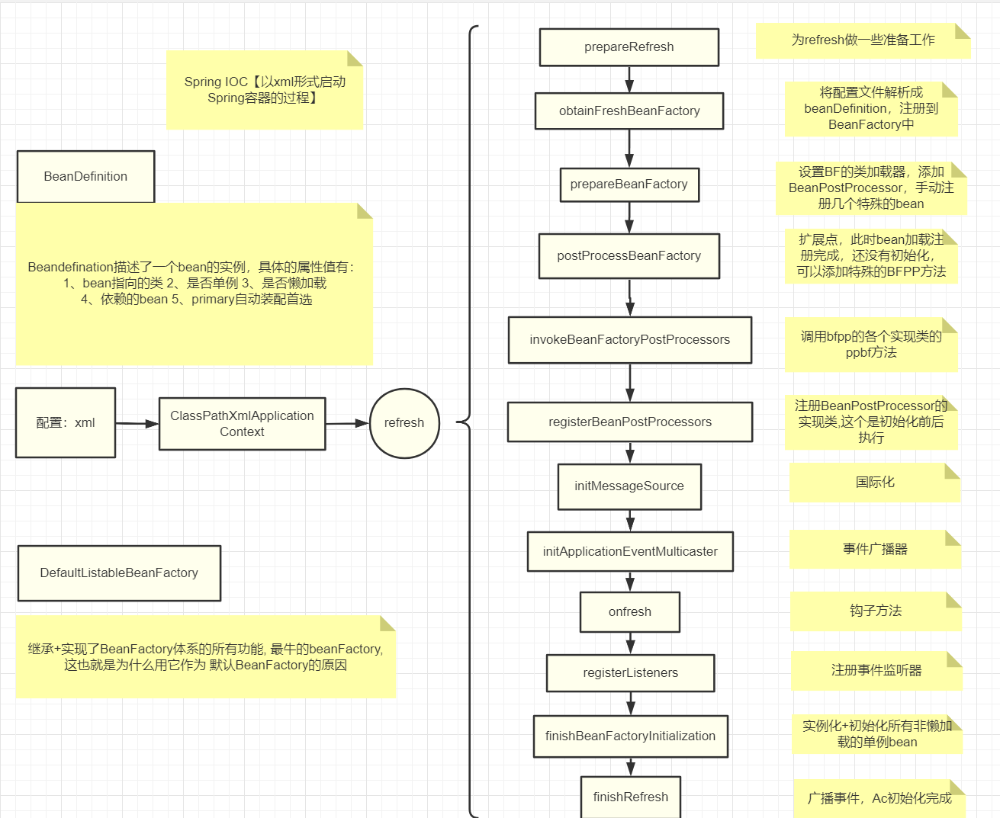

[toc]

# Bean是线程安全的吗？

Spring中的bean是单例的，默认是 `@Scope("Singleton")`

不是线程安全的，成员变量需要考虑线程安全问题。无状态的变量没有线程安全问题。

# 什么是AOP

面向切面编程，用于和那些业务无关，但却对多个对象产生影响的公共行为和逻辑，抽取并封装为一个可重用的模块。

这个模块就是切面aspect，减少系统的重复代码，降低了模块间的耦合度，同时提高系统可维护性。

场景：记录操作日志，缓存处理

@Aspect， @Pointcut定义切点表达式 

# Spring中的事务是如何实现的？

支持编程式事务管理和声明式事务管理

编程式事务管理：使用TransactionTemplate实现，对业务代码具有侵入性

声明式事务管理是基于AOP的实现的

# Spring事务失效的场景有哪些？

## 异常捕获处理

问题：事务通知只有捕捉到了目标抛出的异常，才能进行后续的回滚处理，如果目标自己处理掉异常，事务通知无法知悉

解决：catch块里面把异常抛出来`throw new RuntimeException(e)`

## 抛出检查异常

问题：Spring默认只会回滚非检查异常

解决：配置rollbackFor属性，`@Transactional(rollbackFor=Exception.class)`

## 非public方法

问题：Spring为方法创建代理、添加事务通知、前提条件方法是public的

解决：加上public即可

## final、static修饰的方法

问题：aop创建代理，在代理类中实现事务功能，final方法无法被重写

解决：去掉final和static

## 没有被Spring管理

问题：类没有被Spring管理，自然不会生效 

解决：@Component

## 表不支持事务

问题：有些存储引擎不支持事务，比如myisam

解决：找支持的

## 方法内部调用

问题：A方法调用了@Transactional注解的B方法，没有用到代理对象

解决：1. 内部调用改为外部调用  2使用编程式事务  3使用AopContext.currentProxy得到代理

# Spring事务传播机制


# IOC

控制反转，将创建对象的控制权交给spring框架。

1. 实现对象的统一管理和配置：通过xml配置或java config或注解配置，beanfactory创建对象并存至容器中。
2. 降低两个对象之间耦合度：通过xml文件||@Autowired注入对象，依赖注入，即使注入对象的构造方法发生改变，使用方也无需进行修改。

 **IoC 容器就像是一个工厂一样，当我们需要创建一个对象的时候，只需要配置好配置文件/注解即可，完全不用考虑对象是如何被创建出来的。**


# Spring容器的启动全流程



# AOP的作用及底层实现

**原理: 基于动态代理**

1. JDK Proxy 生成 代理对象 = 被代理接口的实例
2. CGlib【字节码】 生成 代理对象 = 被代理类的子类实例

AOP 将 【事务处理、日志管理、权限控制等 】业务模块共同调用的非业务代码封装起来，从而减少系统重复代码，降低模块间的耦合度，使得代码更具有拓展性。

**源码解析**

> 以@AspectJ注解方式为例

- 首先，依据`<aop:aspectj-autoproxy>`或`@EnableAspectJAutoProxy`，Spring会在容器启动的时候注册名叫`internalAutoProxyCreator`的`AnnotationAwareAspectJAutoProxyCreator `。
- 在bean实例化完成，属性装配完成之后，开始执行回调方法，这时取出所有的BeanPostProcessor，执行其postProcessAfterInitialization方法，准备开始对目标对象代理的创建。
- 首先创建一个代理工厂ProxyFactory，设置一系列的属性，如所有的通知方法，增强器，拦截器和目标类等注入代理工厂，再调用ProxyFactory.getProxy(classLoader)获取代理。
- 通过判断是用JDK动态代理还是CGLIB创建不同的AopProxy，最后获取getProxy。


# jdk和cglib区别

**实现原理**

**1、JDK动态代理具体实现原理：**

- 通过实现InvocationHandlet接口创建自己的调用处理器；
- 通过为Proxy类指定ClassLoader对象和一组interface来创建动态代理；
- 通过反射机制获取动态代理类的构造函数，其唯一参数类型就是调用处理器接口类型；
- 通过构造函数创建动态代理类实例，构造时调用处理器对象作为参数参入；

JDK动态代理是面向接口的代理模式，如果被代理目标没有接口那么Spring也无能为力，Spring通过Java的反射机制生产被代理接口的新的匿名实现类，重写了其中AOP的增强方法。

**2、CGLib动态代理：**

CGLib是一个强大、高性能的Code生产类库，可以实现运行期动态扩展java类，Spring在运行期间通过 CGlib继承要被动态代理的类，重写父类的方法，实现AOP面向切面编程。

CGLIB库使用**ASM**(一个小型但快速的字节码操作框架)**转换现有的字节码并生成新类**，ASM使用类似SAX的解析器机制来实现高性能。

**效率对比**

[Spring AOP中的JDK和CGLib动态代理哪个效率更高？](https://blog.csdn.net/lisheng19870305/article/details/109680589?utm_medium=distribute.pc_relevant.none-task-blog-baidujs_title-1&spm=1001.2101.3001.4242)

理论上说：

1、CGLib所创建的动态代理对象在实际运行时候的性能要比JDK动态代理高不少，有研究表明，大概要高10倍；

2、但是CGLib在创建对象的时候所花费的时间却比JDK动态代理要多很多，有研究表明，大概有8倍的差距；

3、因此，对于singleton的代理对象或者具有实例池的代理，因为无需频繁的创建代理对象，所以比较适合采用CGLib动态代理，反正，则比较适用JDK动态代理。

> 经过测试：在1.6和1.7的时候，JDK动态代理的速度要比CGLib动态代理的速度要慢，但是并没有教科书上的10倍差距，在JDK1.8的时候，JDK动态代理的速度已经比CGLib动态代理的速度快很多了

# SpringAOP 和AspectJ AOP有什么区别?

spring AOP 基于代理，是 运行时增强。

aspectj AOP基于字节码操作， 编译时增强.

# Controller是单例还是多例，如何保证并发安全？

Controller默认是单例的，如果使用非静态的成员变量，可能会发生数据逻辑混乱，解决并发安全问题有如下几种方法 ：

- 尽量不要在controller中定义成员变量。
- 非要定义非静态成员变量，可以通过`@Scope("prototype")`，设置为原型模式。
- 使用ThreadLocal变量。

# SpringBean的作用域

- `singleton`：单例模式，Spring中的bean默认是单例的，当Spring创建ApplicationContext的时候，会初始化所有的单例非懒加载的实例，存入单例的缓存池中。
- `prototype`：原型模式，每次getBean的时候，会得到一个全新的实例，创建之后Spring不再对其进行管理。
- `request`：每次请求都新产生一个实例，与原型不同的是，创建之后，Spring会监听它。
- `session`：每次会话都新产生一个实例，与原型不同的是，创建之后，Spring会监听它。
- `global session`：全局的web域，类似于Servlet中的Application。

# Bean 的生命周期


在了解Bean的生命周期之前，我们必须要明确SpringBean和我们通常说的对象有什么区别？

> SpringBean是**由SpringIoC容器管理**的，是一个**被实例化，组装，并通过容器管理的对象**，可通过getBean()获取。**容器通过读取配置的元数据，解析成BeanDefinition，注册到BeanFactory中，加入到singletonObjects缓存池中**。


# BeanFactory和FactoryBean的区别

**BeanFactory**

BeanFactory是SpringBean的容器顶级接口，**为容器定义了一套规范**，如getBean方法等。实现类包括：Spring默认的工厂类DefaultListableBeanFactory，ClassPathXmlApplicationContext上下文。

**FactoryBean**

该类是SpringIOC容器是**创建Bean的一种形式**，这种方式创建Bean会有加成方式，融合了简单的工厂设计模式于装饰器模式， 定义方法如：getObject()等。

在传统bean创建复杂的时候，可以将复杂的初始化过程包装，让调用者无需关心具体实现细节。

# 什么是循环依赖

可能会出现死循环的问题


# Spring可以解决循环依赖的条件

一、出现循环依赖的Bean**必须是**单例，原型不行。

二、**不全是**构造器注入的方式。

- 均采用setter方法注入，可以被解决。
- 全是构造器注入，无法被解决。
- setter和构造器都存在，具体情况具体分析，Spring会按照AB的顺序选择新创建哪个。

| 依赖情况               | 依赖注入方式                                       | 循环依赖是否被解决 |
| :--------------------- | :------------------------------------------------- | :----------------- |
| AB相互依赖（循环依赖） | 均采用setter方法注入                               | 是                 |
| AB相互依赖（循环依赖） | 均采用构造器注入                                   | 否                 |
| AB相互依赖（循环依赖） | A中注入B的方式为setter方法，B中注入A的方式为构造器 | 是                 |
| AB相互依赖（循环依赖） | B中注入A的方式为setter方法，A中注入B的方式为构造器 | 否                 |

Spring通过三级缓存解决了循环依赖：

- `singletonObjects`：一级缓存，一个单例bean【实例化+初始化】都完成之后，将会加入一级缓存，也就是我们俗称的单例池。
- `earlySingletonObjects`：二级缓存，用于存放【实例化完成，还没初始化】的实例，提前暴露，用于解决循环依赖问题。
- `singletonFactories`：三级缓存，存放单例对象工厂ObjectFactory，与二级缓存不同的是，它可以应对产生代理对象。

Spring不能够解决先用构造器注入情况的循环依赖，原因在于Spring解决循环依赖的关键在于bean实例实例化完成，初始化之前的状态，将其加入三级缓存，提前暴露bean。

# Spring解决循环依赖的流程


> 本质其实就是 让A注入B，B注入A ，B先注入的是一个还没初始化就提前用的A 的引用。【这里不考虑AOP】

以开头的A，B为例，假设他们都使用属性字段注入：

1. A首先getBean，试图获取容器中单例A，第一次容器中还不存在，于是就需要开始创建A。
2. 一顿操作，落点：**A此时已经被实例化完成，但是还没有初始化**，紧接着将A与一个ObjectFactory存入三级缓存 。**如果A被AOP代理，通过这个工厂获取到的就是A代理后的对象，如果没有代理，工厂最后获取到的就是A 的实例化对象。**
3. 初始化A，意为A的属性赋值，这时发现B需要注入，于是getBean，来一遍相同的步骤。
4. 一顿操作，落点：B此时已经被实例化完成，但是还没有初始化，紧接着将B与一个ObjectFactory存入三级缓存 。
5. 初始化B，发现需要注入A，于是getBean("a")，此时它在三级缓存中找到了A与`ObjectFactory<?> singletonFactory`，通过`singletonFactory.getObject();`得到A的引用。并将其存入二级缓存，且从三级缓存移除 。
6. B注入从对象工厂获得的A的引用，此时B已经初始化完成【代表已经注入A成功，其实是拥有了A的引用】，**将B加入到一级缓存，并将B在二级缓存、三级缓存中的玩意清除**，返回。
7. 刚刚是A初始化到一半切出来开始实例化B的，那么接下来也应该返回到A的初始化流程中去。
8. 显然B都已经初始化完毕了，A当然也顺利地初始化成功了，同样，也将A加入一级缓存中，并将A在二级缓存、三级缓存中清除。

9. 至此，Spring解决循环依赖结束，A与B都已实例化+初始化完成，并存入一级缓存，且二级缓存、三级缓存中已经没有了A和B。

> 当然了，这个过程其实是在实例化A的时候，把B一并实例化了，于是在遍历BeanNames实例化B的时候，就不需要进行这么复杂的操作了，因为一级缓存中已经存在B了。

## Spring的事务传播级别

```
支持当前事务的情况：

TransactionDefinition.PROPAGATION_REQUIRED： 如果当前存在事务，则加入该事务；如果当前没有事务，则创建一个新的事务。
TransactionDefinition.PROPAGATION_SUPPORTS： 如果当前存在事务，则加入该事务；如果当前没有事务，则以非事务的方式继续运行。
TransactionDefinition.PROPAGATION_MANDATORY： 如果当前存在事务，则加入该事务；如果当前没有事务，则抛出异常。（mandatory：强制性）
不支持当前事务的情况： 

TransactionDefinition.PROPAGATION_REQUIRES_NEW： 创建一个新的事务，如果当前存在事务，则把当前事务挂起。
TransactionDefinition.PROPAGATION_NOT_SUPPORTED： 以非事务方式运行，如果当前存在事务，则把当前事务挂起。
TransactionDefinition.PROPAGATION_NEVER： 以非事务方式运行，如果当前存在事务，则抛出异常
```

# Spring用到了哪些设计模式

工厂模式 beanfactory

原型模式 prototype bean

单例模式 singleton bean

构造器模式 beandefinitionbuilder

适配器模式 adapter

访问者模式 property accessor

装饰器模式 bean wrapper

代理模式 aop

观察者模式 application listener

策略模式 strategy

模版方法模式 abstractpplicationcontent

责任链模式 chainfactory

# 常用的注解

## Spring常用注解


## SpringMVC常用注解


## SpringBoot常用注解


