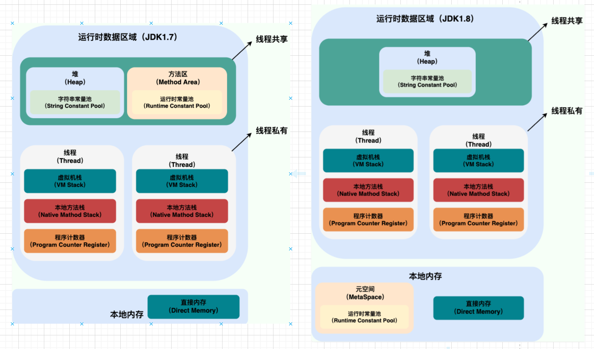
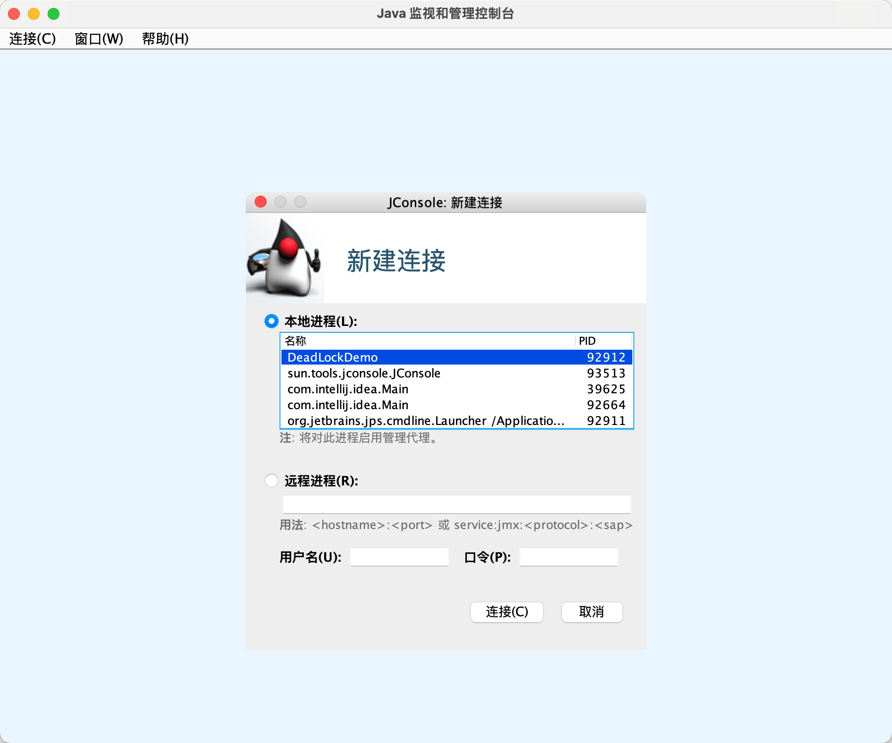
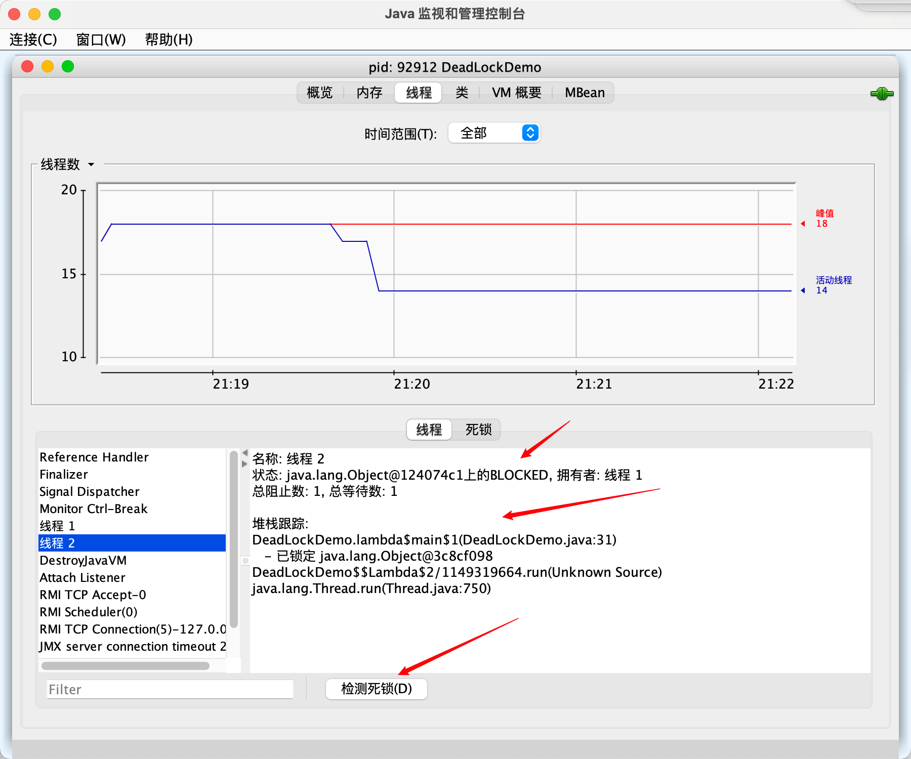

[toc]

# 进程和线程？

> 答：进程是程序的一次执行过程，是系统运行程序的基本单位，系统运行一个程序就是一个进程从创建、运行到消亡的过程。（Java启动main函数就是启动了一个jvm进程）（这里可以引出jvm）
>
> 线程是比进程更小的单位，也叫做轻量级进程，Java中支持多线程，main函数所在线程就是进程主线程（这里可以引出，多线程的优势：利用多核，劣势：上下文切换（什么是上下文切换），线程比进程切换开销小）线程安全（怎么保证正确通信）。
>
> 可以从jvm角度说一下，一个进程中的多个线程共享 堆和方法区（最大的一块内存，存放一些公共的：加载的类信息、常量、静态变量），同时各个线程也有自己的小空间（虚拟机栈、本地方法栈保证局部变量不被看到，程序计数器线程能够正确切换）
>
> 可以引出协程，https://zhuanlan.zhihu.com/p/172471249
>
> 协程运行在线程之上，当一个协程执行完成后，可以选择主动让出，让另一个协程运行在当前线程之上。**协程并没有增加线程数量，只是在线程的基础之上通过分时复用的方式运行多个协程**，而且协程的切换在用户态完成，切换的代价比线程从用户态到内核态的代价小很多。

## 进程？

- 进程是程序的一次执行过程，是**系统运行程序的基本单位**，进程是动态的。
- 系统运行一个程序就是一个进程从创建，运行到消亡的过程。

Java中，**启动main函数的时候其实就是启动了一个JVM进程**，而main函数所在的线程就是这个进程的主线程。

## 线程？

线程是一个比进程**更小**的执行单位。

一个进程在其执行过程中产生多个线程，**同类的多线程共享进程的堆和方法区资源**，每个线程有自己的程序计数器，虚拟机栈和本地方法栈。

**系统在产生一个线程，或是各个线程之间切换工作时，负担比进程小得多**，因此线程也被称为轻量级进程。

Java程序天生就是多线程程序，可以通过JMX查看一下：

```java
public class Main {

    public static void main(String[] args) {
        // 获取 Java 线程管理 MXBean
        ThreadMXBean threadMXBean = ManagementFactory.getThreadMXBean();
        // 不需要获取同步的 monitor 和 synchronizer 信息，仅获取线程和线程堆栈信息
        ThreadInfo[] threadInfos = threadMXBean.dumpAllThreads(false,false);
        // 遍历线程信息，仅打印线程 ID 和线程名称信息 和 线程状态
        for (ThreadInfo threadInfo : threadInfos) {
            System.out.println("[" + threadInfo.getThreadId() + "]" + threadInfo.getThreadName() + "->" + threadInfo.getThreadState());
        }
    }
    
}
```

输出结果如下：

```java
[6]Monitor Ctrl-Break->RUNNABLE //这是IDEA特有的监控线程
[5]Attach Listener->RUNNABLE //添加事件
[4]Signal Dispatcher->RUNNABLE  // 分发处理给 JVM 信号的线程
[3]Finalizer->WAITING    //清除 reference 线程
[2]Reference Handler->WAITING  //清除 reference 线程
[1]main->RUNNABLE //main线程，程序入口
```

> 一个Java程序得运行是main线程和多个线程同时运行。

# 并发与并行？

> 答：并行时并排跑，并发是快速交替跑（非常快）

- **并发：** 同一时间段，多个任务都在执行 (单位时间内不一定同时执行)；
- **并行：** 单位时间内，多个任务同时执行。

# 从JVM 的角度谈谈进程与线程的关系

> 一个进程可以有多个线程，多个线程共享进程的**堆和方法区（共享共用：类信息、常量、静态变量）**【JDK1.8之后的元空间（元空间不受限于java堆的大小）】的资源，但是每个线程又拥有自己**独立的程序计数器（确保线程切换后能回到正确位置）、虚拟机栈和本地方法栈（确保线程中的局部变量不被其他访问）**。



可以得出：

- 线程是进程划分成的更小的运行单位，线程和进程最大的不同在于基本上各进程是独立的，但是各线程不一定，同一进程中的线程极有可能会相互影响。
- 线程执行的开销较小，但不利于资源的管理和保护，而进程恰好相反。

## 为什么程序计数器是私有的？

程序计数器的作用：

- 字节码解释器通过改变程序计数器来依次读取指令，从而实现代码的流程控制，如：顺序执行、选择、循环、异常处理。
- 在多线程的情况下，程序计数器用于记录当前线程执行的位置，从而**当线程被切换回来的时候能够知道该线程上次运行到哪儿了**。

> 需要注意的是，如果执行的是 native 方法，那么程序计数器记录的是 undefined 地址，只有执行的是 Java 代码时程序计数器记录的才是下一条指令的地址。

总结：<u>程序计数器私有主要是为了**线程切换后能恢复到正确的执行位置**。</u>

## 为什么虚拟机栈和本地方法栈是私有的？

- **虚拟机栈：** 每个 Java 方法在执行的同时会创建一个栈帧用于存储局部变量表、操作数栈、常量池引用等信息。从方法调用直至执行完成的过程，就对应着一个栈帧在 Java 虚拟机栈中入栈和出栈的过程。
- **本地方法栈：** 和虚拟机栈所发挥的作用非常相似，区别是： **虚拟机栈为虚拟机执行 Java 方法 （也就是字节码）服务，而本地方法栈则为虚拟机使用到的 Native 方法服务。** 在 HotSpot 虚拟机中和 Java 虚拟机栈合二为一。

总结：<u>虚拟机栈和本地方法栈私有是为了**保证线程中的局部变量不被别的线程访问到**。</u>

## 一句话简单了解堆和方法区

堆和方法区是所有线程共享的资源，其中堆是进程中最大的一块内存，主要用于存放新创建的对象【几乎所有对象都在这里分配内存】，方法区主要用于存放已被加载的类信息、常量、静态变量、即使编译器编译后的代码等数据。

# 为什么使用多线程呢？多线程有啥用？

> 答：单核情况下：提高cpu和io的综合利用率（100-0，0-100 -》50 50 ），多核时代：提高cpu的利用率，总结是：大大提高并发能力，而且线程之间切换成本比进程小，但是需要考虑一些问题，这里可以引出，多线程编程中会引发的问题（比如死锁、怎么同步等等）

从**总体**上来说：

- 从计算机底层来说：线程可以比作是轻量级的进程，是程序执行的最小单位,**线程间的切换和调度的成本远远小于进程**。另外，**多核 CPU 时代意味着多个线程可以同时运行**，这减少了线程上下文切换的开销。

- 从当代互联网发展趋势来说：现在的系统动不动就要求百万级甚至千万级的并发量，而多线程并发编程正是开发高并发系统的基础，利用好多线程机制可以**大大提高系统整体的并发能力以及性能**。

深入到计算机底层来探讨：

- 单核时代：在单核时代多线程主要是为了提高 CPU 和 IO 设备的综合利用率。

  - > 当只有一个线程的时候会导致 CPU 计算时，IO 设备空闲；进行 IO 操作时，CPU 空闲。我们可以简单地说这两者的利用率目前都是 50%左右。但是当有两个线程的时候就不一样了，当一个线程执行 CPU 计算时，另外一个线程可以进行 IO 操作，这样两个的利用率就可以在理想情况下达到 100%了。

- 多核时代：多核时代多线程主要是为了提高 CPU 利用率。

  - > 假如我们要计算一个复杂的任务，我们只用一个线程的话，CPU 只会一个 CPU 核心被利用到，而创建多个线程就可以让多个 CPU 核心被利用到，这样就提高了 CPU 的利用率。

# 多线程带来哪些问题呢？死锁+线程安全+内存泄漏

> 答：导致线程不安全、死锁（是什么？为什么？怎么办）、内存泄漏等问题。
>
> 每个解释一下：

- 内存泄漏：对象回收不掉（这里可以引出 可达性分析、垃圾回收机制），怎么排查dump，MAT文件查看对象引用数量，及时释放对象

- 死锁：

  - 是什么：A和B都吃着自己碗里的，想着对面锅里的，导致线程被阻塞（这里线程的状态）

  - 为什么：（死锁的四个必要条件）

    - 互斥条件：该资源任意一个时刻只由一个线程占用。
    - 请求与保持条件：一个线程因请求资源而阻塞时，对已获得的资源保持不放。
    - 不剥夺条件：线程已获得的资源在未使用完之前不能被其他线程强行剥夺，只有自己使用完毕后才释放资源。
    - 循环等待条件:若干线程之间形成一种头尾相接的循环等待资源关系。

  - 怎么办：怎么检测？怎么避免？

    - 怎么检测：`open . /Library/Java/JavaVirtualMachines/jdk1.8.0_321.jdk/Contents/Home/bin` 打开jconsole 或者 jps+jstack

      

      

    - 怎么避免：破坏必要条件

      - **破坏请求与保持条件**：一次性申请所有的资源
      - **破坏不剥夺条件**：占用部分资源的线程进一步申请其他资源时，如果申请不到，可以主动释放它占有的资源
      - **破坏循环等待条件**：靠按序申请资源来预防。按某一顺序申请资源，释放资源则反序释放。破坏循环等待条件

- 线程不安全：多线程环境下对于同一份数据的访问是否能够保证其正确性和**一致性**的描述。一致性！（这里可以考虑一下分布式环境场景下的一致性）

  - 一定安全的情况：不可变对象（final修饰、String、枚举、包装类）、安全类（CopyOnWriteArrayList）部分安全的（vector、hashtable等会有fail-fast一边遍历一边add并不是绝对线程安全）
  - 不安全的情况：那就要保证同步：互斥同步（阻塞同步） or 非阻塞同步，互斥同步保证：共享数据在同一时刻只被一个线程使用。比如： 加锁 （内置的syn 和 api层面的lock锁）


# 怎么保证线程安全

# 线程的生命周期和状态？

> 答：六种状态：new刚创建、runnable调用start、blocked等待同步锁、waiting排队、timed-waiting指定时间的排队、terminated终止

## 六种状态

| 线程状态      | 解释                                                         |
| ------------- | ------------------------------------------------------------ |
| NEW           | 尚未启动的线程状态，即线程创建，**还未调用start方法**        |
| RUNNABLE      | **就绪状态**（调用start，等待调度）+**正在运行**             |
| BLOCKED       | **等待监视器锁**时，陷入阻塞状态                             |
| WAITING       | 等待状态的线程正在**等待**另一线程执行特定的操作（如notify） |
| TIMED_WAITING | 具有**指定等待时间**的等待状态                               |
| TERMINATED    | 线程完成执行，**终止状态**                                   |

## 状态切换


> 注意：join方法是Thread类下的方法，图里写成了Object，应改为`Thread.join`。

线程创建之后它将处于 **NEW（新建）** 状态，调用 `start()` 方法后开始运行，线程这时候处于 **READY（可运行）** 状态。可运行状态的线程获得了 CPU 时间片（timeslice）后就处于 **RUNNING（运行）** 状态。

当线程执行 `wait()`方法之后，线程进入 **WAITING（等待）** 状态。进入等待状态的线程需要依靠其他线程的通知才能够返回到运行状态，而 **TIME_WAITING(超时等待)** 状态相当于在等待状态的基础上增加了超时限制，比如通过 `sleep（long millis）`方法或 `wait（long millis）`方法可以将 Java 线程置于 TIMED WAITING 状态。当超时时间到达后 Java 线程将会返回到 RUNNABLE 状态。当线程调用同步方法时，在没有获取到锁的情况下，线程将会进入到 **BLOCKED（阻塞）** 状态。线程在执行 Runnable 的`run()`方法之后将会进入到 **TERMINATED（终止）** 状态。

# （！）怎么保证线程正确通信

加锁：synchronized实现互斥（这里可以引出synchronized的原理，jvm对于方法或代码块的实现基于monitor对象的进入enter和退出exit操作， 三个修饰的地方（实例、静态方法、代码块）、分级锁机制优化、偏向锁避免统一线程用户态和内核态频繁切换 -> 加重竞争编程轻量级锁结合自旋 -> 继续加重升级为重量级锁， 优化方法：减少锁粒度，降低竞争、减少锁的持有时间避免变重量级）

volatile拥有比锁更轻量级的通信机制（JMM内存模型（主内存共享变量、本地内存有共享变量的副本）， 并发三特性（只能保证有序（禁止指令重排）和可见性（要求所有对v修饰变量的访问都要从共享内存中获取，对它的修改必须同步刷新回内存）， 无法保证原子性（多线程i++会有问题，建议加锁or使用JUC下面的Atomicinteger使用cas来实现原子操作（引出cas（预期值和当前值比较，相同则改为新值），ABA问题，A拿到B操作后改回A以为没变，如何解决：），双重检查锁实现单例）

等待通知：生产者消费者模型

lock+condition可以实现synchronized一样的操作（这里涉及到了AQS， 知道原理和使用 lock = new lock(), cond = lock.newCondition(), signal, await, signalAll， 是否公平（等待时间最长的线程优先获得锁），是否等待可中断， 分析和synchronized的区别）

管道通信：输入输出流

Thread.join()（注意和wait的区别）

ThreadLocal的原理、使用（身份信息、会话信息）：线程局部变量数据隔离，每个线程可以独立改变自己的副本（其实mybatis的分页插件有用到）、内存泄漏问题（ThreadLocalMap中的存储实体Entry使用ThreadLocal作为key，但这个Entry继承弱引用WeakReference）弱引用：通过WeakReference实现，弱引用的生命周期很短，只要垃圾回收机制运行，不管JVM的内存空间是否足够，总会回收该对象占用的内存

`ThreadLocalMap`使用`ThreadLocal`的弱引用作为`key`，如果一个`ThreadLocal`没有外部强引用来引用它，那么系统 GC 的时候，这个`ThreadLocal`势必会被回收，这样一来，`ThreadLocalMap`中就会出现`key`为`null`的`Entry`，就没有办法访问这些`key`为`null`的`Entry`的`value`。

如果当前线程再迟迟不结束的话，这些`key`为`null`的`Entry`的`value`就会一直存在一条强引用链：`Thread Ref -> Thread -> ThreaLocalMap -> Entry -> value` 永远无法回收，造成内存泄漏。

# 什么是上下文切换？

> 答：当前任务在执行完 CPU 时间片切换到另一个任务之前会先保存自己的状态，以便下次再切换回这个任务时，可以再加载这个任务的状态。**任务从保存到再加载的过程就是一次上下文切换**。（为什么linux上下文切换和模式切换的时间少呢？）

多线程编程中一般线程的个数都大于 CPU 核心的个数，而**一个 CPU 核心在任意时刻只能被一个线程使用**，为了让这些线程都能得到有效执行，CPU 采取的策略是为每个线程分配时间片并轮转的形式。当一个线程的时间片用完的时候就会重新处于就绪状态让给其他线程使用，这个过程就属于一次上下文切换。

概括来说就是：当前任务在执行完 CPU 时间片切换到另一个任务之前会先保存自己的状态，以便下次再切换回这个任务时，可以再加载这个任务的状态。**任务从保存到再加载的过程就是一次上下文切换**。

**上下文切换通常是计算密集型的**。也就是说，它需要相当可观的处理器时间，在每秒几十上百次的切换中，每次切换都需要纳秒量级的时间。所以，上下文切换对系统来说意味着消耗大量的 CPU 时间，事实上，可能是操作系统中时间消耗最大的操作。

Linux 相比与其他操作系统（包括其他类 Unix 系统）有很多的优点，其中有一项就是，其上下文切换和模式切换的时间消耗非常少。

# 说说sleep()方法和wait()方法区别 

- 两个最主要的区别在于：sleep方法没有释放锁，而wait()方法释放了锁。
- 两者都可以暂停线程的执行。
- wait通常被用于线程间交互/通信，sleep通常被用于暂停执行。
- wait() 方法被调用后，线程不会自动苏醒，需要别的线程调用同一个对象上的 notify() 或者 notifyAll() 方法。sleep() 方法执行完成后，线程会自动苏醒。或者可以使用 wait(long timeout)超时后线程会自动苏醒。

# start() 方法和 run() 方法

new 一个 Thread，线程进入了新建状态;调用 start() 方法，会启动一个线程并使线程进入了就绪状态，当分配到时间片后就可以开始运行了。 start() 会执行线程的相应准备工作，然后自动执行 run() 方法的内容，这是真正的多线程工作。 而直接执行 run() 方法，会把 run 方法当成一个 main 线程下的普通方法去执行，并不会在某个线程中执行它，所以这并不是多线程工作。

**总结： 调用 start 方法方可启动线程并使线程进入就绪状态，而 run 方法只是 thread 的一个普通方法调用，还是在主线程里执行。**

# 并发编程三大特性

## 原子性

一个操作或者多次操作，要么所有的操作全部都得到执行并且不会受到任何因素的干扰而中断，**要么所有的操作都执行，要么都不执行**。

对于基本数据类型的访问，读写都是原子性的【long和double可能例外】。

如果需要更大范围的原子性保证，可以使用synchronized关键字满足。

## 可见性

当一个变量对共享变量进行了修改，**另外的线程都能立即看到修改后的最新值**。

`volatile`保证共享变量可见性，除此之外，`synchronized`和`final`都可以 实现可见性。

`synchronized`：对一个变量执行unclock之前，必须先把此变量同步回主内存中。

`final`：被final修饰的字段在构造器中一旦被初始化完成，并且构造器没有把this的引用传递出去，其他线程中就能够看见final字段的值。

## 有序性

即程序执行的顺序按照代码的先后顺序执行【由于**指令重排序**的存在，Java 在编译器以及运行期间对输入代码进行优化，代码的执行顺序未必就是编写代码时候的顺序】，`volatile`通过禁止指令重排序保证有序性，除此之外，`synchronized`关键字也可以保证有序性，由【一个变量在同一时刻只允许一条线程对其进行lock操作】这条规则获得。

# 参考

- 《Java并发编程的艺术》
- [https://snailclimb.gitee.io/javaguide/#/docs/java/Multithread/JavaConcurrencyBasicsCommonInterviewQuestionsSummary](https://snailclimb.gitee.io/javaguide/#/docs/java/Multithread/JavaConcurrencyBasicsCommonInterviewQuestionsSummary?id=java-并发面试题大全%e6%80%bb%e7%bb%93)