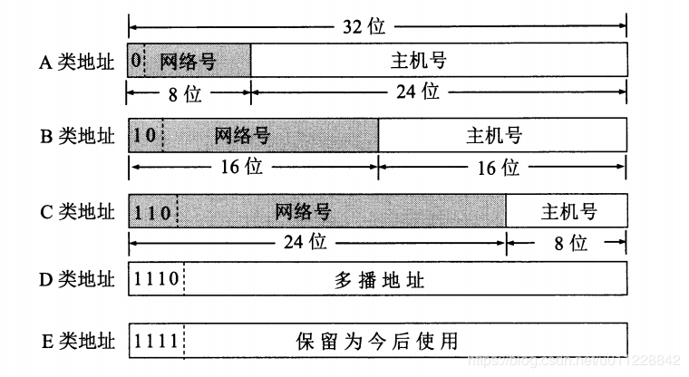

# IP协议

网络层：实现终端节点之间的通信。（点对点通信）

网络层可以跨越不同的数据链路，实现两端节点之间的数据包的传输，而数据链路层只负责某一个区间之间的通信传输吧。

# 主机与路由器的不同

主机：配置有IP地址，但不进行路由控制。

路由器：既配有IP地址，还可以进行路由控制。

# IP的三大作用模块

**一、IP地址寻址**

IP地址用于在连接到网络中的所有主机中识别出进行通信的目标地址，因此，连接互联网的主机需要配置IP地址。

其他细节：

1. 不论主机和哪种数据链路（以太网、无线局域网等）连接，IP地址的形式都保持不变。

2. 在网桥或交换集线器等物理层或数据链路层数据包转发设备中，不需要设置IP地址。

**二、路由控制**

路由控制就是**将分组数据发送到最终目标地址**的功能。

网络中的一个区间称为跳（hop），因此，IP路由也被称为多跳路由，**每个区间决定包在下一跳被转发的路径**。

每个主机都维护者一张**路由控制表**，记录着IP数据在下一步应该发给哪个路由器。

**三、IP分包与组包**

IP的下层是数据链路层，各种不同的数据链路存在差异，IP的职责就是将有差异处抽象化，意思是，不管你底层用的是哪种数据链路，对IP的上一层来说都是一样的。

数据链路层一个比较大的特点：各数据链路的最大传输单位（MTU）不同。

针对此，IP进行了分片处理，即将较大的IP包分成多个较小的IP包，从而实现对MTU的抽象化。

# IP属于面向无连接型

在发包之前不需要建立与对端目标地址之间的连接。

采用面向无连接型的原因（**优点**）：

1. 简化。不需要管理每个连接。
2. 提速。不需要每次先建立连接。

**缺点：**发送数据的时机不确定，如果没有做好接收的准备，可能会错过一些包，导致产生许多冗余的通信。

# IP地址的定义

IPv4：32位二进制，8位为1组，分为4组，以`.`隔开，便于记忆，将二进制转化为十进制，IPv4最多有2的32次方，也就是约43亿IP地址。

如：`11000000.10101000.11010110.00000001`->`192.168.214.1`

- 一台主机至少可以配置一个以上IP地址。
- 一块网卡一般只设置一个IP地址，当然也可以设置很多。
- 一台路由器往往配置两个以上的网卡，也就是两个以上IP。

# IP地址 = 网络地址+主机地址

`192.168.214.1/24`

- 数据链路的段与段之间的网络地址值不同。
- 同一段中的主机网络地址相同。
- 同一段中的的主机地址不能相同。

整个网络中，每台主机的IP地址不会相互重叠，保证了IP地址的唯一性。

# IP地址的四种分类

根据IP地址从第1位到第4位的比特列对其网络地址和主机地址进行区分。

| 地址类别 | 前几位特点   | 网络标识 | 主机标识       | 十进制                     |
| -------- | ------------ | -------- | -------------- | -------------------------- |
| A类地址  | 首位为0      | 1到8位   | 后24位         | 0.0.0.0到127.0.0.0         |
| B类地址  | 前两位为10   | 1到16位  | 后16位         | 128.0.0.0到191.255.0.0     |
| C类地址  | 前三位为110  | 1到24位  | 后8位          | 192.0.0.0到239.255.255.0   |
| D类地址  | 前四位为1110 | 1到32位  | 无（用于多播） | 224.0.0.0到239.255.255.255 |

# 广播与多播

一、广播：用于**在同一个链路中相互连接的主机之间发送数据包**。

IP地址的主机地址部分全部设置为1，就变成了广播地址。

例：172.20.0.0/16 改为广播地址：172.20.255.255

分为两类：

1. 本地广播：本网络内的广播

2. 直接广播：不同网络之间的广播。

二、多播：用于将包发送给**特定组**内的所有主机。

相对于广播来说的优势：既可以穿透路由，又可以实现只给特定的组发送数据包。而广播既不能穿透路由，而且广播会将数据发送给所有的终端主机，造成网络上不必要的流量。

**多播地址**：使用D类地址，前四位为`1110`，后28位为多播的组编号。`224.0.0.0-239.255.255.255`都是多播地址的可用范围，其中`224.0.0.0-224.0.0.255`的范围不需要路由控制，在同一链路内也能实现多播。

