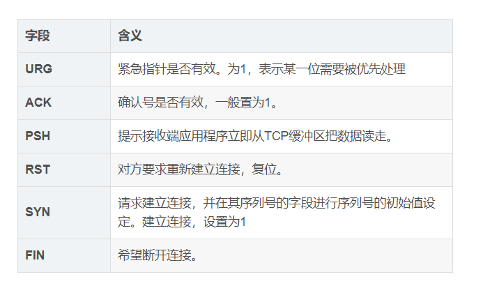

[toc]

# TCP报文结构

**源端口和目的端口**：唯一确定一条TCP连接，TCP在发送数据前必须在彼此间建立连接，意思是：双方需要保存对方的信息。

**序列号seq**：占4个字节，用于标记数据段的顺序，TCP把连接中发送的所有数据字节都编上一个序号，第一个字节的编号由本地随机产生，给字节编上序号后，就给每一个报文段指派一个序号；**序列号seq就是这个报文段中的第一个字节的数据编号**，确保TCP传输有序。

**确认号ack**：占4个字节，**期待收到对方下一个报文段的第一个数据字节的序号**；序列号表示报文段携带数据的第一个字节的编号；而确认号指的是期望接收到下一个字节的编号；因此**当前报文段最后一个字节的编号+1即为确认号**。

**确认ACK**：占1位，**仅当ACK=1时，确认号字段才有效**。ACK=0时，确认号无效。

**同步SYN**：连接建立时用于**同步序号**。当SYN=1，ACK=0时表示：这是一个连接请求报文段。若同意连接，则在响应报文段中使得SYN=1，ACK=1。因此，SYN=1表示这是一个连接请求，或连接接受报文。**SYN这个标志位只有在TCP建产连接时才会被置1，握手完成后SYN标志位被置0**。

**终止FIN**：用来**释放一个连接**。FIN=1表示：此报文段的发送方的数据已经发送完毕，并要求释放运输连接

**其他标志位的含义**：

# 三次握手

1. 第一次握手：客户端发送初始序号seq = x和SYN=1的请求标志。此时服务器得知客户端发送正常，自己接收正常。
2. 第二次握手：服务器发送请求标志SYN=1,确认标志ACK=1，自己的序号seq=y，发送客户端的确认信号x+1。客户端知道自己发送、接收正常，服务器接收、发送正常。
3. 第三次握手：客户端发送确认信号ACK=1，发送自己的序号seq=x+1，发送对方的确认号ACK=y+1。服务器知道客户端发送、接收正常，自己接收、发送也正常。

# 四次挥手

1. 第一次挥手：客户端发出释放FIN=1，自己序列号seq=u，进入FIN-WAIT-1状态，是客户端的请求断开。

2. 第二次挥手：服务器收到客户端的请求后，发出ACK=1确认标志和客户端的确认号ack=u+1，自己的序列号seq=v，进入CLOSE-WAIT状态，服务器确认客户端的断开请求。

3. 第三次挥手：客户端收到服务器确认结果后，进入FIN-WAIT-2状态。此时服务器发送释放FIN=1信号，确认标志ACK=1，确认序号ack=u+1，自己序号seq=w，服务器进入LAST-ACK（最后确认态），服务器请求断开。

4. 第四次挥手：客户端收到回复后，发送确认ACK=1，ack=w+1，自己的seq=u+1，客户端进入TIME-WAIT（时间等待）。客户端经过2个最长报文段寿命后，客户端CLOSE；服务器收到确认后，立刻进入CLOSE状态，客户端确认服务器断开。

# 其他常见问题

> 一、为什么连接的时候是三次握手，关闭的时候却是四次挥手？

连接时，当服务端收到客户端的SYN连接请求报文后，**可以直接发送SYN+ACK报文**，对应用于同步+应答。

连接关闭时，当服务端收到FIN报文时，也许还有话要说，**并不会立即关闭SOCKET，所以不会立即返回一个FIN，而是先回复一个ACK报文**，告诉客户端自己已经收到了FIN，而只有等服务端把要说的话说完，才能发送FIN，因此需要四步。

> 二、为什么TIME_WAIT状态需要经过2MSL才能返回到CLOSE状态？

我们需要假想**网络传输是不可靠的，有可能最后一个ACK将会丢失**，TIME_WAIT状态可以用来重发可能丢失的ACK报文。在客户端发出最后的ACK回复时，如果服务端没有收到ACK，它将不断重复发送FIN片段，所以客户端不能立即关闭，它必须确认服务端收到了该ACK。

客户端会在发出ACK之后进入TIME_WAIT的状态，并等待两倍的MSL的时间，Maximum Segment Lifetime，片段在网络中的最大生存时间，两倍的MSL就是一个发送和一个回复所需要的最大时间，如果超出该时间，客户端还没有再次收到FIN，那么客户端就会推断ACK已经被成功接收，此时TCP连接结束。

> 三、为什么不能用两次握手进行连接？

三次握手完成了两个重要的功能：

- 双方做好发送数据的**准备**工作。
- 允许双方就**初始序列号**进行协商，这个序列号在握手过程中被发送和确认。

**现在把三次握手改成仅需要两次握手，死锁是可能发生的**。作为例子，考虑计算机S和C之间的通信，假定C给S发送一个连接请求分组，S收到了这个分组，并发 送了确认应答分组。按照两次握手的协定，S认为连接已经成功地建立了，可以开始发送数据分组。可是，C在S的应答分组在传输中被丢失的情况下，将不知道S 是否已准备好，不知道S建立什么样的序列号，C甚至怀疑S是否收到自己的连接请求分组。在这种情况下，C认为连接还未建立成功，将忽略S发来的任何数据分 组，只等待连接确认应答分组。而S在发出的分组超时后，重复发送同样的分组。这样就形成了死锁。

> 四、如果已经建立了连接，但是客户端突然出现故障了怎么办？

TCP还设有一个保活计时器，显然，客户端如果出现故障，服务器不能一直等下去，白白浪费资源。**服务器每收到一次客户端的请求后都会重新复位这个计时器，时间通常是设置为2小时**，若两小时还没有收到客户端的任何数据，服务器就会发送一个探测报文段，以后每隔75秒钟发送一次。若一连发送10个探测报文仍然没反应，服务器就认为客户端出了故障，接着就关闭连接。

参考：

[https://www.cnblogs.com/jainszhang/p/10641728.html](https://www.cnblogs.com/jainszhang/p/10641728.html)

[https://www.cnblogs.com/bj-mr-li/p/11106390.html](https://www.cnblogs.com/bj-mr-li/p/11106390.html)