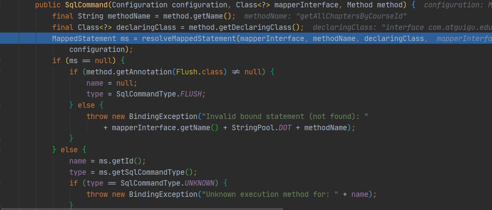
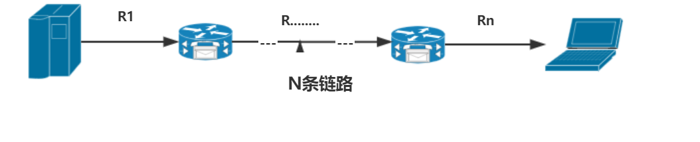
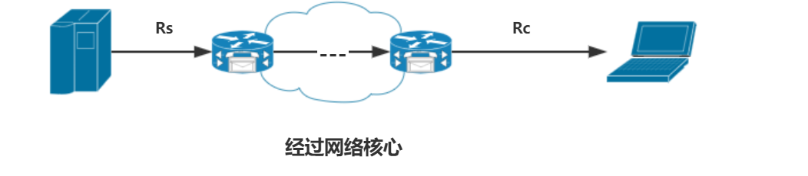
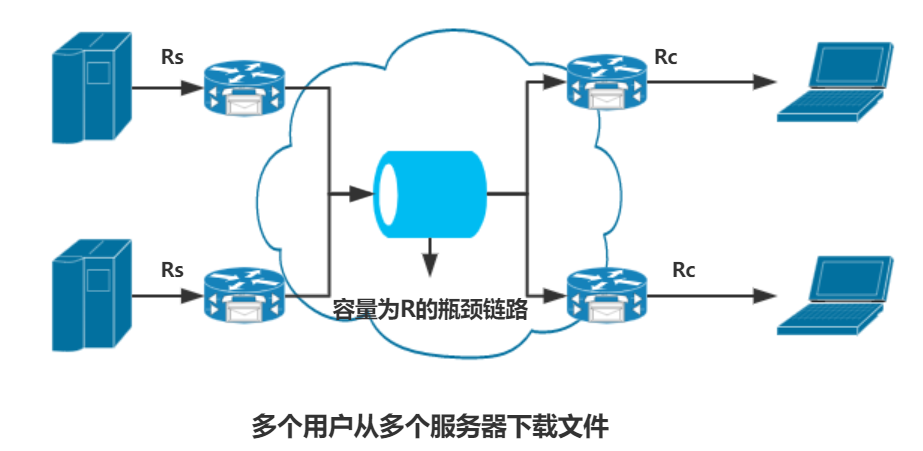

[TOC]

# 分组交换网中的时延、丢包和吞吐量

> 因特网的存在，为运行在端系统上的分布式应用提供了很好的服务。希望能通过因特网在任意两个端系统之间移动数据且不丢失数据，理想很美好，可现实却很难达到。因为，计算机网络中必然会限制端系统之间的吞吐量（每秒能够传送的数据量），在端系统之间引入时延，实际上也会丢失分组，这是难免的。
>
> 由于分组交换凭借其更好的带宽共享服务以及更高效简单的模式，电信网络已经向着分组交换的方向高速发展，所以了解分组交换就显得非常重要，接下来整篇都将对分组交换网络进行探究。

## 一、时延概述

分组由源出发，通过一系列路由器传输，在目的地结束，在这一过程中，经受着各种各样的时延。端到端时延（即源向目的地传输分组的总时延）由众多节点时延组成。

### 1. 处理时延

- 检查分组首部，决定分组导向需要的时间。

- 检查比特级别的差错需要的时间。

### 2. 排队时延

- 分组在链路上等待传输的时间。

- 取决于前期到达的正在排队等待向链路传输分组的数量。

- 当然数量越少，当然排队时延越小咯。

### 3. 传输时延

- 是将所有分组的比特推向链路的时间。

- 是分组长度和链路传输速率之间的函数，与路由器之间距离无关。

### 4. 传播时延

- 比特上路后，在起点到路由器之间传播需要的时间。

- 是两台路由器之间距离的函数。

 

**计算机网络性能测度：时延，丢包，端到端吞吐量。**

## 二、排队时延

排队时延与其他三种节点时延不同，它对于不同的分组是不同的。比如第一个到的分组就没有时延，最后一个到的分组就可能有很大的时延。所以，人们通常用**统计量**来度量排队延时。（平均排队时延，方差，概率等）。

假设：

a -> 分组到达队列的平均速率（分组/每秒）

R -> 传输速率，队列中推出比特的速率（比特/每秒)

L -> 一个分组由L个比特组成（比特/分组)

基于以上假设，La则是比特到达队列的平均速率，单位为比特/每秒。而La/R则称为**流量强度**（traffic intensity）。可以知道如果流量强度>1,即La比R大的话，就会一直排队，排队时延将会一直增长！很可怕！！

当流量强度<=1时，这时达到流量的性质影响着排队时延，即流量是周期性到达还是以突发形式达到。大致结论为：周期性达到分组没有排队时延，相反，突发性达到则有可能会有很大的排队时延。

> 当然，现实情况下，分组之间的时间间隔是随机的，对以上边界值的讨论就显得有些偏向理论，但是能够表示接近值。也就是说，当流量强度接近于0，则平均排队时延也将接近于0；如果流量强度接近与1，平均排队长度也会越来越长，而且接近于1时，增加速率也迅速变大。

## 三、丢包

当流量强度接近于1时，由于容量有限，排队时延并不会趋向无穷大，队列满了，后面来的分组无处可去，就被路由器所丢弃（drop），也就出现了丢包的现象。

## 四、端到端时延

- 也就是各个节点时延的总和。假设源主机和目的地主机之间有N-1台路由器，且网络无拥塞，那么端到端时延可以表示为：d = N*（处理时延+传输时延+传播时延）

- 端系统的其他时延 

  - 希望向共享媒体传输分组的端系统可能有意地延时传输，作为它与其他端系统共享媒体地协议的一部分。

  - 媒体分组化时延。

## 五、计算机网络中的吞吐量

为了定义**吞吐量**(throughput)，考虑吧从主机A到主机B跨越计算机网络传输一个大文件。

**例1:**   P2P（Peer to Peer）文件共享系统中两个对等方之间的传输。P2P网络环境中彼此相连的计算机拥有对等的地位，不需要专用的集中服务器作为依赖。

如果传输的文件由F比特组成，传输时间为T秒，则文件传送的平均吞吐量为F/T bps。

举一个服务器通过两条链路和一个路由器和客户相连的例子。

 

Rs表示服务器与路由器之间的链路速率。

Rc表示路由器与客户之间的链路速率。

对于简单的两链路网络，吞吐量就是min{Rs，Rc}，即两者的最小值，也就是**瓶颈链路的传输速率**。书上用流体和管道的类比，我个人认为有点类似与短板效应，你传输文件的速率取决与各链路上的最小的速率。

以此推广，可以知道，N条链路的情况类似，吞吐量为min{R1,R2...Rn},还是所有链路的最小速率。

 

**例2:**

在上一例的基础上连入网络，即使在网络核心中所有链路的传输速率都远远高于Rs和Rc，但最终吞吐量仍然是Rs和Rc的最小值。

**总结：因特网中对吞吐量的限制因素通常时接入网。**

**例3：**

多个用户从多个服务器下载文件，依旧连接网络核心。

 

假设网络核心中有一条所有下载通过的链路，且瓶颈链路的速率为R。

- R的数量级远远大于Rs,Rc时，吞吐量为min{Rs,Rc}。

- R与Rc，Rs拥有相同数量级时，假设现在两个用户从两台服务器上下载文件，Rs=Rc=2 Mbs，R=3 Mbs，这时两个下载平等划分传输速率R，R/2<min{Rs,Rc},这时瓶颈不在位于接入网，而是位于核心中的共项链路，且吞吐量为3/2=1.5 Mbs。

**总结：**吞吐量<u>不仅仅取决于沿着路径的传输速率，还取决于干扰量</u>，比如有许多其他的数据流都通过一条共享链路流动，就算这条路本身确实速度很快，但路上的东西一多，也会堵起来，时一个道理。