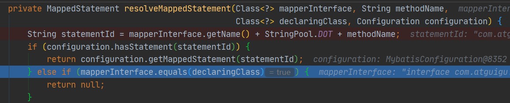
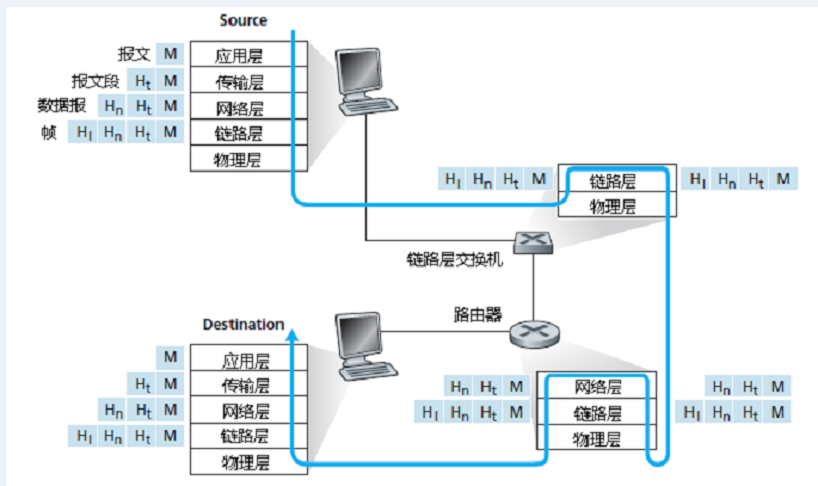

[toc]

# 协议分层（因特网五层模型）及7层OSI参考模型

在因特网中，涉及两个或多个远程通信实体的所有活动都受协议的制约。

## 分层的体系结构：

为了给网络协议的设计提供一个结构，网络设计者以分层的方式组织协议和实现协议的硬件和软件。且每一层具有地协议被称为**协议栈**（protocol stack）。因特网地协议栈由五个层次组成，**自顶向下**(top-down)分别为：

### 1. 应用层（软件）

- 应用层的分组称为**报文**。

- 应用层协议分布在多个端系统上，端系统之间的应用程序使用协议交换报文。

- 应用层包括许多协议：HTTP（WEB文档的请求和传送），SMTP（电子邮件），FTP（端系统间文件传送）。

### 2. 运输层（软件）

- 运输层的分组称为**报文段**(segment)。

- 在应用程序端点之间运输应用层报文。

- 两种运输协议：

- **TCP：**

  - 向应用程序提供面向连接的服务，包括应用层报文向目的地的确保传递和流量控制。
  - 将长报文划分为短报文。

  - 提供拥**塞控制机制**（网络拥塞时，抑制其传输速率）。

- **UDP：**
  - 向应用程序提供无连接式服务，不提供不必要服务。
  - 无可靠性，无流量控制和拥塞控制。

### 3. 网络层（硬件软件混合）

- 网络层的分组称为**数据报**（datagram）。

- 将数据报从一台主机移动到另外一台主机。

- 包括网际协议和路由选择协议，其中有著名的网际协议IP,定义了数据包中各个字段以及端系统和路由器如合作用于这些字段。

- IP仅有一个，且所有具有网络层的因特网组件都要运行IP，所以尽管网络层具有除IP协议以外的路由选择协议，但还是被亲切地称为**IP层**，因为IP厉害，IP将因特网连在了一起。

### 4. 链路层（硬件）（硬件）

- 链路层分组称为**帧**(frame)。

- 将分组从一个节点（主机或路由器）移动到路径上的下一个节点，网络层必须依靠链路层的服务。

- 链路层包括以太网，WiFi和电缆接入网的DOCSIS协议。

- 链路层提供的服务取决于该链路特定的链路层协议，某些协议基于链路提供可靠传递。<u>链路层不同的链路会被不同的链路层协议处理，接受不同的服务。</u>

### 5. 物理层

- 物理层的任务是将链路层传递的帧中的一个个**比特**从一个节点移动到下一个节点，物理层协议依旧与链路相关，且与链路的实际传输媒体（如双绞铜线和单模光纤）有关。

## OSI模型

OSI（Open System Interconnection)参考模型是国际标准化组织（ISO）制定地一个用于计算机或通信系统间互联地标准体系，一般被称为**OSI参考模型**或者**七层模型**。

没有提供一个可以实现地方法，而是描述一些概念，是一个概念性地框架，而且OSI模型在设计时协议这玩意还没发明出来。

OSI模型自上而下分别为应用层、表示层、会话层、运输层、网络层、链路层和物理层。除了表示层和会话层，其他五层与因特网五层模型中地对应层功能相同，所以再补充以下表示层和会话层的功能。

### 表示层

使通信的应用程序能够解释交换数据地含义，包括数据压缩，数据加密和数据描述。

### 会话层

提供数据交换地定界和同步功能，包括建立检查点和恢复方案地方法。

*关于OSI模型的参考：[OSI模型究竟忽悠了多少人](https://wenku.baidu.com/view/e6688b24ccbff121dd3683ca.html)*

## 封装

数据从发送端系统的协议栈向下，沿着中间的链路层交换机和路由器的协议栈，然后向上到达接收端系统的协议栈。

**路由器和链路层交换机**都是前两篇提到的分组交换机，且他们并没有实现协议栈中的所有层次。

比如：链路层交换机实现了链路层和物理层这两层，而路由器实现了网络层，链路层和物理层这三层，相比之下，可以看出，<u>路由器能够实现链路层交换机无法实现的IP协议（第三层协议）</u>。

**主机能够实现所有的层次。**

**封装**(encapsulation)是一个很重要的概念，可以看到：

- 在发送主机端，一个**应用层报文**(application-layer message)被传送给运输层，运输层收到之后，在报文首部附上首部信息，这个首部信息会被接收端的运输层使用。应用层报文和运输层首部信息一起构成了**运输层报文段**(transport-layer segment)，也就是说运输层封装了应用层报文。

- 同理：运输层则向网络层传递报文段，网络层又类似地在其首部添加注入源和目的端系统地址等网络层首部信息，生成**网络层数据报**(network-layer-datagram)。

- 继续向下，数据包被传递给链路层，链路层继续加上链路层地首部信息，生成**链路层帧**(link-layer-frame)。

自此，报文从应用层传输到链路层的过程结束，我们可以知道：

- 在每一层地分组都具有两种类型地字段：**首部字段**和**有效载荷字段**(payload field)，所谓<u>有效载荷就是上一层地分组</u>。

- 接收端反向对封装进行重构，一层一层去掉首部信息，以接收原信息。