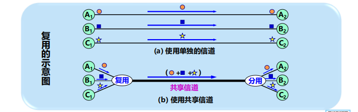

# 第一章！概述！

## 计算机网络的定义

由一些通用的、可编程的硬件互连而成的，而这些硬件并非专门用来实现特定目的，而是用来传送不同类型的数据，并能支持广泛的和日益增长的应用。

- 连通性：网上用户可以交换信息
- 共享性：资源共享

## 互联网的定义

互联网，特指 Internet，  它起源于美国，是由数量极大的各种**计算机网络互连**起  来而形成的一个互连网络。 它采用 **TCP/IP 协议族作为  通信规则**，是一个覆盖全球、  实现全球范围内连通性和资  源共享的计算机网络。

## 边缘部分

### 端系统之间的通信

主机A 和 主机B之间的通信， 指的是：运行在主机A上的某个程序 和 运行在主机B上的另一个程序 进行通信。

- C/S 描述 进程之间 **服务与被服务**的 关系。
- P2P体现对等连接，通信时不区分是服务请求方还是提供方。

> 对等连接：实质是客户服务期模式，只不过对等连接中的 **每一个主机既是客户又是服务器**。

## 核心部分

- 核心部分起特殊作用的 是 ： 路由器。
- 路由器 实现 分组交换！ **分组转发**是 网络核心部分最重要的 功能。

### 典型交换技术

1. 电路交换：**每一部电话都直接连接到交换机上**，而交换机使用交换的方法，让电话用户彼此之间可以很方便地通信。

2. **分组交换**：采用**存储转发**技术！发送端将较长的报文划分为**固定、短数据段**，在每个数据段的前面添加**首部**构成分组，依次将**分组**作为数据单元发送至接收端。接收端剥去分组首部还原报文。

3. 报文交换：也是存储转发技术，但是报文交换延时较长，已经很少使用。

## 计算机网络的分类

- 按照作用范围：广域网、城域网、局域网、个人区域网
- 按照网络的使用者：公用网、专用网
- 用来把用户接入到互联网的网络：接入网（从某个用户端系统到互联网中的第一个路由器之间的一种网络）

## 计算机网络的性能指标

- 速率指 **数据的传送速率**， bit/s。
- 带宽：单位时间内网络中某信道能通过的 **最高数据率** ，bit/s。

- 吞吐量：单位时间内通过某个网络的数据量。
- 时延：发送时延（传输时延）+传播时延+处理时延+排队时延。
  - 发送时延，也叫传输时延，`数据帧长度(bit)/ 发送速率(bit/s) = 发送时延`，指的是发送数据时，数据帧从结点进入到传输媒体所需要的的时间。
  - 传播时延：`信道长度(m)/ 信号在信道上的传播速率(m/s) = 传播时延`。
  - 处理时延：主机或路由器在收到分组，为处理分组花费的时间。（分析首部，提取数据，差错校验，查找路由等）
  - 排队时延：分组排队等待处理所经历的时延，取决于网络当时的通信量。

- 时延带宽积：以比特为单位的链路长度，`时延带宽积 = 传播时延 * 带宽`。
- 往返时间：RTT从发送方发送数据开始，到发送方接受到来自接收方的确认，总共经历的时间。（卫星通信RTT较长）
- 利用率：分为信道利用率（并非越高越好，某信道利用率增大时，信道引起的时延也会迅速增加）和网络利用率。

## OSI与五层协议的体系结构

为什么分层？ **分层可将 庞大且复杂的问题 转化为 若干较小的局部问题**，易于处理。

分层之后怎么办，**协议**是什么？ 数据交换必须遵守实现**约定好的规则**，这些规则明确所交换数据的格式以及有关的同步问题，网络协议便是这个规则，包含三个组成要素：语法、语义、同步。

OSI哪里出了问题？协议实现复杂，层次划分不合理（功能在多个层次出现），指定周期长。

为什么采用五层协议的体系结构？

## 数据发送与接收的大致流程

**PDU (Protocol Data Unit)：协议数据单元。**OSI 参考模型把对等层次之间传送的数据单位称为该层的协议数据单PDU。举个例子：

- 应用进程的数据先传送到应用层， 加上应用层首部，便成为应用层PDU。
- 应用层PDU再传输到运输层，加上运输层首部，成为运输层报文。
- 运输层报文再传送到网络层，加上网络层首部，成为IP数据报（分组）。
- IP数据报再传送到数据链路层，加上链路层首部和尾部，成为数据链路层帧。
- 数据链路层帧再传送到物理层，最下面的物理层把比特流传送到物理媒体。

## 一些 概念理解

# 第二章！物理层！

## 常用术语

数据、信号、模拟信号（取值连续）、数字信号（取值离散）、码元、信道（向某一个方向传送信息的媒体）

基带信号（来自信源的信号），由于基带信号上有较多低频成分，甚至有直流成分，许多信道并不能传输，故需要进行**调制**。

带通信号：经过载波调制后的信号。

调制分为：基带调制（即编码，仅对基带信号的波形进行变换）、带通调制（用载波进行调制，将基带信号转为模拟信号，把基带信号的频率搬移到较高频段，易于在模拟信道中传输）

## 常用编码

## 常用调制方式

## 信道极限容量

限制码元在信道上的传输速率的因素有两个：

- 信道能够通过的频率范围：具体的信道所能通过的频率范围总是有限的。
- 信噪比：信号的平均功率与噪声的平均功率之比。

## 两个重要规则/公式

## 物理层传输媒体

- 导引型传输媒体：电磁波被导引着固体媒体传播。
  - 双绞线：最常用的传输媒体。
  - 同轴电缆：抗干扰特性。
  - 光缆：光纤通信，传输损耗小，抗雷电和电磁干扰，体积小，重量轻，通信容量大。
- 非导引型传输媒体：自由空间（无线传输）。

## 信道复用技术

什么是复用？是通信技术中的基本概念，它允许用户使用一个共享信道进行通信，降低成本，提高利用率。

- 频分复用：将整个带宽分为多份，所有用户在同样的时间里占用不同的带宽资源。

  

- 时分复用：将时间划分为一段段等长的**时分复用帧（TDM帧）**，每个用户在每个TDM帧中占用固定序号的时隙。

  

  - 统计时分复用：**按需动态分配时隙**（解决上面的浪费情况）

  

- 波分复用：光的频分复用。

- 码分复用：各用户使用经过挑选的不同码型，因此彼此不会造成干扰。 每个站分配的码片序列【必须各不相同，且相互正交（规格化内积为0）】。

  - 码片序列

    

  - 码分多址

  

# 第三章！数据链路层！

## 数据链路层的概述

## 数据链路层使用的信道

1. 点对点信道：一对一点对点的通信方式。
2. 广播信道：一对多的广播通信方式。需要使用专用的共享信道协议来协调这些主机的数据发送。

## 数据链路层的三个基本问题

### 封装成帧

### 透明传输

如果数据中的某个字节的二进制代码恰好和SOH或EOT一样，就会错误地认为那是边界，为了实现透明传输，可以采用填充方法。

### 差错检测

在传输过程中可能会产生 比特差错， 1 变为 0， 0 变为 1。

在数据后面添加上的 冗余码 称为 帧检验序列FCS。

仅用循环冗余检验CRC差错检测技术只能做到**无差错接受**。

## PPP协议

PPP(Point-to-Point Protocal) 点对点协议 是目前使用的最广泛的数据链路层协议。

**PPP是面向字节**的！所有的PPP帧的长度都是整数字节。

透明传输问题

## 局域网的拓扑结构

## 共享信道带来的问题

使用一对多的广播通信方式时，若多个设备在共享的广播信道上同时发送数据，则会造成彼此干扰，导致发送失败。

媒体共享技术

- 静态划分信道：复用（频分、时分、波分、码分）
- 动态媒体接入控制：随机接入、受控接入

## 数据链路层的两个子层

- 逻辑链路控制 子层。LLC
- 媒体接入控制 子层。MAC

与接入到传输媒体有关的内容都放在MAC子层，而LLC子层则与传输媒体无关。
不管采用何种协议的局域网，对LLC子层来说都是透明的

## 以太网

【略】IEEE802.3

## 广域网与局域网的区别与联系

