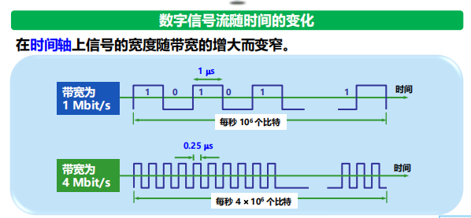
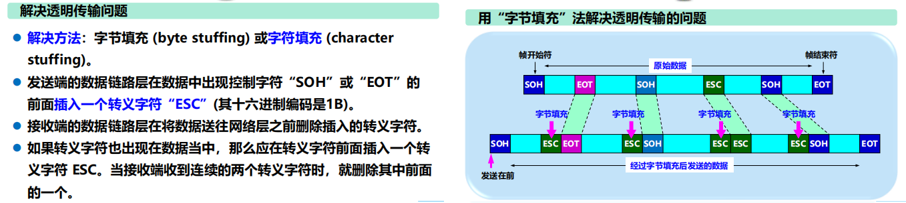
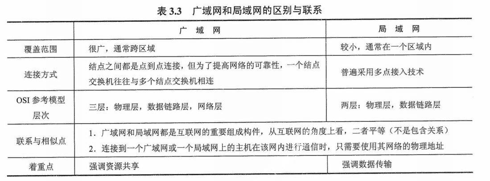
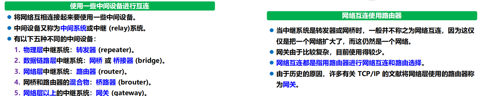
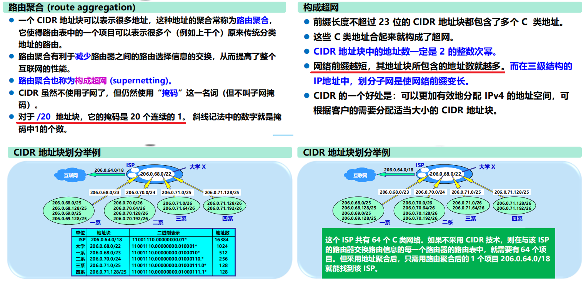
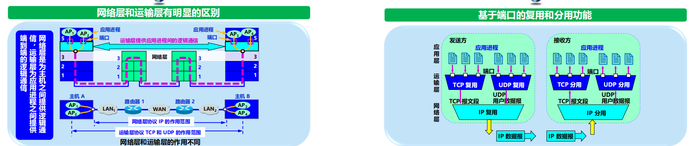

# 第一章！概述！

## 计算机网络的定义

由一些通用的、可编程的硬件互连而成的，而这些硬件并非专门用来实现特定目的，而是用来传送不同类型的数据，并能支持广泛的和日益增长的应用。

- 连通性：网上用户可以交换信息
- 共享性：资源共享

## 互联网的定义

互联网，特指 Internet，  它起源于美国，是由数量极大的各种**计算机网络互连**起  来而形成的一个互连网络。 它采用 **TCP/IP 协议族作为  通信规则**，是一个覆盖全球、  实现全球范围内连通性和资  源共享的计算机网络。

## 边缘部分

### 端系统之间的通信

主机A 和 主机B之间的通信， 指的是：运行在主机A上的某个程序 和 运行在主机B上的另一个程序 进行通信。

- C/S 描述 进程之间 **服务与被服务**的 关系。
- P2P体现对等连接，通信时不区分是服务请求方还是提供方。

> 对等连接：实质是客户服务期模式，只不过对等连接中的 **每一个主机既是客户又是服务器**。

## 核心部分

- 核心部分起特殊作用的 是 ： 路由器。
- 路由器 实现 分组交换！ **分组转发**是 网络核心部分最重要的 功能。

### 典型交换技术

1. 电路交换：**每一部电话都直接连接到交换机上**，而交换机使用交换的方法，让电话用户彼此之间可以很方便地通信。

2. **分组交换**：采用**存储转发**技术！发送端将较长的报文划分为**固定、短数据段**，在每个数据段的前面添加**首部**构成分组，依次将**分组**作为数据单元发送至接收端。接收端剥去分组首部还原报文。

3. 报文交换：也是存储转发技术，但是报文交换延时较长，已经很少使用。

## 计算机网络的分类

- 按照作用范围：广域网、城域网、局域网、个人区域网
- 按照网络的使用者：公用网、专用网
- 用来把用户接入到互联网的网络：接入网（从某个用户端系统到互联网中的第一个路由器之间的一种网络）

## 计算机网络的性能指标

- 速率指 **数据的传送速率**， bit/s。
- 带宽：单位时间内网络中某信道能通过的 **最高数据率** ，bit/s。

- 吞吐量：单位时间内通过某个网络的数据量。
- 时延：发送时延（传输时延）+传播时延+处理时延+排队时延。
  - 发送时延，也叫传输时延，`数据帧长度(bit)/ 发送速率(bit/s) = 发送时延`，指的是发送数据时，数据帧从结点进入到传输媒体所需要的的时间。
  - 传播时延：`信道长度(m)/ 信号在信道上的传播速率(m/s) = 传播时延`。
  - 处理时延：主机或路由器在收到分组，为处理分组花费的时间。（分析首部，提取数据，差错校验，查找路由等）
  - 排队时延：分组排队等待处理所经历的时延，取决于网络当时的通信量。

- 时延带宽积：以比特为单位的链路长度，`时延带宽积 = 传播时延 * 带宽`。
- 往返时间：RTT从发送方发送数据开始，到发送方接受到来自接收方的确认，总共经历的时间。（卫星通信RTT较长）
- 利用率：分为信道利用率（并非越高越好，某信道利用率增大时，信道引起的时延也会迅速增加）和网络利用率。

## OSI与五层协议的体系结构

为什么分层？ **分层可将 庞大且复杂的问题 转化为 若干较小的局部问题**，易于处理。

分层之后怎么办，**协议**是什么？ 数据交换必须遵守实现**约定好的规则**，这些规则明确所交换数据的格式以及有关的同步问题，网络协议便是这个规则，包含三个组成要素：语法、语义、同步。

OSI哪里出了问题？协议实现复杂，层次划分不合理（功能在多个层次出现），指定周期长。

为什么采用五层协议的体系结构？

## 数据发送与接收的大致流程

**PDU (Protocol Data Unit)：协议数据单元。**OSI 参考模型把对等层次之间传送的数据单位称为该层的协议数据单PDU。举个例子：

- 应用进程的数据先传送到应用层， 加上应用层首部，便成为应用层PDU。
- 应用层PDU再传输到运输层，加上运输层首部，成为运输层报文。
- 运输层报文再传送到网络层，加上网络层首部，成为IP数据报（分组）。
- IP数据报再传送到数据链路层，加上链路层首部和尾部，成为数据链路层帧。
- 数据链路层帧再传送到物理层，最下面的物理层把比特流传送到物理媒体。

## 一些 概念理解

# 第二章！物理层！

## 常用术语

数据、信号、模拟信号（取值连续）、数字信号（取值离散）、码元、信道（向某一个方向传送信息的媒体）

基带信号（来自信源的信号），由于基带信号上有较多低频成分，甚至有直流成分，许多信道并不能传输，故需要进行**调制**。

带通信号：经过载波调制后的信号。

调制分为：基带调制（即编码，仅对基带信号的波形进行变换）、带通调制（用载波进行调制，将基带信号转为模拟信号，把基带信号的频率搬移到较高频段，易于在模拟信道中传输）

## 常用编码

## 常用调制方式

## 信道极限容量

限制码元在信道上的传输速率的因素有两个：

- 信道能够通过的频率范围：具体的信道所能通过的频率范围总是有限的。
- 信噪比：信号的平均功率与噪声的平均功率之比。

## 两个重要规则/公式

## 物理层传输媒体

- 导引型传输媒体：电磁波被导引着固体媒体传播。
  - 双绞线：最常用的传输媒体。
  - 同轴电缆：抗干扰特性。
  - 光缆：光纤通信，传输损耗小，抗雷电和电磁干扰，体积小，重量轻，通信容量大。
- 非导引型传输媒体：自由空间（无线传输）。

## 信道复用技术

什么是复用？是通信技术中的基本概念，它允许用户使用一个共享信道进行通信，降低成本，提高利用率。

- 频分复用：将整个带宽分为多份，所有用户在同样的时间里占用不同的带宽资源。

  

- 时分复用：将时间划分为一段段等长的**时分复用帧（TDM帧）**，每个用户在每个TDM帧中占用固定序号的时隙。

  

  - 统计时分复用：**按需动态分配时隙**（解决上面的浪费情况）

  

- 波分复用：光的频分复用。

- 码分复用：各用户使用经过挑选的不同码型，因此彼此不会造成干扰。 每个站分配的码片序列【必须各不相同，且相互正交（规格化内积为0）】。

  - 码片序列

    

  - 码分多址

  

# 第三章！数据链路层！

## 数据链路层的概述

## 数据链路层使用的信道

1. 点对点信道：一对一点对点的通信方式。
2. 广播信道：一对多的广播通信方式。需要使用专用的共享信道协议来协调这些主机的数据发送。

## 数据链路层的三个基本问题

### 封装成帧

### 透明传输

如果数据中的某个字节的二进制代码恰好和SOH或EOT一样，就会错误地认为那是边界，为了实现透明传输，可以采用填充方法。

### 差错检测

在传输过程中可能会产生 比特差错， 1 变为 0， 0 变为 1。

在数据后面添加上的 冗余码 称为 帧检验序列FCS。

仅用循环冗余检验CRC差错检测技术只能做到**无差错接受**。

## PPP协议

PPP(Point-to-Point Protocal) 点对点协议 是目前使用的最广泛的数据链路层协议。

**PPP是面向字节**的！所有的PPP帧的长度都是整数字节。

透明传输问题

## 局域网的拓扑结构

## 共享信道带来的问题

使用一对多的广播通信方式时，若多个设备在共享的广播信道上同时发送数据，则会造成彼此干扰，导致发送失败。

媒体共享技术

- 静态划分信道：复用（频分、时分、波分、码分）
- 动态媒体接入控制：随机接入、受控接入

## 数据链路层的两个子层

- 逻辑链路控制 子层。LLC
- 媒体接入控制 子层。MAC

与接入到传输媒体有关的内容都放在MAC子层，而LLC子层则与传输媒体无关。
不管采用何种协议的局域网，对LLC子层来说都是透明的

## 以太网、CSMA/CD协议

CSMA/CD 的含义：载波监听多点接入/碰撞检测。

- 多点接入：许多计算机以多点接入的方式连接在一根总线上。
- 载波监听：每一个站在发送数据之前先要检测一下总线上是否有其他的计算机在发送数据，如果有，则暂时不要发送数据，以免发生碰撞。（用电子技术检测总线上有没有其他计算机发送的数据信号）

这里电子技术指的就是 碰撞检测！ 计算机边发送数据边检测信道上**信号电压**大小。当检测到信号电压摆动值超过一定门限值，则表明产生了碰撞。

每一个正在发送数据的站，一旦发现总线上出现了碰撞，就要立即停止发送，免得继续浪费网络资源，然后等待一段随机时间后再次发送。

争用期与二进制指数类型退避算法

【略】IEEE802.3

## 以太网MAC帧

在局域网中，硬件地址又称为物理地址，或 MAC 地址。

## 以太网交换机

## 广域网与局域网的区别与联系

# 第四章！网络层！

## 网络层提供的两种服务

网络层应该向运输层提供怎样的服务？ 面向连接 or 无连接？即可靠交付 应该由谁来负责？ 是网络还是端系统？

- 观点一：让网络负责可靠交付，使用面向连接的通信方式，即在通信之前建立虚电路（逻辑连接），分组都沿着这条逻辑连接按照存储转发方式传送。（逻辑连接，并不是真正建立了一条物理连接）
- 观点二：网络层只提供简单灵活的，**无连接的，尽最大努力交付**的数据报服务，不需要建立连接。每个分组（即**IP数据报**）独立发送，与其前后的分组无关（不编号）。网络层不提供服务质量的承诺！意思是让 运输层负责可靠交付（差错处理、流量控制等），使网络的造价大大降低，运行方式灵活，能够适应多种应用。

## 网际协议IP

###  分类的IP地址

IP地址的特点

1. IP地址是一种分等级的地址结构，IP地址管理机构在分配IP地址时只需分配网络号，剩下的主机号则由得到该网络号的单位自行分配。而且，路由器仅根据目的主机所连接的网络号来转发分组（而不需要考虑目的主机号），减少了路由表所占的存储空间。
2. IP地址是标志一个主机（或路由器）和一条链路的接口。由于一个路由器至少应当连接到两个网络（这样它才能将 IP 数据报从一个网络转发到另一个网络），因此一个路由器至少应当有两个不同的 IP 地址。
3. 用转发器或网桥连接起来的若干个局域网仍为一个网络，因此这些局域网都具有同样的网络号 net-id。
4. 所有分配到网络号 net-id 的网络，无论是范围很小的局域网，还是可能覆盖很大地理范围的广域网，都是平等的。

### IP地址与MAC地址有什么区别

## ARP地址解析

## IP数据报格式

## IP层转发分组的流程

## 划分子网

为什么划分子网？ IP地址空间的利用率低，两级的IP地址不够灵活，给每一个物理网络分配一个网络号会使路由表变得太大因而使网络性能变坏。

## 无分类编址CIDR

无分类的两级编址：`IP地址::={<网络前缀>,<主机号>}`

CIDR记法：`220.78.168.0/24`，24表示网络前缀的位数。

路由聚合

## ICMP网际控制报文协议

ICMP用来干啥？为了更有效地转发IP数据报和提高交付成功的机会。ICMP允许主机或路由器报告差错情况和提供有关异常情况的报告，是IP层的协议！

ICMP差错报告报文共有四种：

- 终点不可达
- 时间超过
- 参数问题
- 改变路由（重定向）

不应发送ICMP差错报告报文的几种情况：

- 对 ICMP 差错报告报文不再发送 ICMP 差错报告报文。
- 对第一个分片的数据报片的所有后续数据报片都不发送 ICMP 差错报告报文。
- 对具有多播地址的数据报都不发送 ICMP 差错报告报文。
- 对具有特殊地址（如127.0.0.0 或 0.0.0.0）的数据报不发送 ICMP 差错报告报文。

ICMP应用举例：

- PING(Packet Internet Groper) 测试两个主机之间的连通性。
- **Traceroute**跟踪一个分组从源点到终点的路径。

## 路由选择协议

路由选择算法的自适应角度考虑策略：

- 静态路由选择策略，非自适应路由选择，简单，开销小，不能及时适应网络状态的变化。
- 动态路由选择策略，自适应路由选择，能及时适应网络状态的变化， 开销大，实现复杂。

路由选择协议分层次的原因？

- 互联网的规模非常大，如果让所有的路由器知道所有的网络应怎样到达，则这种路由表将非常大，处理起来也太花时间。
- 许多单位不愿意外界了解自己单位网络的布局细节和本部门所采用的路由选择协议（这属于本部门内部的事情），但同时还希望连接到互联网上。

自治系统AS：在单一的技术管理下的一组路由器，而这些路由器使用一种 AS 内部的路由选择协议和共同的度量以确定分组在该AS 内的路由，同时还使用一种 AS 之间的路由选择协议用以确定分组在 AS之间的路由。

### RIP

### OSPF

### BGP

## IPV6

## IP多播

IP多播的目的是为了更好地支持一对多的通信。

## VPN、NAT

# 第五章！传输层！

## 传输层的作用

从IP层来说，通信的两端是两台主机。从传输层的角度来看，通信的真正端点并不是主机而是主机中的进程。

## TCP与UDP

## 端口的作用

## 什么是套接字？

## UDP

UDP只在IP的数据报服务之上增加了很少一点的功能：

- 复用和分用
- 差错检测

什么叫面向报文？ 以发送方为例，UDP对应用层下来的报文，在添加首部后就向下交付给IP层，一次发送一个报文，既不合并，也不拆分，而是保留这些报文的边界。 报文不可分割，UDP数据报处理的最小单位就是报文！

UDP用户数据报的格式：首部（源端口、目的端口、长度、校验和）+数据

当运输层从IP层收到UDP数据报时，就根据首部中的目的端口，把UDP数据报通过相应的端口，上交给最后的终点-应用进程。（无连接的，不需要使用套接字来建立连接）

在计算检验和时，临时把 12 字节的“伪首部”和 UDP 用户数据报连接在一起。伪首部仅仅是为了计算检验和。

## TCP

TCP面向流：不保证接收方应用程序所收到的数据块和发送方应用程序所发出的数据块具有对应大小的关系，**但接收方应用程序收到的字节流必须和发送方应用程序发出的字节流完全一样**。

TCP连接是一条虚连接而不是一条真正的物理连接。

TCP对应用进程一次把多长的报文发送到TCP的缓存中是不关心的，根据对方给出的窗口值和当前网络拥塞程度来决定一个报文段应该包含多少个字节。

## 可靠传输的工作原理 

**IP 网络所提供的是不可靠的传输**，必须使用一些可靠传输协议，在不可靠的传输信道实现可靠传输。

停止等待协议！

连续ARQ协议

## TCP报文段的首部格式

- 源端口和目的端口字段 —— 各占2字节，端口是运输层与应用层的服务接口。运输层的复用和分用功能都要通过端口才能实现。
- 序号字段 —— 占 4 字节。TCP 连接中传送的数据流中的每一个字节都编上一个序号。序号字段的值则指的是本报文段所发送的数据的第一个字节的序号。
- 确认号字段 —— 占 4 字节，是期望收到对方的下一个报文段的数据的第一个字节的序号。
- 数据偏移（即首部长度） —— 占 4 位，它指出 TCP 报文段的数据起始处距离 TCP 报文段的起始处有多远。“数据偏移”的单位是 32 位字（以 4 字节为计算单位）。
- 保留字段 —— 占 6 位，保留为今后使用，但目前应置为 0。
- 紧急 URG —— 当 URG 1 时，表明紧急指针字段有效。它告诉系统此报文段中有紧急数据，应尽快传送(相当于高优先级的数据)。
- 确认 ACK —— 只有当 ACK =1 时确认号字段才有效。当ACK =0 时，确认号无效。
  推送 PSH (PuSH) —— 接收 TCP 收到 PSH = 1 的报文段，就尽快地交付接收应用进程，而不再等到整个缓存都填满了后再向上交付。
- 复位 RST (ReSeT) —— 当 RST=1 时，表明 TCP 连接中出现严重差错（如由于主机崩溃或其他原因），必须释放连接，然后再重新建立运输连接。
- 同步 SYN —— 同步 SYN = 1 表示这是一个连接请求或连接接受报文。
  终止 FIN (FINish) —— 用来释放一个连接。FIN=1 表明此报文段的发送端的数据已发送完毕，并要求释放运输连接。
- 窗口字段 —— 占 2 字节，用来让对方设置发送窗口的依据，单位为字节。
- 检验和 —— 占 2 字节。检验和字段检验的范围包括首部和数据这两部分。在计算检验和时，要在 TCP 报文段的前面加上 12 字节的伪首部。
- 紧急指针字段 —— 占 16 位，指出在本报文段中紧急数据共有多少个字节（紧急数据放在本报文段数据的最前面）。
- 选项字段 —— 长度可变。TCP 最初只规定了一种选项，即最大报文段长度 MSS。MSS 告诉对方 TCP：“我的缓存能接收的报文段的数据字段的最大长度是 MSS 个字节。”
- 填充字段 —— 这是为了使整个首部长度是 4 字节的整数倍。

## TCP连接管理

## TCP可靠传输

## TCP流量控制

## TCP拥塞控制

