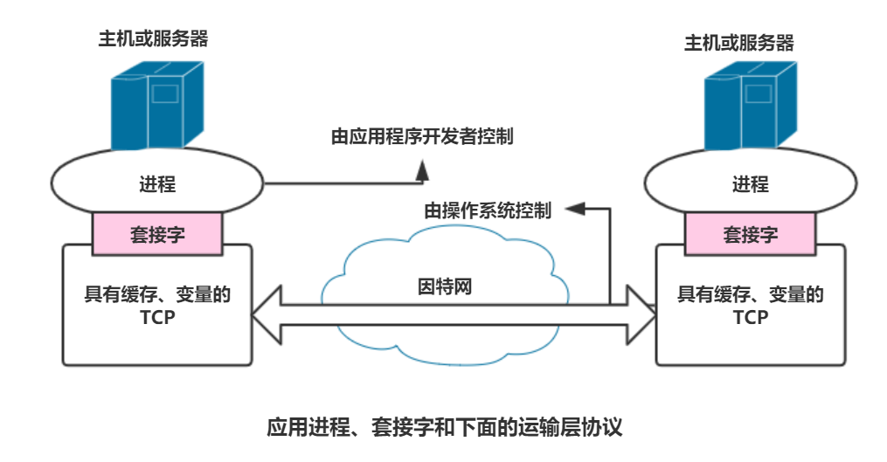

[TOC]

# 应用层协议原理

分层体系结构的优点可以很好地在这里体现，应用层应用程序的开发不需要关心网络核心设备上运行的要求，因为网络核心设备只能对网络层及以下起作用，够不到应用层。

## 1. 网络应用程序体系结构

### 不同于网络体系结构

1.对于研发者来说，网络体系结构是固定的，其提供的服务集合能为之所用。

2.网络应用程序体系结构就是研发者设计的，规定如何在各种端系统上组织该应用程序。

### 两种主流应用体系结构

**客户-服务器体系结构**

- 服务器**具有固定周知的地址**，且总时打开。

- 客户之间不直接通信，客户只通过服务器的**IP地址**与服务器通信。

- **解决一服务器对多用户的问题**：配备大量的数据中心，创建强大的虚拟服务器。

- 例如：Web，FTP，telnet，电子邮件等等。

**P2P体系结构**

- 不通过专门的服务器，是**对等方和对等方之间的通信**。

- 应用程序对位于数据中心的专用服务器又很小的依赖，甚至没有。

- 例如许多流量密集型应用：共享文件（Bit Torrent、对等方协助下载加速器（迅雷）等。

**当然还有混合的，比如许多即时讯息应用**

- 服务器跟踪用户的IP地址--->L客户-服务器体系结构

- 用户与用户之间的报文在主机之间直接发送--->P2P体系结构

## 2. 进程通信

进行通信实际上就是**进程**（process），而不是程序。<u>一个进程可以被认为是运行在端系统上的一个程序</u>。

- 多个进程在同一端系统上时，直接使用进程间通信机制进行通信，且通信规则由操作系统来决定。

- 当进程在不同端系统上，相互之间进行通信，需要怎么办呢？就是<u>发送端生成报文并向网络中发送，接收端接受报文并可能通过回送报文进行响应。</u>

### 客户和服务器进程

网络应用程序由好多好多进程对组成，进程对中两个重要的角色，**客户（client）**和**服务器（server）**。

- Web应用程序中，web服务器->服务器进程，浏览器是客户进程。

- P2P文件共享系统中，上传文件的为服务器，下载文件的是客户。

**注：**<u>尽管P2P中某个进程既是客户又是服务器，但在任何一个给定进程对之中，他的身份总时确定的</u>。

> 在一对 进程之间的通信会话场景中，发起通信的进程被标识为客户，在绘画开始时等待联系的是服务器。

### 进程与计算机网络之间的接口

首先要先清楚一个很重要的概念：**套接字**(socket)。

套接字是应用层和运输层之间的接口。

由于套接字是建立网络应用程序的可编程接口，所以套接字也被称为**应用程序编程接口**(Application Programming Interface)。

**注意：**应用程序开发者可以控制套接字在应用层端的一切，但是**对运输层端几乎没有控制权**。对运输层端的控制仅限于

1.选择传输协议。

2.设定几个运输层参数（最大缓存和最大报文长度等）。

<u>一旦选择了一个运输层协议，应用程序就建立在由该协议提供的运输层服务之上。</u>

### 进程寻址

从一台主机将分组发到另外一台主机，需要标识接收进程的地址，不然怎么找得到哦。如何定义呢？

1.目的地主机地址（由**IP地址**(IP address)唯一标识）。

2.指定运行在接收主机上的接收进程，具体地说，是接收套接字。（通过**端口号**（port number）标识）

大概就像去图书馆找书，图书馆的地址就是所谓的主机地址，是自己学校的图书馆而不是其他学校的，找的书也有属于自己的书单号，图书馆中那么多的书，以不同的编号区分，这就类似与端口号。一台主机上运行的多个进程，就好比一个图书馆里的多本书，一样一样的。

## 3. 可供应用程序使用的运输服务

我们知道，包括因特网在内的很多网络都提供了不止一种的运输层协议，那么如何选择一种最好用的运输层协议呢，一个运输层协议能够为调用它的应用程序提供什么样的服务呢？

接下来从四个方面对应用程序服务要求进行分类：

### 可靠数据传输

前面说过，分组在计算机网络中传输可能会出现丢失，这对许多特别关注传输数据的应用产生重大的影响。因此就需要做一些工作，去确保数据完全地被传送到另外一方。如果一个协议提供了确保数据交付服务，就认为提供了**可靠数据传输**（reliable data transfer）。只要运输协议提供了这种服务，发送进程只要将数据传递进套接字，就可以完全信任数据能够无差错地到达接收进程。

相反，如果一个运输层协议不提供可靠地数据传输服务时，可能有些数据在传输时就会出现偏差，有些应用允许这些数据丢失，这些就是**容忍丢失的应用**（loss-tolerant application）。

### 吞吐量

前面提到，可用吞吐量是发送进程能够向接收进程交付比特的速率，由于其他会话会共享沿着网络路径的带宽，且这些会话将会到达和离开，所以吞吐量会随时间波动。

- **带宽敏感地应用**（bandwidth-sensitive application）（具有吞吐量要求地应用程序）希望运输层协议始终能够以某种特定的速率提供明确的可用吞吐量，例如当前许多的多媒体应用。

- 相反，**弹性应用**(elastic application)则能够根据当前可用带宽的多少利用可供使用的吞吐量，例如电子邮件、文件传输和Web传送等。

当然，谁不想发的消息越快到达越好呢，所以，吞吐量这玩意儿，当然是越多越好啦。只不过弹性应用能够容忍的吞吐量更多罢了。

### 定时

类似于对吞吐量的保证，运输层协议也可以提供**定时保证**，比如保证发送方注入进套接字中的每个比特到达接收方的套接字不迟于100 ms。

- **交互式实时应用**对数据交付有严格地时间限制，就会比较青睐这样地运输层协议，比如因特网电话、虚拟环境、电话会议和多方游戏等。

- 非实时应用则对端到端地时延没有严格地约束，当然时延低总是好的。

### 安全性

运输层协议能够为应用程序提供一种或多种安全性服务。比如发送时加密，接收时解密体现的**机密性**，还有**数据完整性**和**端点鉴别**等服务。

## 4. 因特网提供的运输服务

一把打住，前面提到的一些运输层能够提供的服务是通用的运输服务，接下来将要具体地考察由因特网提供地运输服务类型。

因特网（一般是TCP/IP网络）为应用程序提供了两个极为重要的运输层协议，UDP和TCP，选<u>择哪一个协议，就意味着应用程序享受哪一种服务。</u>

### TCP服务

- **面向连接地服务**

  - 握手阶段：在应用层数据报文流动之前，TCP先让客户和服务器互相<u>交换运输层控制信息</u>，提醒双方即将有大量分组到来。

  - 握手之后：一个**TCP连接**(TCP connection)就在两个进程的套接字之间建立起来了。这条连接是**双工**的，即连接双方的进程可以同时进行收发报文。

  - 结束时：应用程序结束报文发送时，必须拆除该连接。

- **可靠地数据传送服务**
  - 无差错且按适当顺序交付所有发送的数据。

- 另外，TCP协议还具有**拥塞控制机制**，它不针对某一进程，而是针对整个因特网。当发和收双方之间的网络出现拥塞时，TCP的拥塞机制就会抑制发送进程，同时也会限制每个TCP连接，让他们公平地共享网络带宽。

### UDP服务

UDP是不提供不必要服务的轻量级运输协议，仅提供最小服务。

对于UDP的描述，可以根据TCP描述一一来看：

- **无连接的**，也就是说<u>通信前没有握手的过程</u>。

- 提供的是**<u>不可靠数据传送服务</u>**，它不保证对方能否收到，也不能保证报文的顺序。

- **<u>没有拥塞控制机制</u>**，所以UDP的发送端可以以任何速率向下层注入数据。（可能受到中间链路带宽受限或者拥塞的影响，实际端到端的吞吐量甚至比这个速率还小）

**关于TCP的安全性**

> - 无论是TCP还是UDP**都没有提供任何加密机制**，就是说发送进程传进套接字的数据，经过网络传送之后，与目的进程接收的数据相同。看似达到了数据一致，但是许多隐私数据很有可能会被坏人知道，所以没有安全机制是很可怕的。
> - 为此，一种在TCP的基础上进行加强的**安全套接字层（Secure Sockets Layers ，SSL）**应运而生，<u>它能做传统TCP可以做到的一切，在这个基础上，还提供了关键的进程到进程的安全性服务</u>（包括前边提到的加密、数据完整性和端点鉴别）。
>
> **注意：**SSL不是与TCP和UDP在相同层次的第三种因特网运输协议，只不过是对TCP在应用层上的加强，想要享受SSL的服务，需要在应用程序的客户端和服务器端都包括SSL的代码。

**基本流程如下图：**

 

发送进程将明文数据传给SSL套接字，<u>发送主机中的SSL加密该数据并传递给TCP套接字</u>，经过网络，传给接收进程的TCP套接字，它将加密数据传给SSL，由SSL进行解密，最后SSL通过SSL套接字将明文数据传递给接收进程。

### 因特网运输协议所不提供的服务

我们可以发现，TCP可以提供可靠的端到端的数据传送，安全方面也可以通过SSL来加强。<u>但对于前面提到的吞吐量和定时保证，这两者目前的因特网运输协议并没有提供。</u>

今天的因特网通常能够为时间敏感应用提供满意的服务，但是它不提供任何定时或者带宽的保证。

> 电子邮件、远程终端访问、web和文件传输等流行的因特网应用都使用了TCP协议，最主要的原因还是TCP提供着**可靠的数据传输服务**。
>
> 而因特网电话应用（Skype）则能够容忍某些丢失，但是要求达到一定的最小速率才能有效工作，所以它避开了TCP的拥塞控制机制和分组开销，选择了UDP。但是许多防火墙搜设置阻挡UDP流量，所以因特网电话应用也通常使用TCP作为备份。

## 5. 应用层协议

应用层协议（application-layer protocol）定义了运行在不同端系统上的应用程序进程如何相互传递报文。

- **交换的报文类型**，如请求报文和响应报文

- **各种报文类型的语法**，如报文中的各个字段及这些字段是如何描述的

- **字段的语义**，即这些字段中的信息的含义

- 确定一个进程**何时、如何发送报文**，以及**对报文响应的规则**。

**应用层协议的分类：**

- 有些应用层协议是由**RFC文档**定义的，因此它们位于公共领域。

> 例如，web的应用层的协议HTTP(超文本传输协议，RFC 2616)就作为一个RFC供大家使用。如果浏览器开发者遵从HTTP RFC规则，所开发出的浏览器就能访问任何遵从该文档标准的web，并获取相应的web页面。

- 还有很多别的应用层协议是专用的．不能随意应用于公共领域。

> 例如，很多现有的P2P文件共享系统使用的是专用应用层协议。

**网络应用与应用层协议的关系**:

- 应用层协议是网络应用的一部分，尽管很重要。

> 比如web是一种客户-服务器应用，他有很多组成部分，包括文档格式的标准（HTML）啊，Web浏览器(Firefox和Microsoft Internet Explorer)啊，Web服务器(如Apache、Microsoft服务器程序）啊，还有应用层协议（HTTP）。**HTTP作为Web的应用层协议，是Web应用的重要组成部分**，<u>它定义了浏览器和web服务器之间传输的报文格式和序列</u>，之后会继续学习总结。