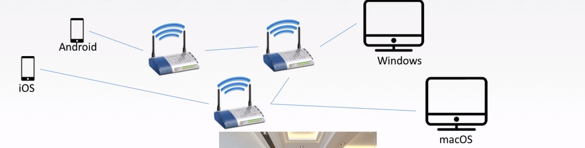
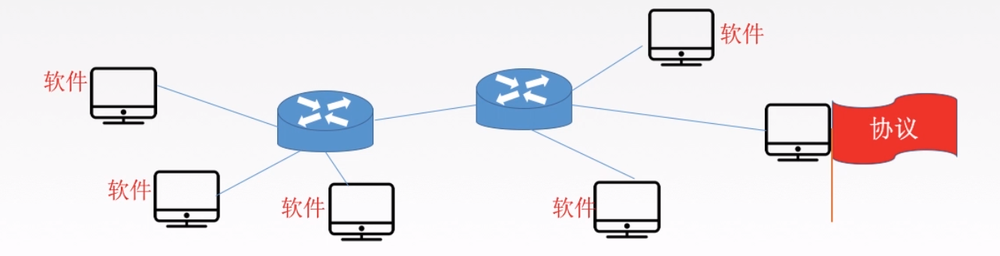
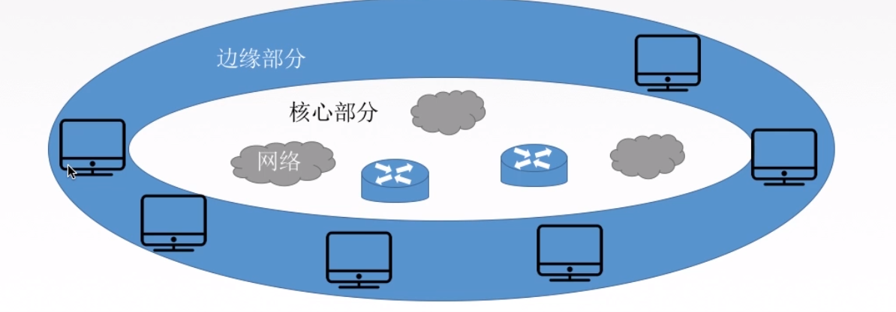
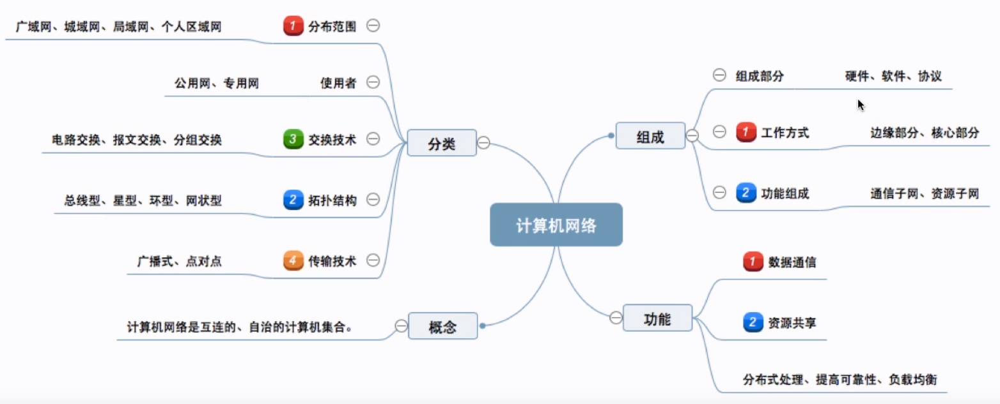

概念、总结、功能、分类

## 计算机网络的概念

计算机网络: 是一个将分散的、具有独立功能的**计算机系统**【端系统】，通过**通信设备**与**线路**连接起来【交换机】，由功能完善的**软件**实现资源共享和信息传递的系统。

计算机网络是互连的，自治的计算机集合。

互连 - 互联互通  通信链路

自治 - 无主从关系

## 计算机网络的功能

一、数据通信，连通性

二、资源共享：硬件 or 软件 or 数据

三、分布式处理： 多台计算机各自承担同一工作任务的不同部分

四、提高可靠性： 替代机

五、负载均衡

## 计算机网络的组成

一、组成部分： 硬件、软件、协议

二、工作方式：

- 边缘部分 ： 用户直接使用 C/S  P2P
- 核心部分 ： 为边缘部分服务

三、功能组成

- 数据通信 ： 通信子网， 各种传输介质、通信设备、相应的网络协议组成， 网络层，数据链路层，物理层。
- 资源共享 ： 资源子网， 实现资源共享功能的设备和软件的集合， 应用层， 表示层， 会话层。

## 计算机网络的分类

一、分布范围分：广域网， 城域网， 局域网， 个人区域网

二、按使用者分： 公用网【电信】， 专用网

三、按交换技术分： 电路交换， 报文交换， 分组交换。

四、按拓扑结构分： 如网状型常用于广域网。

五、按传输技术分： 广播式网络【共享公共通信信道】，点对点网络。

