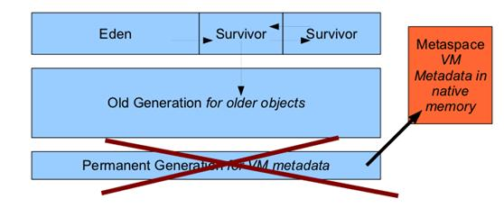
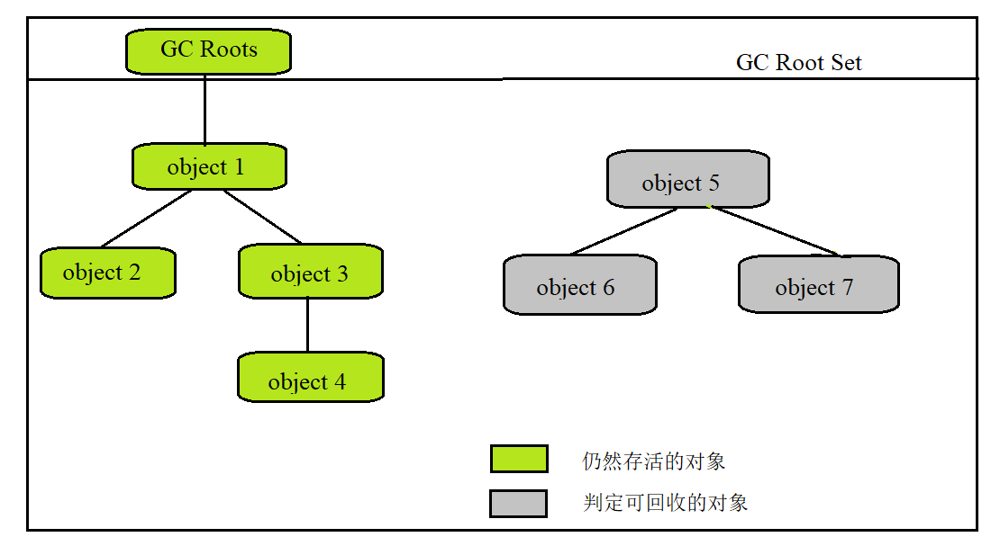
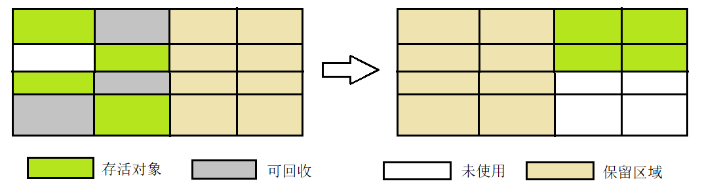
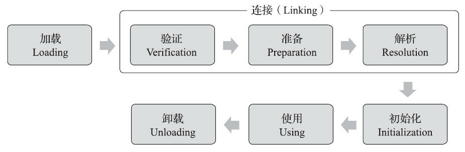
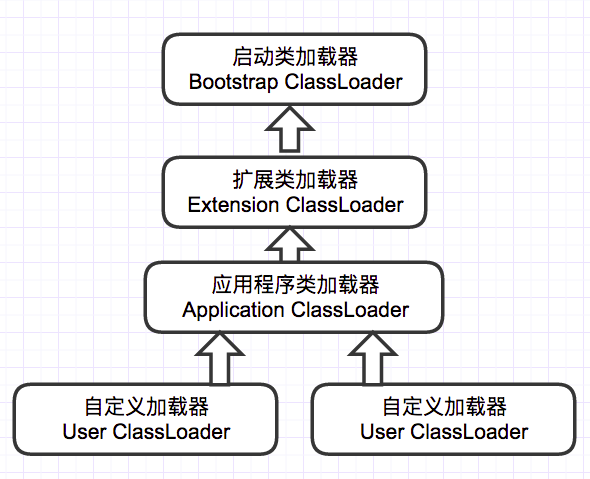

[toc]

# JVM内存区域

## JDK1.8前后，JVM内存区域的变化

### 一、JDK1.8前


### 二、JDK1.8之后


## 线程共享

### 一、堆

Java 虚拟机所管理的内存中最大的一块，Java 堆是所有线程共享的一块内存区域，在虚拟机启动时创建。**此内存区域的唯一目的就是存放对象实例，几乎所有的对象实例以及数组都在这里分配内存。**

为什么说**几乎**呢？

答：**Java世界中“几乎”所有的对象都在堆中分配，但是，随着JIT编译期的发展与逃逸分析技术逐渐成熟，<u>栈上分配、标量替换</u>优化技术将会导致一些微妙的变化，所有的对象都分配到堆上也渐渐变得不那么“绝对”了。从jdk 1.7开始已经默认开启逃逸分析，如果某些方法中的对象引用没有被返回或者未被外面使用（也就是未逃逸出去），那么对象可以直接在栈上分配内存。**

Java 堆是垃圾收集器管理的主要区域，因此也被称作**GC 堆（Garbage Collected Heap）**.从垃圾回收的角度，由于现在收集器基本都采用分代垃圾收集算法，所以 Java 堆还可以细分为：新生代和老年代：再细致一点有：Eden 空间、From Survivor、To Survivor 空间等。**进一步划分的目的是更好地回收内存，或者更快地分配内存。**

---

在JDK1.7及以前，堆内存分为三部分：

1. 新生代【分为Eden区、Survivor from区、Survivor to区】8：1：1
2. 老生代
3. 永久代


JDK1.8之后方法区【HotSpot的永久代】被彻底移除【JDK1.7就已经开始】，取而代之的是元空间，元空间使用的是**直接内存**。



大部分情况下：对象都会首先在Eden区分类，再一次新生代垃圾回收后，如果对象还存活，则会进入from或to，之后就在from和to之间来回倒腾，且对象的年龄+1，年龄增加到一定程度【阈值默认15岁，阈值可通过参数`-XX:MaxTenuringThreshold`设置】，就会被晋升到老年代中。

> **Sets the maximum tenuring threshold for use in adaptive GC sizing. The largest value is 15. The default value is 15 for the parallel (throughput) collector, and 6 for the CMS collector.默认晋升年龄并不都是15，这个是要区分垃圾收集器的，CMS就是6.**

**动态年龄计算**

> “Hotspot遍历所有对象时，按照年龄从小到大对其所占用的大小进行累积，当累积的某个年龄大小超过了survivor区的一半时，取这个年龄和MaxTenuringThreshold中更小的一个值，作为新的晋升年龄阈值”。

> 堆中容易出现的错误：OOM，对于这种错误，表现形式有多种：
>
> 1. GC Overhead Limit Exceeded：当JVM花太多时间执行垃圾回收并且只能回收很少的堆空间时，就会发生此错误。
> 2. Java Heap Space：假如在创建新的对象时, 堆内存中的空间不足以存放新创建的对象, 就会引发该错误。【和本机物理内存无关，和你配置的内存大小有关】

### 二、方法区

- 存储已被虚拟机加载的类信息、常量、静态变量、即时编译器编译后的代码等数据。
- 虽然 **Java 虚拟机规范把方法区描述为堆的一个逻辑部分**，但是它却有一个别名叫做 **Non-Heap（非堆）**，目的应该是与 Java 堆区分开来。

#### 方法区与永久代的关系

> 《Java 虚拟机规范》只是规定了有方法区这么个概念和它的作用，并没有规定如何去实现它。那么，在不同的 JVM 上方法区的实现肯定是不同的了。 **方法区和永久代的关系很像 Java 中接口和类的关系，类实现了接口，而永久代就是 HotSpot 虚拟机对虚拟机规范中方法区的一种实现方式。** 也就是说，永久代是 HotSpot 的概念，方法区是 Java 虚拟机规范中的定义，是一种规范，而永久代是一种实现，一个是标准一个是实现，其他的虚拟机实现并没有永久代这一说法。

#### 常用参数

JDK1.8之前永久代还没被彻底移除的时候，调节方法区大小的参数：

```java
-XX:PermSize=N //方法区 (永久代) 初始大小
-XX:MaxPermSize=N //方法区 (永久代) 最大大小,超过这个值将会抛出 OutOfMemoryError 异常:java.lang.OutOfMemoryError: PermGen
```

相对而言，垃圾收集行为在这个区域比较少出现，但也是有的。

JDK1.8之后，方法区【hotSpot的永久代】被彻底移除【JDK1.7就已经开始了】，取而代之的是元空间，元空间使用的是直接内存，之后调节元空间大小的参数是：

```java
-XX:MetaspaceSize=N //设置 Metaspace 的初始（和最小大小）
-XX:MaxMetaspaceSize=N //设置 Metaspace 的最大大小
```

与永久代很大的不同是，如果不指定大小的话，随着类的创建，虚拟机会耗尽所有可用的系统内存。

#### 为什么要将永久代替换为元空间？

1. **整个永久代有一个 JVM 本身设置固定大小上限，无法进行调整，而元空间使用的是直接内存，受本机可用内存的限制**，虽然元空间仍旧可能溢出【元空间溢出的错误：java.lang.OutOfMemoryError: MetaSpace】，但是比原来出现的几率会更小。

2. 元空间里面存放的是类的元数据，这样加载多少类的元数据就不由MaxPermSize控制了，而由系统的实际可用空间来控制，加载的类更多。
3. 在 JDK8，合并 HotSpot 和 JRockit 的代码时, JRockit 从来没有一个叫永久代的东西, 合并之后就没有必要额外的设置这么一个永久代的地方了。

#### 运行时常量池

- 运行时常量池是方法区的一部分，Class文件中除了有类的版本、字段、方法、接口等描述信息外，还有一项信息是常量池表（Constant Pool Table），用于存放编译期生 成的各种字面量与符号引用，这部分内容将在类加载后存放到方法区的运行时常量池中。
- 运行时常量池相对于Class文件常量池的另外一个重要特征是具备动态性，Java语言并不要求常量 一定只有编译期才能产生，也就是说，并非预置入Class文件中常量池的内容才能进入方法区运行时常量池，运行期间也可以将新的常量放入池中，这种特性被开发人员利用得比较多的便是String类的 intern()方法。 

> String.intern() 是一个 Native 方法，它的作用是：如果运行时常量池中已经包含一个等于此 String 对象内容的字符串，则返回常量池中该字符串的引用；如果没有，JDK1.7之前（不包含1.7）的处理方式是在常量池中创建与此 String 内容相同的字符串，并返回常量池中创建的字符串的引用，JDK1.7以及之后的处理方式是在常量池中记录此字符串的引用，并返回该引用。

- 既然运行时常量池是方法区的一部分，自然受到方法区内存的限制，当常量池无法再申请到内存时会抛出OutOfMemoryError异常。

### 三、直接内存【非运行时数据区的一部分】

**直接内存并不是虚拟机运行时数据区的一部分，也不是虚拟机规范中定义的内存区域，但是这部分内存也被频繁地使用。而且也可能导致 OutOfMemoryError 错误出现。**

## 线程私有

### 一、程序计数器

- 可以看作是当前线程所执行的字节码的**行号指示器**。
- 字节码解释器通过改变程序计数器来依次读取指令，从而**实现代码的流程控制**，如：顺序执行、选择、循环、异常处理。
- 在多线程的情况下，**程序计数器用于记录当前线程执行的位置**，从而当线程被切换回来的时候能够知道该线程上次运行到哪儿了。

> 程序计数器是唯一一个不会出现OOM的内存区域，它的生命周期随线程的创建而创建，随着线程的结束而死亡。

### 二、虚拟机栈

- 生命周期和线程相同，描述的是 Java 方法执行的内存模型，每次方法调用的数据都是通过**栈**传递的。

- 虚拟机栈又一个个**栈帧**组成，每个栈帧中都有：局部变量表、操作数栈、动态链接、方法出口信息。
- Java内存粗略分为【堆内存】和【栈内存】、而栈大多说的就是虚拟机栈，或者说是虚拟机栈中的**局部变量部分**。
- **局部变量表**主要存放了**编译期可知的各种数据类型**【boolean、byte、char、short、int、float、long、double】、**对象引用**【reference 类型，它不同于对象本身，可能是一个指向对象起始地址的引用指针，也可能是指向一个代表对象的句柄或其他与此对象相关的位置】。

> 虚拟机栈可能出现的两个错误：
>
> - StackOverFlowError：若 Java 虚拟机栈的内存大小不允许动态扩展，那么当线程请求栈的深度超过当前 Java 虚拟机栈的最大深度的时候，就抛出 StackOverFlowError 错误。
> - OOM： 若 Java 虚拟机堆中没有空闲内存，并且垃圾回收器也无法提供更多内存的话。就会抛出 OutOfMemoryError 错误。
>
> 每个线程都有各自的 Java 虚拟机栈，而且随着线程的创建而创建，随着线程的死亡而死亡。

### 三、本地方法栈

和虚拟机栈所发挥的作用非常相似，区别是： **虚拟机栈为虚拟机执行 Java 方法 （也就是字节码）服务，而本地方法栈则为虚拟机使用到的 Native 方法服务。**

在 HotSpot 虚拟机中和 Java 虚拟机栈合二为一。

本地方法被执行的时候，在本地方法栈也会创建一个栈帧，用于存放该本地方法的局部变量表、操作数栈、动态链接、出口信息。

> 方法执行完毕后相应的栈帧也会出栈并释放内存空间，也会出现 StackOverFlowError 和 OutOfMemoryError 两种错误。

# 四种引用类型及特点

##  强引用

在 Java 中最常见的就是强引用，**把一个对象赋给一个引用变量，这个引用变量就是一个强引用**。当一个对象被强引用变量引用时，它处于可达状态，它是**不可能被垃圾回收机制回收的**，即使该对象以后永远都不会被用到 JVM 也不会回收。因此强引用是造成 Java 内存泄漏的主要原因之一。

## 软引用

软引用需要用 SoftReference 类来实现，如果一个对象只具有软引用，**当系统内存足够时它不会被回收，当系统内存空间不足时它会被回收**。

软引用可以用来实现内存敏感的高速缓存。

软引用可以和一个引用队列联合使用，如果软引用所引用的对象被垃圾回收，虚拟机就会把这个软引用加入到与之关联的引用队列中。

## 弱引用

弱引用需要用 WeakReference 类来实现，弱引用与软引用的区别在于：**弱引用比软引用的生存期更短**，对于只有弱引用的对象来说，**只要垃圾回收机制一运行，不管 JVM 的内存空间是否足够，总会回收该对象占用的内存**。

弱引用可以和一个引用队列（ReferenceQueue）联合使用，如果弱引用所引用的对象被垃圾回收，Java 虚拟机就会把这个弱引用加入到与之关联的引用队列中。

## 虚引用

虚引用需要 PhantomReference 类来实现，它不能单独使用，**必须和引用队列联合使用**。虚引用的主要作用是**跟踪对象被垃圾回收的状态**。

当垃圾回收器准备回收一个对象时，如果发现它还有虚引用，就会在回收对象的内存之前，把这个虚引用加入到与之关联的引用队列中。程序可以通过判断引用队列中是否已经加入了虚引用，来了解被引用的对象是否将要被垃圾回收。程序如果发现某个虚引用已经被加入到引用队列，那么就可以在所引用的对象的内存被回收之前采取必要的行动。


> 在程序设计中一般很少使用弱引用与虚引用，使用软引用的情况较多，这是因为**软引用可以加速 JVM 对垃圾内存的回收速度，可以维护系统的运行安全，防止内存溢出（OutOfMemory）等问题的产生**。

虚引用需要 PhantomReference 类来实现，它不能单独使用，必须和引用队列联合使用。虚引用的主要作用是跟踪对象被垃圾回收的状态。

# 判断对象是否存活的算法

## 1、引用计数算法

特点：每当对象被引用，计数器++，对象失效，计数器--。计数器为0，表示对象可回收。

优点：原理简单，效率高。

缺点：两对象相互引用，无法被回收。 

## 2、可达性算法分析

特点：从GC roots对象 向下搜索，如果没有路径到达目标对象。则标记目标对象可回收。

GC roots对象有哪些？

1. 虚拟机栈中的引用对象。
2. 方法区 静态属性的引用对象。
3. 方法区 常量引用的对象。



## 3、再谈引用

>  引用计数算法和可达性算法，判断对象是否存活的两种方法都与**引用**离不开关系。

JDK1.2之前对引用的定义是：如果reference类型的数据中存储的数值代表的是另外一块内存的起始地址，就称该reference数据代表的是某块内存、某个对象的引用。

JDK1.2之后对原先较为狭隘的概念进行了扩充：将引用分为以下四种，强度由高到低逐渐减弱。

- 强引用（Strongly Reference）：即通常说的引用定义，`Object o = new Object();`，**被强引用的对象，在强引用失效之前不会被回收**。
- 软引用（Soft Reference）：描述还有用，但不是必须的对象，**系统将要发生内存溢出异常前，将会把软引用关联的对象列入回收范围进行二次回收**，可以通过SoftReference实现软引用。
- 弱引用（Weak Reference）：描述非必须的对象，强度较软引用要弱。弱引用关联的对象只能生存到下一次垃圾收集发生为止，也就是说，**只要垃圾收集器开始工作，不管你内存是不是足够，弱引用关联的对象都会被回收**，可以通过WeakReference实现。
- 虚引用（Phantom Reference）：最弱的引用，无法通过该引用获取一个对象实例，**可以用来跟踪GC，对象准备被回收时发现他还有虚引用，会把这个虚引用加入一个引用队列，可以观察这个队列中虚引用是否存在来判断对象是否被回收了**，可以通过PhantomReference实现。

## 4、对象啥时候死亡

对象在进行可达性分析后发现没有与GC Roots相连接的引用链，将会被第一次标记，随后进行依次筛选，筛选的条件是此对象是**否有必要执行finalize()方法**，以下两种情况都是判定为没有必要执行finalize方法：

- 对象没有覆盖finalize()方法。
- finalize()方法已经被虚拟机调用过。

如果说有必要执行finalize方法，该对象将被置如F-Queue队列中，并由虚拟机建立的低调度优先级的Finalizer线程去执行对象们的finalize方法。

finalize方法中，如果对象重新与引用链上的任意一个对象建立联系，则可以拯救自己，逃脱回收。

稍后收集器将对队列中的对象进行第二次小规模的标记，此时解救自己的对象将会被移除即将回收的集合。

> 二次标记：标记可回收的对象，并非立刻回收，他们加入一个对列中进行二次标记，如果在二次标记之前，对象产生引用则不会被回收。

# 垃圾回收算法

标记-清除， 标记复制， 标记整理， 分代收集。

## 1、标记-清除算法

最早出现、最基础的算法，Mark-Sweep。

【标记】+【清除】：

1. 标记要回收的对象。
2. 统一回收有标记的对象。

【缺点】：

- **执行效率不稳定**，如果Java堆中包含大量对象需要标记或清除，这个过程的执行效率会大大下降。
- **内存空间的碎片化问题**，标记或清除之后将会产生大量的不连续的内存碎片，将会导致之后在分配较大对象的时候，无法找到足够的连续内存空间而提前触发垃圾收集。


## 2、标记-复制算法

半区复制的思想，**解决标记-清除算法面对大量可回收对象时，执行效率低的问题**。

特点：

1. 将内存一份为二，假设为A 和B。
2. 将A部分存活的对象复制到B中，A部分全部清除。

【优点】：每次都是针对整个半区进行内存回收，分配内存时不用考虑有空间碎片的复杂情况，只需要移动堆顶指针，按顺序分配即可。实现简单，运行高效。

【缺点】：将可用内存缩小为原来的一半，**空间浪费较大**；对象存活率较高时，需要进行较多的复制操作，效率降低。



### Appel式回收

**将新生代分为一块较大的Eden空间和两块较小的Survivor空间**【8：1：1】，每次分配内存只使用Eden和其中一块Survivor。大多数情况下，HotSpot虚拟机默认的Eden和Survivor的大小比例为8：1，每次新生代中可用内存空间为整个新生代容量的90%，此时只会浪费10%的空间。

当然，如果出现超过10%的对象存活，Survivor空间不足以容纳依次Minor GC之后存活的对象时，需要其他的内存区域的进行**分配担保**。

## 3、标记-整理算法

标记-整理与标记-清除算法的本质差异：前者是移动式的，后者是非移动式的。

1. 标记要回收的对象。
2. 将存活的对象向一端移动，清除掉边界外内存。


【缺点】：移动大量存活对象时，操作负重。

【优点】：移动并整理对象，相较于标记-清除来说，**解决空间碎片化问题**。

## 4、分代收集

**分代收集**理论建立在两个分代假说之上：

- **弱分代假说**：绝大多数对象都是朝生夕灭的。
- **强分代假说**：熬过越多次垃圾收集过程的对象就越难消亡。

两个分代假说奠定的多款常用垃圾收集器的**设计原则**： 收集器应该将Java堆划分出不同的区域，然后将回收对象根据其年龄分配到不同的区域中存储。

为了解决该问题，需要引入第三条假说，即**跨代引用假说**：跨代引用相对于同代引用来说仅占极少数。

因此，只需要在新生代上建立一个全局的数据结构（记忆集），记忆集将老年代划分成若干的小块，标识出老年代的哪一块内存会存在跨代引用，之后发生Minor GC（新生代收集）时，只有包含了跨代引用的小块内存里的对象才会被加入到GC Roots进行扫描。

总结：

1. 新生代内存采用标记复制算法，原因在于新生代垃圾回收时，对象的死亡率高，则仅复制少数存活的对象即可。
2. 老年代内存采用标记清除算法或标记整理算法，原因在于老年代垃圾回收时，对象死亡率低，仅清除少量死亡对象即可。

# HotSpot的算法细节实现

根节点枚举

安全点

安全区域

记忆集与卡表

写屏障

并发的可达性分析

# 经典垃圾收集器

GC 算法是方法论， 垃圾收集器是具体的实现。

## Serial收集器


最基本的垃圾收集器，**针对新生代采用复制算法**。

**单线程收集器**，只使用一个CPU或一个线程去垃圾收集，**必须暂停其他所有工作线程**。【stop the world】

但**简单高效**，没有线程交互的开销。

仍是Java虚拟机运行在Client模式下默认的新生代垃圾收集器。

## ParNew收集器


Serial收集器的**多线程版本**，**针对新生代采用复制算法**。

垃圾收集过程中，需要暂停所有其他的工作线程，区别在于，**支持多个垃圾收集线程的并行收集**操作。

默认开启和CPU数目相同的线程数，但可以通过`-XX:ParallelGCThreads`来改变。

是Java虚拟机运行在Server模式下默认的新生代垃圾收集器。

## Parallel Scavenge收集器

同样是**基于标记复制算法的多线程收集器**，与ParNew几乎一样，区别在于关注点不同：【可控制的吞吐量】

## Serial Old收集器

**单线程标记整理算法，是Serial的老年代版本**。

是运行在 客户端模式下 默认的 java 虚拟机默认的年老代垃圾收集器。

如果在服务断，它也有另外两种用途：

1. 在 JDK1.5 以及以前的版本中与 Parallel Scavenge 收集器搭配使用
2. 作为 CMS 收集器的后备方案

## Parallel Old 收集器

JDK1.6之后提供，**是Parallel Scavenge的年老代版本，使用多线程 的标记整理算法。**

在此之前，Parallel Scavenge需要配合Serial Old收集器进行垃圾收集【没办法，那时候这哥们还没出来呢，老年代只能交给单线程的SerialOld】，只能保证新生代的吞吐量，而无法保证整体吞吐量。而Parallel Old的出现正好解决了这个问题。

> 建议：在注重吞吐量或者处理器资源较为稀缺的场合，可以优先考虑【PS和PO】

## CMS收集器！

**CMS（Concurrent Mark Sweep）收集器是一种以获取最短回收停顿时间为目标的收集器。它非常符合在注重用户体验的应用上使用。**

**CMS（Concurrent Mark Sweep）收集器是 HotSpot 虚拟机第一款真正意义上的并发收集器，它第一次实现了让垃圾收集线程与用户线程（基本上）同时工作。**

多线程的标记清除，是**老年代**的垃圾收集器。

主要目标是获取最短垃圾回收停顿时间。

**工作机制**：

1. **初始标记**：**标记GC Roots能够直接关联的对象**，需要**stw暂停所有工作线程**，但这个过程速度很快。
2. **并发标记**：进行GC Roots跟踪，和用户线程一起工作。
3. **重新标记**：在并发标记期间，用户程序可能会产生那一部分对象的变动，仍需要stw，但这个过程仍旧很快。
4. **并发清除**：清除GC Roots不可达对象，和用户线程一起工作。


并发标记和并发清除两个操作耗时长，且能够并发，总体来看，**CMS收集器的内存回收和用户线程是并发执行的**。

**优点**：

1. 并发收集
2. 低停顿

**缺点**：

1. 对CPU资源敏感：并发期间，gc程序占用cpu资源，导致用户程序吞吐量低。
2. 无法处理浮动垃圾：并发清除阶段，gc和用户线程并发执行，该阶段会产生垃圾，这些垃圾仅能在下次gc中回收。
3. 导致收集结束时会有大量空间碎片产生。

## G1收集器

**G1 (Garbage-First) 是一款面向服务器的垃圾收集器,主要针对配备多颗处理器及大容量内存的机器. 以极高概率满足 GC 停顿时间要求的同时,还具备高吞吐量性能特征.**

优点：

1. 并行与并发：G1能够充分利用cpu，多核环境的硬件优势，使用多个cpu来缩短stw的事件。
2. 分代收集：不需要其他收集器配合就能独立管理整个gc堆，保留了分代概念。
3. 空间整合：整体基于标记整理，局部基于标记复制。
4. 可预测的停顿：降低停顿时间+能建立可预测的停顿事件模型。

G1 收集器的运作大致分为以下几个步骤：

- **初始标记**：暂停用户程序，标记和root相连的对象。
- **并发标记**：gc和用户程序并发，gc程序标记可达对象。
- **最终标记**：修正并发标记阶段，用户程序更新引用域所引起可达性的变化。
- **筛选回收**

# 低延迟垃圾收集器

Shenandoah收集器

ZGC收集器：与CMS中的ParNew和G1类似， 也采用标记复制算法，在zgc中出现stw的情况会更少。

[[新一代垃圾回收器ZGC的探索与实践](https://tech.meituan.com/2020/08/06/new-zgc-practice-in-meituan.html)](https://tech.meituan.com/2020/08/06/new-zgc-practice-in-meituan.html)

# 类加载机制

类加载机制：Java虚拟机将描述类的数据从Class文件加载到内存，并对数据进行校验，转换解析和初始化，最终形成可以被虚拟机直接使用的Java类型。

## 类加载的时机



加载阶段合适开始，《Java虚拟机规范》并没有强制约束，交由虚拟机自己实现。

而初始化阶段，严格规定有且只有以下六种情况，如果类型没有进行过初始化，必须对类进行初始化：

- 遇到以下字节码指令：
  - new：实例化对象的时候
  - getstatic和putstatic，读取或设置一个类型的静态字段（被final修饰、已在编译期把结果放入常量池的静态字段除外）。
  - invokestatic：调用一个类型的静态方法的时候。

- 使用`java.lang.reflect`包对类型进行反射调用的时候。
- 当初始化类的时候，发现父类还没有进行初始化，则先初始化父类。
- 虚拟机启动时，会先初始化用户指定执行的主类，main方法所在类。
- 当使用JDK 7新加入的动态语言支持时，如果一个java.lang.invoke.MethodHandle实例最后的解 析结果为`REF_getStatic`、`REF_putStatic`、`REF_invokeStatic`、`REF_newInvokeSpecial`四种类型的方法句柄，并且这个方法句柄对应的类没有进行过初始化，则需要先触发其初始化。
- 当一个接口中定义了JDK 8新加入的默认方法（被default关键字修饰的接口方法）时，如果有 这个接口的实现类发生了初始化，那该接口要在其之前被初始化。 

## 类加载的过程

系统加载Class类型的文件主要是三步：加载，连接，初始化。

连接过程又分为三步：验证，准备，解析。

### 加载

在加载阶段Java虚拟机需要完成的三件事情：

1. 通过一个类的全限定名来获取定义此类的二进制字节流。
2. 将这个字节流所代表的静态存储结构转化为**方法区的运行时数据结构**。
3. <u>在内存中生成一个代表这个类的java.lang.Class对象</u>，作为**方法区**这个类的各种数据的访问入口。

**一个非数组类的加载阶段（加载阶段获取类的二进制字节流的动作）是可控性最强的阶段，这一步我们可以去完成还可以自定义类加载器去控制字节流的获取方式（重写一个类加载器的 `loadClass()` 方法）。数组类型不通过类加载器创建，它由 Java 虚拟机直接创建。**

#### 验证

确保Class文件的字节流中包含的信息符合《Java虚拟机规范》的全部约束要求，保证这些信息被当作代码运行后不会危害虚拟机自身的安全。

- 文件格式验证：验证字节流是否符合Class文件格式的规范。
  - 是否以0XCAFEBABE开头。
  - 主次版本号是否在当前虚拟机的处理范围之内。
  - 常量池中的常量是否有不被支持的类型。
- 元数据验证：对字节码描述的信息进行语义分析，以保证其描述的信息符合Java语言规范的要求。
  - 这个类是否有父类。【除Object之外都有父类】
  - 这个类是否被继承了不允许继承的类。【final修饰的类】
- 字节码验证：最复杂的阶段，通过数据流和控制流分析，确定程序语义是否合法、符合逻辑。
  - 比如说任意时刻操作数栈和指令代码序列都能够配合工作。
- 符号引用验证：确保解析动作能正确执行。

#### 准备 

为类中定义的变量，**分配内存**并**设置类变量初始值**的阶段。

- **仅仅进行包括类变量的内存分配**【static】，不包括实例变量，实例变量将会在对象实例化时随着对象一起分配在Java堆中。
- 初始值通常情况下时数据类型的零值（int类型为0，boolean类型为false等），特殊情况如类字段的字段中属性表中存在ConstantValue属性时：`public static final int value = 123`，在准备阶段就会赋值123。

> tips：public static int value = 123;该语句在准备阶段过后为value值为0，给value赋值123的操作在类初始化才进行。

#### 解析

**Java虚拟机将常量池内的符号引用替换为直接引用的过程**。

解析动作主要针对7类符号引用：类或接口、字段、类方法、接口方法、方法类型、方法句柄和调用限定符。

Java 虚拟机为每个类都准备了一张方法表来存放类中所有的方法。当需要调用一个类的方法的时候，只要知道这个方法在方发表中的偏移量就可以直接调用该方法了。通过解析操作符号引用就可以直接转变为目标方法在类中方法表的位置，从而使得方法可以被调用。

解析阶段是虚拟机将常量池内的符号引用替换为直接引用的过程，也就是得到类或者字段、方法在内存中的指针或者偏移量。

#### 初始化

类加载的最后一个过程，前面的几个阶段中，除了加载阶段用户可以自定义加载器参与控制外，其余动作完全 由JVM主导，直到初始化阶段，JVM才真正开始执行类中编写的Java代码，主导权交由应用程序。

初始化阶段是执行类构造器`<clinit>()`方法的过程。

> `<clinit>()`方法是由编译器自动收集类中的所有类变量的赋值动作和静态语句块（`static{}`块）中的 语句合并产生的，编译器收集的顺序是由语句在源文件中出现的顺序决定的，静态语句块中只能访问 到定义在静态语句块之前的变量，定义在它之后的变量，在前面的静态语句块可以赋值，但是不能访问。

JVM会保证子类的`<clinit>()`方法执行前，父类的`<clinit>()`方法也已经执行完毕，因此第一个被执行的`<clinit>()`方法一定在`java.lang.Object`中。

Java虚拟机必须保证一个类的`<clinit>()`方法在多线程环境中被正确地加锁同步，如果多个线程同 时去初始化一个类，那么只会有其中一个线程去执行这个类的`<clinit>()`方法，其他线程都需要阻塞等 待，直到活动线程执行完毕`<clinit>()`方法。如果在一个类的`<clinit>()`方法中有耗时很长的操作，那就 可能造成多个进程阻塞。

且其他线程唤醒之后就不会再进入该方法，从而保证再同一个类加载器之下，一个类型只会被初始化一次。

---

对于初始化阶段，JDK8之前虚拟机严格规范了有且只有5种情况下，必须对类进行初始化(只有主动去使用类才会初始化类)：

1. 当遇到 new 、 getstatic、putstatic或invokestatic 这4条直接码指令时，比如 new 一个类，读取一个静态字段(未被 final 修饰)、或调用一个类的静态方法时。
   - 当jvm执行new指令时会初始化类。即当程序创建一个类的实例对象。
   - 当jvm执行getstatic指令时会初始化类。即程序访问类的静态变量(不是静态常量，常量会被加载到运行时常量池)。
   - 当jvm执行putstatic指令时会初始化类。即程序给类的静态变量赋值。
   - 当jvm执行invokestatic指令时会初始化类。即程序调用类的静态方法。
2. 使用 `java.lang.reflect` 包的方法对类进行反射调用时如Class.forname("..."),newInstance()等等。 ，如果类没初始化，需要触发其初始化。
3. 初始化一个类，如果其父类还未初始化，则先触发该父类的初始化。
4. 当虚拟机启动时，用户需要定义一个要执行的主类 (包含 main 方法的那个类)，虚拟机会先初始化这个类。
5. MethodHandle和VarHandle可以看作是轻量级的反射调用机制，而要想使用这2个调用， 就必须先使用findStaticVarHandle来初始化要调用的类。

JDK8新增：

1. 当一个接口中定义了JDK8新加入的默认方法（被default关键字修饰的接口方法）时，如果有这个接口的实现类发生了初始化，那该接口要在其之前被初始化。

### 类加载器

> Java虚拟机设计团队有意把类加载阶段中的“通过一个类的全限定名来获取描述该类的二进制字节流”这个动作放到Java虚拟机外部去实现，以便让应用程序自己决定如何去获取所需的类。实现这个动作的代码被称为“类加载器”（Class Loader）。

**对于任意一个类，都必须由加载它的类加载器和这个类本身一起共同确立其在Java虚拟机中的唯一性**，每一个类加载器，都拥有一个独立的类名称空间。简单来说就是：<u>比较两个类是否相等，只有在他们是由同一个类加载器加载的前提下才有意义。</u>只要加载他们的类加载器不同，两个类必不相同。

JVM 中内置了三个重要的 ClassLoader，除了 BootstrapClassLoader 其他类加载器均由 Java 实现且全部继承自`java.lang.ClassLoader`：

#### 启动类加载器 Bootstrap ClassLoader

C++语言实现，是虚拟机自身的一部分，其他类加载器独立存在于虚拟机外部，并且全都继承自抽象类 

`java.lang.ClassLoader`。 

负责加载`<JAVA_HOME>\lib`目录中，或通过`-Xbootclasspath`参数指定路径中，且被虚拟机认可的类。

【按照文件名识别，如rt.jar、tools.jar，名字不符合的类库即使放在lib目录中也不会被加载】。

#### 扩展类加载器 Extension ClassLoader

负责加载`<JAVA_HOME>\lib\ext`目录中，或者被`java.ext.dirs`系统变量所指定路径中的所有的类库。

#### 应用程序类加载器 Application ClassLoader

它负责加载用户类路径 `(ClassPath)`上所有的类库。

如果应用程序中没有自定义过类加载器，默认为该类加载器。

# 双亲委派模型



## 双亲委派模型的要求

除了顶层的启动类加载器外，**其余的类加载器都应有自己的父类加载器**，只不过这里的父子关系一般不是以继承的关系实现，而是以**组合**来复用父加载器的代码。

## 双亲委派模型的工作过程

- 如果一个类加载器收到了类加载的请求，它首先不会自己去尝试加 载这个类，而是**把这个请求委派给父类加载器去完成**。
- 每一个层次的类加载器都是如此，因此**所有的加载请求最终都应该传送到最顶层的启动类加载器中**。
- 只有当父加载器反馈自己无法完成这个加载请求（它的搜索范围中没有找到所需的类）时，子加载器才会尝试自己去完成加载。 

## 双亲委派模型的优点

- 使用双亲委派模型来组织类加载器间的关系，**使得Java中的类随着它的类加载器一起具备了一种带有优先级的层次关系**。
- 比如加载位于 rt.jar 包中的类 java.lang.Object，不管是哪个加载器加载这个类，最终都是委托给顶层的启动类加载器进行加载，这样就**保证了使用不同的类加载器最终得到的都是同样一个 Object 对象**。

## 双亲委派的代码实现

```java
protected Class<?> loadClass(String name, boolean resolve)
    throws ClassNotFoundException
{
    synchronized (getClassLoadingLock(name)) {
        // 首先，检查请求的类是否已经被加载过了
        Class<?> c = findLoadedClass(name);
        if (c == null) {
            long t0 = System.nanoTime();
            try {
                //不断调用父加载器的loadClass方法，直到BootstrapClassLoader
                if (parent != null) {
                    c = parent.loadClass(name, false);
                } else {
                    c = findBootstrapClassOrNull(name);
                }
            } catch (ClassNotFoundException e) {
                // 如果父类加载器抛出ClassNotFoundException说明父类加载器无法完成加载请求
            }

            if (c == null) {
                // 在父类加载器无法加载时 再调用本身的findClass方法来进行类加载
                long t1 = System.nanoTime();
                c = findClass(name);

                // this is the defining class loader; record the stats
                sun.misc.PerfCounter.getParentDelegationTime().addTime(t1 - t0);
                sun.misc.PerfCounter.getFindClassTime().addElapsedTimeFrom(t1);
                sun.misc.PerfCounter.getFindClasses().increment();
            }
        }
        if (resolve) {
            resolveClass(c);
        }
        return c;
    }
}
```

1. 首先检查请求加载的类型是否已经被加载过，如果没有，则调用父加载器的loadClass方法。
2. **如果父加载器为null，则默认使用启动类加载器作为父加载器**。
3. 如果父加载器加载失败，抛出`ClassNotFoundException`异常，才调用自己的findClass方法。

# 参考

- 《深入理解 Java 虚拟机：JVM 高级特性与最佳实践（第三版》

- [https://snailclimb.gitee.io/javaguide/#/docs/java/jvm/](https://snailclimb.gitee.io/javaguide/#/docs/java/jvm/JVM%E5%9E%83%E5%9C%BE%E5%9B%9E%E6%94%B6?id=_24-%e4%b8%8d%e5%8f%af%e8%be%be%e7%9a%84%e5%af%b9%e8%b1%a1%e5%b9%b6%e9%9d%9e%e9%9d%9e%e6%ad%bb%e4%b8%8d%e5%8f%af)

  

