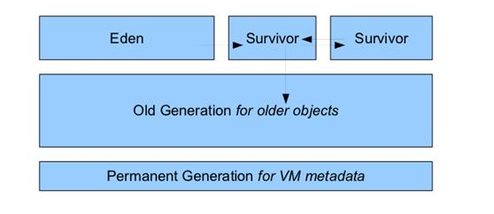

[toc]

参考于：[JavaGuide](https://snailclimb.gitee.io/javaguide/#/docs/java/jvm/Java%E5%86%85%E5%AD%98%E5%8C%BA%E5%9F%9F)

# JVM内存区域

## JDK1.8前后，JVM内存区域的变化

### 一、JDK1.8前


### 二、JDK1.8之后


## 线程共享

### 一、堆

Java 虚拟机所管理的内存中最大的一块，Java 堆是所有线程共享的一块内存区域，在虚拟机启动时创建。**此内存区域的唯一目的就是存放对象实例，几乎所有的对象实例以及数组都在这里分配内存。**

为什么说**几乎**呢？

答：**Java世界中“几乎”所有的对象都在堆中分配，但是，随着JIT编译期的发展与逃逸分析技术逐渐成熟，<u>栈上分配、标量替换</u>优化技术将会导致一些微妙的变化，所有的对象都分配到堆上也渐渐变得不那么“绝对”了。从jdk 1.7开始已经默认开启逃逸分析，如果某些方法中的对象引用没有被返回或者未被外面使用（也就是未逃逸出去），那么对象可以直接在栈上分配内存。**

Java 堆是垃圾收集器管理的主要区域，因此也被称作**GC 堆（Garbage Collected Heap）**.从垃圾回收的角度，由于现在收集器基本都采用分代垃圾收集算法，所以 Java 堆还可以细分为：新生代和老年代：再细致一点有：Eden 空间、From Survivor、To Survivor 空间等。**进一步划分的目的是更好地回收内存，或者更快地分配内存。**

---

在JDK1.7及以前，堆内存分为三部分：

1. 新生代【分为Eden区、Survivor from区、Survivor to区】8：1：1
2. 老生代
3. 永久代



JDK1.8之后方法区【HotSpot的永久代】被彻底移除【JDK1.7就已经开始】，取而代之的是元空间，元空间使用的是**直接内存**。


大部分情况下：对象都会首先在Eden区分类，再一次新生代垃圾回收后，如果对象还存活，则会进入from或to，之后就在from和to之间来回倒腾，且对象的年龄+1，年龄增加到一定程度【阈值默认15岁，阈值可通过参数`-XX:MaxTenuringThreshold`设置】，就会被晋升到老年代中。

> **Sets the maximum tenuring threshold for use in adaptive GC sizing. The largest value is 15. The default value is 15 for the parallel (throughput) collector, and 6 for the CMS collector.默认晋升年龄并不都是15，这个是要区分垃圾收集器的，CMS就是6.**

**动态年龄计算**

> “Hotspot遍历所有对象时，按照年龄从小到大对其所占用的大小进行累积，当累积的某个年龄大小超过了survivor区的一半时，取这个年龄和MaxTenuringThreshold中更小的一个值，作为新的晋升年龄阈值”。

> 堆中容易出现的错误：OOM，对于这种错误，表现形式有多种：
>
> 1. GC Overhead Limit Exceeded：当JVM花太多时间执行垃圾回收并且只能回收很少的堆空间时，就会发生此错误。
> 2. Java Heap Space：假如在创建新的对象时, 堆内存中的空间不足以存放新创建的对象, 就会引发该错误。【和本机物理内存无关，和你配置的内存大小有关】

### 二、方法区

- 存储已被虚拟机加载的类信息、常量、静态变量、即时编译器编译后的代码等数据。
- 虽然 **Java 虚拟机规范把方法区描述为堆的一个逻辑部分**，但是它却有一个别名叫做 **Non-Heap（非堆）**，目的应该是与 Java 堆区分开来。

#### 方法区与永久代的关系

> 《Java 虚拟机规范》只是规定了有方法区这么个概念和它的作用，并没有规定如何去实现它。那么，在不同的 JVM 上方法区的实现肯定是不同的了。 **方法区和永久代的关系很像 Java 中接口和类的关系，类实现了接口，而永久代就是 HotSpot 虚拟机对虚拟机规范中方法区的一种实现方式。** 也就是说，永久代是 HotSpot 的概念，方法区是 Java 虚拟机规范中的定义，是一种规范，而永久代是一种实现，一个是标准一个是实现，其他的虚拟机实现并没有永久代这一说法。

#### 常用参数

JDK1.8之前永久代还没被彻底移除的时候，调节方法区大小的参数：

```java
-XX:PermSize=N //方法区 (永久代) 初始大小
-XX:MaxPermSize=N //方法区 (永久代) 最大大小,超过这个值将会抛出 OutOfMemoryError 异常:java.lang.OutOfMemoryError: PermGen
```

相对而言，垃圾收集行为在这个区域比较少出现，但也是有的。

JDK1.8之后，方法区【hotSpot的永久代】被彻底移除【JDK1.7就已经开始了】，取而代之的是元空间，元空间使用的是直接内存，之后调节元空间大小的参数是：

```java
-XX:MetaspaceSize=N //设置 Metaspace 的初始（和最小大小）
-XX:MaxMetaspaceSize=N //设置 Metaspace 的最大大小
```

与永久代很大的不同是，如果不指定大小的话，随着类的创建，虚拟机会耗尽所有可用的系统内存。

#### 为什么要将永久代替换为元空间？

1. **整个永久代有一个 JVM 本身设置固定大小上限，无法进行调整，而元空间使用的是直接内存，受本机可用内存的限制**，虽然元空间仍旧可能溢出【元空间溢出的错误：java.lang.OutOfMemoryError: MetaSpace】，但是比原来出现的几率会更小。

2. 元空间里面存放的是类的元数据，这样加载多少类的元数据就不由MaxPermSize控制了，而由系统的实际可用空间来控制，加载的类更多。
3. 在 JDK8，合并 HotSpot 和 JRockit 的代码时, JRockit 从来没有一个叫永久代的东西, 合并之后就没有必要额外的设置这么一个永久代的地方了。

#### 运行时常量池

- 运行时常量池是方法区的一部分，Class文件中除了有类的版本、字段、方法、接口等描述信息外，还有一项信息是常量池表（Constant Pool Table），用于存放编译期生 成的各种字面量与符号引用，这部分内容将在类加载后存放到方法区的运行时常量池中。
- 运行时常量池相对于Class文件常量池的另外一个重要特征是具备动态性，Java语言并不要求常量 一定只有编译期才能产生，也就是说，并非预置入Class文件中常量池的内容才能进入方法区运行时常量池，运行期间也可以将新的常量放入池中，这种特性被开发人员利用得比较多的便是String类的 intern()方法。 

> String.intern() 是一个 Native 方法，它的作用是：如果运行时常量池中已经包含一个等于此 String 对象内容的字符串，则返回常量池中该字符串的引用；如果没有，JDK1.7之前（不包含1.7）的处理方式是在常量池中创建与此 String 内容相同的字符串，并返回常量池中创建的字符串的引用，JDK1.7以及之后的处理方式是在常量池中记录此字符串的引用，并返回该引用。

- 既然运行时常量池是方法区的一部分，自然受到方法区内存的限制，当常量池无法再申请到内存时会抛出OutOfMemoryError异常。

### 三、直接内存【非运行时数据区的一部分】

**直接内存并不是虚拟机运行时数据区的一部分，也不是虚拟机规范中定义的内存区域，但是这部分内存也被频繁地使用。而且也可能导致 OutOfMemoryError 错误出现。**

## 线程私有

### 一、程序计数器

- 可以看作是当前线程所执行的字节码的**行号指示器**。
- 字节码解释器通过改变程序计数器来依次读取指令，从而**实现代码的流程控制**，如：顺序执行、选择、循环、异常处理。
- 在多线程的情况下，**程序计数器用于记录当前线程执行的位置**，从而当线程被切换回来的时候能够知道该线程上次运行到哪儿了。

> 程序计数器是唯一一个不会出现OOM的内存区域，它的生命周期随线程的创建而创建，随着线程的结束而死亡。

### 二、虚拟机栈

- 生命周期和线程相同，描述的是 Java 方法执行的内存模型，每次方法调用的数据都是通过**栈**传递的。

- 虚拟机栈又一个个**栈帧**组成，每个栈帧中都有：局部变量表、操作数栈、动态链接、方法出口信息。
- Java内存粗略分为【堆内存】和【栈内存】、而栈大多说的就是虚拟机栈，或者说是虚拟机栈中的**局部变量部分**。
- **局部变量表**主要存放了**编译期可知的各种数据类型**【boolean、byte、char、short、int、float、long、double】、**对象引用**【reference 类型，它不同于对象本身，可能是一个指向对象起始地址的引用指针，也可能是指向一个代表对象的句柄或其他与此对象相关的位置】。

> 虚拟机栈可能出现的两个错误：
>
> - StackOverFlowError：若 Java 虚拟机栈的内存大小不允许动态扩展，那么当线程请求栈的深度超过当前 Java 虚拟机栈的最大深度的时候，就抛出 StackOverFlowError 错误。
> - OOM： 若 Java 虚拟机堆中没有空闲内存，并且垃圾回收器也无法提供更多内存的话。就会抛出 OutOfMemoryError 错误。
>
> 每个线程都有各自的 Java 虚拟机栈，而且随着线程的创建而创建，随着线程的死亡而死亡。

### 三、本地方法栈

和虚拟机栈所发挥的作用非常相似，区别是： **虚拟机栈为虚拟机执行 Java 方法 （也就是字节码）服务，而本地方法栈则为虚拟机使用到的 Native 方法服务。**

在 HotSpot 虚拟机中和 Java 虚拟机栈合二为一。

本地方法被执行的时候，在本地方法栈也会创建一个栈帧，用于存放该本地方法的局部变量表、操作数栈、动态链接、出口信息。

> 方法执行完毕后相应的栈帧也会出栈并释放内存空间，也会出现 StackOverFlowError 和 OutOfMemoryError 两种错误。

