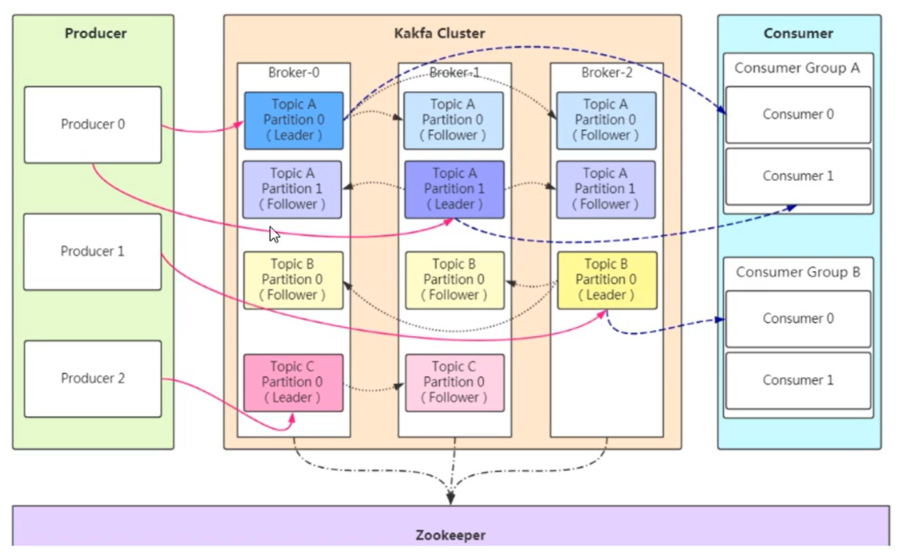

## Kafka架构设计

> 日志收集

Consumer Group 消费者组：消费者组内每个消费者负责消费不同分区的数据，提高消费能力。

Topic：将消息分类，生产者和消费者面向同一个Topic。

broker：集群中的节点。

Partition：实现扩展性，提高并发能力。**一个Topic以多个Partition的方式分布到多个Broker上，每个Partition是一个有序的队列**。一个topic的每个partition都有若干个副本，一个leader和若干个follower。发送数据和消费数据都是leader在做，follower负责实时从leader同步数据，保持和leader的数据同步。当leader发生故障时，某个follower还会成为新的leader。

Offset：消费者消费的位置信息，监控数据消费到什么位置，当消费者挂掉再重新恢复的时候，可以从消费位置继续消费。

Zookeeper：帮助kafka存储和管理集群信息。

## kafka消息丢失的场景及解决方案

