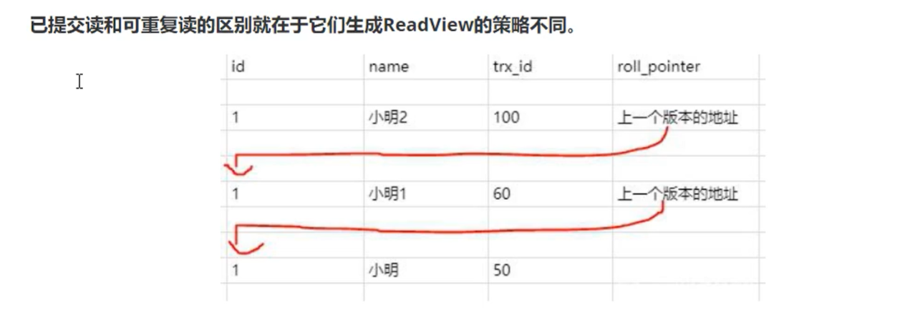
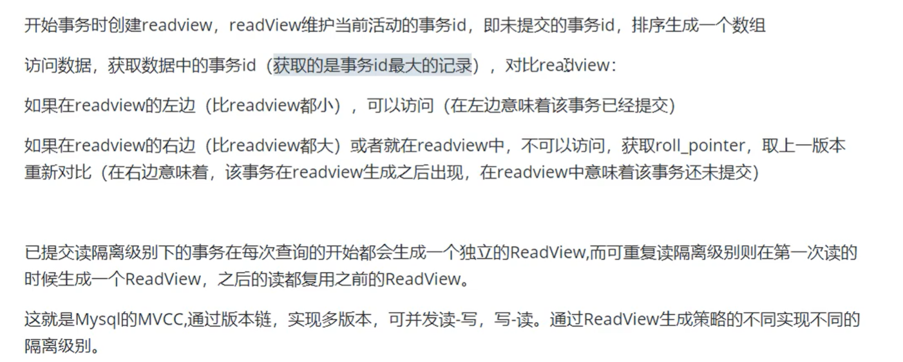

[toc]

## ACID

```
    1. Atomicity
        事务是不可分割的最小单元，事务内所有操作要么全部执行成功，要么全部失败回滚

    2. Isolation
        事务所作出的修改，在提交前，对于其他事务而言不可见
        
    3. Durability
        事务一旦提交，所作出的修改是永久的。
        
    4. Consistency
        系统从一个正确状态-->另一个正确状态
        
        
       【数据库】约束列值 不能小于0，则事务执行失败
       【应用层】约束 余额数据不能小于0，则应用层通过事务回滚保证约束
       
       没有约束，则事务执行成功，且保持了一致性。因为没有破坏约束。
       
     AID是数据库的特征，通过AID手段保证C这个最终目的。
```

## ACID如何保证

A原子性由undo log日志保证，记录了需要回滚的日志信息，事务回滚时撤销已经执行的sql。

C一致性由其他三大特性保证、程序代码需要保证业务上的一致性。

I隔离性由MVCC来保证。

D持久性由**内存+redolog**来保证，mysql修改数据同时再内存和redolog记录这次操作，宕机的时候可以从redolog恢复。

```
InnoDB redolog 写盘，InnoDB事务进入prepare状态

如果前面的prepare成功， binlog写盘，再继续将事务日志持久化到binlog，如果持久化成功，事务则进入commit状态（在redolog 里面写一个commit记录）

redolog的刷盘会在系统空闲时进行。
```

## 并发事务带来的问题

```
    1. 脏读 
        事务A 修改数据，但并未commit。而事务B读取该数据。 
    2. 丢失修改
        事务A 、B都读取同一个数据。事务A 、B先后修改数据，则 第一次修改操作丢失。
    3. 不可重复读
        事务A 共读取两次数据，而在这两次读取之间。事务B修改了数据。则事务A两次读取到的数据不同。
    4. 幻读 
        事务A 读取某数据不存在，事务B正好插入该条数据。事务A试图插入该数据发生冲突，就和产生幻觉一样。
```

幻读演示：

```sql
事务A
set autocommit = 0;
begin;
select * from t_user where id = 5; -- 没有数据

事务B
begin;
insert into t_user values(5, 'haha', 'haha');
commit;

事务A
insert into t_user values(5, 'hyh', 'hyh'); 
-- Duplicate entry '5' for key 't_user.PRIMARY'
select * from t_user where id = 5; -- 还是没有数据，但就是插不进去，跟鬼一样
```

## 事务隔离级别

查看事务隔离级别：

```sql
select @@transaction_isolation; 
show variables like 'transaction_isolation';
```

修改事务的隔离级别

```sql
set [session | global] transaction isolation level 
{READ UNCOMMITTED | READ COMMITTED | REPEATABLE READ | SERIALIZABLE};
```

事务使用

```sql
begin;
select * from user;
commit || rollback;
```

查看有多少事务正在运行

```sql
select * from information_schema.innodb_trx;
```

```
    1. Read-Uncommitted 读取未提交
        无论事务是否提交，直接【读取主记录】 
        即并发问题 =【脏读】+【不可重复读】+【幻读】
    2. Read-committed 读取已提交
        【读取最新版本的快照】，快照是事务提交后产生，但可能存在同一事务两次读取的快照不同。
        即并发问题 = 【不可重复读】+【幻读】
    3. Repeatable 可重复读
        【读取指定版本快照】，则事务多次读取某数据行的结果一致，但读取到的数据可能并非最新数据 。
        即并发问题 = 【幻读】
    4. Serializable 可串行化 
        上表锁，读写相互阻塞。效率低下。
        无并发问题 
        
    InnoDB引擎默认实现 可重复读隔离级别  Oracle默认是读已提交
    
    四种隔离级别都是有存在的意义的，根据具体场景选择。
```

## MVCC

```
【概念】：
 多版本并发控制：读取数据时通过一种类似快照的方式将数据保存下来，这样读锁就和写锁不冲突了，不同的事务session会看到自己特定版本的数据，版本链。

【目的】 ： 
    MVCC是行锁的变种，它想要尽可能地避免加锁操作，实现【非阻塞】读。从而提高处理并发事务的性能

【MVCC 实现的隔离级别】
    MVCC仅 Read Committed & REPEATABLE READ 两种隔离级别
    READ UNCOMMITTED 总是【读取最新】数据行 ，与MVCC的版本快照机制不符
    SERIALIZABLE 则 对读取的【数据行】都加锁 ，与MVCC 尽可能避免加锁的原则不符
    
【undolog】 记录数据行的某个历史版本，undolog以链表形式存在

RC 是读取 最新版本的 undolog
RR 是读取 某一指定老版本的undolog

【三个字段】
row_id: 隐含的自增id，数据库默认为该行记录生成的唯一隐式主键
trx_id: 用来存储每次对某条聚簇索引记录进行修改的时候的事务id。
roll_pointer: 回滚指针，配合undolog，指向上一版本
```





RC 每次查询开始都会生成独立的视图。

RR 在第一次读的时候生成一个视图，之后复用。

## 当前读和快照读

**当前读**

读取的记录是最新版本，读取时还要保证其他并发事务不能修改当前记录，会对读取的记录加锁。

像`select lock in share mode(共享锁), select for update ; update, insert ,delete(排他锁)`这些操作都是一种当前读，

**快照读**

串行级别没有快照读。

基于MVCC【维持一个数据的多个快照版本，使读写操作没有冲突】，快照读可能读到的并不一定是数据的最新版本，可能是历史版本。

像`select`操作就是快照读。

