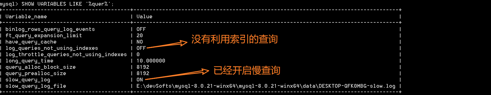

[toc]

# 其他知识点总结

## 简述关系型数据库与非关系型数据库

- **关系型数据库**（RDBMS）：就是建立在关系模型【二维表格模型】基础上的数据库，SQL 就是关系型数据库的查询语言。
  - 
- NoSQL 泛指非关系型数据库，包括了键值型数据库、文档型数据库、搜索引擎和列存储等，除此以外还包括图形数据库。

  - **键值型数据库**通过 Key-Value 键值的方式来存储数据，其中 Key 和 Value 可以是简单的对象，也可以是复杂的对象。优点： key作为唯一标识符，查找速度快。缺点： 无法像关系型数据库一样自由使用条件过滤，比如where。key-value典型的使用场景是作为内容缓存，Redis是最流行的键值型数据库。

  - **文档型数据库**：管理文档，在数据库中文档作为处理信息的基本单位，一个文档就相当于一条记录，MongoDB 是最流行的文档型数据库。
  - **搜索引擎**：搜索引擎的优势在于采用了全文搜索的技术，核心原理是“倒排索引”，Elasticsearch、Splunk 和 Solr。
  - **列式数据库**：相对于行式存储的数据库，Oracle、MySQL、SQL Server 等数据库都是采用的行式存储（Row-based），而列式数据库是将数据按照列存储到数据库中，这样做的好处是可以大量降低系统的 I/O，适合于分布式文件系统，不足在于功能相对有限，典型案例：HBase。
  - **图形数据库**，利用了图这种数据结构存储了实体（对象）之间的关系。数据模型主要是以节点和边（关系）来实现，特点在于能高效地解决复杂的关系问题。

## SQL语句的执行

```
1. 应用服务器与数据库服务器建立一个连接，应用服务器发送SQL请求

2. 数据库进程拿到【sql请求】，通过【连接器】验证SQL语句是否具有【权限】

3. 【分析器】进行 词法分析和语法分析。 
    词法分析 提取SQL语句关键元素 ： SELECT 、 表名 、 查询条件等
    语法分析 判断SQL语句是否正确 ：判断关键词是否正确

4. 【优化器】生成SQL【执行计划】
    
5. 【执行器】按照执行计划， 将数据读取到内存并进行逻辑处理

6. 通过连接，将数据传输给应用服务器 

7. 断开连接
```

## 数据库三大范式

第一范式： 每个列不可分离。

第二范式：非主键完全依赖主键。

第三范式：非主键只依赖主键，不依赖非主键。

## 反范式

为什么需要反范式？

虽然范式可以避免数据冗余，减少数据库的空间，减轻维护数据完整性的麻烦。

但导致数据库业务涉及的表变多，并且可能需要将涉及的业务表进行多表连接查询，这样将导致性能变差，且不利于分库分表。

因此，出于性能优先的考量，可能在数据库的结构中需要使用反模式的设计，即**空间换取时间，采取数据冗余的方式避免表之间的关联查询**。

**需要谨慎使用反模式设计数据库**。一般情况下，尽可能使用范式化的数据库设计，因为范式化的数据库设计能让产品更加灵活，并且能在数据库层保持数据完整性。

## 大表优化的一些方法

1. 限定数据的范围：查询语句 通过查询条件限定数据范围。

2. 数据库主从同步，读写分离 ： 主库写数据， 从库读数据。【负载均衡+  数据备份+ 高可用】

   主从同步的实现：

   - 主库记录数据库的所有变更记录到binlog
   - binlog有变动时，发送给从节点。
   - 从节点IO线程接收binlog内容，写入relay log
   - 从节点sql线程读取relay log，重放。
   
3. 垂直分区：

   优点：一行记录的数据量变少，查询时IO次数减少。

   缺点：1、主键冗余2、 引起join操作。

4. 水平分区

   将行数据分组存储到不同的【库||表】中。

   缺点：

   1. 在查询时，通常需要多个表名+union操作。
   2. 跨库join性能很差。
   3. 跨库的事务支持，逻辑复杂度和性能代价大。

## 分库分表后出现的问题

```
        (1). 【跨节点】的 count，order by ， group by 等【聚合函数】逻辑复杂
        (2). 【跨库】的join 性能代价大
        (3). 【主键ID问题】 ：MySQL原先主键自增机制，跨库情况下，存在主键重复的问题
           1)  若采用 UUID作为主键， 则UUID主键占用内存过大
           2)  多个数据库采用 跨步自增
           3) ...
        (4) 【事务支持】
```

## SQL优化

### where优化

1. 全表扫描：where， order by涉及的列上建立索引。
2. where条件中避免使用判断：`is null, !=, or, in`，这些条件会导致全表扫描。
3. 避免运行时解析的变量：避免左侧**函数调用**或算数计算。

## 慢查询的相关指令

**慢查询日志相关指令**

```sql
SHOW VARIABLES LIKE '%quer%'; -- 查看当前慢查询日志的开启情况
```



如果没有开启慢查询，开启一下：

```sql
set global slow_query_log = on;
```

```sql
--查询慢查询时间

show variables like 'long_query_time';

--修改慢查询时间

set long_query_time=1; ---但是重启mysql之后，long_query_time依然是my.ini中的值

-- 查看有多少条慢查询语句

SHOW GLOBAL STATUS LIKE '%slow_queries%';
```

## 关心过sql耗时吗？慢查询如何统计，如何优化？

在业务系统中，除了使用主键进行的查询，其他的都会在测试库上测试其耗时，慢查询的统计主要由运维在做，会定期将业务中的慢查询反馈给我们。

首先**搞明白慢的原因**？

1. 查询条件是否命中索引？
2. 是否load了不需要的数据列？
3. 数据量是否过大？

针对这三点解决：

1. 分析语句的执行计划，获得其使用索引的情况，之后修改语句或者修改索引，使得语句可以尽可能地命中索引。【尽可能去命中索引】
2. 分析语句，看看是否load了额外的数据，可能是查询了多余的行并且抛弃掉了，可能是加载了许多结果中并不需要的列，对语句进行分析以及重写。【未使用where限制范围，limit分页过大等】
3. 如果对语句的优化已经无法进行，可以考虑表中的数据量是否过大，如果是的话，可以进行横向或纵向的分表。【分库分表】【主从同步、读写分离】