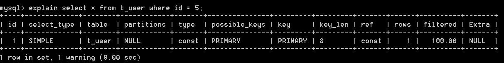
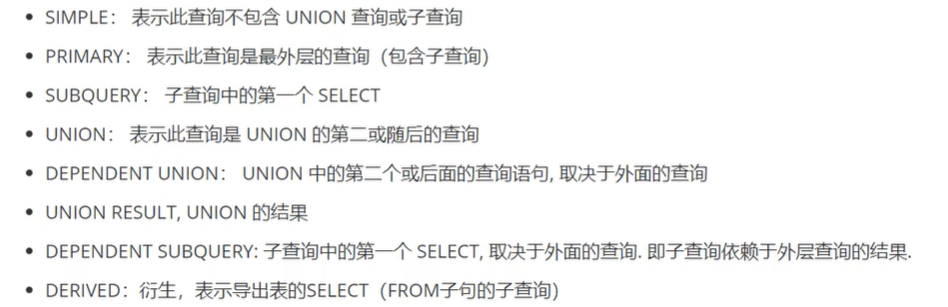

设计数据库会注意什么；

## 关心过sql耗时吗？慢查询如何统计，如何优化？

在业务系统中，除了使用主键进行的查询，其他的都会在测试库上测试其耗时，慢查询的统计主要由运维在做，会定期将业务中的慢查询反馈给我们。

首先**搞明白慢的原因**？

1. 查询条件是否命中索引？
2. 是否load了不需要的数据列？
3. 数据量是否过大？

针对这三点解决：

1. 分析语句的执行计划，获得其使用索引的情况，之后修改语句或者修改索引，使得语句可以尽可能地命中索引。
2. 分析语句，看看是否load了额外的数据，可能是查询了多余的行并且抛弃掉了，可能是加载了许多结果中并不需要的列，对语句进行分析以及重写。
3. 如果对语句的优化已经无法进行，可以考虑表中的数据量是否过大，如果是的话，可以进行横向或纵向的分表。

## mysql执行计划怎么看？

执行计划就是sql的执行查询顺序，以及如何使用索引查询，返回的结果集的行数。

一、id 查询的顺序号，有几个select就显示几行，id的顺序是按select出现的顺序增长的。id列的值越大执行优先级越高越先执行，id列的值相同则从上往下执行， id列的值为null最后执行。

二、select_type 查询中每个select子句的类型

三、table：标识该语句查询的表

四、type：优化sql的重要字段，也是判断sql性能和优化程度重要指标，他的取值类型范围：

- const：通过索引一次命中，匹配一行数据。
- system：表中只有一行记录，相当于系统表、
- eq_ref：唯一性索引扫描，对于每个索引键，表中只有一条记录与之匹配。
- ref：非唯一性索引扫描，返回匹配某个值的所有。
- range：只检索指定范围的行，使用一个索引来选择行，一般用于between，< , >。
- index：只遍历索引树。
- all：全表扫描，这个类型的查询是性能最差的查询之一。

> 执行效率：all< index < range < ref < eq_ref < const < system 避免all和index

五、possible_keys：它标识mysql在执行该sql语句的时候，可能用到的索引信息，仅仅是可能，实际不一定会用到。

六、key：此字段是mysql在当前查询时所使用到的索引，是possible_keys的子集。

七、key_len：查询优化器使用的索引的字节数，可以评估联合索引是否被完全使用，也是我们优化sql时，评估索引的重要指标。

八、ref

九、rows：mysql查询优化器根据统计信息，估算该sql返回结果集需要扫描读取的行数。这个值很重要，索引优化后，扫描读取的行数越多，说明索引设置不对，或者字段传入的类型之类的问题，说明要优化的空间越大。

十、filter：返回结果的行占需要读到的行rows的百分比，就是百分比越高，说明需要查询到数据越准确，百分比越小，说明查询到的数据量大，而结果集很少。

十一、extra：

- using filesort：标识mysql对结果集进行外部排序，不能通过索引顺序达到排序效果，一般有using filesort都建议优化去掉，因为这样的查询cpu资源消耗大，延时大。
- using index：覆盖索引扫描，标识查询在索引树种就可以查找所需要的数据，不用扫描表数据文件，往往说明性能不错。
- using temporary：查询有使用临时表，一般出现于排序，分组和夺表join的情况，查询效率不高，建议优化。
- using where：sql使用了where过滤，效率较高。

