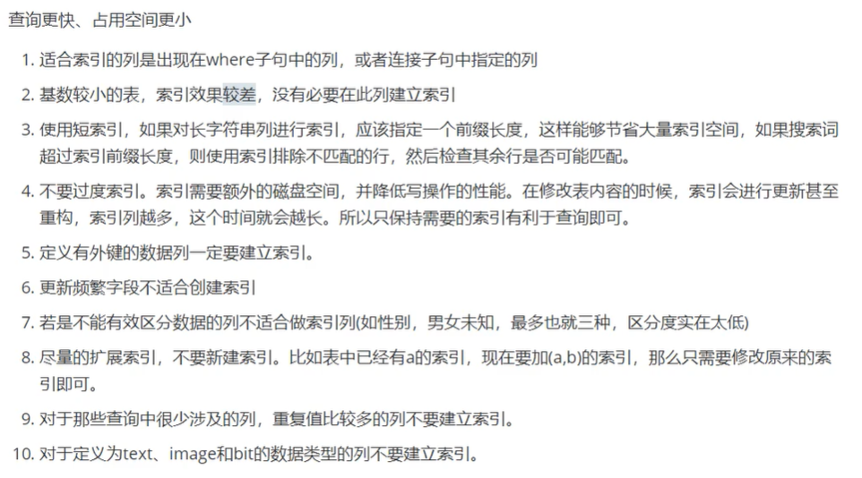
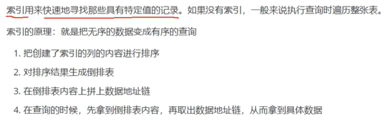
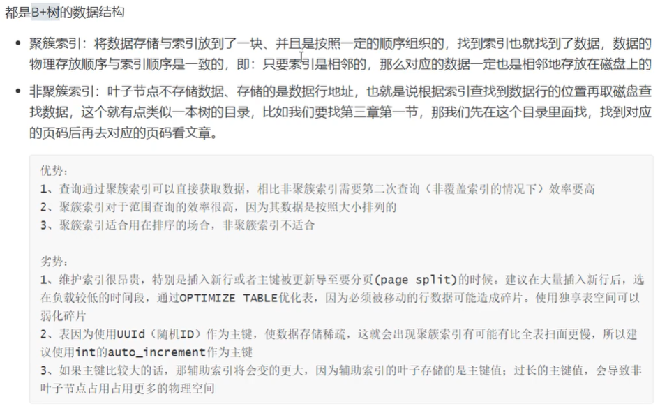
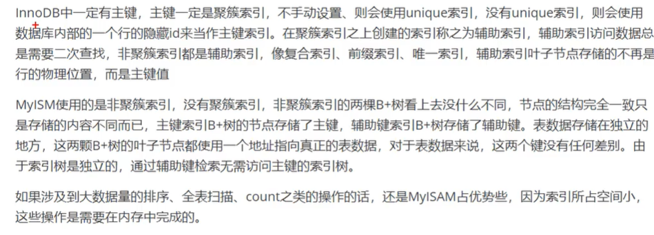

[TOC]

## MySQL类型对数据库性能的影响

### 索引类型

普通索引：允许被索引的数据列包含重复的值。

唯一索引：记录唯一性。

主键索引：特殊的唯一索引，一张表只能定义一个主键索引，主键用于唯一标识一条记录，使用primary key创建。

联合索引：索引可以覆盖多个列，index(col1, col2)索引。

全文索引：倒排索引，极大提升检索效率，解决判断字段是否包含的问题。alter table tb_user add fulltext(col)

### 对性能的影响

1. 极大提高数据的查询速度。

2. 使用索引，在查询过程种，使用优化隐藏器，提高性能。
3. 会降低插入、删除、更新表的速度，因为在执行写操作时，还需要操作索引文件。
4. 索引需要占物理空间，除了数据表占数据空间之外，每个索引还有占一定的物理空间，如果要建立聚簇索引，那么需要空间就会更大，如果非聚簇索引很多，一旦聚簇索引改变，非聚簇索引也会跟着变。

## MyISAM和InnoDB的区别

### MyISAM

不支持事务，但每次查询都是原子的。

支持表级锁，每次操作是对整个表加锁。

存储表的总行数，count速度很快。

拥有三个文件：索引文件、表结构文件、数据文件。

非聚簇索引：索引文件得数据域存储指向数据文件的指针，辅助索引与主索引基本一致，但辅助索引不用保证唯一性。

### InnoDB

支持ACID的事务，支持事务的四种隔离级别。

支持行级锁及外键约束：因此可以支持写并发。

不存储总行数。

一个InnoDB引擎存储在一个文件空间【共享表空间，表大小不受操作系统的控制，一个表可能分布在多个文件里】，也有可能为多个【设置为独立表空间，表大小受操作系统文件大小限制，一般为2G】受操作系统文件大小的限制。

主键索引采用聚集索引【索引的数据域存储数据文件本身】，辅助索引的数据域存储主键的值。因此从辅助索引查找数据，需要现通过辅助索引找到主键值，再访问辅助索引。最好使用自增主键，防止插入数据时，为维持B+树结构，文件大调整。

```
    1. 【是否支持行锁】
        MyISAM 仅支持表锁， InnoDB支持表锁和行锁
        
    2. 【是否支持事务】 
        MyISAM不支持事务，且不具备【崩溃恢复能力】。
        InnoDB 支持事务，提供回滚和崩溃恢复。
    
    3. 【是否支持外键】
        仅InnoDB支持外键 
    4. 【是否支持MVCC】
        仅InnoDB支持MVCC
    
    5. 【应用场景不同】
        MyISAM 适用 【Select】频繁，并发少
        InnoDB 适用 【Insert Delete Update】频繁，高并发

        因为 
        (1) MyISAM 仅缓存索引块，而InnoDB缓存 {索引+数据}
        (2) InnoDB 回表需要映射块，而MyISAM 直接映射数据地址
        (3) InnoDB 需要维护MVCC机制
        
    6.  MyISAM索引 和 InnoDB 索引 区别
        MyISAM 【索引】 叶子节点 = {key ， 行数据地址}
        
        InnoDB 【主键索引】 叶子节点 = {主键ID ， data数据}
        因此 InnoDB根据【主键】索引查询，不需要二次寻址，效率更高
        
        InnoDB 【二级索引】 叶子节点 = {key, 主键ID}
        如果实现索引覆盖，即 要查询列值 全部命中索引，则直接返回 非主键索引的内容
        如果未实现索引覆盖，则需要根据【主键ID】做回表
    
    7.  【存储结构不同】
        InnoDB 存储结构 = 索引和数据 集中存储
        MyISAM存储结构 = {表定义，MYD数据文件，MYI索引文件}
    
    8.  不带WHERE条件时，【count(*)效率不同 】
        MyISAM 自带计数器存储保存【总行数】，可直接返回结果
        InnoDB 扫描全表计算总行数
        
    
```

## B树和B+树的区别

```
1.  Mysql根据【磁盘IO次数】衡量查询效率，而【B+树磁盘IO次数更少】

    因为 B+树中【 非叶节点 = { 指针+key } 】
    而B树中 【非叶节点 = { 指针+ key + data数据 }】,
    每个节点(即每一页) 存储空间有限，B树节点存储的key较少，出度较小
    因此B树的节点较多(key总量固定)
    导致B树深度较大，磁盘IO次数多。
    
2.  B+树叶子节点通过指针连接，便于【区间访问】
```

**B树**

.png)

**B+树**

.png)

## 为什么是B+树，而不是红黑树？

B+树磁盘IO次数更少。

1. 红黑树的深度往往较大，磁盘IO次数和树高度成正比。
2. B树利用磁盘预读取特性，在建立节点时，申请物理连续的一页空间【磁盘预读取的多个磁盘款的总和】，从而实现一次磁盘IO读取一个节点，减少磁盘IO次数。 但红黑树逻辑较近的节点，其物理距离可能较远，无法利用磁盘预读取的特性。

## 索引的设计原则



## 索引的基本原理



## 索引应用场景

```sql
alter table table_name add index(字段名) 创建索引

1. where : where WHERE 筛选字段进行查询时，如果 该字段建立索引，则查询效率更高
2. order by : 使用order by将查询结果按照某个字段进行排序时，如果该字段不建立索引，查询出的数据会使用外部排序，涉及磁盘io，效率低， 
	但如果建立索引，由于索引有序， 会按照索引顺序逐条读出数据
3. 索引覆盖
	查询的字段都建立过索引，引擎会直接在索引表中查询而不访问原始数据，尽可能在select后只写必要的查询字段，以增加索引覆盖的几率。
```


## MySQL索引的数据结构，各自优劣

与存储引擎有关，hash索引，b+树索引。

哈希索引： 哈希表，单条记录查询。

```
(1) hash 索引的实现 
    底层数据结构 = hash表
    通过hash值定位数据行，产生碰撞则采用拉链法解决。
(2) hash索引的缺点 
    1. 适用于等值查询。
       但hash索引无法排序，因此不适用于范围查询，不支持最左匹配原则。
    2. 大量重复的键值，减低效率、
```

btree索引：

**磁盘预读取**

```
磁盘读取以【磁盘块】为基本单位。
【磁盘预读取】：每次读取多个【物理连续】的磁盘块
B树利用磁盘预读取特性。在建立节点时，申请【物理连续】的一页空间。
一页空间 = 磁盘预读取的 多个磁盘块总和
从而 【实现一次磁盘IO读取一个节点】，减少磁盘IO次数
```

b+树：平衡的多叉树，从根节点到每个叶子节点的高度值不超过1，而且同层级的节点间有指针相互连接。从根节点到叶子节点的搜索效率高。且基于索引的顺序扫描，也可以通过叶子节点的双向指针快速搜索。

## 聚簇索引与非聚簇索引的区别





## 最左前缀原则

联合索引 由多个列组成， 如（name, age)

查询时，列值从左到右匹配索引。

## 覆盖索引指的是？

```
在非聚集索引的叶子节点中 所含的列值是要查询的列值，不用进行回表。直接返回即可
```

## 索引这么快，为什么不对每个列建索引？

回答索引的缺点：

1. 增删改时，需要动态维护索引。
2. 索引占据物理空间，尤其聚簇索引。

