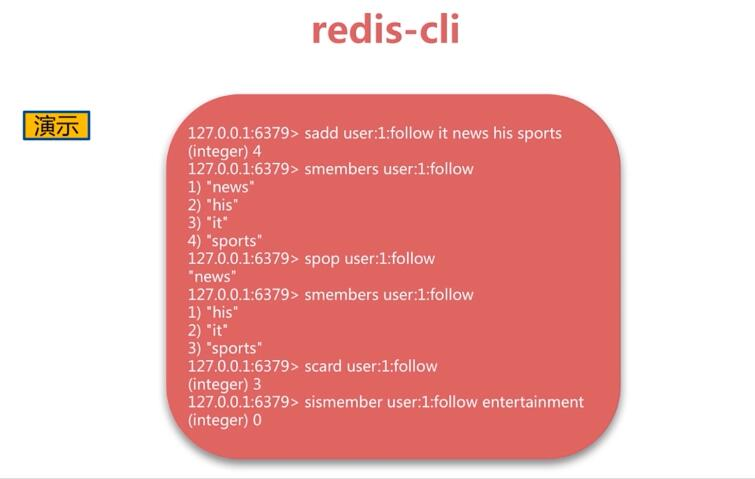
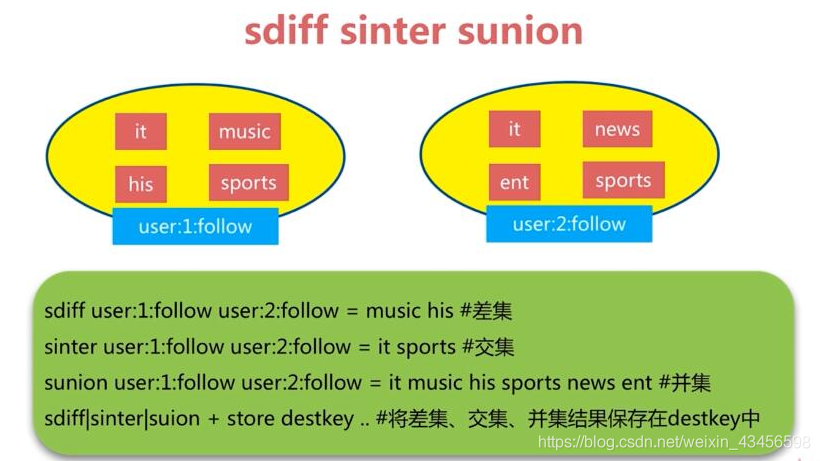

# 如何设计Redis Key

分段设计法：

1. 把表名转化为key前缀
2. 主键名
3. 主键值
4. 要存储的字段

例：`user:id:1:name` 

# Redis的基础数据类型和具体应用场景

> [Redis 数据类型及应用场景](https://segmentfault.com/a/1190000012212663)

## string

**概述**

string 类型是 Redis 中最基本的数据类型，最常用的数据类型，甚至被很多玩家当成 redis 唯一的数据类型去使用。string 类型在 redis 中是二进制安全(binary safe)的,这意味着 string 值关心二进制的字符串，不关心具体格式，你可以用它存储 json 格式或 JPEG 图片格式的字符串。

**底层实现**


**应用场景**

1. 存储某个字段的值： `set user:id:1:name summerday`
2. 存储json或其他对象格式化的对象： `set user:id:1 '[{"id":1,"name":"summerday"}]'`
3. 生成自增id：当redis的string类型是整数时，redis可以把它当作整数一样进行自增incr自减decr操作。

## list

**概述**

list 是按照插入顺序排序的字符串链表，可以在头部和尾部插入新的元素（双向链表实现，两端添加元素的时间复杂度为 O(1)）。插入元素时，如果 key 不存在，redis 会为该 key 创建一个新的链表，如果链表中所有的元素都被移除，该 key 也会从 redis 中移除。

**数据模型**


**应用场景**

1. 消息队列
2. 最新内容：两段附近的查询性能较好，适合查询最新数据场景。

## hash

**概述**

hash 类型很像一个关系型数据库的数据表，hash 的 Key 是一个唯一值，Value 部分是一个 hashmap 的结构。

hash数据类型在存储上述类型的数据时具有比 string 类型更灵活、更快的优势，具体的说，使用 string 类型存储，必然需要转换和解析 json 格式的字符串，即便不需要转换，在内存开销方面，还是 hash 占优势。

**应用场景**

适合存储对象类的数据：

```sql
hmset user:1 name summerday address hangzhou
```

## set

**概述**

　　set 数据类型是一个集合（没有排序，不重复），可以对 set 类型的数据进行添加、删除、判断是否存在等操作（时间复杂度是 O(1) ）
　　set 集合不允许数据重复，如果添加的数据在 set 中已经存在，将只保留一份。
　　set 类型提供了多个 set 之间的聚合运算，如求交集、并集、补集，这些操作在 redis 内部完成，效率很高。

**应用场景**

1. 共同好友列表：

```redis
// 这里为了方便阅读，把 id 替换成姓名
sadd user:wade james melo paul kobe
sadd user:james wade melo paul kobe
sadd user:paul wade james melo kobe
sadd user:melo wade james paul kobe

// 获取 wade 和 james 的共同好友
sinter user:wade user:james
/* 输出：
 *      1) "kobe"
 *      2) "paul"
 *      3) "melo"
 */
 
 // 获取香蕉四兄弟的共同好友
 sinter user:wade user:james user:paul user:melo
 /* 输出：
 *      1) "kobe"
 */
 
 /*
     类似的需求还有很多 , 必须把每个标签下的文章 id 存到集合中，可以很容易的求出几个不同标签下的共同文章；
 把每个人的爱好存到集合中，可以很容易的求出几个人的共同爱好。 
 */
```

## zset

**概述**

在 set 的基础上给集合中每个元素关联了一个分数，往有序集合中插入数据时会自动根据这个分数排序。

**应用场景**

```redis
// 用元素的分数（score）表示与好友的亲密度
zadd user:kobe 80 james 90 wade  85 melo  90 paul

// 根据“亲密度”给好友排序
zrevrange user:kobe 0 -1

/**
 * 输出：
 *      1) "wade"
 *      2) "paul"
 *      3) "melo"
 *      4) "james"
 */
 
// 增加好友的亲密度
zincrby user:kobe 15 james

// 再次根据“亲密度”给好友排序
zrevrange user:kobe 0 -1

/**
 * 输出：
 *      1) "james"
 *      2) "wade"
 *      3) "paul"
 *      2) "melo"
 */
 
 //类似的需求还出现在根据文章的阅读量或点赞量对文章列表排序
```

# Redis的set求交集的时间复杂度





> https://blog.csdn.net/weixin_43456598/article/details/100551692

