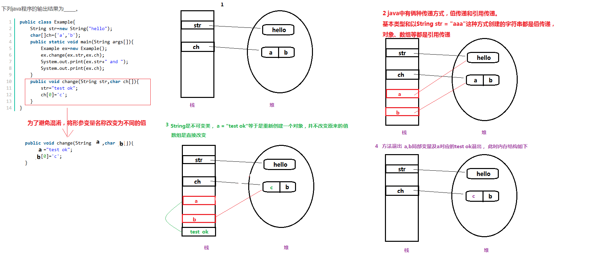

# 程序结果输出类题目

## String类

```java
public class Example{
    String str=new String("hello");
    char[]ch={'a','b'};
    public static void main(String args[]){
        Example ex=new Example();
        ex.change(ex.str,ex.ch);
        System.out.print(ex.str+" and ");
        System.out.print(ex.ch);
    }
    public void change(String str,char ch[]){
        str="test ok";
        ch[0]='c';
    }
}
// 正确答案 hello and cb
```



大致如上图所示，需要注意绿色的Test Ok实在字符串常量池中创建，而不是图中的栈区。

## 类加载相关

```java
package NowCoder;
class Test {
    public static void hello() {
        System.out.println("hello");
    }
}
public class MyApplication {
    public static void main(String[] args) {
        // TODO Auto-generated method stub
        Test test = null;
        test.hello();
    }
}
// 正确结果： 能编译通过，并正确运行
```

关于结果的解释：[https://www.nowcoder.com/profile/710353654/test/38531333/56439#summary](https://www.nowcoder.com/profile/710353654/test/38531333/56439#summary)


# 在创建派生类对象，构造函数的执行顺序

```java
public class ExtendsTest {

    public static void main(String[] args) {
        A c = new  B();
    }

}

class A{
    static
    {
        System.out.println("A 基类静态域 ");
    }
    {
        System.out.println("A 基类对象成员构造函数");
    }
    public A(){
        System.out.println("A 基类本身的构造函数");
    }
}
class B extends A{
    static
    {
        System.out.println("B 派生类静态域");
    }
    {
        System.out.println("B 派生类对象成员构造函数");
    }
    public B(){
        System.out.println("B 派生类本身的构造函数");
    }
}
// 输出结果
A 基类静态域 
B 派生类静态域
A 基类对象成员构造函数
A 基类本身的构造函数
B 派生类对象成员构造函数
B 派生类本身的构造函数
```

# 二维数组的创建

```java
float f[][] = new float[6][6];
float []f[] = new float[6][6];
float [][]f = new float[6][6];
float [][]f = new float[6][];
```

以上都是正确的：

- 行必须指定。
- `[][]`和变量名的顺序可以不定。

