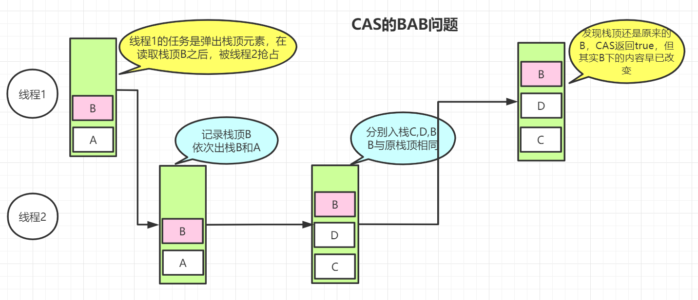

[toc]

> 本文基于JDK1.8

# Atomic原子类

原子类是具有原子操作特征的类。

原子类存在于`java.util.concurrent.atmic`包下。

根据操作的数据类型，原子类可以分为以下几类。

## 基本类型

- AtomicInteger：整型原子类
- AtomicLong：长整型原子类
- AtomicBoolean：布尔型原子类

### AtomicInteger的常用方法

```java
public final int get() //获取当前的值
public final int getAndSet(int newValue)//获取当前的值，并设置新的值
public final int getAndIncrement()//获取当前的值，并自增
public final int getAndDecrement() //获取当前的值，并自减
public final int getAndAdd(int delta) //加上给定的值，并返回之前的值
public final int addAndGet(int delta) //加上给定的值，并返回最终结果
boolean compareAndSet(int expect, int update) //如果输入的数值等于预期值，则以原子方式将该值设置为输入值（update）
public final void lazySet(int newValue)//最终设置为newValue,使用 lazySet 设置之后可能导致其他线程在之后的一小段时间内还是可以读到旧的值。
```

### AtomicInteger常见方法的使用

```java
@Test
public void AtomicIntegerT() {

    AtomicInteger c = new AtomicInteger();

    c.set(10);
    System.out.println("初始设置的值 ==>" + c.get());

    int andAdd = c.getAndAdd(10);
    System.out.println("为原先的值加上10,并返回原先的值,原先的值是 ==> " + andAdd + "加上之后的值是 ==> " + c.get());

    int finalVal = c.addAndGet(5);
    System.out.println("加上5, 之后的值是 ==> " + finalVal);

    int i = c.incrementAndGet();
    System.out.println("++1,之后的值为 ==> " + i);
    
    int result = c.updateAndGet(e -> e + 3);
    System.out.println("可以使用函数式更新 + 3 计算后的结果为 ==> "+ result);

    int res = c.accumulateAndGet(10, (x, y) -> x + y);
    System.out.println("使用指定函数计算后的结果为 ==>" + res);
}

初始设置的值 ==>10
为原先的值加上10,并返回原先的值,原先的值是 ==> 10 
加上之后的值是 ==> 20
加上5, 之后的值是 ==> 25
++1,之后的值为 ==> 26
可以使用函数式更新 + 3 计算后的结果为 ==> 29
使用指定函数计算后的结果为 ==>39
```

### AtomicInteger保证原子性

我们知道，volatile可以保证可见性和有序性，但是不能保证原子性，因此，以下的代码在并发环境下的结果会不正确：最终的结果可能会小于10000。

```java
public class AtomicTest {

    static CountDownLatch c = new CountDownLatch(10);
    public volatile int inc = 0;

    public static void main(String[] args) throws InterruptedException {

        final AtomicTest test = new AtomicTest();
        for (int i = 0; i < 10; i++) {
            new Thread(() -> {
                for (int j = 0; j < 1000; j++) {
                    test.increase();
                }
                c.countDown();
            }).start();
        }
        c.await();
        System.out.println(test.inc);

    }
    //不是原子操作, 先读取inc的值, inc + 1, 写回内存
    public void increase() {
        inc++;
    }
}
```

想要解决最终结果不是10000的办法有两个：

- 使用synchronized关键字，修饰increase方法，锁可以保证该方法某一时刻只能有一个线程执行，保证了原子性。

```java
    public synchronized void increase() {
        inc++;
    }
```

- 使用Atomic原子类，比如这里的`AtomicInteger`。

```java
public class AtomicTest {

    static CountDownLatch c = new CountDownLatch(10);

    // 使用整型原子类 保证原子性
    public AtomicInteger inc = new AtomicInteger();

    public static void main(String[] args) throws InterruptedException {

        final AtomicTest test = new AtomicTest();
        for (int i = 0; i < 10; i++) {
            new Thread(() -> {
                for (int j = 0; j < 1000; j++) {
                    test.increase();
                }
                c.countDown();
            }).start();
        }
        c.await();
        System.out.println(test.getCount());
    }

    // 获取当前的值，并自增
    public void increase() {
        inc.getAndIncrement();
    }

    // 获取当前的值
    public int getCount() {
        return inc.get();
    }
}
```

### getAndIncrement()方法的实现

getAndIncrement方法是如何确保原子操作的呢？

```java
    private static final Unsafe unsafe = Unsafe.getUnsafe();
    private static final long valueOffset;

    static {
        try {
            //objectFieldOffset本地方法，用来拿到“原来的值”的内存地址。
            valueOffset = unsafe.objectFieldOffset
                (AtomicInteger.class.getDeclaredField("value"));
        } catch (Exception ex) { throw new Error(ex); }
    }
	//value在内存中可见，JVM可以保证任何时刻任何线程总能拿到该变量的最新值
    private volatile int value;   


	public final int incrementAndGet() {
        return unsafe.getAndAddInt(this, valueOffset, 1) + 1;
    }
```

openjdk1.8Unsafe类的源码：[Unsafe.java](http://hg.openjdk.java.net/jdk8/jdk8/jdk/file/687fd7c7986d/src/share/classes/sun/misc/Unsafe.java)

```java
    /**
     * Atomically adds the given value to the current value of a field
     * or array element within the given object <code>o</code>
     * at the given <code>offset</code>.
     *
     * @param o object/array to update the field/element in
     * @param offset field/element offset
     * @param delta the value to add
     * @return the previous value
     * @since 1.8
     */
    public final int getAndAddInt(Object o, long offset, int delta) {
        int v;
        do {
            v = getIntVolatile(o, offset);
        } while (!compareAndSwapInt(o, offset, v, v + delta));
        return v;
    }
```

Java的源码改动是有的，《Java并发编程的艺术》的内容也在此摘录一下，相对来说更好理解一些：

```java
    public final int getAddIncrement() {
        for ( ; ; ) {
            //先取得存储的值
            int current = get();
            //加1操作
            int next = current + 1;
            // CAS保证原子更新操作，如果输入的数值等于预期值，将值设置为输入的值
            if (compareAndSet(current, next)) {
                return current;
            }
        }
    }

    public final boolean compareAndSet(int expect, int update) {
        return unsafe.compareAndSwapInt(this, valueOffset, expect, update);
```

## 数组类型

- AtomicIntegerArray：整型数组原子类
- AtomicLongArray：长整型数组原子类
- AtomicReferenceArray ：引用类型数组原子类

### AtomicIntegerArray的常用方法

```java
@Test
public void AtomicIntegerArrayT() {

    int[] nums = {1, 2, 3, 4, 5};
    AtomicIntegerArray c = new AtomicIntegerArray(nums);

    for (int i = 0; i < nums.length; i++) {
        System.out.print(c.get(i) + " ");
    }
    System.out.println();

    int finalVal = c.addAndGet(0, 10);
    System.out.println("索引为 0 的值 加上 10  ==> " + finalVal);

    int i = c.incrementAndGet(0);
    System.out.println("索引为 0 的值 ++1,之后的值为 ==> " + i);

    int result = c.updateAndGet(0, e -> e + 3);
    System.out.println("可以使用函数式更新索引为0 的位置 + 3 计算后的结果为 ==> " + result);

    int res = c.accumulateAndGet(0, 10, (x, y) -> x * y);
    System.out.println("使用指定函数计算后的结果为 ==> " + res);
}
```

## 引用类型

基本类型原子类只能更新一个变量，如果需要原子更新多个变量，需要使用 引用类型原子类。

- AtomicReference：引用类型原子类
- AtomicMarkableReference：原子更新带有标记的引用类型，无法解决ABA问题，该类的标记更多用于**表示引用值是否已逻辑删除**。
- AtomicStampedReference ：原子更新带有版本号的引用类型。该类将整数值与引用关联起来，**可用于解决原子的更新数据和数据的版本号**，可以解决使用 CAS 进行原子更新时可能出现的 ABA 问题。

### AtomicReference常见方法的使用

```java
@Test
public void AtomicReferenceT(){

    AtomicReference<Person> ar = new AtomicReference<>();
    Person p = new Person(18,"summer");

    ar.set(p);

    Person pp = new Person(50,"dan");
    ar.compareAndSet(p, pp);// except = p  update = pp

    System.out.println(ar.get().getName());
    System.out.println(ar.get().getAge());

}
@Data
@AllArgsConstructor
@NoArgsConstructor
class Person{

    int age;
    String name;
}
//dan
//50
```

## 对象的属性修改类型 

如果需要**原子更新某个类里的某个字段**时，需要用到对象的属性修改类型原子类。

- AtomicIntegerFieldUpdater:原子更新整型字段的更新器
- AtomicLongFieldUpdater：原子更新长整型字段的更新器
- AtomicReferenceFieldUpdater：原子更新引用类型里的字段

要想原子地更新对象的属性需要两步。

1. 因为对象的属性修改类型原子类都是抽象类，所以每次使用都必须使用静态方法 newUpdater()创建一个更新器，并且需要设置想要更新的类和属性。
2. 更新的对象属性必须使用 public volatile 修饰符。

### AtomicIntegerFieldUpdater常用方法的使用

```java
@Test
public void AtomicIntegerFieldUpdateTest(){
    AtomicIntegerFieldUpdater<Person> a =
        AtomicIntegerFieldUpdater.newUpdater(Person.class,"age");
    Person p = new Person(18,"summer");
    System.out.println(a.getAndIncrement(p)); //18
    System.out.println(a.get(p)); //19
}
@Data
@AllArgsConstructor
@NoArgsConstructor
class Person{

    public volatile int age;
    private String name;
}
```


## Java8新增的原子操作类

- LongAdder

由于AtomicLong通过CAS提供非阻塞的原子性操作，性能已经很好，在高并发下大量线程竞争更新同一个原子量，但只有一个线程能够更新成功，这就造成大量的CPU资源浪费。

LongAdder 通过让多个线程去竞争多个Cell资源，来解决，再很高的并发情况下,线程操作的是Cell数组，并不是base，在cell元素不足时进行2倍扩容，在高并发下性能高于AtomicLong

# CAS的ABA问题的产生

假设两个线程访问同一变量x。

1. 第一个线程获取到了变量x的值A，然后执行自己的逻辑。
2. 这段时间内，第二个线程也取到了变量x的值A，然后将变量x的值改为B，然后执行自己的逻辑，最后又把变量x的值变为A【还原】。
3. 在这之后，第一个线程终于进行了变量x的操作，但此时变量x的值还是A，以为x的值没有变化，所以compareAndSet还是会成功执行。

先来看一个值变量产生的ABA问题，理解一下ABA问题产生的流程：

```java
@SneakyThrows
@Test
public void test1() {
    AtomicInteger atomicInteger = new AtomicInteger(10);

    CountDownLatch countDownLatch = new CountDownLatch(2);

    new Thread(() -> {
        atomicInteger.compareAndSet(10, 11);
        atomicInteger.compareAndSet(11,10);
        System.out.println(Thread.currentThread().getName() + "：10->11->10");
        countDownLatch.countDown();
    }).start();

    new Thread(() -> {
        try {
            TimeUnit.SECONDS.sleep(1);
            boolean isSuccess = atomicInteger.compareAndSet(10,12);
            System.out.println("设置是否成功：" + isSuccess + ",设置的新值：" + atomicInteger.get());
        } catch (InterruptedException e) {
            e.printStackTrace();
        }
        countDownLatch.countDown();
    }).start();

    countDownLatch.await();
}
//输出：线程2并没有发现初始值已经被修改
//Thread-0：10->11->10
//设置是否成功：true,设置的新值：12
```

ABA问题存在，但可能对值变量并不会造成结果上的影响，但是考虑一种特殊的情况：

[https://zhuanlan.zhihu.com/p/237611535](https://zhuanlan.zhihu.com/p/237611535)



1. 线程1和线程2并发访问ConcurrentStack。
2. 线程1执行出栈【预期结果是弹出B，A成为栈顶】，但在读取栈顶B之后，被线程2抢占。
3. 线程2记录栈顶B，依次弹出B和A，再依次将C，D，B入栈，且保证B就是原栈顶记录的B。
4. 之后轮到线程1，发现栈顶确实是期望的B，遂弹出B，但此时栈顶已经是D，就出现了错误。

# BAB的问题如何解决

AtomicStampedReference **原子更新带有版本号的引用类型**。该类将整数值与引用关联起来，可用于解决原子的更新数据和数据的版本号，可以解决使用 CAS 进行原子更新时可能出现的 ABA 问题。

```java
@SneakyThrows
@Test
public void test2() {
    AtomicStampedReference<Integer> atomicStampedReference = new AtomicStampedReference(10,1);

    CountDownLatch countDownLatch = new CountDownLatch(2);

    new Thread(() -> {
        System.out.println(Thread.currentThread().getName() + " 第一次版本：" + atomicStampedReference.getStamp());
        atomicStampedReference.compareAndSet(10, 11, atomicStampedReference.getStamp(), atomicStampedReference.getStamp() + 1);
        System.out.println(Thread.currentThread().getName() + " 第二次版本：" + atomicStampedReference.getStamp());
        atomicStampedReference.compareAndSet(11, 10, atomicStampedReference.getStamp(), atomicStampedReference.getStamp() + 1);
        System.out.println(Thread.currentThread().getName() + " 第三次版本：" + atomicStampedReference.getStamp());
        countDownLatch.countDown();
    }).start();

    new Thread(() -> {
        System.out.println(Thread.currentThread().getName() + " 第一次版本：" + atomicStampedReference.getStamp());
        try {
            TimeUnit.SECONDS.sleep(2);
            boolean isSuccess = atomicStampedReference.compareAndSet(10,12, atomicStampedReference.getStamp(), atomicStampedReference.getStamp() + 1);
            System.out.println(Thread.currentThread().getName() + " 修改是否成功：" + isSuccess + " 当前版本：" + atomicStampedReference.getStamp() + " 当前值：" + atomicStampedReference.getReference());
            countDownLatch.countDown();
        } catch (InterruptedException e) {
            e.printStackTrace();
        }
    }).start();

    countDownLatch.await();
}
//输出
//输出
Thread-0 第一次版本：1
Thread-0 第二次版本：2
Thread-0 第三次版本：3
Thread-1 第一次版本：3
Thread-1 修改是否成功：true 当前版本：4 当前值：12
```

而AtomicMarkableReference 通过标志位，标志位只有true和false，每次更新标志位的话，在第三次的时候，又会变得跟第一次一样，并不能解决ABA问题。

```java
@SneakyThrows
@Test
public void test3() {
    AtomicMarkableReference<Integer> markableReference = new AtomicMarkableReference<>(10, false);

    CountDownLatch countDownLatch = new CountDownLatch(2);

    new Thread(() -> {
        System.out.println(Thread.currentThread().getName() + " 第一次标记：" + markableReference.isMarked());
        markableReference.compareAndSet(10, 11, markableReference.isMarked(), true);
        System.out.println(Thread.currentThread().getName() + " 第二次标记：" + markableReference.isMarked());
        markableReference.compareAndSet(11, 10, markableReference.isMarked(), false);
        System.out.println(Thread.currentThread().getName() + " 第三次标记：" + markableReference.isMarked());
        countDownLatch.countDown();
    }).start();

    new Thread(() -> {
        System.out.println(Thread.currentThread().getName() + " 第一次标记：" + markableReference.isMarked());
        try {
            TimeUnit.SECONDS.sleep(2);
            boolean isSuccess = markableReference.compareAndSet(10,12, false, true);
            System.out.println(Thread.currentThread().getName() + " 修改是否成功：" + isSuccess + " 当前标记：" + markableReference.isMarked() + " 当前值：" + markableReference.getReference());
            countDownLatch.countDown();
        } catch (InterruptedException e) {
            e.printStackTrace();
        }
    }).start();

    countDownLatch.await();
}
//输出
Thread-0 第一次标记：false
Thread-0 第二次标记：true
Thread-0 第三次标记：false
Thread-1 第一次标记：false
Thread-1 修改是否成功：true 当前标记：true 当前值：12
```

# 参考

- JavaGuide
- 《Java并发编程的艺术》方腾飞

- [https://www.yuque.com/itsaysay/mzsmvg/2.java-concurrent#db7421c2](https://www.yuque.com/itsaysay/mzsmvg/2.java-concurrent#db7421c2)