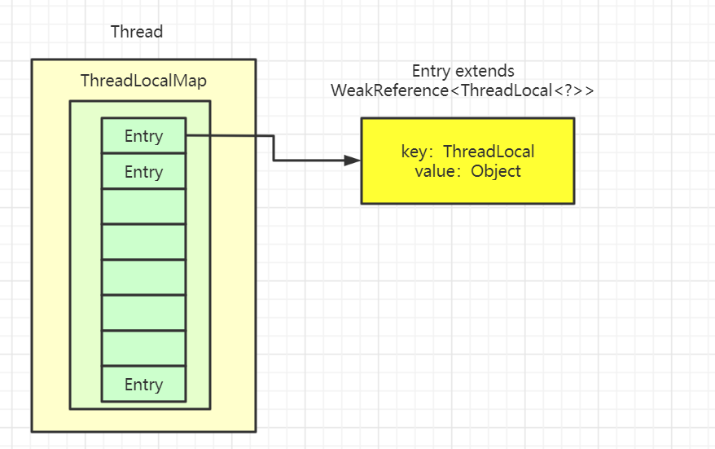

[toc]

> 本文基于JDK1.8

# ThreadLocal是啥？用来干啥？

```java
public class Thread implements Runnable {
	//线程内部局部变量
    ThreadLocal.ThreadLocalMap threadLocals = null;
	//子线程继承父线程的变量
    ThreadLocal.ThreadLocalMap inheritableThreadLocals = null;
}
```

Java官方对**ThreadLocal类的定义**如下：

- ThreadLocal类用于提供线程内部的局部变量。
- 这种变量在多线程环境下访问（通过`get`和`set`方法访问）时能保证各个线程的变量相对独立于其他线程内的变量。
- `ThreadLocal`实例通常来说都是`private static`类型的，用于关联线程和线程上下文。

**ThreadLocal的作用**：

`ThreadLocal`的作用是提供线程内的局部变量，不同的线程之间不会相互干扰，这种变量在线程的生命周期内起作用，减少同一个线程内多个函数或组件之间一些公共变量的传递的复杂度。

# ThreadLocal的简单使用

```java
/**
 * 官方demo,测试ThreadLocal的用法
 * 
 * @author Summerday
 */
public class ThreadLocalTest {

    public static void main(String[] args) {
        // main Thread
        incrementSameThreadId();
        new Thread(ThreadLocalTest::incrementSameThreadId).start();
        new Thread(ThreadLocalTest::incrementSameThreadId).start();
    }

    private static void incrementSameThreadId() {
        try {
            for (int i = 0; i < 3; i++) {
                System.out.println(Thread.currentThread() + "_" + i + ",threadId:" + ThreadLocalId.get());
            }
        } finally {
            // 使用后请清除
            ThreadLocalId.remove();
        }
    }

}

class ThreadLocalId {
    // Atomic integer containing the next thread ID to be assigned
    private static final AtomicInteger nextId = new AtomicInteger(0);

    // Thread local variable containing each thread's ID
    private static final ThreadLocal<Integer> threadId = new ThreadLocal<Integer>() {
        @Override
        protected Integer initialValue() {
            return nextId.getAndIncrement();
        }
    };

    // Returns the current thread's unique ID, assigning it if necessary
    public static int get() {
        return threadId.get();
    }

    // remove currentid
    public static void remove() {
        threadId.remove();
    }
}
```

```java
//输出
Thread[main,5,main]_0,threadId:0
Thread[main,5,main]_1,threadId:0
Thread[main,5,main]_2,threadId:0
Thread[Thread-0,5,main]_0,threadId:1
Thread[Thread-0,5,main]_1,threadId:1
Thread[Thread-0,5,main]_2,threadId:1
Thread[Thread-1,5,main]_0,threadId:2
Thread[Thread-1,5,main]_1,threadId:2
Thread[Thread-1,5,main]_2,threadId:2
```

# ThreadLocal的实现思路？



- Thread类中有一个类型为`ThreadLocal.ThreadLocalMap`的实例变量threadLocals，意味着**每个线程都有一个自己的ThreadLocalMap**。
- 可以简单地**将key视作ThreadLocal，value为代码中放入的值**（实际上key并不是ThreadLocal本身，而是它的一个弱引用）。
- 每个线程在往某个ThreadLocal里塞值的时候，都会往自己的ThreadLocalMap里存，读也是以某个ThreadLocal作为引用，在自己的map里找对应的key，从而实现了线程隔离。

# ThreadLocal常见方法源码分析

## ThreadLocal.set(T value)

```java
    public void set(T value) {
        //获取到当前的线程对象
        Thread t = Thread.currentThread();
        //进而获取此线程对象中维护的ThreadLocalMap对象
        ThreadLocalMap map = getMap(t);
        //如果ThreadLocalMap存在，则以当前的ThreadLocal为key，value作为值设置entry
        if (map != null)
            map.set(this, value);
        else
            //调用createMap进行ThreadLocalMap对象的初始化，并将此实体作为第一个值
            createMap(t, value);
    }
	//创建一个与线程t关联的ThreadLocalMap
	void createMap(Thread t, T firstValue) {
        t.threadLocals = new ThreadLocalMap(this, firstValue);
    }
```

## ThreadLocal.get()

```java
    public T get() {
        //获取到当前的线程对象
        Thread t = Thread.currentThread();
        //进而获取此线程对象中维护的ThreadLocalMap对象
        ThreadLocalMap map = getMap(t);
        //如果此map存在
        if (map != null) {
            //以当前的ThreadLocal 为 key，调用getEntry获取对应的存储实体e
            ThreadLocalMap.Entry e = map.getEntry(this);
            //找到对应的存储实体 e
            if (e != null) {
                @SuppressWarnings("unchecked")
                T result = (T)e.value;
                return result;
            }
        }
        //如果map不存在，调用setInitialValue进行初始化
        return setInitialValue();
    }

    private T setInitialValue() {
        //调用initialValue获取初始化的值
        T value = initialValue();
        //获取当前线程对象
        Thread t = Thread.currentThread();
        //获取此线程对象中维护的ThreadLocalMap对象
        ThreadLocalMap map = getMap(t);
        //如果此map存在
        if (map != null)
            //存在则调用map.set设置此实体entry
            map.set(this, value);
        else
            ////调用createMap进行ThreadLocalMap对象的初始化，并将此实体作为第一个值
            createMap(t, value);
        return value;
    }

    ThreadLocalMap getMap(Thread t) {
        return t.threadLocals;
    }
```

## ThreadLocal.remove()

```java
     public void remove() {
         ThreadLocalMap m = getMap(Thread.currentThread());
         if (m != null)
             //以当前ThreadLocal为key删除对应的实体entry
             m.remove(this);
     }

```

可以发现，ThreadLocal的这些方法，都是通过当前线程找到对应的map，其实都是对其维护的ThreadLocalMap这个对象进行的操作，这些细节后面探讨。

# ThreadLocalMap源码分析

## ThreadLocalMap结构分析

ThreadLocalMap的底层实现是一个定制的自定义HashMap：

- `Entry[] table` ：底层是一个Entry类型的数组，必要时需要进行扩容，数组的长度必须是**2的n次幂**，为了在Hash时效率更高：当n为2的n此幂时，`hashCode % len` 与`hashCode & (len -1)`效果相同，但位运算效率更高。
- `int threshold`：下次扩容时的阈值，`threshold  = len * 2 / 3`。当`size >= threshold`时，遍历`table`并删除`key`为`null`的元素，如果删除后`size >= threshold * 3 / 4`时，需要对`table`进行扩容。
- Entry：是哈希表存储的核心元素，Entry继承了弱引用。
  - ThreadLocal<?> k：当前存储的ThreadLocal实例。
  - object value：当前ThreadLocal对应存储的值。

Entry继承了弱引用，这样会导致`Entry[]table`中的每个数据可能会有三种状态：

- entry不为null，且key不为null，正常数据。
- entry不为null，但key为null，表示过期数据。
- entry == null。

```java
    static class ThreadLocalMap {

        /**
         * 实体Entry在此hash map中是继承弱引用 WeakReference, 
         * 使用ThreadLocal 作为 key 键.
         */
        static class Entry extends WeakReference<ThreadLocal<?>> {
            /** 当前 ThreadLocal 对应储存的值value. */
            Object value;

            Entry(ThreadLocal<?> k, Object v) {
                super(k);
                value = v;
            }
        }

        /**
         * 初始容量大小 16 -- 必须是2的n次方.
         */
        private static final int INITIAL_CAPACITY = 16;

        /**
         * 底层哈希表 table, 必要时需要进行扩容.
         * 底层哈希表 table.length 长度必须是2的n次方.
         */
        private Entry[] table;

        /**
         * 实际存储键值对元素个数 entries.
         */
        private int size = 0;

        /**
         * 下一次扩容时的阈值
         */
        private int threshold; // 默认为 0

        /**
         * 设置触发扩容时的阈值 threshold
         * 阈值 threshold = 底层哈希表table的长度 len * 2 / 3
         */
        private void setThreshold(int len) {
            threshold = len * 2 / 3;
        }

        /**
         * 获取该位置i对应的下一个位置index
         */
        private static int nextIndex(int i, int len) {
            return ((i + 1 < len) ? i + 1 : 0);
        }

        /**
         * 获取该位置i对应的上一个位置index
         */
        private static int prevIndex(int i, int len) {
            return ((i - 1 >= 0) ? i - 1 : len - 1);
        }

    }
```

## ThreadLocalMap的Hash算法

```java
public class ThreadLocal<T> {

    private final int threadLocalHashCode = nextHashCode();

    private static AtomicInteger nextHashCode =
        new AtomicInteger();

    private static final int HASH_INCREMENT = 0x61c88647;

    private static int nextHashCode() {
        return nextHashCode.getAndAdd(HASH_INCREMENT);
    }
    //...省略get set remove等方法
    
    
    static class ThreadLocalMap {
        //2的幂    len % c = len & (c - 1)
        private static final int INITIAL_CAPACITY = 16;
        
        //ThreadLocalMaps是延迟加载的，在有entry实体存放时，才初始化创建一次。
        ThreadLocalMap(ThreadLocal<?> firstKey, Object firstValue) {
            table = new Entry[INITIAL_CAPACITY];
            // 哈希算法 ， 利用数组容量2的幂次的特性，位运算快速得到位置
            int i = firstKey.threadLocalHashCode & (INITIAL_CAPACITY - 1);
            table[i] = new Entry(firstKey, firstValue);
            size = 1;
            setThreshold(INITIAL_CAPACITY);
        }
    }
}
```

ThreadLocalMap使用**线性探测法来解决散列冲突**，而Entry[]table其实在逻辑上也就是可以想象成一个环，这也可以看出nextIndex和prevIndex两个方法，是获取环形意义上的下一个位置。

每当创建一个ThreadLocal对象，nextHashCode就会增长`0x61c88647`。`0x61c88647`这个值非常特殊，被称作斐波那契数，它能使hash分布更加均匀，线性探测时就能更快探测到下一个临近可用的slot，从而保证效率。

## ThreadLocalMap.set()

[https://snailclimb.gitee.io/javaguide/#/docs/java/Multithread/ThreadLocal](https://snailclimb.gitee.io/javaguide/#/docs/java/Multithread/ThreadLocal?id=threadlocalset%e6%96%b9%e6%b3%95%e6%ba%90%e7%a0%81%e8%af%a6%e8%a7%a3)

```java
private void set(ThreadLocal<?> key, Object value) {

    //set方法需要考虑到hash碰撞，相对get方法比较复杂一些
    Entry[] tab = table;
    int len = tab.length;
    //得到在table中的索引位置
    int i = key.threadLocalHashCode & (len-1);

    //循环遍历
    for (Entry e = tab[i];e != null;e = tab[i = nextIndex(i, len)]) {
        //获取当前位置的ThreadLocal
        ThreadLocal<?> k = e.get();
        //如果key一致，则直接赋予新值【替换操作】，并退出
        if (k == key) {
            e.value = value;
            return;
        }
        //当前位置的key为null【过期数据】，调用replaceStaleEntry方法，并退出
        if (k == null) {
            replaceStaleEntry(key, value, i);
            return;
        }
    }
    //遍历过程中，遇到entry == null 的情况【没有数据冲突】，直接使用这个桶
    tab[i] = new Entry(key, value);
    int sz = ++size;
    //调用cleanSomeSlots启发式清理操作，清理散列数组中Entry的key过期数据
    //清理完成后，未清理到任何数据，且size超过了阈值，进行rehash
    if (!cleanSomeSlots(i, sz) && sz >= threshold)
        //rehash不等于resize！
        rehash();
}

private void rehash() {
    // 进行一轮探测式清理【全量清理】
    expungeStaleEntries();

    // 清理完成后，如果满足size >= threshold - threshold / 4，执行扩容逻辑
    // threshold默认是 len * 2/3    size >= len / 2 默认执行扩容
    if (size >= threshold - threshold / 4)
        resize();
}
```


## ThreadLocalMap.resize()扩容

```java
//将表的容量加倍
private void resize() {
    Entry[] oldTab = table;
    int oldLen = oldTab.length;
    int newLen = oldLen * 2;
    Entry[] newTab = new Entry[newLen];
    int count = 0;
	//逐一遍历旧的哈希表的每一个entry，重新分配至新的哈希表中
    for (int j = 0; j < oldLen; ++j) {
        Entry e = oldTab[j];
        if (e != null) {
            ThreadLocal<?> k = e.get();
            if (k == null) {
                e.value = null; // 清除无效entry的value值，帮助GC回收
            } else {
                 // 线性探测来存放Entry
                int h = k.threadLocalHashCode & (newLen - 1);
                while (newTab[h] != null)
                    h = nextIndex(h, newLen);
                newTab[h] = e;
                count++;
            }
        }
    }
	//重新计算阈值
    setThreshold(newLen);
    size = count;
    table = newTab;
}
```

- 扩容后的tab大小为oldLen * 2。
- 遍历老数组，重新计算hash位置，放到新的tab数组中。
- 如果出现hash冲突，则往后找到最近的entry为null的槽位。
- 遍历完成之后oldTab中所有的数据置如新的tab。
- 重新计算tab下次扩容的阈值。

## ThreadLocalMap.get()

```java
private Entry getEntry(ThreadLocal<?> key) {
    //通过key计算出散列表中的位置
    int i = key.threadLocalHashCode & (table.length - 1);
    Entry e = table[i];
    //如果key一致，命中直接返回
    if (e != null && e.get() == key)
        return e;
    else
        //不一致，调用方法继续找
        return getEntryAfterMiss(key, i, e);
}
private Entry getEntryAfterMiss(ThreadLocal<?> key, int i, Entry e) {
    Entry[] tab = table;
    int len = tab.length;

    while (e != null) {
        ThreadLocal<?> k = e.get();
        if (k == key)
            return e;
        //遇到无效的slot，执行一次探测式的清理
        if (k == null)
            expungeStaleEntry(i);
        else
            //index后移
            i = nextIndex(i, len);
        e = tab[i];
    }
    return null;
}
```


## ThreadLocalMap.remove()

```java

private void remove(ThreadLocal<?> key) {
    Entry[] tab = table;
    int len = tab.length;
    // 计算对应threalocal的存储位置
    int i = key.threadLocalHashCode & (len-1);
    // 循环遍历table对应该位置的实体，查找对应的threadLocal
    for (Entry e = tab[i];e != null;e = tab[i = nextIndex(i, len)]) {
        // 如果key threadLocal一致，则证明找到对应的threadLocal
        if (e.get() == key) {
            // 执行清除操作
            e.clear();
            // 清除此位置的实体
            expungeStaleEntry(i);
            // 结束
            return;
        }
    }
}
```

## ThreadLocalMap.replaceStaleEntry()

在set方法中，循环寻找桶时，找到过期的key，将会调用该方法，replaceStaleEntry方法提供了**替换过期数据**的功能：

## ThreadLocalMap.replaceStaleEntry探测式清理

```java
// 在执行set操作时，获取对应的key，并替换过期的entry
private void replaceStaleEntry(ThreadLocal<?> key, Object value,
                               int staleSlot) {
    Entry[] tab = table;
    int len = tab.length;
    Entry e;

    // 往前找到table中第一个过期的实体的下标
    // 清理整个table范围，避免因为垃圾回收带来的连续增长哈希的危险
    
    // 记录slotToExpunge 开始探测式清理过期数据的开始下标
    int slotToExpunge = staleSlot;
    
    //向前遍历查找第一个过期的实体下标
    for (int i = prevIndex(staleSlot, len);
         (e = tab[i]) != null;
         i = prevIndex(i, len))
        if (e.get() == null)
            slotToExpunge = i;

    // 向后遍历查找 key一致的ThreadLocal或 key为null 的
    for (int i = nextIndex(staleSlot, len);
         (e = tab[i]) != null;
         i = nextIndex(i, len)) {
        ThreadLocal<?> k = e.get();

        // 如果找到key，【将它跟新的过期数据交换】
        if (k == key) {
            
            e.value = value;

            tab[i] = tab[staleSlot];
            tab[staleSlot] = e;

            // 两个索引重合，表明在【整个扫描过程中】前+后扫描  的时候并没有找到过期的key
            if (slotToExpunge == staleSlot)
                //修改开始探测式清理过期数据的下标为当前循环的index
                slotToExpunge = i;
            // 从slotToExpunge开始做一次启发式清理
            cleanSomeSlots(expungeStaleEntry(slotToExpunge), len);
            return;
        }

        // 如果当前的slot已经无效，并且向前扫描过程中没有无效slot，则更新slotToExpunge为当前位置
        if (k == null && slotToExpunge == staleSlot)
            slotToExpunge = i;
    }

    // 最后key仍然没有找到，则将要设置的新实体放置在原过期的实体对应的位置上
    tab[staleSlot].value = null;
    tab[staleSlot] = new Entry(key, value);

    // 在探测过程中如果发现任何无效slot，则做一次清理（探测式清理+启发式清理）
    if (slotToExpunge != staleSlot)
        cleanSomeSlots(expungeStaleEntry(slotToExpunge), len);
}
```

## ThreadLocalMap过期key清理流程

### 探测式清理expungeStaleEntry

expungeStaleEntry方法将会遍历散列数组，**从开始位置向后探测清理过期数据，将过期数据的Entry设置为null，沿途中碰到未过期的数据则将此数据rehash后重新在table中定位**。

如果定位的位置已经有了数据，则会将未过期的数据放到最靠近此位置的Entry==null的桶中，使rehash后的Entry数据距离正确的桶的位置更近一些。

```java
private int expungeStaleEntry(int staleSlot) {
    Entry[] tab = table;
    int len = tab.length;

    // 因为entry对应的ThreadLocal已经被回收，value设为null，显式断开强引用
    tab[staleSlot].value = null;
    // 显式设置该entry为null，以便垃圾回收
    tab[staleSlot] = null;
    size--;

    // Rehash until we encounter null
    Entry e;
    int i;
    //向后遍历
    for (i = nextIndex(staleSlot, len);(e = tab[i]) != null;i = nextIndex(i, len)) {
        ThreadLocal<?> k = e.get();
        //遇到k == null 的过期数据，清空该槽位
        if (k == null) { 
            e.value = null;
            tab[i] = null;
            size--;
        } else {
            // key没有过期，重新计算当前key的下标位置是不是当前槽位的下标位置
            int h = k.threadLocalHashCode & (len - 1);
            // 如果不是，说明产生了hash冲突
            if (h != i) {
                tab[i] = null;

                //以新计算出正确的槽位位置往后迭代，找到最近一个可以存放entry的位置.
                while (tab[h] != null)
                    h = nextIndex(h, len);
                tab[h] = e;
            }
        }
    }
    //经过迭代之后，有hash冲突的数据的entry位置会更加靠近正确的位置，查询效率更高。
    return i;
}
```

### 启发式清理cleanSomeSlots

在添加Entry或过期元素被清除时调用：

- 如果没有过期数据，只要扫描logN次即可，这个算法的时间复杂度为O(logN)。
- 如果有过期数据，需要将n置为table的长度len，做一次探测式清理，再从下一个空的slot开始继续扫描。

```java
// i对应的entry是非无效的
// n用于控制扫描次数
private boolean cleanSomeSlots(int i, int n) {
    boolean removed = false;
    Entry[] tab = table;
    int len = tab.length;
    do {
        //从i的下一个开始，因为i不是无效的
        i = nextIndex(i, len);
        Entry e = tab[i];
        if (e != null && e.get() == null) {
            //扩大扫描因子
            n = len;
            removed = true;
            //清理一个连续段
            i = expungeStaleEntry(i);
        }
    } while ( (n >>>= 1) != 0);
    return removed;
}
```


# ThreadLocal的内存泄漏问题

我们需要明确ThreadLocalMap的结构，ThreadLocalMap中的存储实体Entry使用ThreadLocal作为key，但这个Entry继承弱引用WeakReference。

## 强引用与弱引用的区别

弱引用与强引用有啥区别？在这边复习一下：引用类型有四种，强引用属于第一档，而弱引用属于第三档。

- 强引用：将一个对象赋值给一个引用变量，这个引用变量就是一个强引用，当一个对象被强引用对象引用时，处于可达状态，就不会被垃圾回收机制回收。
- 弱引用：通过WeakReference实现，弱引用的生命周期很短，只要垃圾回收机制运行，不管JVM的内存空间是否足够，总会回收该对象占用的内存。

举个例子：

```java
A a = new A(); 
a = null;
```

由于a = null，一段时间之后，Java垃圾回收机制就会将a对应的内存空间回收。

```JAVA
B b = new B(a);
a = null;
```

当a被设置为null之后，GC却并不会回收a的内存空间，原因在于：尽管a已经为null，但**对象B仍然持有对a的强引用**，所以这时a这块内存就出现了**内存泄漏**，因为**无法回收，也无法使用**。

解决的办法有两种：

- 强行让b为null，这样对于对象a就再没有强引用指向它。
- 让a成为弱引用类型：`WeakReference w = new WeakReference(a);`，对于弱引用，GC是可以回收a原先分配的内存空间的。

## ThreadLocal内存泄漏如何造成？

`ThreadLocalMap`使用`ThreadLocal`的弱引用作为`key`，如果一个`ThreadLocal`没有外部强引用来引用它，那么系统 GC 的时候，这个`ThreadLocal`势必会被回收，这样一来，`ThreadLocalMap`中就会出现`key`为`null`的`Entry`，就没有办法访问这些`key`为`null`的`Entry`的`value`。

如果当前线程再迟迟不结束的话，这些`key`为`null`的`Entry`的`value`就会一直存在一条强引用链：`Thread Ref -> Thread -> ThreaLocalMap -> Entry -> value` 永远无法回收，造成内存泄漏。

ThreadLocalMap的设计中已经考虑到这种情况，也再get，set，remove等方法上做了预防：在调用之后都清除线程ThreadLocalMap所有key为null的value。

使用ThreadLocal**发生内存泄漏的前提条件**：

1. ThreadLocal引用被设置为null，且后面没有set，get，remove等操作。
2. 线程一致运行，不停止。【线程池】
3. 触发了垃圾回收。【MinorGC或FullGC】

## 如何解决这个问题呢？

- ThreadLocal申明为`private static final`：private final尽量不让他人修改变更引用，static类属性，只有在程序结束的时候才会被回收。
- 每次使用完`ThreadLocal`，都调用它的`remove()`方法，清除数据。

## 那为什么要设计使用弱引用呢？强引用不香么？

这个问题可以从如果使用强引用会引发什么问题讨论：

如果使用强引用，也就是普通的key-value形式定义存储结构，实质上就是**将节点的生命周期与线程强行绑定**，只要线程没有销毁，节点在GC分析中一直处于可达状态，**无法被回收**。

使用弱引用的好处在于，如果某个ThreadLocal**已经没有强引用可达，它就会被垃圾回收**，ThreadLocalMap中对应的Entry也会失效，为ThreadLocalMap本身的垃圾清理提供了便利。

# ThreadLocal可以解决哪些问题？

## 解决并发问题

使用`ThreadLocal`代替`synchronized`来保证线程安全。同步机制采用了“以时间换空间”的方式，而`ThreadLoca`l采用了**“以空间换时间”**的方式。前者仅提供一份变量，让不同的线程排队访问，而后者为每一个线程都提供了一份变量，因此可以同时访问而互不影响。

> Java7 的SimpleDateFormat不是线程安全的，可以通过ThreadLocal解决

```java
public class DateUtil {
    private static ThreadLocal<SimpleDateFormat> format1 = new ThreadLocal<SimpleDateFormat>() {
        @Override
        protected SimpleDateFormat initialValue() {
            return new SimpleDateFormat("yyyy-MM-dd HH:mm:ss");
        }
    };

    public static String formatDate(Date date) {
        return format1.get().format(date);
    }
}
```

## 解决数据存储问题

`ThreadLocal`为变量在每个线程中都创建了一个副本，所以每个线程可以访问自己内部的副本变量，不同线程之间不会互相干扰。如一个`Parameter`对象的数据需要在多个模块中使用，如果采用参数传递的方式，显然会增加模块之间的耦合性。此时我们可以使用`ThreadLocal`解决。

> 以下例子用于session的存储

```java
private static final ThreadLocal threadSession = new ThreadLocal();

    public static Session getSession() throws InfrastructureException {
        Session s = (Session) threadSession.get();
        try {
            if (s == null) {
                s = getSessionFactory().openSession();
                threadSession.set(s);
            }
        } catch (HibernateException ex) {
            throw new InfrastructureException(ex);
        }
        return s;
    }
```

# InheritableThreadLocal是啥？

InheritableThreadLocal主要用于子线程创建时，需要自动继承父线程的ThreadLocal变量，方便必要信息的进一步传递。

**实现原理**是子线程是通过在父线程中通过调用`new Thread()`方法来创建子线程，`Thread#init`方法在`Thread`的构造方法中被调用。在`init`方法中拷贝父线程数据到子线程中

线程初始化代码：

```java
    /**
     * 初始化一个线程.
     * 此函数有两处调用，
     * 1、上面的 init()，不传AccessControlContext，inheritThreadLocals=true
     * 2、传递AccessControlContext，inheritThreadLocals=false
     */
    private void init(ThreadGroup g, Runnable target, String name,
                      long stackSize, AccessControlContext acc,
                      boolean inheritThreadLocals) {
        //......（其他代码）

        if (inheritThreadLocals && parent.inheritableThreadLocals != null)
            this.inheritableThreadLocals =
                ThreadLocal.createInheritedMap(parent.inheritableThreadLocals);

        //......（其他代码）
    }

    static ThreadLocalMap createInheritedMap(ThreadLocalMap parentMap) {
        return new ThreadLocalMap(parentMap);
    }

    /**
    * 构建一个包含所有parentMap中Inheritable ThreadLocals的ThreadLocalMap
    * 该函数只被 createInheritedMap() 调用.
    */
    private ThreadLocalMap(ThreadLocalMap parentMap) {
        Entry[] parentTable = parentMap.table;
        int len = parentTable.length;
        setThreshold(len);
        // ThreadLocalMap 使用 Entry[] table 存储ThreadLocal
        table = new Entry[len];

        // 逐一复制 parentMap 的记录
        for (int j = 0; j < len; j++) {
            Entry e = parentTable[j];
            if (e != null) {
                @SuppressWarnings("unchecked")
                ThreadLocal<Object> key = (ThreadLocal<Object>) e.get();
                if (key != null) {
                    Object value = key.childValue(e.value);
                    Entry c = new Entry(key, value);
                    int h = key.threadLocalHashCode & (len - 1);
                    while (table[h] != null)
                        h = nextIndex(h, len);
                    table[h] = c;
                    size++;
                }
            }
        }
    }
```

# 参考

- [ThreadLocal源码解读](https://www.cnblogs.com/micrari/p/6790229.html)
- [JAVA并发-自问自答学ThreadLocal](https://www.jianshu.com/p/807686414c11)
- [ThreadLocal万字图文全面解析！一篇文章彻底搞懂ThreadLocal](https://www.jianshu.com/p/a8c6507bbde0)
- [InheritableThreadLocal详解](https://www.jianshu.com/p/94ba4a918ff5)
- [ThreadLocal原理分析与使用场景](https://www.cnblogs.com/luxiaoxun/p/8744826.html)